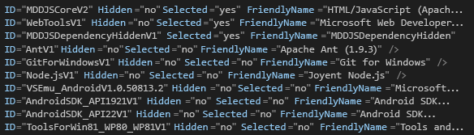

# Comment&#160;: cr&#233;er et ex&#233;cuter une installation sans assistance de Visual Studio
[!INCLUDE[vs2017banner](../code-quality/includes/vs2017banner.md)]

Vous pouvez exécuter l’application d’installation pour [!INCLUDE[vsprvs](../code-quality/includes/vsprvs_md.md)] comme installation sans assistance via un intranet plutôt qu’à partir de supports tels que les DVD. Cette rubrique explique comment préparer [!INCLUDE[vsprvs](../code-quality/includes/vsprvs_md.md)] pour ce type d’installation à partir d’un partage réseau.  
  
## Création d’une image réseau  
 Tout d’abord, créez une image réseau du support [!INCLUDE[vsprvs](../code-quality/includes/vsprvs_md.md)].  
  
#### Pour créer une image réseau  
  
1.  Créez un dossier sur le serveur \(par exemple, *Lecteur*: \\IDEinstall\\\).  
  
2.  Effectuez l’une des opérations suivantes :  
  
    -   Téléchargez le programme d’amorçage web, puis exécutez *Produit*.exe \/Layout*Lecteur*:\\IDEinstall\\.  
  
         OU  
  
    -   Copiez le contenu du support pour Visual Studio dans le dossier IDEinstall. Après avoir copié le contenu, vous devez encore télécharger les logiciels tiers que vous souhaitez installer.  
  
3.  Partagez le dossier IDEinstall sur le réseau et définissez les paramètres de sécurité appropriés.  
  
     Le chemin réseau de l’application d’installation pour [!INCLUDE[vsprvs](../code-quality/includes/vsprvs_md.md)] ressemble à \\\\*nom\_serveur*\\IDEinstall\\*Produit*.exe.  
  
    > [!NOTE]
    >  L’installation peut échouer si la combinaison du nom du chemin d’accès et du fichier dépasse 260 caractères. La longueur maximale d’un chemin dans [!INCLUDE[vsprvs](../code-quality/includes/vsprvs_md.md)] est de 221 caractères.  Le nom de chemin d’accès local ne doit pas dépasser 70 caractères et le nom du chemin d’accès réseau ne doit pas dépasser 39 caractères.  
  
     L’installation peut également échouer si les noms de dossiers du chemin d’accès incluent des espaces incorporés \(par exemple, "\\\\*nom\_serveur*\\installation IDE" ou \\\\*nom\_serveur*\\Visual Studio\\\).  
  
## Déploiement de Visual Studio en mode sans assistance  
 Pour déployer [!INCLUDE[vsprvs](../code-quality/includes/vsprvs_md.md)] en mode sans assistance, vous devez modifier le fichier AdminDeployment.xml. Pour ce faire, vous devez d’abord créer le fichier AdminDeployment.xml à l’aide du paramètre de ligne de commande `/CreateAdminFile < emplacement du fichier >`. Ensuite, vous pouvez utiliser ce fichier pour pousser un déploiement de Visual Studio sur votre réseau ou l’extraire dans une installation si vous placez ce fichier dans le répertoire *Lecteur* :\\IDEinstall\\packages. Le fichier AdminDeployment.xml n’est pas propre à un système d’exploitation, une architecture, une version de Visual Studio ou un langage de système d’exploitation.  
  
> [!CAUTION]
>  Parfois, les éléments répertoriés comme étant sélectionnés dans le fichier AdminDeployment.xml ne sont pas installés. Pour résoudre ce problème, placez à la **fin** du fichier AdminDeployment.xml les éléments marqués comme suit : « Selected\="yes" ».  
>   
>  Si vous ne souhaitez pas installer les dépendances facultatives d’un élément, vous devez d’abord sélectionner le parent, puis désélectionner les dépendances facultatives après le parent, comme illustré dans la capture d’écran suivante :  
>   
>    
>   
>  Une autre façon de procéder consiste à simplement omettre les enfants facultatifs d’un parent \(en d’autres termes, vous excluez les éléments « Selected\="no" »\), mais vous devez quand même placer tous les éléments « Selected\="yes" » à la fin du fichier AdminDeployment.xml.  
  
> [!IMPORTANT]
>  Pendant l’installation, l’ordinateur peut redémarrer automatiquement une ou plusieurs fois. Après qu’il a redémarré, vous devez vous reconnecter avec le même compte d’utilisateur que celui avec lequel vous étiez connecté pour effectuer l’installation avant le redémarrage de l’ordinateur. Vous pouvez éviter les redémarrages automatiques en installant les composants requis avant d’exécuter une installation sans assistance. Pour plus d’informations, consultez la section intitulée « Éviter le redémarrage lors de l’installation » dans le [Guide de l’administrateur Visual Studio](../install/visual-studio-administrator-guide.md).  
  
 Le schéma de fichier AdminDeployment contient les éléments suivants :  
  
|Élément|Attribut|Valeurs|Description|  
|-------------|--------------|-------------|-----------------|  
|BundleCustomizations|TargetDir|*Chemin*|Identique au remplacement du chemin d’accès dans l’interface utilisateur de l’application d’installation. Cet élément est ignoré si Visual Studio est déjà installé.|  
|BundleCustomizations|NoWeb|yes&#124;default|Si la valeur de cet élément est Oui, l’application d’installation ne tente jamais d’accéder au web lors de l’action d’installation.|  
|SelectableItemCustomization|Hidden|Yes&#124;No|Si la valeur de cet élément est Oui, masque un élément sélectionnable dans l’arborescence de la personnalisation.|  
|SelectableItemCustomization|Selected|Yes&#124;No|Active ou désactive un élément sélectionnable dans l’arborescence de la personnalisation.|  
|BundleCustomizations|Feed|Chemin|Emplacement du flux que l’utilisateur souhaite utiliser.  Ce flux est utilisé pour les opérations de modification ultérieures sur l’ordinateur \(« Default » par défaut\).|  
|BundleCustomizations|SuppressRefreshPrompt|yes&#124;default|Empêche l’envoi d’invites demandant à l’utilisateur d’actualiser le programme d’installation si une version plus récente est disponible.|  
|BundleCustomizations|NoRefresh|yes&#124;default|N’actualise pas le programme d’installation si une version plus récente est disponible.|  
|BundleCustomizations|NoCacheOnlyMode|yes&#124;default|Empêche le préremplissage du cache du package.|  
  
> [!WARNING]
>  L’application d’installation respecte l’état sélectionné d’un événement SelectableItem, même s’il est masqué. Par exemple, si vous souhaitez toujours installer un élément sélectionnable, vous pouvez le marquer comme masqué et sélectionné.  
  
#### Pour créer une installation sans assistance de Visual Studio  
  
1.  Dans le fichier *Lecteur*:\\IDEinstall\\AdminDeployment.xml, modifiez la valeur de l’attribut NoWeb de l’élément BundleCustomizations en remplaçant « par défaut » par « oui », comme le montre l’exemple suivant :  
  
     Remplacer `<BundleCustomizations TargetDir="default" NoWeb="default"/>` par `<BundleCustomizations TargetDir="default" NoWeb="yes"/>`  
  
2.  Modifiez l’attribut SelectableItemCustomization si nécessaire pour les composants facultatifs, puis enregistrez le fichier.  
  
## Exécution du programme d’installation sans assistance  
 Vous pouvez exécuter le programme d’installation sans assistance en exécutant automatiquement l’application d’installation pour Visual Studio sur les ordinateurs clients ou en permettant aux utilisateurs d’exécuter l’application avec les paramètres que vous définissez.  
  
#### Pour exécuter une installation sans assistance sur un ordinateur client  
  
-   Ouvrez le menu **Démarrer**, choisissez **Exécuter**, puis entrez `\\ServerName\IDEinstall\vs_Product.exe /adminfile PathOfTheAdmindeployment.xmlFile`*AdditionalParametersAsNeeded*.  
  
     Par exemple, vous pouvez spécifier la ligne de commande suivante : `\\server1\IDEinstall\vs_ultimate.exe /adminfile \\server1\ IDEinstall\AdminDeployment.xml /quiet /norestart`  
  
#### Pour permettre aux clients d’installer manuellement Visual Studio avec des paramètres prédéfinis  
  
1.  Copiez le fichier AdminDeployment.xml personnalisé sur un partage réseau qui est en lecture seule \(par exemple, \\\\*nom\_serveur*\\IDEinstall\\packages\\AdminDeployment.xml\).  
  
2.  Autorisez les utilisateurs à installer à partir de ce partage.  
  
## Maintenance d’une installation  
 Si vous ouvrez le **Panneau de configuration** et réexécutez l’application d’installation, vous pouvez modifier les fonctionnalités de Visual Studio, désinstaller les langages de programmation et réparer ou désinstaller Visual Studio.  
  
> [!NOTE]
>  Vous devez avoir les informations d’identification de l’administrateur sur l’ordinateur local pour utiliser le mode maintenance.  
  
#### Pour maintenir une installation sur un ordinateur client  
  
-   Ouvrez le **Panneau de configuration**, puis choisissez **Programmes et fonctionnalités**.  
  
-   Choisissez [!INCLUDE[vsprvs](../code-quality/includes/vsprvs_md.md)], puis choisissez **Modifier**.  
  
#### Pour modifier les paramètres d’AdminDeployment sur un ordinateur client après l’installation de Visual Studio  
  
1.  Mettez à jour admindeployment.xml si nécessaire.  
  
2.  Ouvrez le menu **Démarrer**, puis choisissez **Exécuter**.  
  
3.  Tapez le texte suivant :  
  
     `\\ServerName\IDEinstall\vs_Product.exe /AdminFile PathToAdmindeployment.xmlFile` AdditionalParametersAsNeeded  
  
     Par exemple, vous pouvez spécifier la ligne de commande suivante : `\\server1\IDEinstall\vs_ultimate.exe /adminfile \\server1\IDEinstall\AdminDeployment.xml /quiet /norestart`  
  
 La réparation est le paramètre par défaut après l’installation de Visual Studio. Si vous réparez Visual Studio avec un \/AdminFile mis à jour, vous remplacez les paramètres de déploiement de l’administrateur en cours par ceux que le fichier AdminDeployment.xml appelle.  
  
## Enregistrer le produit  
 Une fois l’installation terminée, vous pouvez enregistrer votre copie de [!INCLUDE[vsprvs](../code-quality/includes/vsprvs_md.md)] depuis [!INCLUDE[vsprvs](../code-quality/includes/vsprvs_md.md)].  
  
#### Pour inscrire  
  
1.  Ouvrez le menu **Aide**, puis choisissez **Inscrire le produit**.  
  
2.  Entrez la clé de produit.  
  
## Voir aussi  
 [Installation de Visual Studio](../Topic/Installing%20Visual%20Studio%202015.md)