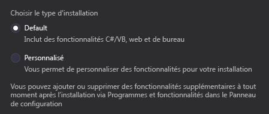

# Installation de Visual Studio
[!INCLUDE[vs2017banner](../code-quality/includes/vs2017banner.md)]

Cette page comprend des informations détaillées qui vous aideront à installer Visual Studio 2015, notre suite intégrée d’outils de productivité pour les développeurs. Nous avons aussi inclus des liens vous permettant d’accéder rapidement à des informations sur les [fonctionnalités](https://www.visualstudio.com/en-us/news/vs2015-vs.aspx), les [éditions](http://go.microsoft.com/fwlink/?LinkID=242142), la [configuration requise](https://www.visualstudio.com/products/visual-studio-2015-compatibility-vs), les [téléchargements](http://go.microsoft.com/fwlink/?LinkId=517106) et bien plus encore.  
  
> [!TIP]
>  Pour afficher les informations d’installation des versions précédentes de Visual Studio, cliquez sur le lien « Autres versions » en haut de cette page.  
  
## Liens rapides  
 Avant d’entrer dans les détails, voici une liste de nos liens les plus demandés.  
  
|Fonctionnalités|  
|---------------------|  
|Pour en savoir plus sur les fonctionnalités nouvelles ou mises à jour de Visual Studio 2015, consultez les notes de mise à jour de [Visual Studio 2015 RTM](https://www.visualstudio.com/en-us/news/vs2015-vs.aspx) et [Visual Studio 2015 Mise à jour 1](https://www.visualstudio.com/news/vs2015-update1-vs).|  
|Pour découvrir les nouveautés disponible dans chaque édition de Visual Studio 2015, consultez notre page [Comparez les offres Visual Studio](http://go.microsoft.com/fwlink/?LinkID=242142).|  
|Pour examiner la configuration requise pour chaque édition de Visual Studio 2015, consultez la page [Compatibilité de Visual Studio 2015](https://www.visualstudio.com/products/visual-studio-2015-compatibility-vs).|  
|Pour installer Visual Studio 2015, téléchargez\-le à partir de [Téléchargements Visual Studio](http://go.microsoft.com/fwlink/?LinkId=517106) ou servez\-vous du support d’installation de la version en boîte du produit.|  
|Pour trouver la clé du produit, consultez la rubrique [Comment : trouver la clé de produit de Visual Studio](../install/how-to-locate-the-visual-studio-product-key.md).|  
|Pour connaître les options de licence pour les individus ou les clients d’entreprise, consultez le livre blanc sur les [licences Visual Studio et MSDN](https://www.microsoft.com/download/details.aspx?id=13350).|  
  
##   Installation par défaut ou installation personnalisée  
 Au moment d’installer Visual Studio 2015, vous pouvez inclure les composants que vous prévoyez d’utiliser au quotidien et exclure les autres. Cela signifie qu’une installation par défaut sera souvent plus petite et plus rapide à installer qu’une installation personnalisée. Cela signifie aussi que bon nombre de composants qui étaient installés par défaut dans les versions précédentes sont maintenant considérés comme des composants personnalisés que vous devez sélectionner explicitement dans cette version.  
  
   
  
 Les composants personnalisés incluent Visual C\+\+, Visual F\#, SQL Server Data Tools, les outils mobiles multiplateformes et les Kits de développement logiciel \(SDK\), ainsi que les extensions et les SDK tiers. Vous pouvez installer les composants personnalisés ultérieurement si vous ne les sélectionnez pas pendant l’installation initiale.  
  
> [!NOTE]
>  Une installation personnalisée inclut automatiquement les composants qui figurent dans une installation par défaut.  
  
 Voici la liste complète des composants personnalisés :  
  
-   **Langages de programmation**  
  
    -   Compilateurs, bibliothèques et outils Visual C\+\+  
  
    -   Visual F\#  
  
    -   Outils Python pour Visual Studio  
  
-   **Développement Windows et web**  
  
    -   Outils de publication de ClickOnce  
  
    -   Microsoft SQL Server Data Tools  
  
    -   Microsoft Web Developer Tools  
  
    -   Outils PowerShell pour Visual Studio  
  
    -   Kit de développement Silverlight  
  
    -   Outils de développement d’applications Windows universelles  
  
    -   Kits de développement logiciel \(SDK\) et outils Windows 10  
  
    -   Outils Windows 8.1 et Windows Phone 8.0\/8.1  
  
    -   Kits de développement logiciel \(SDK\) et outils Windows 8.1  
  
-   **Développement multiplateforme pour appareils mobiles**  
  
    -   Xamarin \(C\#\/.NET\)  
  
    -   Apache Cordova \(HTML\/JavaScript\)  
  
    -   Développement mobile Visual C\+\+ pour iOS \/ Android  
  
-   **Kits de développement logiciel \(SDK\) et outils courants**  
  
    -   Kit de développement natif Android \(R10E, 32 bits\)  
  
    -   Kit de développement logiciel Android SDK  
  
    -   Programme d'installation du Kit de développement logiciel Android SDK \(API niveau 19 et 21\)  
  
    -   Programme d'installation du Kit de développement logiciel Android SDK \(API niveau 22\)  
  
    -   Apache Ant \(1.9.3\)  
  
    -   Kit de développement Java SE \(7.0.550.13\)  
  
    -   Joyent Node.js  
  
-   **Outils courants**  
  
    -   Git pour Windows  
  
    -   Extensions GitHub pour Visual Studio  
  
    -   Outils d'extensibilité de Visual Studio  
  
##   Installer Visual Studio  
 Vous avez besoin d’informations d’identification d’administrateur pour installer [!INCLUDE[vsprvs](../code-quality/includes/vsprvs_md.md)]. Toutefois, elles ne sont pas requises pour utiliser [!INCLUDE[vsprvs](../code-quality/includes/vsprvs_md.md)] après son installation.  
  
 Les privilèges suivants de votre compte d'administrateur local doivent autoriser l'installation de tous les composants de Visual Studio.  
  
|Nom d'affichage de l'objet de stratégie locale|Droit d'utilisateur|  
|----------------------------------------------------|-------------------------|  
|Sauvegarder les fichiers et les répertoires|SeBackupPrivilege|  
|Déboguer les programmes|SeDebugPrivilege|  
|Gérer le journal d'audit et de sécurité|SeSecurityPrivilege|  
  
 Pour plus d’informations sur cette exigence de compte d’administrateur local, consultez l’article suivant de la Base de connaissances : [Échec de l’installation de SQL Server si le compte d’installation ne possède pas certains droits d’utilisateur](https://support.microsoft.com/en-us/kb/2000257).  
  
###   Installation à l'aide d'un média d'installation  
  
-   Pour installer [!INCLUDE[vsprvs](../code-quality/includes/vsprvs_md.md)], dans le répertoire racine du support d'installation de [!INCLUDE[vsprvs](../code-quality/includes/vsprvs_md.md)], exécutez le fichier d'installation de l'édition souhaitée :  
  
    |Édition|Fichier d'installation|  
    |-------------|----------------------------|  
    |Visual Studio Enterprise|vs\_enterprise.exe|  
    |Visual Studio Professional|vs\_professional.exe|  
    |Communauté Visual Studio|vs\_community.exe|  
  
###   Installation par téléchargement à partir du site web du produit  
  
-   Visitez [Téléchargements Visual Studio](http://go.microsoft.com/fwlink/?LinkId=517106) sur le site web VisualStudio.com.  
  
###   Téléchargement de Visual Studio pour une installation hors connexion  
 Dans la plupart des cas, vous pouvez installer Visual Studio sans problème à partir du site de téléchargement. Toutefois, dans certains cas, vous pouvez télécharger tous les packages mis à jour avant de les installer, par exemple pour une installation sur plusieurs ordinateurs ou sur un ordinateur hors connexion. Les étapes suivantes expliquent comment télécharger toutes les mises à jour dont vous avez besoin pour une installation hors connexion.  
  
1.  Après avoir téléchargé le fichier exécutable de mise à jour à partir du site web MSDN sur un emplacement de votre système de fichiers, exécutez la commande suivante à partir d'une invite de commandes : `<executable name> /layout`.  
  
     Cette commande télécharge tous les packages pour l'installation.  
  
     En utilisant le commutateur `/layout`, vous pouvez télécharger presque tous les principaux packages d’installation, pas seulement ceux qui s’appliquent à l’ordinateur de téléchargement. Cette approche vous permet d'obtenir tous les fichiers dont vous avez besoin pour effectuer cette mise à jour n'importe où et peut être utile si vous voulez installer des composants qui n'ont pas été installés initialement.  
  
2.  Lorsque vous avez exécuté la commande, vous devez être invité à spécifier l'emplacement du téléchargement. Entrez l'emplacement, puis choisissez **Télécharger**.  
  
3.  Une fois le téléchargement du package terminé, vous devez voir un écran Visual Studio qui indique **Installation réussie \! Tous les composants spécifiés ont été correctement acquis.**  
  
4.  Dans l'emplacement de fichier que vous avez spécifié, recherchez le fichier exécutable et le dossier du package. C'est tout ce dont vous avez besoin pour copier sur un emplacement partagé ou installer un média.  
  
    > [!CAUTION]
    >  Actuellement, le Kit de développement logiciel \(SDK\) Android ne prend pas en charge les installations hors connexion. Si vous installez des éléments de l’installation du Kit de développement logiciel \(SDK\) Android sur un ordinateur qui n’est pas connecté à internet, l’installation peut échouer.  
  
5.  Vous pouvez maintenant exécuter l'installation depuis l'emplacement du fichier ou le média d'installation.  
  
###   Installation de Visual Studio dans des environnements virtualisés  
 **Problèmes vidéo avec Hyper\-V**  
  
 Si vous exécutez Windows Server 2008 R2 avec Hyper\-V activé et une carte graphique accélérée, il se peut que vous rencontriez des ralentissements du système.  
  
 Pour plus d’informations, consultez sur le site web Microsoft la page suivante, qui explique pourquoi les [performances vidéo peuvent diminuer quand un ordinateur Windows Server 2008 ou Windows Server 2008 R2 a le rôle Hyper\-V activé et une carte graphique accélérée installée](http://go.microsoft.com/fwlink/?LinkID=231084).  
  
 **Émulation de périphériques avec Hyper\-V**  
  
 Quand vous installez Visual Studio 2015 sur du vrai matériel, sans virtualisation, vous pouvez choisir les fonctionnalités qui permettent d'émuler les appareils Windows et Android avec Hyper\-V. En revanche, quand vous effectuez l'installation dans Hyper\-V, vous ne pouvez pas émuler les appareils Windows ou Android. Ceci est dû au fait que les émulateurs sont eux\-mêmes des machines virtuelles et que vous ne pouvez pas héberger actuellement une machine virtuelle à l'intérieur d'une autre machine virtuelle. Une solution de contournement consiste à faire l'acquisition d'appareils Windows ou Android sur lesquels vous pouvez directement déployer et déboguer votre application.  
  
## Utilisation des paramètres de ligne de commande  
 Lorsque vous exécutez l'application d'installation, vous pouvez utiliser les paramètres de ligne de commande suivants, qui ne respectent pas la casse.  
  
|Paramètre|Description|  
|---------------|-----------------|  
|**\/?**   **\/help**   **\/h**|Affiche les paramètres de la ligne de commande.|  
|**\/AddRemoveFeatures**|Spécifie les fonctionnalités à ajouter ou à supprimer du produit installé.|  
|**\/AdminFile** *DéploiementAdmin.xml*|Installe Visual Studio à l'aide du fichier de données que vous avez spécifié pour l'installation administrative.|  
|**\/CEIPConsent**|Accepte la collecte d'informations pour améliorer l'expérience utilisateur conformément à la déclaration de confidentialité du produit.|  
|**\/ChainingPackage** *NomGroupe*|Spécifie le groupe qui effectue le chaînage vers ce groupe. Peut également servir à spécifier une cohorte d'amélioration de l'expérience utilisateur.|  
|**\/CreateAdminFile \<filename\>**|Spécifie l'emplacement pour créer un fichier de contrôle qui peut être utilisé avec \/AdminFile|  
|**\/CustomInstallPath** *RépertoireInstallation*|Installe tous les packages reciblables dans le répertoire que vous spécifiez.|  
|**\/ForceRestart**|Redémarre toujours l'ordinateur après l'installation.|  
|**\/full**|Installe toutes les fonctionnalités du produit.|  
|**\/InstallSelectableItems \<item name 1\>\[;\<item name 2\>\]**|Liste d'éléments de l'arborescence de sélection à cocher sur l'écran de sélection de l'Assistant Installation.|  
|**\/l**   **\/Log** *NomFichier*|Spécifie l'emplacement du fichier journal.|  
|**\/layout** *Répertoire*|Copie les fichiers sur le média d'installation dans le répertoire que vous spécifiez.|  
|**\/NoCacheOnlyMode**|Empêche le préremplissage du cache du package.|  
|**\/NoRefresh**|Empêche la vérification des versions plus récentes de ce produit, qu'il s'agisse de versions mises à jour requises ou recommandées.|  
|**\/norestart**|Empêche l'application d'installation de redémarrer l'ordinateur pendant ou après l'installation. Dans la section Codes de retour du [Guide de l’administrateur Visual Studio](../install/visual-studio-administrator-guide.md), vous trouverez les codes de retour à rechercher.|  
|**\/noweb**|Empêche l'installation à partir d'Internet.|  
|**\/OverrideFeedUri \<path to feed file\>**|Chemin d'accès vers un flux externe local qui décrit les éléments logiciels.|  
|**\/ProductKey**   *CléProduit*|Définit une clé de produit personnalisée qui ne contient aucun tiret et moins de 25 caractères.|  
|**\/PromptRestart**|Invite l'utilisateur avant de redémarrer l'ordinateur.|  
|**\/q**   **\/quiet**   **\/s**   **\/silent**|Supprime l'interface utilisateur \(UI\) de l'application d'installation. Si Visual Studio est déjà installé et que vous ne spécifiez pas de paramètres à l’exception de celui\-ci, l’application d’installation s’exécute en mode de maintenance.|  
|**\/qb**   **\/passive**|Indique la progression, mais n'attend pas de saisie utilisateur.|  
|**\/repair**|Répare Visual Studio.|  
|**\/SuppressRefreshPrompt**|Empêche l'affichage de la boîte de dialogue des mises à jour disponibles dans l'Assistant Installation. Ce dernier accepte donc automatiquement toute version mise à jour requise ou recommandée.|  
|**\/u**   **\/Uninstall**|Désinstalle [!INCLUDE[vsprvs](../code-quality/includes/vsprvs_md.md)].|  
|**\/Uninstall \/Force**   **\/u \/force**|Désinstalle Visual Studio et toutes les fonctionnalités partagées avec d'autres produits. **Warning:**  Si vous utilisez ce paramètre, d'autres produits installés sur le même ordinateur peuvent cesser de fonctionner correctement.|  
  
 Quand vous exécutez le programme d'installation à partir de la ligne de commande, veillez à capturer et à traiter le code de retour pour améliorer l'expérience au niveau de la ligne de commande.  Pour plus d’informations, consultez [Guide de l’administrateur Visual Studio](../install/visual-studio-administrator-guide.md).  
  
##   Résolution des problèmes liés à l'installation  
 Utilisez ces ressources pour obtenir de l'aide sur les problèmes de configuration et d'installation.  
  
-   Forum [Installation et configuration de Visual Studio](http://go.microsoft.com/fwlink/?LinkID=151190). Passez en revue les questions et les réponses des autres dans la communauté Visual Studio. Si vous ne trouvez pas ce dont vous avez besoin, posez vos propres questions.  
  
-   Site web de [support technique Microsoft pour Visual Studio](http://go.microsoft.com/fwlink/?LinkID=251019). Lisez les articles de la Base de connaissances et apprenez comment contacter le support technique Microsoft pour obtenir plus d'informations sur les problèmes liés à l'installation de Visual Studio.  
  
-   Pour les versions de Visual Studio 2015, vous pouvez signaler votre problème via le site Connect à l’adresse [https:\/\/connect.microsoft.com\/visualstudio](https://connect.microsoft.com/visualstudio).  
  
     Il est recommandé d'inclure les journaux d'installation avec votre problème. Vous pouvez préparer vos journaux pour le signalement de votre problème à l'aide de l'outil Microsoft Visual Studio and .NET Framework Log Collection Tool, comme indiqué dans les étapes suivantes.  
  
    1.  Téléchargez l’outil de diagnostic d’installation à l’adresse [http:\/\/aka.ms\/vscollect](http://aka.ms/vscollect)  
  
    2.  À partir d'une invite de commandes avec élévation de privilèges, exécutez le programme collect.exe.  
  
    3.  Une fois le programme collect.exe terminé, récupérez le fichier vslogs.cab de votre répertoire Temp et chargez\-le dans le rapport du problème.  
  
##   Déploiement du réseau d'entreprise  
 Pour plus d’informations sur le déploiement de [!INCLUDE[vsprvs](../code-quality/includes/vsprvs_md.md)] sur un réseau, consultez [Guide de l’administrateur Visual Studio](../install/visual-studio-administrator-guide.md).  
  
##   Une fois Visual Studio installé  
 Au terme de l'installation de [!INCLUDE[vsprvs](../code-quality/includes/vsprvs_md.md)], nous vous recommandons d'inscrire votre copie du produit.  
  
###   Inscription de Visual Studio  
  
##### Pour inscrire Visual Studio  
  
1.  Dans la barre de menus, choisissez **Aide**, **À propos de**.  
  
     La boîte de dialogue **À propos de** affiche le numéro d'identification du produit \(PID\). Vous avez besoin du PID et des informations d'identification d'un compte Windows \(telles qu'une adresse de messagerie Hotmail ou Outlook.com et un mot de passe\) pour inscrire le produit.  
  
2.  Dans la barre de menus, cliquez sur **Aide**, puis sur **Inscrire le produit**.  
  
###   Installation du contenu d'aide hors connexion  
 Après avoir installé [!INCLUDE[vsprvs](../code-quality/includes/vsprvs_md.md)], vous pouvez télécharger le contenu d'aide supplémentaire afin qu'il soit disponible hors connexion.  
  
##### Pour installer ou désinstaller le contenu de l'aide  
  
1.  Dans la barre de menus [!INCLUDE[vsprvs](../code-quality/includes/vsprvs_md.md)], choisissez **Aide**, **Ajouter et supprimer le contenu d'aide**.  
  
2.  Sous l'onglet **Gérer le contenu** de la **Visionneuse d'aide Microsoft**, sélectionnez la source d'installation pour votre contenu d'aide.  
  
3.  Si vous recherchez une collection d'aide spécifique, entrez le nom ou le mot clé dans la zone de texte **Rechercher**, puis appuyez sur Entrée.  
  
4.  À côté du nom de la collection d'aide souhaitée, choisissez le lien **Ajouter** ou **Supprimer**.  
  
5.  Choisissez le bouton **Mettre à jour**.  
  
 Pour plus d'informations sur l'aide hors connexion, consultez [Visionneuse d'aide Microsoft 2.2](../ide/microsoft-help-viewer.md)  
  
###   Réparation de Visual Studio  
  
##### Pour réparer Visual Studio  
  
1.  Dans le **Panneau de configuration**, dans la page **Programmes et fonctionnalités**, sélectionnez l'édition du produit que vous souhaitez réparer, puis sélectionnez **Modifier**.  
  
2.  Dans l'Assistant Installation, sélectionnez **Réparer**, **Suivant**, puis suivez les instructions restantes.  
  
##### Pour réparer Visual Studio en mode silencieux ou passif \(autrement dit, réparer à partir de la source\)  
  
1.  Sur l'ordinateur où Visual Studio est installé, ouvrez l'invite de commandes Windows.  
  
2.  Entrez les paramètres suivants :  
  
     *DVDRoot* \\\<Fichier d'installation\> \<\/quiet&#124;\/passive\> \[\/norestart\]\/Repair  
  
###   Installation des éléments sélectionnables  
  
##### Pour installer les éléments sélectionnables  
  
1.  Dans **Panneau de configuration**, dans la page **Programmes et fonctionnalités**, sélectionnez l'édition du produit à laquelle vous souhaitez ajouter un ou plusieurs composants, puis cliquez sur **Modifier**.  
  
2.  Dans l'Assistant Installation, sélectionnez **Modifier**, puis sélectionnez les composants que vous souhaitez installer.  
  
3.  Choisissez **Suivant**, puis suivez les instructions restantes.  
  
###   Recherche des publications du service et des mises à jour des produits  
 Visual Studio ne met pas automatiquement à niveau les extensions quand vous effectuez une mise à niveau de versions antérieures, car les extensions ne sont pas toutes compatibles. Vous devez réinstaller les extensions à partir de la [galerie Visual Studio](http://go.microsoft.com/fwlink/?LinkId=178891) ou de l’éditeur du logiciel.  
  
##### Pour rechercher automatiquement les publications du service  
  
1.  Dans la barre de menus, sélectionnez **Outils**, **Options**.  
  
2.  Dans la boîte de dialogue **Options**, développez **Environnement**, puis sélectionnez **Extensions et mises à jour**. Assurez\-vous de cocher la case **Rechercher automatiquement les mises à jour**, puis choisissez **OK**.  
  
##   Désinstallation de Visual Studio  
 Utilisez les procédures suivantes pour désinstaller Visual Studio 2015.  
  
#### Pour désinstaller Visual Studio :  
  
1.  Dans le **Panneau de configuration**, dans la page **Programmes et fonctionnalités**, sélectionnez l'édition du produit que vous souhaitez désinstaller, puis cliquez sur **Modifier**.  
  
2.  Dans l'Assistant Installation, sélectionnez **Désinstaller**, choisissez **Oui**, puis suivez les instructions restantes de l'assistant.  
  
#### Pour désinstaller Visual Studio en mode silencieux ou passif \(autrement dit, désinstaller à partir de la source\)  
  
1.  Sur l'ordinateur où Visual Studio est installé, ouvrez l'invite de commandes Windows.  
  
2.  Entrez les paramètres suivants :  
  
     *DVDRoot* \\\<fichier\_installation\> \<\/quiet&#124;\/passive\> \[\/norestart\]\/uninstall  
  
 Si vous ne pouvez pas désinstaller [!INCLUDE[vsprvs](../code-quality/includes/vsprvs_md.md)] à l'aide de l'utilitaire de désinstallation, vous pouvez exécuter une désinstallation manuelle en supprimant d'abord [!INCLUDE[vsprvs](../code-quality/includes/vsprvs_md.md)], puis les composants connexes. Pour plus d’informations, consultez l’article [Comment désinstaller Visual Studio](https://support.microsoft.com/en-us/kb/2771441) dans la Base de connaissances Microsoft \(KB\) ou le billet qui traite de la [suppression des composants Visual Studio qui subsistent après une désinstallation](http://blogs.msdn.com/b/heaths/archive/2015/07/17/removing-visual-studio-components-left-behind-after-an-uninstall.aspx) sur le site web Microsoft Server & Tools Blogs.  
  
##   Rubriques connexes  
  
|Titre|Description|  
|-----------|-----------------|  
|[Coexistence des versions de Visual Studio](../Topic/Installing%20Visual%20Studio%20Versions%20Side-by-Side.md)|Fournit des informations concernant l’installation de plusieurs versions de Visual Studio sur le même ordinateur.|  
|[Bibliothèque d’images Visual Studio](../designers/the-visual-studio-image-library.md)|Fournit des informations concernant l’installation de graphiques qui peuvent être utilisés dans les applications Visual Studio.|  
|[Guide de l’administrateur Visual Studio](../install/visual-studio-administrator-guide.md)|Fournit des informations concernant des options de déploiement pour Visual Studio.|  
|[Installation de versions multilingues de Visual Studio](../Topic/Installing%20Multiple%20Language%20Versions%20of%20Visual%20Studio.md)|Fournit des informations concernant l'installation de différentes versions linguistiques de Visual Studio.|  
|[Comment : trouver la clé de produit de Visual Studio](../install/how-to-locate-the-visual-studio-product-key.md)|Fournit des informations sur la recherche de la clé de produit pour votre installation de Visual Studio.|  
|[Prise en main](../ide/get-started-developing-with-visual-studio.md)|Établit un lien vers des documents qui peuvent vous aider à utiliser efficacement Visual Studio.|  
  
## Voir aussi  
 [Personnalisation des paramètres de développement dans Visual Studio](http://msdn.microsoft.com/fr-fr/22c4debb-4e31-47a8-8f19-16f328d7dcd3)