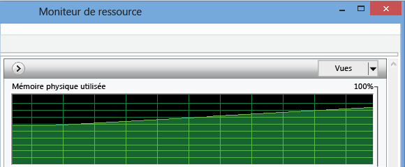
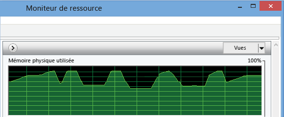
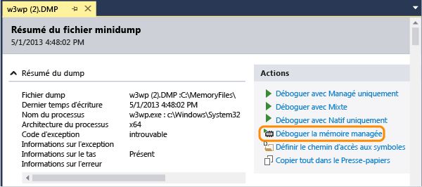
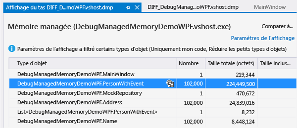
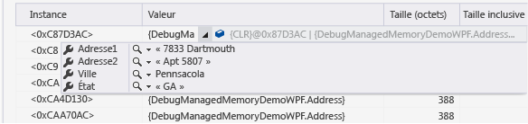
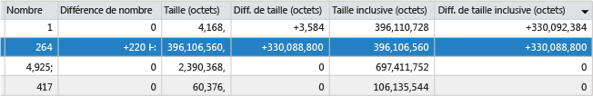

# Analyser des probl&#232;mes de m&#233;moire li&#233;s &#224; .NET Framework
Vous pouvez identifier les fuites et l'utilisation inefficace de la mémoire dans le code .NET Framework à l'aide de l'analyseur de mémoire managée de Visual Studio.  La version minimale de .NET Framework du code cible est .NET Framework 4.5.  
  
 L'outil d'analyse de la mémoire analyse les informations qui se trouvent dans les *fichiers dump avec données de tas* et crée une copie des objets dans la mémoire d'une application.  Vous pouvez recueillir des fichiers dump \(.dmp\) à partir de l'IDE Visual Studio IDE ou à l'aide d'autres outils système.  
  
-   Vous pouvez analyser un instantané pour comprendre l'impact relatif des types d'objets sur l'utilisation de la mémoire et pour rechercher le code dans votre application qui utilise la mémoire de manière inefficace.  
  
-   Vous pouvez aussi comparer \(*diff*\) deux instantanés d'une application pour rechercher les sections de votre code qui provoquent une augmentation de l'utilisation de la mémoire au fil du temps.  
  
 Pour obtenir une procédure pas à pas avec l'analyseur de mémoire managée, voir [Using Visual Studio 2013 to Diagnose .NET Memory Issues in Production](http://blogs.msdn.com/b/visualstudioalm/archive/2013/06/20/using-visual-studio-2013-to-diagnose-net-memory-issues-in-production.aspx) sur le blog Visual Studio ALM \+ Team Foundation Server.  
  
##   Contenu  
 [Utilisation de la mémoire dans les applications .NET Framework](#BKMK_Memory_use_in__NET_Framework_apps)  
  
 [Identifier un problème de mémoire dans une application](#BKMK_Identify_a_memory_issue_in_an_app)  
  
 [Recueillir des instantanés de la mémoire](#BKMK_Collect_memory_snapshots)  
  
 [Analyser l'utilisation de la mémoire](#BKMK_Analyze_memory_use)  
  
##   Utilisation de la mémoire dans les applications .NET Framework  
 .NET Framework étant un runtime avec Garbage Collection, dans la plupart des applications l'utilisation de la mémoire n'est pas un problème.  Par contre, avec les applications de longue durée telles que les applications et les services web, et sur les appareils avec une quantité de mémoire limitée, l'accumulation d'objets en mémoire peut avoir un impact sur les performances de l'application et de l'appareil.  Une utilisation excessive de la mémoire peut priver l'application et l'ordinateur de ressources si le garbage collector s'exécute trop souvent ou si le système d'exploitation est contraint de déplacer de la mémoire entre la RAM et le disque.  Dans le pire des cas, une application peut se bloquer avec une exception « Mémoire insuffisante ».  
  
 Le *tas managé* .NET est une région de mémoire virtuelle où sont stockés les objets de référence créés par une application.  La durée de vie des objets est gérée par le garbage collector.  Le garbage collector utilise des références pour effectuer le suivi des objets qui occupent des blocs de mémoire.  Une référence est créée quand un objet est créé et assigné à une variable.  Un même objet peut avoir plusieurs références.  Par exemple, des références supplémentaires à un objet peuvent être créées en ajoutant l'objet à une classe, une collection ou autre structure de données ou en assignant l'objet à une seconde variable.  Une référence peut aussi être créée quand un objet ajoute un gestionnaire à l'événement d'un autre objet.  Dans ce cas, le second objet contient la référence au premier jusqu'à ce que le gestionnaire soit supprimé de manière explicite ou que le second objet soit détruit.  
  
 Pour chaque application, le garbage collector tient à jour une arborescence de références qui assure le suivi des objets référencés par l'application.  L'*arborescence de références* comprend un ensemble de racines, qui inclut des objets globaux et statiques, ainsi que des piles de threads associées et des objets instanciés de manière dynamique.  Un objet est enraciné si au moins l'un de ses objets parents y fait référence.  Le garbage collector peut récupérer la mémoire d'un objet uniquement quand aucun autre objet ou variable dans l'application n'y fait référence.  
  
  [Contenu](#BKMK_Contents)  
  
##   Identifier un problème de mémoire dans une application  
 Le symptôme le plus visible des problèmes de mémoire est le niveau de performances de votre application, en particulier s'il diminue au fil du temps.  Une dégradation des performances d'autres applications pendant que votre application est en cours d'exécution peut également indiquer qu'il existe un problème de mémoire.  Si vous suspectez qu'il existe un problème de mémoire, utilisez un outil tel que le Gestionnaire des tâches ou l'[Analyseur de performances Windows](http://technet.microsoft.com/library/cc749249.aspx) pour effectuer un examen plus approfondi.  Par exemple, une augmentation de la taille totale de mémoire que vous ne pouvez pas expliquer peut être envisagée comme une source possible de fuites de mémoire :  
  
   
  
 Vous pourriez également remarquer des pointes de mémoire plus élevées que ce que votre connaissance du code pourrait suggérer. Cela pourrait être le signe d'une utilisation inefficace de la mémoire dans une procédure :  
  
   
  
##   Recueillir des instantanés de la mémoire  
 L'outil d'analyse de la mémoire analyse les informations des *fichiers dump* qui contiennent des informations sur les tas.  Vous pouvez créer des fichiers dump dans Visual Studio ou utiliser un outil comme [ProcDump](http://technet.microsoft.com/sysinternals/dd996900.aspx) disponible à partir de [Windows Sysinternals](http://technet.microsoft.com/sysinternals).  Voir [What is a dump, and how do I create one?](http://blogs.msdn.com/b/debugger/archive/2009/12/30/what-is-a-dump-and-how-do-i-create-one.aspx) sur le blog de l'équipe de débogage Visual Studio.  
  
> [!NOTE]
>  La plupart des outils peuvent recueillir des informations de dump avec ou sans données de mémoire de tas complètes.  L'analyseur de mémoire de Visual Studio nécessite des informations de tas complètes.  
  
 **Pour recueillir un dump à partir de Visual Studio**  
  
1.  Vous pouvez créer un fichier dump pour un processus qui a été démarré à partir d'un projet Visual Studio ou vous pouvez attacher le débogueur à un processus en cours d'exécution.  Consultez [Attacher aux processus en cours d'exécution](../debugger/attach-to-running-processes-with-the-visual-studio-debugger.md).  
  
2.  Arrêtez l'exécution.  Le débogueur s'arrête quand vous choisissez **Interrompre tout** dans le menu **Déboguer** ou à une exception ou un point d'arrêt.  
  
3.  Dans le menu **Déboguer**, choisissez **Enregistrer le dump sous**.  Dans la boîte de dialogue **Enregistrer le dump sous**, spécifiez un emplacement et assurez\-vous que **Minidump avec segment mémoire** \(option par défaut\) est sélectionné dans la liste **Type de fichier**.  
  
 **Pour comparer deux instantanés de mémoire**  
  
 Pour analyser l'augmentation de l'utilisation de la mémoire par une application, recueillez deux fichiers dump à partir d'une même instance de l'application.  
  
  [Contenu](#BKMK_Contents)  
  
##   Analyser l'utilisation de la mémoire  
 [Filtrer la liste d'objets](#BKMK_Filter_the_list_of_objects) **&#124;** [Analyser les données de mémoire d'un seul instantané](#BKMK_Analyze_memory_data_in_from_a_single_snapshot) **&#124;** [Comparer deux instantanés de mémoire](#BKMK_Compare_two_memory_snapshots)  
  
 Pour analyser un fichier dump à la recherche de problèmes de mémoire  
  
1.  Dans Visual Studio, choisissez **Fichier**, **Ouvrir**, puis spécifiez le fichier dump.  
  
2.  Dans la page **Résumé du fichier minidump**, choisissez **Déboguer la mémoire managée**.  
  
       
  
 L'analyseur de mémoire démarre une session de débogage pour analyser le fichier et affiche les résultats dans la page Affichage du tas :  
  
  [Contenu](#BKMK_Contents)  
  
###   Filtrer la liste d'objets  
 Par défaut, l'analyseur de mémoire filtre la liste d'objets dans un instantané de la mémoire pour afficher uniquement les types et instances codés par un utilisateur et uniquement les types dont la taille inclusive totale dépasse un seuil de pourcentage de la taille totale du tas.  Vous pouvez modifier ces options dans la liste **Paramètres de l'affichage** :  
  
|||  
|-|-|  
|**Activer Uniquement mon code**|Uniquement mon code masque les objets système les plus courants. Ainsi, seuls les types que vous créez figurent dans la liste.   Vous pouvez également définir l'option Uniquement mon code dans la boîte de dialogue **Options** de Visual Studio.  Dans le menu **Déboguer**, choisissez **Options et paramètres**.  Sous l'onglet **Débogage**\/**Général**, activez ou désactivez **Uniquement mon code**.|  
|**Réduire les petits objets**|**Réduire les petits objets** masque tous les types dont la taille inclusive totale est inférieure à 0,5 pour cent de la taille totale du tas.|  
  
 Vous pouvez aussi filtrer la liste de types en entrant une chaîne dans la zone **Rechercher**.  La liste affiche uniquement les types dont le nom contient la chaîne.  
  
  [Contenu](#BKMK_Contents)  
  
###   Analyser les données de mémoire d'un seul instantané  
 Visual Studio démarre une nouvelle session de débogage pour analyser le fichier et affiche les données de mémoire dans une fenêtre Affichage du tas.  
  
   
  
  [Contenu](#BKMK_Contents)  
  
#### Table Type d'objet  
 La table du haut mentionne les types d'objets contenus en mémoire.  
  
-   **Nombre** indique le nombre d'instances du type dans l'instantané.  
  
-   **Taille \(octets\)** est la taille des instances all du type, à l'exclusion de la taille des objets auxquels il détient des références.  Le champ  
  
-   **Taille inclusive \(octets\)** indique les tailles des objets référencés.  
  
 Vous pouvez choisir l'icône d'instance \(\) dans la colonne **Type d'objet** pour afficher une liste des instances du type.  
  
#### Table Instance  
   
  
-   **Instance** est l'emplacement mémoire de l'objet qui sert d'identificateur pour l'objet  
  
-   **Valeur** indique la valeur réelle des types valeur.  Vous pouvez placer le pointeur de la souris sur le nom d'un type référence pour afficher ses valeurs de données dans une bulle d'informations.  
  
       
  
-   **Taille \(octets\)** est la taille de l'objet, à l'exclusion de la taille des objets auxquels il détient des références.  Le champ  
  
-   **Taille inclusive \(octets\)** indique les tailles des objets référencés.  
  
 Par défaut, les types et instances sont triés par **Taille inclusive \(octets\)**.  Pour changer l'ordre de tri, choisissez un en\-tête de colonne dans la liste.  
  
#### Chemins d'accès à la racine  
  
-   Pour un type sélectionné dans la table **Type d'objet**, la table **Chemins d'accès à la racine** montre les hiérarchies de types uniques qui mènent aux objets racines pour tous les objets du type, ainsi que le nombre de références au type qui se trouve au\-dessus de lui dans la hiérarchie.  
  
-   Pour un objet sélectionné à partir de l'instance d'un type, **Chemins d'accès à la racine** montre un graphique des objets qui détiennent une référence à l'instance.  Vous pouvez placer le pointeur de la souris sur le nom de l'objet pour afficher ses valeurs de données dans une bulle d'informations.  
  
#### Types référencés \/ Objets référencés  
  
-   Pour un type sélectionné dans la table **Type d'objet**, l'onglet **Types référencés** montre la taille et le nombre de types référencés détenus par tous les objets du type sélectionné.  
  
-   Pour une instance sélectionnée d'un type, **Objets référencés** montre les objets qui sont détenus par l'instance sélectionnée.  Vous pouvez placer le pointeur de la souris sur le nom pour afficher ses valeurs de données dans une bulle d'informations.  
  
 **Références circulaires**  
  
 Un objet peut faire référence à un second objet qui détient directement ou indirectement une référence au premier objet.  Quand l'analyseur de mémoire rencontre cette situation, il cesse d'étendre le chemin d'accès de référence, ajoute une annotation **\[Cycle détecté\]** à la liste du premier objet et s'arrête.  
  
 **Types racines**  
  
 L'analyseur de mémoire ajoute des annotations aux objets racines qui décrivent le genre de référence détenu :  
  
|Annotation|Description|  
|----------------|-----------------|  
|**Variable statique** `VariableName`|Variable statique.  `VariableName` est le nom de la variable.|  
|**Handle de finalisation**|Référence à partir de la file d'attente de finaliseur|  
|**Variable locale**|Variable locale.|  
|**Handle fort**|Handle à une référence forte tiré de la table de handles d'objets.|  
|**Handle  asynchrone épinglé**|Objet épinglé asynchrone tiré de la table de handles d'objets.|  
|**Handle dépendant**|Objet dépendant tiré de la table de handles d'objets.|  
|**asynchrone épinglé**|Référence forte épinglée tirée de la table de handles d'objets.|  
|**Handle RefCount**|Objet contenant des références tiré de la table de handles d'objets.|  
|**Handle SizedRef**|Handle fort qui conserve une taille approximative de la fermeture collective de tous les objets et racines d'objets au moment de la Garbage Collection.|  
|**Variable locale épinglée**|Variable locale épinglée.|  
  
###   Comparer deux instantanés de mémoire  
 Vous pouvez comparer deux fichiers dump d'un processus pour rechercher les objets susceptibles de provoquer des fuites de mémoire.  L'intervalle entre la collecte du premier fichier \(plus ancien\) et du second fichier \(plus récent\) doit être suffisamment élevé pour que l'augmentation du nombre d'objets ayant fuit soit facile à détecter.  Pour comparer deux fichiers  
  
1.  Ouvrez le second file dump, puis choisissez **Déboguer la mémoire managée** dans la page **Résumé du fichier minidump**.  
  
2.  Dans la page du rapport d'analyse de la mémoire, ouvrez la liste **Sélectionner une ligne de base**, puis choisissez **Parcourir** pour spécifier le premier fichier dump.  
  
 L'analyseur ajoute des colonnes au volet supérieur du rapport qui affiche la différence entre le **Nombre**, la **Taille** et la **Taille inclusive** des types et les valeurs de l'instantané antérieur.  
  
   
  
 Une colonne **Diff. au niveau du nombre de références** est aussi ajoutée à la table **Chemins d'accès à la racine**.  
  
  [Contenu](#BKMK_Contents)  
  
## Voir aussi  
 [Blog VS ALM TFS : Using Visual Studio 2013 to Diagnose .NET Memory Issues in Production](http://blogs.msdn.com/b/visualstudioalm/archive/2013/06/20/using-visual-studio-2013-to-diagnose-net-memory-issues-in-production.aspx)   
 [Channel 9 &#124; Visual Studio TV &#124; Managed Memory Analysis](http://channel9.msdn.com/Series/Visual-Studio-2012-Premium-and-Ultimate-Overview/Managed-Memory-Analysis)   
 [Channel 9 &#124; Visual Studio Toolbox &#124; Managed Memory Analysis in Visual Studio 2013](http://channel9.msdn.com/Shows/Visual-Studio-Toolbox/Managed-Memory-Analysis-in-Visual-Studio-2013)