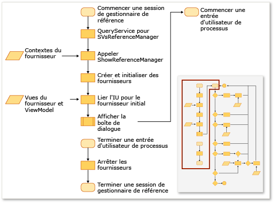

# Extension du Gestionnaire de r&#233;f&#233;rences
Vous pouvez ajouter des références à votre projet à l’aide du Gestionnaire de références dans une extension Visual Studio. Avant l’apparition du Gestionnaire de références, vos projets doivent le configurer pour afficher les données en provenance des emplacements corrects. Par exemple, un projet qui cible le [!INCLUDE[net_v40_short](../debugger/includes/net_v40_short_md.md)] doit remplir les assemblys à partir d’un dossier autre que celui d’un projet qui cible le [!INCLUDE[net_v35_long](../misc/includes/net_v35_long_md.md)].  
  
 Vous configurez en général le Gestionnaire de références à l’aide d’une collection de ProviderContexts provenant des fournisseurs suivants :  
  
-   <xref:Microsoft.VisualStudio.Shell.Interop.IVsAssemblyReferenceProviderContext>  
  
-   <xref:Microsoft.VisualStudio.Shell.Interop.IVsComReferenceProviderContext>  
  
-   <xref:Microsoft.VisualStudio.Shell.Interop.IVsFileReferenceProviderContext>  
  
-   <xref:Microsoft.VisualStudio.Shell.Interop.IVsProjectReferenceProviderContext>  
  
-   <xref:Microsoft.VisualStudio.Shell.Interop.IVsPlatformReferenceProviderContext>  
  
 Un composant client affiche le Gestionnaire de références en appelant la méthode ShowReferenceManager sur le service Visual Studio nommé SVsReferenceManager. Une collection de classes IVsReferenceProviderContext est passée à cette méthode en tant qu’argument. Les contextes déterminent les onglets qui apparaissent à gauche de la boîte de dialogue Gestionnaire de références. Chaque fournisseur contient toutes les informations nécessaires à la boîte de dialogue pour qu’elle remplisse et affiche les données dont vous avez besoin pour ajouter une référence à votre projet.  
  
 L’illustration suivante résume le processus.  
  
   
  
   
  
## Ajout d’un onglet personnalisé  
 Pour ajouter un onglet personnalisé, vous devez implémenter un IReferenceProvider, un IVsReference et un IVsReferenceProviderContext.  
  
#### Pour ajouter un onglet personnalisé  
  
1.  Implémentez l’interface IReferenceProvider, puis exportez\-la par le biais de Managed Extensibility Framework \(MEF\) pour que le Gestionnaire de références puisse s’en servir.  
  
     Le Gestionnaire de références utilise l’objet ReferenceProvider pour générer les éléments qui apparaissent dans le Gestionnaire de références. L’interface de cet objet est définie dans Microsoft.VisualStudio.ReferenceManager.Contracts.dll.  
  
2.  Implémentez un objet ProviderContext.  
  
     Le Gestionnaire de références utilise la propriété GUID de cet objet pour faire correspondre le contexte au fournisseur. Quand le Gestionnaire de références s’initialise, il passe au fournisseur le ProviderContext qui est passé par le biais de la méthode ShowReferenceManager. Le ProviderContext doit contenir toutes les informations dont le fournisseur a besoin pour énumérer IVsReferences.  
  
3.  Étendez la classe StandardReferenceProviderContext.  
  
     Le Gestionnaire de référence fournit des classes de base, telles que la classe StandardReferenceProviderContext, que vous pouvez utiliser pour commencer. Votre classe de fournisseur peut étendre StandardReferenceProvider, et l’élément de référence peut étendre StandardReferenceItem.  
  
 Votre classe de fournisseur peut ressembler à l’exemple suivant :  
  
```  
[Export(typeof(IReferenceProvider))] [ExportMetadata("Name", "AssemblyReferenceProvider")] [ExportMetadata("Guid", VSConstants.AssemblyReferenceProvider_string)] internal class AssemblyReferenceProvider : StandardReferenceProvider { }  
```  
  
 Votre classe de contexte peut ressembler à l’exemple suivant :  
  
```  
  
[Export(typeof(IVsReferenceProviderContext))] [Export(typeof(IVsAssemblyReferenceProviderContext))] [Export("AssemblyReferenceProviderContext", typeof(IVsReferenceProviderContext))] [Export(VSConstants.AssemblyReferenceProvider_string, typeof(IVsReferenceProviderContext))] [PartCreationPolicy(System.ComponentModel.Composition.CreationPolicy.NonShared)] [ExportMetadata("Name", "AssemblyReferenceProviderContext")] [ExportMetadata("Guid", VSConstants.AssemblyReferenceProvider_string)] public class AssemblyReferenceProviderContext : StandardReferenceProviderContext<IVsAssemblyReference, AssemblyIdentity>, IVsAssemblyReferenceProviderContext { }  
```  
  
 Pour votre classe d’élément de référence, nous vous recommandons d’implémenter IWatchableReference et de rendre votre classe sérialisable. En suivant cette approche, vous pouvez tirer parti des méthodes de sérialisation du cache dans la classe StandardReferenceProvider, et ce en plus du service ReferenceWatcher qui synchronise automatiquement les contrôles d’élément entre les différents onglets de la boîte de dialogue :  
  
```  
[Serializable] public class StandardReferenceItem : IWatchableReference { }  
```  
  
 La classe ReferenceProvider contient deux méthodes importantes. La première méthode, Initialize, est appelée une seule fois lors du chargement initial du fournisseur dans la boîte de dialogue. La seconde méthode est SetContext, qui est appelée immédiatement après Initialize. Elle peut être rappelée si les systèmes de projet ne parviennent pas à ajouter les références que vous avez spécifiées et tentées de valider.  
  
> [!NOTE]
>  Étant donné que les fournisseurs persistent pendant la durée du programme, ils peuvent enregistrer l’état entre les sessions, mais des conditions de concurrence peuvent se produire si l’utilisateur ferme la boîte de dialogue et la rouvre rapidement.  
  
## Substituer la source existante de l’énumération des onglets  
 Certains contextes de fournisseur ont une propriété appelée Tabs de type uint. Cette propriété est un masque de bits, et ses valeurs contrôlent les onglets affichés par ce fournisseur.  Par exemple, l’interface IVsAssemblyReferenceProviderContext définit une propriété Tabs qui peut accepter les valeurs suivantes :  
  
```  
namespace Microsoft.VisualStudio.Shell.Interop { public enum __VSASSEMBLYPROVIDERTAB { TAB_ASSEMBLY_FRAMEWORK = 1, TAB_ASSEMBLY_EXTENSIONS = 2, TAB_ASSEMBLY_ALL = 3, } }  
```  
  
 La classe IVsPlatformReferenceProviderContext possède une propriété similaire. Vous ne pouvez pas modifier le nom de l’onglet, mais vous pouvez contrôler le texte d’en\-tête qui s’affiche quand l’utilisateur sélectionne l’onglet. Vous pouvez contrôler cette valeur par le biais des méthodes suivantes sur la classe IVsAssemblyProviderContext :  
  
```  
void SetTabTitle(uint etabId, string szTabTitle);  
```  
  
## Substituer le filtre dans la boîte de dialogue Parcourir  
 Vous pouvez fournir un filtre de type personnalisé à la boîte de dialogue Parcourir du Gestionnaire de références en modifiant la valeur de la propriété BrowseFilter sur l’objet IFileReferenceProviderContext.  L’exemple suivant illustre cette technique à partir du code natif :  
  
```  
  
// Holds a list of provider contexts CComSafeArray<LPUNKNOWN> spProviderContexts; // Creates the file reference context for Browse vsReferenceManager->CreateProviderContext(GUID_FileReferenceProvider, &pFileRefProviderContext)); // Sets the Browse filter pFileRefProviderContext->put_BrowseFilter(wszFilter); spProviderContexts.Add(pFileRefProviderContext); // Show the reference manager hr = srpRefMgr->ShowReferenceManager( spVsRefMgrUser, spProviderContexts, strTitle, HELPKEYWORD_AddReference, GUID_AssemblyReferenceProvider, wszFilter, m_bstrStartBrowse);  
```  
  
## Voir aussi  
 [Comment : ajouter ou supprimer des références à l'aide du gestionnaire de références](../ide/how-to-add-or-remove-references-by-using-the-reference-manager.md)