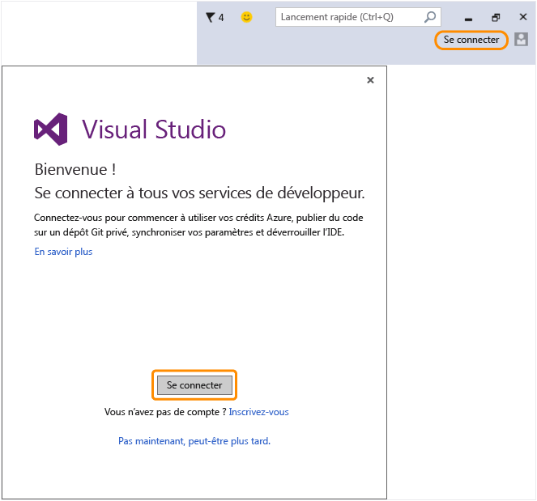

# Retournez dans Visual Studio pour vous connecter &#224; l’IDE avec votre nouveau compte Microsoft&#160;!
Vous avez bien créé un compte Microsoft. Retournez dans Visual Studio et connectez\-vous via l’Assistant de bienvenue à l’occasion du premier lancement ou à tout moment à partir de l’angle supérieur droit de l’IDE.  
  
 Connectez\-vous à l’IDE pour commencer à utiliser vos crédits Azure, publier du code sur un référentiel Git privé, synchroniser vos paramètres et déverrouiller l’IDE.[En savoir plus](../ide/signing-in-to-visual-studio.md) sur tous les services de développement disponibles.  
  
 