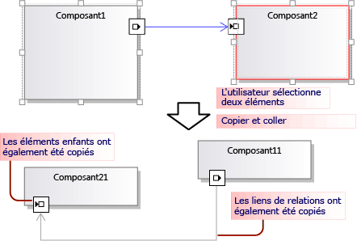
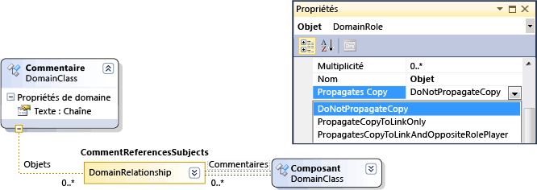
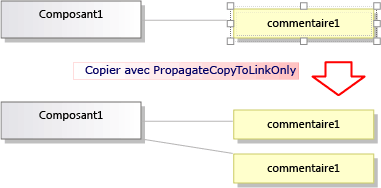
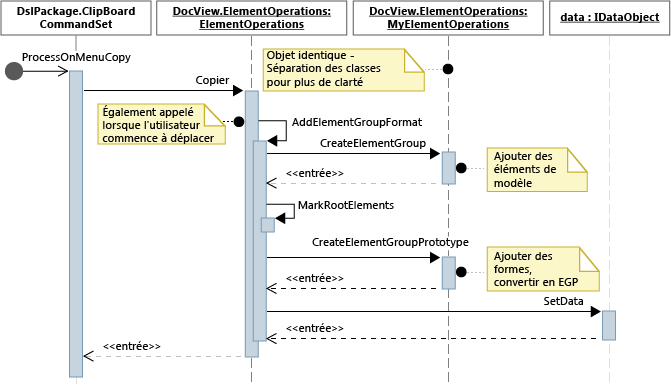
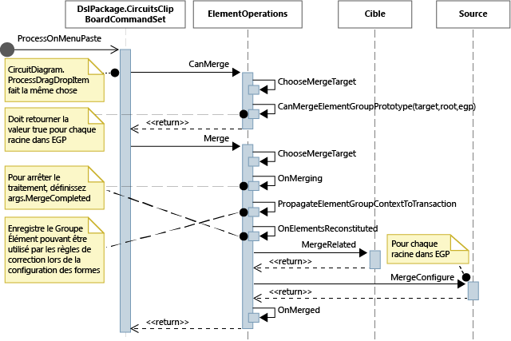

# <a name="customizing-copy-behavior"></a>Personnalisation du comportement de la commande copier
Dans un langage spécifique à un domaine (DSL) créé avec le kit de développement logiciel (SDK) de visualisation et de modélisation Visual Studio, vous pouvez modifier ce qui se produit lorsque l’utilisateur copie et colle des éléments.

## <a name="standard-copy-and-paste-behavior"></a>Comportement standard de copie et de collage
 Pour activer la copie, définissez la propriété **activer la copie de collage** du nœud **éditeur** dans l’Explorateur DSL.

 Par défaut, quand l'utilisateur copie des éléments dans le Presse-papiers, les éléments suivants sont également copiés :

- descendants incorporés des éléments sélectionnés. (Autrement dit, les éléments qui sont les cibles de relations incorporées ayant pour source des éléments copiés.) ;

- liens de relation entre les éléments copiés.

  Cette règle s'applique de manière récursive aux liens et aux éléments copiés.

  

  Les liens et les éléments copiés sont sérialisés et stockés dans un <xref:Microsoft.VisualStudio.Modeling.ElementGroupPrototype> (EGP), qui est placé dans le Presse-papiers.

  Une image des éléments copiés est aussi placée dans le Presse-papiers. Cela permet à l'utilisateur de les coller dans d'autres applications telles que Word.

  L'utilisateur peut coller des éléments copiés sur une cible qui peut accepter les éléments conformément à la définition DSL. Par exemple, dans une solution DSL générée à partir du modèle de solution de composants, l'utilisateur peut coller des ports sur des composants, mais pas sur le diagramme, et il peut coller des composants sur le diagramme, mais pas sur d'autres composants.

## <a name="customizing-copy-and-paste-behavior"></a>Personnalisation du comportement de copie et de collage
 Pour plus d’informations sur la personnalisation du modèle à l’aide de code de programme, consultez [navigation et mise à jour d’un modèle dans le code de programme](../modeling/navigating-and-updating-a-model-in-program-code.md).

 **Activer ou désactiver la copie, la coupe et le collage.**
Dans l’Explorateur DSL, définissez la propriété **activer la copie de collage** du nœud **éditeur** .

 **Copier des liens vers la même cible.**  Par exemple, pour qu'une zone de commentaires copiée soit liée au même élément de sujet.
Affectez à la propriété **propager la copie** du rôle la valeur **propager la copie au lien uniquement**. Pour plus d’informations, consultez Personnalisation du comportement de la [copie des liens](#customizeLinks).

 Copier des éléments liés. Par exemple, quand vous copiez un nouvel élément, des copies de toute zone de commentaires liée sont également créées.
Définissez la propriété **propager la copie** du rôle sur **propager la copie au lien et à l’acteur de rôle opposé**. Pour plus d’informations, consultez Personnalisation du comportement de la [copie des liens](#customizeLinks).

 **Dupliquer rapidement des éléments en copiant et en collant.**  Normalement, l'élément que vous venez de copier est encore sélectionné et vous ne pouvez pas y coller le même type d'élément.
Ajoutez une directive de fusion d'élément à la classe de domaine et configurez-la pour transférer les fusions vers la classe parente. L'effet sera le même sur les opérations de déplacement. Pour plus d’informations, consultez Personnalisation de la [création et du déplacement d’éléments](../modeling/customizing-element-creation-and-movement.md).

 \- ou -

 Sélectionnez le diagramme avant de coller les éléments, en substituant `ClipboardCommandSet.ProcessOnPasteCommand()`. Ajoutez ce code dans un fichier personnalisé dans le projet DslPackage :

```csharp
namespace Company.MyDsl {
using System.Linq;
using Microsoft.VisualStudio.Modeling.Diagrams;
using Microsoft.VisualStudio.Modeling.Shell;
partial class MyDslClipboardCommandSet
{
  protected override void ProcessOnMenuPasteCommand()
  {
 // Deselect the current selection after copying:
 Diagram diagram = (this.CurrentModelingDocView as SingleDiagramDocView).Diagram;
    this.CurrentModelingDocView
     .SelectObjects(1, new object[] { diagram }, 0);
  }
} }
```

 **Créer des liens supplémentaires quand l'utilisateur colle un élément sur une cible sélectionnée.**  Par exemple, quand une zone de commentaires est collée sur un élément, un lien est créé entre eux.
Ajoutez une directive de fusion d'élément à la classe de domaine cible et configurez-la pour traiter la fusion en ajoutant des liens. L'effet sera le même sur les opérations de déplacement. Pour plus d’informations, consultez Personnalisation de la [création et du déplacement d’éléments](../modeling/customizing-element-creation-and-movement.md).

 \- ou -

 Substituez `ClipboardCommandSet.ProcessOnPasteCommand()` pour créer les liens supplémentaires après avoir appelé la méthode de base.

 **Personnaliser les formats dans lesquels les éléments peuvent être copiés** vers des applications externes, par exemple, pour ajouter une bordure au formulaire bitmap.
Remplacez *MyDsl* `ClipboardCommandSet.ProcessOnMenuCopyCommand()` dans le projet DslPackage.

 **Personnaliser la façon dont les éléments sont copiés dans le presse-papiers par la commande copier, mais pas dans une opération glisser.**
Remplacez *MyDsl* `ClipboardCommandSet.CopyModelElementsIntoElementGroupPrototype()` dans le projet DslPackage.

 **Conserver la disposition des formes lors des opérations de copie et de collage.**
Quand l'utilisateur copie plusieurs formes, vous pouvez conserver leurs positions relatives quand elles sont collées. Cette technique est illustrée dans l’exemple de l’exemple de [diagrammes de circuit](https://code.msdn.microsoft.com/Visualization-Modeling-SDK-763778e8).

 Pour obtenir cet effet, ajoutez les formes et les connecteurs à l'ElementGroupPrototype copié. La méthode la plus simple à substituer est ElementOperations.CreateElementGroupPrototype(). Pour cela, ajoutez le code suivant au projet DSL :

```csharp

public class MyElementOperations : DesignSurfaceElementOperations
{
  // Create an EGP to add to the clipboard.
  // Called when the elements to be copied have been
  // collected into an ElementGroup.
 protected override ElementGroupPrototype CreateElementGroupPrototype(ElementGroup elementGroup, ICollection<ModelElement> elements, ClosureType closureType)
  {
 // Add the shapes and connectors:
 // Get the elements already in the group:
    ModelElement[] mels = elementGroup.ModelElements
        .Concat(elementGroup.ElementLinks) // Omit if the paste target is not the diagram.
        .ToArray();
 // Get their shapes:
    IEnumerable<PresentationElement> shapes =
       mels.SelectMany(mel =>
            PresentationViewsSubject.GetPresentation(mel));
    elementGroup.AddRange(shapes);

 return base.CreateElementGroupPrototype
           (elementGroup, elements, closureType);
  }

 public MyElementOperations(IServiceProvider serviceProvider, ElementOps1Diagram diagram)
      : base(serviceProvider, diagram)
  { }
}

// Replace the standard ElementOperations
// singleton with your own:
partial class MyDslDiagram // EDIT NAME
{
 /// <summary>
 /// Singleton ElementOperations attached to this diagram.
 /// </summary>
 public override DesignSurfaceElementOperations ElementOperations
  {
 get
    {
 if (singleton == null)
      {
        singleton = new MyElementOperations(this.Store as IServiceProvider, this);
      }
 return singleton;
    }
  }
 private MyElementOperations singleton = null;
}
```

 **Coller des formes à un emplacement choisi, par exemple la position actuelle du curseur.**
Quand l'utilisateur copie plusieurs formes, vous pouvez conserver leurs positions relatives quand elles sont collées. Cette technique est illustrée dans l’exemple de l’exemple de [diagrammes de circuit](https://code.msdn.microsoft.com/Visualization-Modeling-SDK-763778e8).

 Pour obtenir cet effet, substituez `ClipboardCommandSet.ProcessOnMenuPasteCommand()` pour utiliser la version d'`ElementOperations.Merge()` spécifique à l'emplacement. Pour cela, ajoutez le code suivant au projet DslPackage :

```csharp

partial class MyDslClipboardCommandSet // EDIT NAME
{
   /// <summary>
    /// This method assumes we only want to paste things onto the diagram
    /// - not onto anything contained in the diagram.
    /// The base method pastes in a free space on the diagram.
    /// But if the menu was used to invoke paste, we want to paste in the cursor position.
    /// </summary>
    protected override void ProcessOnMenuPasteCommand()
    {

  NestedShapesSampleDocView docView = this.CurrentModelingDocView as NestedShapesSampleDocView;

      // Retrieve data from clipboard:
      System.Windows.Forms.IDataObject data = System.Windows.Forms.Clipboard.GetDataObject();

      Diagram diagram = docView.CurrentDiagram;
      if (diagram == null) return;

      if (!docView.IsContextMenuShowing)
      {
        // User hit CTRL+V - just use base method.

        // Deselect anything that's selected, otherwise
        // pasted item will be incompatible:
        if (!this.IsDiagramSelected())
        {
          docView.SelectObjects(1, new object[] { diagram }, 0);
        }

        // Paste into a convenient spare space on diagram:
    base.ProcessOnMenuPasteCommand();
      }
      else
      {
        // User right-clicked - paste at mouse position.

        // Utility class:
        DesignSurfaceElementOperations op = diagram.ElementOperations;

        ShapeElement pasteTarget = diagram;

        // Check whether what's in the paste buffer is acceptable on the target.
        if (pasteTarget != null && op.CanMerge(pasteTarget, data))
        {

        // Although op.Merge would be a no-op if CanMerge failed, we check CanMerge first
          // so that we don't create an empty transaction (after which Undo would be no-op).
          using (Transaction t = diagram.Store.TransactionManager.BeginTransaction("paste"))
          {
            PointD place = docView.ContextMenuMousePosition;
            op.Merge(pasteTarget, data, PointD.ToPointF(place));
            t.Commit();
          }
        }
      }
    }
  }
```

 **Permet à l’utilisateur de glisser-déplacer des éléments.**
Consultez [Comment : ajouter un gestionnaire de glisser-déplacer](../modeling/how-to-add-a-drag-and-drop-handler.md).

## <a name="customizing-link-copy-behavior"></a><a name="customizeLinks"></a> Personnalisation du comportement de la copie des liens
 Quand l'utilisateur copie un élément, le comportement standard est que tout élément incorporé est également copié. Vous pouvez modifier le comportement de copie standard. Dans la définition DSL, sélectionnez un rôle d’un côté d’une relation, puis dans la Fenêtre Propriétés définissez la valeur de **copie propages** .

 

 Il existe trois valeurs :

- Ne pas propager la copie

- Propager la copie au lien uniquement : quand le groupe est collé, la nouvelle copie de ce lien fait référence à l'élément existant à l'autre extrémité du lien.

- Propager la copie au lien et à l'acteur de rôle opposé : le groupe copié inclut une copie de l'élément à l'autre extrémité du lien.

  

  Les modifications que vous apportez affectent à la fois les éléments et l'image copiée.

## <a name="programming-copy-and-paste-behavior"></a>Programmation du comportement de copie et de collage
 De nombreux aspects du comportement d'une solution DSL en ce qui concerne la copie, le collage, la création et la suppression d'objets sont régis par une instance de <xref:Microsoft.VisualStudio.Modeling.ElementOperations> couplée au diagramme. Vous pouvez modifier le comportement de votre solution DSL en dérivant votre propre classe de <xref:Microsoft.VisualStudio.Modeling.ElementOperations> et en substituant la propriété <xref:Microsoft.VisualStudio.Modeling.Diagrams.Diagram.ElementOperations%2A> de votre classe de diagramme.

> [!TIP]
> Pour plus d’informations sur la personnalisation du modèle à l’aide de code de programme, consultez [navigation et mise à jour d’un modèle dans le code de programme](../modeling/navigating-and-updating-a-model-in-program-code.md).

 

 

#### <a name="to-define-your-own-elementoperations"></a>Pour définir vos propres ElementOperations

1. Dans un nouveau fichier dans votre projet DSL, créez une classe dérivée de <xref:Microsoft.VisualStudio.Modeling.Diagrams.DesignSurfaceElementOperations>.

2. Ajoutez une définition de classe partielle pour votre classe de diagramme. Le nom de cette classe se trouve dans **Dsl\GeneratedCode\Diagrams.cs**.

    Dans la classe diagramme, substituez <xref:Microsoft.VisualStudio.Modeling.Diagrams.Diagram.ElementOperations%2A> pour retourner une instance de votre sous-classe ElementOperations. Vous devez retourner la même instance à chaque appel.

   Ajoutez ce code dans un fichier de code personnalisé dans le projet DslPackage :

```csharp

using Microsoft.VisualStudio.Modeling;
using Microsoft.VisualStudio.Modeling.Diagrams;
using Microsoft.VisualStudio.Modeling.Diagrams.ExtensionEnablement;

  public partial class MyDslDiagram
  {
    public override DesignSurfaceElementOperations ElementOperations
    {
      get
      {
        if (this.elementOperations == null)
        {
          this.elementOperations = new MyElementOperations(this.Store as IServiceProvider, this);
        }
        return this.elementOperations;
      }
    }
    private MyElementOperations elementOperations = null;
  }

  public class MyElementOperations : DesignSurfaceElementOperations
  {
    public MyElementOperations(IServiceProvider serviceProvider, MyDslDiagram diagram)
      : base(serviceProvider, diagram)
    { }
    // Overridden methods follow
  }
```

## <a name="receiving-items-dragged-from-other-models"></a>Réception d'éléments déplacés à partir d'autres modèles
 ElementOperations peut également servir à définir le comportement de copie, de déplacement, de suppression et de glisser-déplacer. En guise de démonstration de l'utilisation d'ElementOperations, l'exemple fourni ici définit un comportement de glisser-déplacer personnalisé. Toutefois, à cette fin, vous pouvez envisager l’approche alternative décrite dans [Comment : ajouter un gestionnaire de glisser-déplacer](../modeling/how-to-add-a-drag-and-drop-handler.md), qui est plus extensible.

 Définissez deux méthodes dans votre classe ElementOperations :

- `CanMerge(ModelElement targetElement, System.Windows.Forms.IDataObject data)` qui détermine si l’élément source peut être glissé sur la forme, le connecteur ou le diagramme cible.

- `MergeElementGroupPrototype(ModelElement targetElement, ElementGroupPrototype sourcePrototype)` qui combine l’élément source dans la cible.

### <a name="canmerge"></a>CanMerge()
 `CanMerge()` est appelé pour déterminer les commentaires qui doivent être donnés à l’utilisateur lorsque la souris se déplace dans le diagramme. Les paramètres de la méthode sont l'élément sur lequel la souris est placée et les données concernant la source à partir de laquelle l'opération de déplacement a été effectuée. L'utilisateur peut faire glisser un élément à partir de n'importe quel emplacement à l'écran. Ainsi, l'objet source peut être de nombreux types différents et peut être sérialisé dans différents formats. Si la source est un modèle DSL ou UML, le paramètre de données et la sérialisation d'un <xref:Microsoft.VisualStudio.Modeling.ElementGroupPrototype>. Les opérations de glissement, de copie et de boîte à outils utilise des ElementGroupPrototypes pour représenter des fragments de modèles.

 Un prototype de groupe d'éléments peut contenir une quantité quelconque d'éléments et de liens. Les types d'éléments peuvent être identifiés par leurs GUID. Le GUID est de la forme qui a été déplacée, et non l'élément de modèle sous-jacent. Dans l'exemple suivant, `CanMerge()` retourne la valeur True si une forme de classe à partir d'un diagramme UML est déplacée sur ce diagramme.

```csharp
public override bool CanMerge(ModelElement targetShape, System.Windows.Forms.IDataObject data)
 {
  // Extract the element prototype from the data.
  ElementGroupPrototype prototype = ElementOperations.GetElementGroupPrototype(this.ServiceProvider, data);
  if (targetShape is MyTargetShape && prototype != null &&
        prototype.RootProtoElements.Any(rootElement =>
          rootElement.DomainClassId.ToString()
          ==  "3866d10c-cc4e-438b-b46f-bb24380e1678")) // Guid of UML Class shapes
          // or SourceClass.DomainClassId
        return true;
   return base.CanMerge(targetShape, data);
 }
```

## <a name="mergeelementgroupprototype"></a>MergeElementGroupPrototype()
 Cette méthode est appelée quand l'utilisateur dépose un élément sur un diagramme, une forme ou un connecteur. Elle doit fusionner le contenu déplacé dans l'élément cible. Dans cet exemple, le code détermine s'il reconnaît la combinaison de types cibles et de prototypes. Si c'est le cas, la méthode convertit les éléments déplacés en un prototype des éléments qui doivent être ajoutés au modèle. La méthode de base est appelée pour effectuer la fusion des éléments convertis ou non convertis.

```csharp
public override void MergeElementGroupPrototype(ModelElement targetShape, ElementGroupPrototype sourcePrototype)
{
  ElementGroupPrototype prototypeToMerge = sourcePrototype;
  MyTargetShape pel = targetShape as MyTargetShape;
  if (pel != null)
  {
    prototypeToMerge = ConvertDraggedTypeToLocal(pel, sourcePrototype);
  }
  if (prototypeToMerge != null)
    base.MergeElementGroupPrototype(targetShape, prototypeToMerge);
}
```

 Cet exemple traite d'éléments de classe UML déplacés à partir d'un diagramme de classe UML. La solution DSL n'est pas conçue pour stocker directement des classes UML. Au lieu de cela, nous créons un élément DSL pour chaque classe UML déplacée. Cela est utile par exemple si la solution DSL est un diagramme d'instance. L'utilisateur pourrait faire glisser des classes sur le diagramme pour créer des instances de ces classes.

```csharp

private ElementGroupPrototype ConvertDraggedTypeToLocal (MyTargetShape snapshot, ElementGroupPrototype prototype)
{
  // Find the UML project:
  EnvDTE.DTE dte = snapshot.Store.GetService(typeof(EnvDTE.DTE)) as EnvDTE.DTE;
  foreach (EnvDTE.Project project in dte.Solution.Projects)
  {
    IModelingProject modelingProject = project as IModelingProject;
    if (modelingProject == null) continue; // not a modeling project
    IModelStore store = modelingProject.Store;
    if (store == null) continue;
    // Look for the shape that was dragged:
    foreach (IDiagram umlDiagram in store.Diagrams())
    {
      // Get modeling diagram that implements UML diagram:
      Diagram diagram = umlDiagram.GetObject<Diagram>();
      Guid elementId = prototype.SourceRootElementIds.FirstOrDefault();
      ShapeElement shape = diagram.Partition.ElementDirectory.FindElement(elementId) as ShapeElement;
      if (shape == null) continue;
      IClass classElement = shape.ModelElement as IClass;
      if (classElement == null) continue;

      // Create a prototype of elements in my DSL, based on the UML element:
      Instance instance = new Instance(snapshot.Store);
      instance.Type = classElement.Name;
      // Pack them into a prototype:
      ElementGroup group = new ElementGroup(instance);
      return group.CreatePrototype();
    }
  }
  return null;
}
```

## <a name="standard-copy-behavior"></a>Comportement de copie standard
 Le code de cette section montre des méthodes que vous pouvez substituer pour modifier le comportement de copie. Pour vous aider à voir comment obtenir vos propres personnalisations, cette section montre du code qui substitue les méthodes impliquées dans la copie, mais ne modifie pas le comportement standard.

 Quand l'utilisateur appuie sur Ctrl+C ou utilise la commande de menu Copier, la méthode <xref:Microsoft.VisualStudio.Modeling.Shell.ClipboardCommandSet.ProcessOnMenuCopyCommand%2A> est appelée. Vous pouvez voir comment cela est configuré dans **DslPackage\Generated Code\CommandSet.cs**. Pour plus d’informations sur la configuration des commandes, consultez [Comment : ajouter une commande au menu contextuel](../modeling/how-to-add-a-command-to-the-shortcut-menu.md).

 Vous pouvez substituer ProcessOnMenuCopyCommand en ajoutant une définition de classe partielle de *MyDsl* `ClipboardCommandSet` dans le projet DslPackage.

```csharp
using System.Collections.Generic;
using System.Drawing;
using System.Windows.Forms;
using Microsoft.VisualStudio.Modeling;
using Microsoft.VisualStudio.Modeling.Diagrams;

partial class MyDslClipboardCommandSet
{
  /// <summary>
  /// Override ProcessOnMenuCopyCommand() to copy elements to the
  /// clipboard in different formats, or to perform additional tasks
  /// before or after copying - for example deselect the copied elements.
  /// </summary>
  protected override void ProcessOnMenuCopyCommand()
  {
    IList<ModelElement> selectedModelElements = this.SelectedElements;
    if (selectedModelElements.Count == 0) return;

    // System container for clipboard data.
    // The IDataObject can contain data in several formats.
    IDataObject dataObject = new DataObject();

    Bitmap bitmap = null; // For export to other programs.
    try
    {
      #region Create EGP for copying to a DSL.
      this.CopyModelElementsIntoElementGroupPrototype
                     (dataObject, selectedModelElements);
      #endregion

      #region Create bitmap for copying to another application.
      // Find all the shapes associated with this selection:
      List<ShapeElement> shapes = new List<ShapeElement>(
        this.ResolveExportedShapesForClipboardImages
              (dataObject, selectedModelElements));

      bitmap = this.CreateBitmapForClipboard(shapes);
      if (bitmap != null)
      {
        dataObject.SetData(DataFormats.Bitmap, bitmap);
      }
      #endregion

      // Add the data to the clipboard:
      Clipboard.SetDataObject(dataObject, true, 5, 100);
    }
    finally
    {
      // Dispose bitmap after SetDataObject:
      if (bitmap != null) bitmap.Dispose();
    }
  }
/// <summary>
/// Override this to customize the element group that is copied to the clipboard.
/// </summary>
protected override void CopyModelElementsIntoElementGroupPrototype(IDataObject dataObject, IList<ModelElement> selectedModelElements)
{
  return this.ElementOperations.Copy(dataObject, selectedModelElements);
}
}
```

 Chaque diagramme possède une instance singleton d'ElementOperations. Vous pouvez fournir votre propre dérivé. Ce fichier, qui peut être placé dans le projet DSL, se comporterait de la même manière que le code qu'il substitue :

```csharp
using System;
using System.Collections.Generic;
using System.Linq;
using Microsoft.VisualStudio.Modeling;
using Microsoft.VisualStudio.Modeling.Diagrams;

namespace Company.MyDsl
{
  partial class MyDslDiagram
  {
    /// <summary>
    /// Singleton ElementOperations attached to this diagram.
    /// </summary>
    public override DesignSurfaceElementOperations ElementOperations
    {
      get
      {
        if (this.elementOperations == null)
        {
          this.elementOperations = new MyElementOperations(this.Store as IServiceProvider, this);
        }
        return this.elementOperations;
      }
    }
    private MyElementOperations elementOperations = null;
  }

  // Our own version of ElementOperations so that we can override:
  public class MyElementOperations : DesignSurfaceElementOperations
  {
    public MyElementOperations(IServiceProvider serviceProvider, ElementOps1Diagram diagram)
      : base(serviceProvider, diagram)
    { }

    /// <summary>
    /// Copy elements to the clipboard data.
    /// Provides a hook for adding custom data.
    /// </summary>
    public override void Copy(System.Windows.Forms.IDataObject data,
      ICollection<ModelElement> elements,
      ClosureType closureType,
      System.Drawing.PointF sourcePosition)
    {
      if (CanAddElementGroupFormat(elements, closureType))
      {
        AddElementGroupFormat(data, elements, closureType);
      }

      // Override these to store additional data:
      if (CanAddCustomFormat(elements, closureType))
      {
        AddCustomFormat(data, elements, closureType, sourcePosition);
      }
    }

    protected override void AddElementGroupFormat(System.Windows.Forms.IDataObject data, ICollection<ModelElement> elements, ClosureType closureType)
    {
      // Add the selected elements and those implied by the propagate copy rules:
      ElementGroup elementGroup = this.CreateElementGroup(elements, closureType);

      // Mark all the elements that are not embedded under other elements:
      this.MarkRootElements(elementGroup, elements, closureType);

      // Store in the clipboard data:
      ElementGroupPrototype elementGroupPrototype = this.CreateElementGroupPrototype(elementGroup, elements, closureType);
      data.SetData(ElementGroupPrototype.DefaultDataFormatName, elementGroupPrototype);
    }

    /// <summary>
    /// Override this to store additional elements in the element group:
    /// </summary>
    protected override ElementGroupPrototype CreateElementGroupPrototype(ElementGroup elementGroup, ICollection<ModelElement> elements, ClosureType closureType)
    {
      ElementGroupPrototype prototype = new ElementGroupPrototype(this.Partition, elementGroup.RootElements, elementGroup);
      return prototype;
    }

    /// <summary>
    /// Create an element group from the given starting elements, using the
    /// copy propagation rules specified in the DSL Definition.
    /// By default, this includes all the embedded descendants of the starting elements,
    /// and also includes reference links where both ends are already included.
    /// </summary>
    /// <param name="startElements">model elements to copy</param>
    /// <param name="closureType"></param>
    /// <returns></returns>
    protected override ElementGroup CreateElementGroup(ICollection<ModelElement> startElements, ClosureType closureType)
    {
      // ElementClosureWalker finds all the connected elements,
      // according to the propagate copy rules specified in the DSL Definition:
      ElementClosureWalker walker = new ElementClosureWalker(this.Partition,
        closureType, // Normally ClosureType.CopyClosure
        startElements,
        true, // Do not load other models.
        null, // Optional list of domain roles not to traverse.
        true); // Include relationship links where both ends are already included.

      walker.Traverse(startElements);
      IList<ModelElement> closureList = walker.ClosureList;
      Dictionary<object, object> closureContext = walker.Context;

      // create a group for this closure
      ElementGroup group = new ElementGroup(this.Partition);
      group.AddRange(closureList, false);

      // create the element group prototype for the group
      foreach (object key in closureContext.Keys)
      {
        group.SourceContext.ContextInfo[key] = closureContext[key];
      }

      return group;
    }
  }
}
```

## <a name="see-also"></a>Voir aussi

- [Personnalisation de la création et du mouvement des éléments](../modeling/customizing-element-creation-and-movement.md)
- [Guide pratique pour ajouter un gestionnaire de glisser-déplacer](../modeling/how-to-add-a-drag-and-drop-handler.md)
- [Exemple : exemple de diagrammes de circuit VMSDK](https://code.msdn.microsoft.com/Visualization-Modeling-SDK-763778e8)

[!INCLUDE[modeling_sdk_info](includes/modeling_sdk_info.md)]
