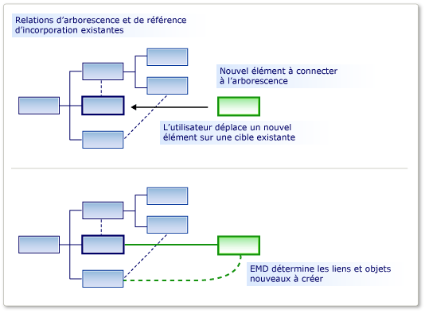
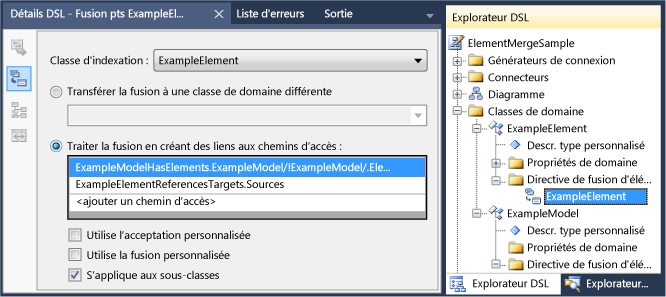

# <a name="customizing-element-creation-and-movement"></a>Personnalisation de la création et du mouvement des éléments

Vous pouvez autoriser le glissement d’un élément vers un autre, soit à partir de la boîte à outils, soit dans une opération de collage ou de déplacement. Vous pouvez faire en sorte que les éléments déplacés soient liés aux éléments cibles, à l’aide des relations que vous spécifiez.

Une directive de fusion d’éléments (EMD) spécifie ce qui se produit lorsqu’un élément de modèle est *fusionné* dans un autre élément de modèle. Cela se produit dans les situations suivantes :

- L’utilisateur fait glisser de la boîte à outils vers le diagramme ou une forme.

- L’utilisateur crée un élément à l’aide d’un menu Ajouter dans la forme Explorateur ou compartiment.

- L’utilisateur déplace un élément d’un couloir à un autre.

- L’utilisateur colle un élément.

- Votre code de programme appelle la directive de fusion d’éléments.

Bien que les opérations de création puissent paraître différentes des opérations de copie, elles fonctionnent de la même façon. Lorsqu’un élément est ajouté, par exemple à partir de la boîte à outils, un prototype de celui-ci est répliqué. Le prototype est fusionné dans le modèle de la même façon que les éléments qui ont été copiés à partir d’une autre partie du modèle.

La responsabilité d’un EMD consiste à décider comment un objet ou un groupe d’objets doit être fusionné à un emplacement particulier dans le modèle. En particulier, il décide des relations qui doivent être instanciées pour lier le groupe fusionné au modèle. Vous pouvez également le personnaliser pour définir des propriétés et créer des objets supplémentaires.



Un EMD est généré automatiquement lorsque vous définissez une relation d’incorporation. Ce EMD par défaut crée une instance de la relation lorsque les utilisateurs ajoutent de nouvelles instances enfants au parent. Vous pouvez modifier ces EMDs par défaut, par exemple en ajoutant du code personnalisé.

Vous pouvez également ajouter votre propre EMDs dans la définition DSL, pour permettre aux utilisateurs de faire glisser ou coller différentes combinaisons de classes fusionnées et de réception.

## <a name="defining-an-element-merge-directive"></a>Définition d’une directive de fusion d’éléments

Vous pouvez ajouter des directives de fusion d’éléments à des classes de domaine, des relations de domaine, des formes, des connecteurs et des diagrammes. Vous pouvez les ajouter ou les trouver dans l’Explorateur DSL sous la classe de domaine réceptrice. La classe de réception est la classe de domaine de l’élément qui se trouve déjà dans le modèle, et sur lequel l’élément nouveau ou copié sera fusionné.



La **classe d’indexation** est la classe de domaine des éléments qui peuvent être fusionnés dans les membres de la classe de réception. Les instances de sous-classes de la classe d’indexation seront également fusionnées par ce EMD, sauf si vous affectez la valeur false **à la propriété s’applique aux sous-classes** .

Il existe deux genres de directives de fusion :

- Une directive de **fusion de processus** spécifie les relations selon lesquelles le nouvel élément doit être lié à l’arborescence.

- Une directive de **fusion directe** redirige le nouvel élément vers un autre élément de réception, généralement un parent.

Vous pouvez ajouter du code personnalisé aux directives de fusion :

- Set **utilise l’acceptation personnalisée** pour ajouter votre propre code afin de déterminer si une instance particulière de l’élément d’indexation doit être fusionnée dans l’élément cible. Quand l’utilisateur fait glisser la souris à partir de la boîte à outils, le pointeur « non valide » indique si votre code interdit la fusion.

   Par exemple, vous pouvez autoriser la fusion uniquement lorsque l’élément récepteur est dans un état particulier.

- Set **utilise la fusion personnalisée** pour ajouter un code qui permet de définir les modifications apportées au modèle lors de l’exécution de la fusion.

   Par exemple, vous pouvez définir des propriétés dans l’élément fusionné à l’aide des données de son nouvel emplacement dans le modèle.

> [!NOTE]
> Si vous écrivez du code de fusion personnalisé, il affecte uniquement les fusions effectuées à l’aide de ce EMD. S’il existe d’autres EMDs qui fusionnent le même type d’objet, ou s’il existe un autre code personnalisé qui crée ces objets sans utiliser le EMD, ils ne sont pas affectés par votre code de fusion personnalisé.
>
> Si vous souhaitez vous assurer qu’un nouvel élément ou une nouvelle relation est toujours traité par votre code personnalisé, envisagez `AddRule` de définir un sur la relation d’incorporation et un `DeleteRule` sur la classe de domaine de l’élément. Pour plus d’informations, consultez [règles de propagation des modifications dans le modèle](../modeling/rules-propagate-changes-within-the-model.md).

## <a name="example-defining-an-emd-without-custom-code"></a>Exemple : définition d’un EMD sans code personnalisé

L’exemple suivant permet aux utilisateurs de créer un élément et un connecteur en même temps en faisant glisser la souris de la boîte à outils vers une forme existante. L’exemple ajoute un EMD à la définition DSL. Avant cette modification, les utilisateurs peuvent faire glisser des outils sur le diagramme, mais pas sur les formes existantes.

Les utilisateurs peuvent également coller des éléments sur d’autres éléments.

### <a name="to-let-users-create-an-element-and-a-connector-at-the-same-time"></a>Pour permettre aux utilisateurs de créer un élément et un connecteur en même temps

1. Créez un nouveau DSL à l’aide du modèle de solution de **langage minimal** .

    Lorsque vous exécutez cette solution DSL, elle vous permet de créer des formes et des connecteurs entre les formes. Vous ne pouvez pas faire glisser une nouvelle forme **ExampleElement** de la boîte à outils vers une forme existante.

2. Pour permettre aux utilisateurs de fusionner des éléments sur des `ExampleElement` formes, créez un EMD dans la `ExampleElement` classe de domaine :

   1. Dans l' **Explorateur DSL**, développez **classes de domaine**. Cliquez avec le bouton droit sur `ExampleElement` , puis cliquez sur **Ajouter une nouvelle directive de fusion d’élément**.

   2. Assurez-vous que la fenêtre **Détails DSL** est ouverte, afin que vous puissiez voir les détails de la nouvelle EMD. (Menu : **affichage**, **autres fenêtres**, **Détails DSL**.)

3. Définissez la **classe d’indexation** dans la fenêtre Détails DSL pour définir la classe d’éléments qui peut être fusionnée sur les `ExampleElement` objets.

    Pour cet exemple, sélectionnez `ExampleElements` , afin que l’utilisateur puisse faire glisser de nouveaux éléments sur des éléments existants.

    Notez que la classe d’indexation devient le nom du EMD dans l’Explorateur DSL.

4. Sous **traiter la fusion en créant des liens**, ajoutez deux chemins d’accès :

   - Un chemin d’accès lie le nouvel élément au modèle parent. L’expression de chemin d’accès que vous devez entrer navigue à partir de l’élément existant, jusqu’à la relation d’incorporation vers le modèle parent. Enfin, il spécifie le rôle dans le nouveau lien auquel le nouvel élément sera assigné. Le chemin d’accès est le suivant :

      `ExampleModelHasElements.ExampleModel/!ExampleModel/.Elements`

   - L’autre chemin d’accès lie le nouvel élément à l’élément existant. L’expression de chemin d’accès spécifie la relation de référence et le rôle auquel le nouvel élément sera assigné. Ce chemin d’accès est le suivant :

      `ExampleElementReferencesTargets.Sources`

      Vous pouvez utiliser l’outil de navigation du chemin d’accès pour créer chaque chemin d’accès :

      1. Sous **traiter la fusion en créant des liens sur les chemins d’accès**, cliquez sur **\<add path>** .

      2. Cliquez sur la flèche déroulante à droite de l’élément de liste. Une arborescence s’affiche.

      3. Développez les nœuds dans l’arborescence pour former le chemin d’accès que vous souhaitez spécifier.

5. Testez le DSL :

   1. Appuyez sur **F5** pour régénérer et exécuter la solution.

        La reconstruction prendra plus de temps que d’habitude, car le code généré sera mis à jour à partir des modèles de texte pour se conformer à la nouvelle définition DSL.

   2. Lorsque l’instance expérimentale de Visual Studio a démarré, ouvrez un fichier de modèle de votre DSL. Créez des exemples d’éléments.

   3. Faites glisser à partir de l’outil d' **élément example** sur une forme existante.

        Une nouvelle forme s’affiche et est liée à la forme existante à l’aide d’un connecteur.

   4. Copier une forme existante. Sélectionnez une autre forme et collez-la.

        Une copie de la première forme est créée.  Il a un nouveau nom et il est lié à la deuxième forme avec un connecteur.

Notez les points suivants de cette procédure :

- En créant des directives de fusion d’éléments, vous pouvez autoriser n’importe quelle classe d’élément à accepter les autres. Le EMD est créé dans la classe de domaine de réception, et la classe de domaine accepté est spécifiée dans le champ **classe d’index** .

- En définissant des chemins d’accès, vous pouvez spécifier les liens à utiliser pour connecter le nouvel élément au modèle existant.

     Les liens que vous spécifiez doivent inclure une relation d’incorporation.

- EMD affecte à la fois la création à partir de la boîte à outils et les opérations de collage.

     Si vous écrivez du code personnalisé qui crée de nouveaux éléments, vous pouvez appeler explicitement le EMD à l’aide de la `ElementOperations.Merge` méthode. Cela permet de s’assurer que votre code lie les nouveaux éléments dans le modèle de la même façon que les autres opérations. Pour plus d’informations, consultez [Personnalisation du comportement](../modeling/customizing-copy-behavior.md)de la copie.

## <a name="example-adding-custom-accept-code-to-an-emd"></a>Exemple : ajout d’un code Accept personnalisé à un EMD

En ajoutant du code personnalisé à un EMD, vous pouvez définir un comportement de fusion plus complexe. Cet exemple simple empêche l’utilisateur d’ajouter plus d’un nombre fixe d’éléments au diagramme. L’exemple modifie le EMD par défaut qui accompagne une relation d’incorporation.

### <a name="to-write-custom-accept-code-to-restrict-what-the-user-can-add"></a>Pour écrire du code Accept personnalisé pour limiter ce que l’utilisateur peut ajouter

1. Créez un DSL à l’aide du modèle de solution de **langage minimal** . Ouvrez le diagramme de définition DSL.

2. Dans l’Explorateur DSL, développez **classes de domaine**, `ExampleModel` , puis **directives de fusion d’éléments**. Sélectionnez la directive de fusion d’éléments nommée `ExampleElement` .

     Ce EMD contrôle la manière dont l’utilisateur peut créer des `ExampleElement` objets dans le modèle, par exemple en faisant glisser la souris à partir de la boîte à outils.

3. Dans la fenêtre **Détails DSL** , sélectionnez **utilise l’acceptation personnalisée**.

4. Régénérez la solution. Cela prendra plus de temps que d’habitude, car le code généré sera mis à jour à partir du modèle.

     Une erreur de build est signalée, comme suit : « Company. ElementMergeSample. ExampleElement ne contient pas de définition pour CanMergeExampleElement... »

     Vous devez implémenter la méthode `CanMergeExampleElement` .

5. Créez un nouveau fichier de code dans le projet **DSL** . Remplacez son contenu par le code suivant et remplacez l’espace de noms par l’espace de noms de votre projet.

    ```csharp
    using Microsoft.VisualStudio.Modeling;

    namespace Company.ElementMergeSample // EDIT.
    {
      partial class ExampleModel
      {
        /// <summary>
        /// Called whenever an ExampleElement is to be merged into this ExampleModel.
        /// This happens when the user pastes an ExampleElement
        /// or drags from the toolbox.
        /// Determines whether the merge is allowed.
        /// </summary>
        /// <param name="rootElement">The root element in the merging EGP.</param>
        /// <param name="elementGroupPrototype">The EGP that the user wants to merge.</param>
        /// <returns>True if the merge is allowed</returns>
        private bool CanMergeExampleElement(ProtoElementBase rootElement, ElementGroupPrototype elementGroupPrototype)
        {
          // Allow no more than 4 elements to be added:
          return this.Elements.Count < 4;
        }
      }
    }
    ```

    Cet exemple simple restreint le nombre d’éléments qui peuvent être fusionnés dans le modèle parent. Pour les conditions plus intéressantes, la méthode peut inspecter les propriétés et les liens de l’objet de réception. Il peut également inspecter les propriétés des éléments de fusion, qui sont transportées dans un <xref:Microsoft.VisualStudio.Modeling.ElementGroupPrototype> . Pour plus d’informations sur `ElementGroupPrototypes` , consultez [Personnalisation du comportement](../modeling/customizing-copy-behavior.md)de la copie. Pour plus d’informations sur la façon d’écrire du code qui lit un modèle, consultez [navigation et mise à jour d’un modèle dans le code de programme](../modeling/navigating-and-updating-a-model-in-program-code.md).

6. Testez le DSL :

    1. Appuyez sur **F5** pour régénérer la solution. Lorsque l’instance expérimentale de Visual Studio s’ouvre, ouvrez une instance de votre DSL.

    2. Créez de nouveaux éléments de plusieurs façons :

        - Faites glisser à partir de l’outil d' **élément example** sur le diagramme.

        - Dans l' **exemple d’Explorateur de modèles**, cliquez avec le bouton droit sur le nœud racine, puis cliquez sur **Ajouter un nouvel exemple d’élément**.

        - Copier et coller un élément sur le diagramme.

    3. Vérifiez que vous ne pouvez pas utiliser ces méthodes pour ajouter plus de quatre éléments au modèle. Cela est dû au fait qu’ils utilisent tous la directive de fusion d’éléments.

## <a name="example-adding-custom-merge-code-to-an-emd"></a>Exemple : ajout d’un code de fusion personnalisé à un EMD

Dans le code de fusion personnalisé, vous pouvez définir ce qui se produit lorsque l’utilisateur fait glisser un outil ou colle sur un élément. Il existe deux façons de définir une fusion personnalisée :

1. Set **utilise la fusion personnalisée** et fournit le code requis. Votre code remplace le code de fusion généré. Utilisez cette option si vous souhaitez redéfinir complètement ce que fait la fusion.

2. Substituez la `MergeRelate` méthode, et éventuellement la `MergeDisconnect` méthode. Pour ce faire, vous devez définir la propriété **générée double dérivée** de la classe de domaine. Votre code peut appeler le code de fusion généré dans la classe de base. Utilisez cette option si vous souhaitez effectuer des opérations supplémentaires après l’exécution de la fusion.

   Ces approches affectent uniquement les fusions effectuées à l’aide de ce EMD. Si vous souhaitez affecter tous les moyens de créer l’élément fusionné, vous pouvez également définir un `AddRule` sur la relation d’incorporation et un `DeleteRule` sur la classe de domaine fusionnée. Pour plus d’informations, consultez [règles de propagation des modifications dans le modèle](../modeling/rules-propagate-changes-within-the-model.md).

### <a name="to-override-mergerelate"></a>Pour remplacer MergeRelate

1. Dans la définition DSL, vérifiez que vous avez défini le EMD auquel vous souhaitez ajouter du code. Si vous le souhaitez, vous pouvez ajouter des chemins d’accès et définir le code d’acceptation personnalisé comme décrit dans les sections précédentes.

2. Dans le diagramme DslDefinition, sélectionnez la classe de réception de la fusion. En général, il s’agit de la classe à l’extrémité source d’une relation d’incorporation.

     Par exemple, dans un DSL généré à partir de la solution de langage minimale, sélectionnez `ExampleModel` .

3. Dans la fenêtre **Propriétés** , Set **génère une valeur double dérivée** de **true**.

4. Régénérez la solution.

5. Inspectez le contenu de **Dsl\Generated Files\DomainClasses.cs**. Recherchez des méthodes nommées `MergeRelate` et examinez leur contenu. Cela vous aidera à écrire vos propres versions.

6. Dans un nouveau fichier de code, écrivez une classe partielle pour la classe de réception et substituez la `MergeRelate` méthode. N’oubliez pas d’appeler la méthode de base. Exemple :

    ```csharp
    partial class ExampleModel
    {
      /// <summary>
      /// Called when the user drags or pastes an ExampleElement onto the diagram.
      /// Sets the time of day as the name.
      /// </summary>
      /// <param name="sourceElement">Element to be added</param>
      /// <param name="elementGroup">Elements to be merged</param>
      protected override void MergeRelate(ModelElement sourceElement, ElementGroup elementGroup)
      {
        // Connect the element according to the EMD:
        base.MergeRelate(sourceElement, elementGroup);

        // Custom actions:
        ExampleElement mergingElement = sourceElement as ExampleElement;
        if (mergingElement != null)
        {
          mergingElement.Name = DateTime.Now.ToLongTimeString();
        }
      }
    }
    ```

### <a name="to-write-custom-merge-code"></a>Pour écrire du code de fusion personnalisé

1. Dans **Dsl\Generated Code\DomainClasses.cs**, inspectez les méthodes nommées `MergeRelate` . Ces méthodes créent des liens entre un nouvel élément et le modèle existant.

    Examinez également les méthodes nommées `MergeDisconnect` . Ces méthodes dissocient un élément du modèle lorsqu’il doit être supprimé.

2. Dans l' **Explorateur DSL**, sélectionnez ou créez la directive de fusion d’éléments que vous souhaitez personnaliser. Dans la fenêtre **Détails DSL** , Set **utilise la fusion personnalisée**.

    Lorsque vous définissez cette option, les options **traiter la fusion** et transférer la **fusion** sont ignorées. Votre code est utilisé à la place.

3. Régénérez la solution. Elle prendra plus de temps que d’habitude, car les fichiers de code générés seront mis à jour à partir du modèle.

    Des messages d’erreur s’affichent. Double-cliquez sur les messages d’erreur pour afficher les instructions dans le code généré. Ces instructions vous demandent de fournir deux méthodes, `MergeRelate` *YourDomainClass* et `MergeDisconnect` *YourDomainClass*

4. Écrivez les méthodes dans une définition de classe partielle dans un fichier de code séparé. Les exemples que vous avez inspectés précédemment doivent suggérer ce dont vous avez besoin.

   Le code de fusion personnalisé n’affecte pas le code qui crée directement des objets et des relations, et il n’affecte pas les autres EMDs. Pour vous assurer que vos modifications supplémentaires sont implémentées, quelle que soit la façon dont l’élément est créé, envisagez d’écrire un `AddRule` et un à la `DeleteRule` place. Pour plus d’informations, consultez [règles de propagation des modifications dans le modèle](../modeling/rules-propagate-changes-within-the-model.md).

## <a name="redirecting-a-merge-operation"></a>Redirection d’une opération de fusion

Une directive de fusion directe redirige la cible d’une opération de fusion. En règle générale, la nouvelle cible est le parent d’incorporation de la cible initiale.

Par exemple, dans un DSL qui a été créé avec le modèle Diagramme de composant, les ports sont incorporés dans les composants. Les ports sont affichés sous forme de petites formes sur le bord d’une forme de composant. L’utilisateur crée des ports en faisant glisser l’outil port sur une forme composant. Mais parfois, l’utilisateur fait glisser par erreur l’outil port sur un port existant, au lieu du composant, et l’opération échoue. Il s’agit d’une erreur simple lorsqu’il existe plusieurs ports existants. Pour aider l’utilisateur à éviter cette nuisance, vous pouvez autoriser le déplacement de ports sur un port existant, mais faire en sorte que l’action soit redirigée vers le composant parent. L’opération fonctionne comme si l’élément cible était le composant.

Vous pouvez créer une directive de fusion directe dans la solution de modèle de composant. Si vous compilez et exécutez la solution d’origine, vous devez voir que les utilisateurs peuvent faire glisser un nombre quelconque d’éléments de port **d’entrée** ou de **port de sortie** de la **boîte à outils** vers un élément de **composant** . Toutefois, ils ne peuvent pas faire glisser un port vers un port existant. Le pointeur non disponible les signale que ce déplacement n’est pas activé. Toutefois, vous pouvez créer une directive de fusion directe pour qu’un port qui est supprimé involontairement sur un **port d’entrée** existant soit transféré à l’élément de **composant** .

### <a name="to-create-a-forward-merge-directive"></a>Pour créer une directive de fusion directe

1. Créez une [!INCLUDE[dsl](../modeling/includes/dsl_md.md)] solution à l’aide du modèle de modèle de composant.

2. Affichez l' **Explorateur DSL** en ouvrant DslDefinition. DSL.

3. Dans l' **Explorateur DSL**, développez **classes de domaine**.

4. La classe de domaine abstraite **ComponentPort** est la classe de base des classes **inport** **et out**. Cliquez avec le bouton droit sur **ComponentPort** , puis cliquez sur **Ajouter une nouvelle directive de fusion d’élément**.

    Un nouveau nœud de **directive de fusion d’éléments** apparaît sous le nœud directives de fusion d' **éléments** .

5. Sélectionnez le nœud de **la directive de fusion d’éléments** et ouvrez la fenêtre **Détails DSL** .

6. Dans la liste classe d’indexation, sélectionnez **ComponentPort**.

7. Sélectionnez **transférer la fusion vers une autre classe de domaine**.

8. Dans la liste sélection du chemin d’accès, développez **ComponentPort**, développez **ComponentHasPorts**, puis sélectionnez **composant**.

    Le nouveau chemin d’accès doit ressembler à celui-ci :

    **ComponentHasPorts. Component/ ! composant**

9. Enregistrez la solution, puis transformez les modèles en cliquant sur le bouton le plus à droite dans la barre d’outils **Explorateur de solutions** .

10. Créez et exécutez la solution. Une nouvelle instance de Visual Studio s’affiche.

11. Dans **Explorateur de solutions**, ouvrez Sample. MyDSL. Le diagramme et la **boîte à outils ComponentLanguage** s’affichent.

12. Faites glisser un **port d’entrée** de la **boîte à outils** vers un autre **port d’entrée.** Ensuite, faites glisser un **OutputPort** vers un **InputPort** , puis vers un autre **OutputPort**.

     Vous ne devriez pas voir le pointeur non disponible et vous devez être en mesure de supprimer le nouveau **port d’entrée** de l’élément existant. Sélectionnez le nouveau **port d’entrée** et faites-le glisser vers un autre point du **composant**.

## <a name="see-also"></a>Voir aussi

- [Navigation et mise à jour d’un modèle dans le code de programme](../modeling/navigating-and-updating-a-model-in-program-code.md)
- [Personnalisation des outils et de la boîte à outils](../modeling/customizing-tools-and-the-toolbox.md)
- [Exemple de diagrammes de circuit DSL](https://code.msdn.microsoft.com/Visualization-Modeling-SDK-763778e8)
