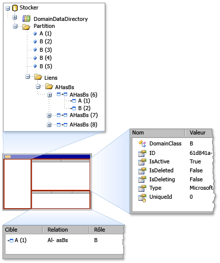

# <a name="debugging-by-using-the-store-viewer"></a>Débogage à l'aide de la visionneuse de banque d'information
Avec la visionneuse de stocker, vous pouvez examiner l’état d’un *stocker* utilisé par [!INCLUDE[dsl](../modeling/includes/dsl_md.md)]. La visionneuse de stocker affiche tous les éléments de modèle de domaine qui se trouvent dans un magasin spécifique, ainsi que les propriétés d’un élément et les liens entre des éléments.  
  
## <a name="opening-store-viewer"></a>Visionneuse de l’ouverture du magasin  
 Lorsque vous êtes dans le [!INCLUDE[vsprvs](../code-quality/includes/vsprvs_md.md)] expérimentale build, arrêtez votre code à un point d’arrêt où une instance de la banque contient des informations sur le modèle. Ensuite, ouvrez l’Observateur de magasin en tapant la commande suivante dans le **exécution** fenêtre :  
  
```  
Microsoft.VisualStudio.Modeling.Diagnostics.StoreViewer.Show(mystore);  
```  
  
> [!NOTE]
>  Vous devez remplacer `mystore` par le nom de votre instance de la banque. En outre, si vous ajoutez l’espace de noms à votre code, vous pouvez taper la commande pour afficher la visionneuse de banque sans l’espace de noms qualifié complet :  
>   
>  `using Microsoft.VisualStudio.Modeling.Diagnostics;`  
>   
>  `...`  
>   
>  `StoreViewer.Show(mystore);`  
  
 Le `Show` méthode a plusieurs surcharges. Vous pouvez spécifier une instance d’un magasin ou d’une partition en tant que paramètre.  
  
 En guise d’alternative, vous pouvez placer la ligne de code qui affiche la visionneuse de magasin n’importe où dans votre code où le paramètre que vous passez à la `Show` méthode se trouve dans l’étendue. Cette action affiche la visionneuse stocker lors de la ligne de code s’exécute comme un instantané du contenu de la banque.  
  
### <a name="using-store-viewer"></a>À l’aide de la visionneuse de banque  
 Lorsque l’Observateur du magasin s’ouvre, une fenêtre non modale de Windows Forms s’affiche, comme la montre l’illustration suivante.  
  
   
Observateur de magasin  
  
 La visionneuse de magasin comporte trois volets : le volet gauche, le volet supérieur droit et le volet inférieur droit. Le volet de gauche est une arborescence des types dans le `DomainDataDirectory` membre d’un magasin. Si vous développez le nœud de la Partition et cliquez sur un élément, les propriétés de l’élément s’affichent dans le volet supérieur droit. Si l’élément est lié à d’autres éléments, les éléments supplémentaires s’affichent dans le volet en bas à droite. Si vous double-cliquez sur un élément dans le volet en bas à droite, l’élément est mis en surbrillance dans le volet gauche.  
  
## <a name="see-also"></a>Voir aussi  
 [Navigation et mise à jour d’un modèle dans le code de programme](../modeling/navigating-and-updating-a-model-in-program-code.md)