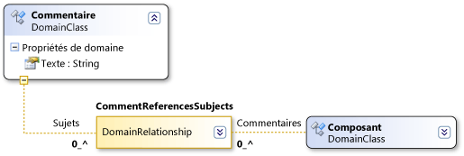

# Syntaxe du chemin de domaine
Les définitions DSL utilisent une syntaxe semblable à XPath pour rechercher des éléments spécifiques dans un modèle.

 En général, vous ne devez pas opérer sur cette syntaxe directement. Quand elle apparaît dans la fenêtre Propriétés ou Détails DSL, vous pouvez cliquer sur la flèche vers le bas et utiliser l'éditeur de chemin d'accès. Toutefois, le chemin d'accès apparaît dans ce format dans le champ une fois que vous avez utilisé l'éditeur.

 Un chemin d'accès de domaine prend la forme suivante :

 *RelationshipName. PropertyName/ ! Actif*

 

 La syntaxe traverse l'arborescence du modèle. Par exemple, la relation de domaine **CommentReferencesSubjects** dans l’illustration ci-dessus a un rôle **sujets** . Le segment de chemin d’accès **/ ! Subjectt** spécifie que le chemin d’accès se termine sur les éléments accessibles via le rôle des **sujets** .

 Chaque segment commence par le nom d'une relation de domaine. Si la traversée est d’un élément à une relation, le segment de chemin d’accès apparaît comme *Relationship. PropertyName*. Si le tronçon provient d’un lien vers un élément, le segment de chemin d’accès apparaît comme *relation/ ! RoleName*.

 Les barres obliques séparent les différentes parties de la syntaxe d'un chemin d'accès. Chaque segment de chemin d'accès est soit un tronçon d'un élément vers un lien (une instance d'une relation), soit un lien vers un élément. Les segments de chemin d'accès apparaissent fréquemment par paires. Un segment de chemin d'accès représente un tronçon d'un élément vers un lien et le segment suivant représente un tronçon du lien vers l'élément à l'autre extrémité. (Tout lien peut aussi être la source ou la cible d'une relation.)

 Le nom que vous utilisez pour le tronçon de l'élément vers le lien est la valeur de `Property Name` du rôle. Le nom que vous utilisez pour le tronçon du lien vers l'élément est le nom du rôle cible.

## Voir aussi

- [Présentation des modèles, des classes et des relations](../modeling/understanding-models-classes-and-relationships.md)