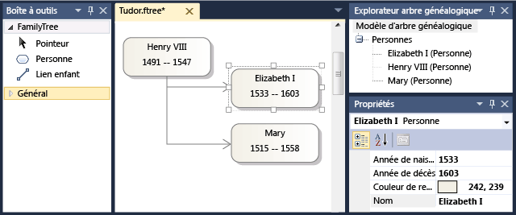
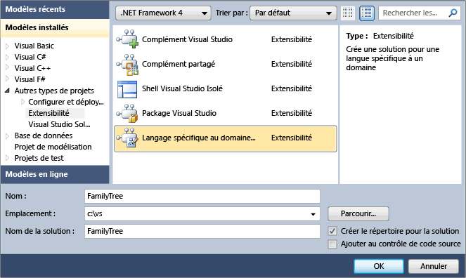
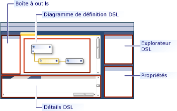
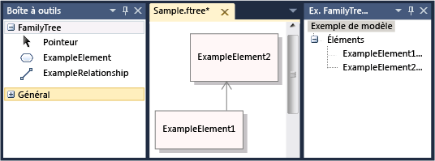
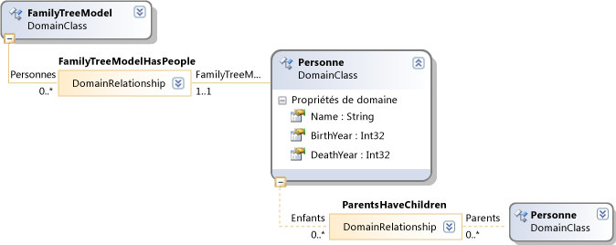
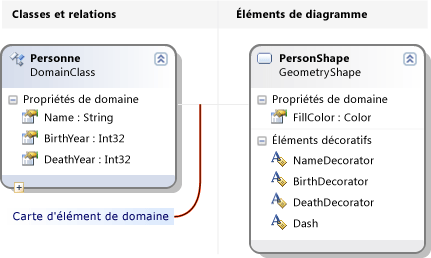
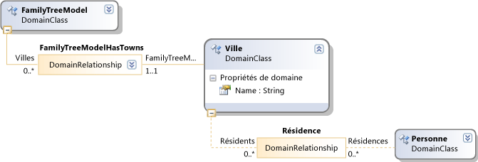
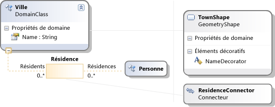

# <a name="get-started-with-domain-specific-languages"></a>Bien démarrer avec les langages spécifiques à un domaine

Cette rubrique explique les concepts de base de la définition et de l’utilisation d’un langage spécifique à un domaine (DSL) créé avec le kit de développement logiciel (SDK) de modélisation pour Visual Studio.

> [!NOTE]
> Le kit SDK de transformation de modèle de texte et le kit de développement logiciel (SDK) de modélisation Visual Studio sont installés automatiquement lorsque vous installez des fonctionnalités spécifiques de Visual Studio. Pour plus d’informations, consultez [ce billet de blog](https://devblogs.microsoft.com/devops/the-visual-studio-modeling-sdk-is-now-available-with-visual-studio-2017/).

Si vous débutez avec DSL, nous vous recommandons d’utiliser le **laboratoire d’outils DSL**, que vous trouverez dans ce site : [Kit de développement logiciel de visualisation et de modélisation](https://code.msdn.microsoft.com/Visualization-and-Modeling-313535db)

## <a name="what-can-you-do-with-a-domain-specific-language"></a>Que pouvez-vous faire avec un langage Domain-Specific ?

Un langage spécifique à un domaine est une notation, généralement graphique, conçue pour être utilisée à des fins particulières. En revanche, les langages tels que UML sont à usage général. Dans une solution DSL, vous pouvez définir les types d’élément de modèle et leurs relations, et la façon dont ils sont présentés à l’écran.

Lorsque vous avez conçu une solution DSL, vous pouvez la distribuer dans le cadre d’un package d’extension d’intégration Visual Studio (VSIX). Les utilisateurs utilisent le langage DSL dans Visual Studio :



La notation n’est qu’une partie d’une DSL. Avec la notation, votre package VSIX comprend des outils que les utilisateurs peuvent appliquer pour les aider à modifier et à générer des documents à partir de leurs modèles.

L’une des principales applications de DSL consiste à générer un code de programme, des fichiers de configuration et d’autres artefacts. En particulier dans les grands projets et les lignes de produits, où plusieurs variantes d’un produit seront créées, la génération d’un grand nombre des aspects variables à partir de DSL peut offrir une grande augmentation de la fiabilité et une réponse très rapide aux modifications des spécifications.

Le reste de cette vue d’ensemble est une procédure pas à pas qui présente les opérations de base de création et d’utilisation d’un langage spécifique à un domaine dans Visual Studio.

## <a name="prerequisites"></a>Prérequis

Pour définir un DSL, vous devez avoir installé les composants suivants :

| Composant | Lien |
|-|-|
| Visual Studio | [http://go.microsoft.com/fwlink/?LinkId=185579](https://visualstudio.microsoft.com) |
| [!INCLUDE[vssdk_current_short](../modeling/includes/vssdk_current_short_md.md)] | [https://go.microsoft.com/fwlink/?linkid=2166172](../extensibility/visual-studio-sdk.md) |
| SDK Modeling pour Visual Studio | |

[!INCLUDE[modeling_sdk_info](includes/modeling_sdk_info.md)]

## <a name="create-a-dsl-solution"></a>Créer une solution DSL

Pour créer un langage spécifique à un domaine, vous devez créer une solution Visual Studio à l’aide du modèle de projet Domain-Specific Language.

1. Dans le menu **Fichier** , pointez sur **Nouveau**, puis cliquez sur **Projet**.

2. Sous **types de projets**, développez le nœud **autres types de projets** , puis cliquez sur **extensibilité**.

3. Cliquez sur **Concepteur Domain-specific language**.

     

4. Dans la zone **nom** , tapez **FamilyTree**. Cliquez sur **OK**.

     L' **Assistant langage spécifique à un domaine** s’ouvre et affiche une liste de modèles de solutions DSL.

     Cliquez sur chaque modèle pour afficher une description,

     Les modèles sont des points de départ utiles. Chacun d’eux fournit une DSL de travail complète, que vous pouvez modifier en fonction de vos besoins. En règle générale, vous choisissez le modèle le plus proche de celui que vous souhaitez créer.

5. Pour cette procédure pas à pas, choisissez le modèle de **langage minimal** .

6. Entrez une extension de nom de fichier pour votre solution DSL dans la page appropriée de l'Assistant. Il s'agit de l'extension qui sera utilisée par les fichiers contenant des instances de votre solution DSL.

    - Choisissez une extension qui n’est pas associée à une application de votre ordinateur, ou sur n’importe quel ordinateur sur lequel vous souhaitez installer le DSL. Par exemple, **docx** et **htm** sont des extensions de nom de fichier inacceptable.

    - L'Assistant vous avertit si l'extension que vous avez entrée est utilisée actuellement comme DSL. Dans ce cas, utilisez une autre extension de nom de fichier. Vous pouvez aussi réinitialiser l'instance expérimentale du Kit SDK Visual Studio pour effacer les anciennes conceptions expérimentales. Cliquez **sur Démarrer**, sur **tous les programmes**, **Microsoft Visual Studio Kit de développement logiciel (SDK) 2010**, **Outils**, puis **réinitialisez l’instance Microsoft Visual Studio 2010 expérimentale**.

7. Examinez les autres pages, puis cliquez sur **Terminer**.

     Une solution qui contient deux projets est générée. Ils sont nommés DSL et DslPackage. Un fichier de diagramme s’ouvre, nommé DslDefinition. DSL.

    > [!NOTE]
    > La majeure partie du code que vous pouvez voir dans les dossiers dans les deux projets est générée à partir de DslDefinition. DSL. Pour cette raison, la plupart des modifications apportées à votre DSL sont effectuées dans ce fichier.

L'interface utilisateur ressemble maintenant à l'image suivante.



Cette solution définit un langage spécifique à un domaine. Pour plus d’informations, consultez [vue d’ensemble de l’interface utilisateur des outils de langage Domain-Specific](../modeling/overview-of-the-domain-specific-language-tools-user-interface.md).

## <a name="the-important-parts-of-the-dsl-solution"></a>Parties importantes de la solution DSL

Notez les aspects suivants de la nouvelle solution :

- **Dsl\DslDefinition.DSL** Il s’agit du fichier que vous voyez lorsque vous créez une solution DSL. Presque tout le code de la solution est généré à partir de ce fichier, et la plupart des modifications que vous apportez à une définition DSL sont effectuées ici. Pour plus d’informations, consultez la page utilisation du [diagramme de définition de DSL](../modeling/working-with-the-dsl-definition-diagram.md).

- **Projet DSL** Ce projet contient du code qui définit le langage spécifique à un domaine.

- **Projet DslPackage** Ce projet contient du code qui permet d’ouvrir et de modifier des instances du DSL dans Visual Studio.

## <a name="running-the-dsl"></a><a name="Debugging"></a> Exécution du DSL

Vous pouvez exécuter la solution DSL dès que vous l’avez créée. Ultérieurement, vous pouvez modifier la définition de la DSL progressivement, en réexécutant la solution après chaque modification.

### <a name="to-experiment-with-the-dsl"></a>Pour expérimenter le DSL

1. Cliquez sur **transformer tous les modèles** dans la barre d’outils **Explorateur de solutions** . Cela régénère la majeure partie du code source à partir de DslDefinition. DSL.

    > [!NOTE]
    > Chaque fois que vous modifiez *DslDefinition. DSL*, vous devez cliquer sur **transformer tous les modèles** avant de reconstruire la solution. Vous pouvez automatiser cette étape. Pour plus d’informations, consultez [automatisation de la transformation de tous les modèles](/previous-versions/visualstudio/visual-studio-2012/ff521399\(v\=vs.110\)).

2. Appuyez sur **F5**, ou dans le menu **Déboguer** , choisissez **Démarrer le débogage**.

     La solution DSL est générée et installée dans l’instance expérimentale de Visual Studio.

     Une instance expérimentale de Visual Studio démarre. L’instance expérimentale prend ses paramètres d’une sous-arborescence distincte du Registre, où les extensions Visual Studio sont inscrites à des fins de débogage. Les instances normales de Visual Studio n’ont pas accès aux extensions inscrites à cet emplacement.

3. Dans l’instance expérimentale de Visual Studio, ouvrez le fichier de modèle nommé **test** à partir de **Explorateur de solutions**.

     \- ou -

     Cliquez avec le bouton droit sur le projet de débogage, pointez sur **Ajouter**, puis cliquez sur **élément**. Dans la boîte de dialogue **Ajouter un élément** , sélectionnez le type de fichier de votre DSL.

     Le fichier de modèle s’ouvre sous la forme d’un diagramme vide.

     La boîte à outils s’ouvre et affiche les outils appropriés au type de diagramme.

4. Utilisez les outils pour créer des formes et des connecteurs sur le diagramme.

    1. Pour créer des formes, faites-les glisser à partir de l’exemple outil Forme sur le diagramme.

    2. Pour connecter deux formes, cliquez sur l’outil de l’exemple de connecteur, cliquez sur la première forme, puis cliquez sur la deuxième forme.

5. Cliquez sur les étiquettes des formes pour les modifier.

Votre Visual Studio expérimental ressemble à l’exemple suivant :



### <a name="the-content-of-a-model"></a>Contenu d’un modèle

Le contenu d’un fichier qui est une instance d’un DSL est appelé *modèle*. Le modèle contient des <em>éléments</em> de *modèle* et *des liens* entre les éléments. La définition DSL spécifie les types d’éléments de modèle et les liens qui peuvent exister dans le modèle. Par exemple, dans un DSL créé à partir du modèle de langage minimal, il existe un type d’élément de modèle et un type de lien.

La définition DSL peut spécifier la façon dont le modèle s’affiche sur un diagramme. Vous pouvez choisir parmi divers styles de formes et de connecteurs. Vous pouvez spécifier que certaines formes s’affichent à l’intérieur d’autres formes.

Vous pouvez afficher un modèle sous la forme d’une arborescence dans l’affichage de l' **Explorateur** pendant que vous modifiez un modèle. À mesure que vous ajoutez des formes au diagramme, les éléments de modèle s’affichent également dans l’Explorateur. L’Explorateur peut être utilisé même s’il n’y a aucun diagramme.

Si vous ne voyez pas l’Explorateur dans l’instance de débogage de Visual Studio, dans le menu **affichage** , pointez sur **autres fenêtres**, puis cliquez sur *\<Your Language>* **Explorateur**.

### <a name="the-api-of-your-dsl"></a>L’API de votre DSL

Votre DSL génère une API qui vous permet de lire et de mettre à jour les modèles qui sont des instances du DSL. Une application de l’API consiste à générer des fichiers texte à partir d’un modèle. Pour plus d’informations, consultez [génération de code au moment du design à l’aide de modèles de texte T4](../modeling/design-time-code-generation-by-using-t4-text-templates.md).

Dans la solution de débogage, ouvrez les fichiers de modèle avec l’extension « . TT ». Ces exemples montrent comment vous pouvez générer du texte à partir de modèles et vous permettre de tester l’API de votre DSL. L’un des exemples est écrit dans [!INCLUDE[vbprvb](../code-quality/includes/vbprvb_md.md)] [!INCLUDE[csprcs](../data-tools/includes/csprcs_md.md)] .

Sous chaque fichier de modèle se trouve le fichier qu’il génère. Développez le fichier de modèle dans Explorateur de solutions, puis ouvrez le fichier généré.

Le fichier de modèle contient un segment de code succinct qui répertorie tous les éléments du modèle.

Le fichier généré contient le résultat.

Lorsque vous modifiez un fichier de modèle, vous voyez les modifications correspondantes dans les fichiers générés après la régénération des fichiers.

#### <a name="to-regenerate-text-files-after-you-change-the-model-file"></a>Pour régénérer des fichiers texte après avoir modifié le fichier de modèle

1. Dans l’instance expérimentale de Visual Studio, enregistrez le fichier de modèle.

2. Assurez-vous que le paramètre de nom de fichier dans chaque fichier. TT fait référence au fichier de modèle que vous utilisez pour les expériences. Enregistrez le fichier. TT.

3. Cliquez sur **transformer tous les modèles** dans la barre d’outils de **Explorateur de solutions**.

     \- ou -

     Cliquez avec le bouton droit sur les modèles que vous souhaitez régénérer, puis cliquez sur **exécuter un outil personnalisé**.

Vous pouvez ajouter n’importe quel nombre de fichiers de modèle de texte à un projet. Chaque modèle génère un fichier de résultats.

> [!NOTE]
> Lorsque vous modifiez la définition DSL, l’exemple de code de modèle de texte ne fonctionnera pas, sauf si vous la mettez à jour.

Pour plus d’informations, consultez [génération de code à partir d’un langage Domain-Specific](../modeling/generating-code-from-a-domain-specific-language.md) et [écriture de code pour personnaliser un langage de Domain-Specific](../modeling/writing-code-to-customise-a-domain-specific-language.md).

## <a name="customizing-the-dsl"></a>Personnalisation de la solution DSL

Lorsque vous souhaitez modifier la définition DSL, fermez l’instance expérimentale et mettez à jour la définition dans l’instance principale de Visual Studio.

> [!NOTE]
> Après avoir modifié la définition de la DSL, vous risquez de perdre des informations dans les modèles de test que vous avez créés à l’aide des versions antérieures.  Par exemple, la solution de débogage contient un fichier nommé Sample, qui contient des formes et des connecteurs. Une fois que vous avez commencé à développer votre définition DSL, celles-ci ne sont pas visibles, et elles sont perdues lorsque vous enregistrez le fichier.

Vous pouvez créer une grande variété d’extensions pour votre DSL. Les exemples suivants vous donnent une impression des possibilités.

Après chaque modification, enregistrez la définition DSL, cliquez sur **transformer tous les modèles** dans **Explorateur de solutions**, puis appuyez sur **F5** pour expérimenter le DSL modifié.

### <a name="rename-the-types-and-tools"></a>Renommer les types et les outils

Renommez les classes et les relations de domaine existantes. Par exemple, à partir d’une définition DSL créée à partir du modèle de langue minimale, vous pouvez effectuer les opérations de renommage suivantes pour que le DSL représente des arbres de famille.

#### <a name="to-rename-domain-classes-relationships-and-tools"></a>Pour renommer des classes de domaine, des relations et des outils

1. Dans le diagramme DslDefinition, renommez **ExampleModel** **FamilyTreeModel**, **ExampleElement** en **Person**, **Targets** to **parents** et **sources** to **Children**. Vous pouvez cliquer sur chaque étiquette pour la modifier.

     

2. Renommez l’élément et les outils de connecteur.

    1. Ouvrez la fenêtre de l’Explorateur DSL en cliquant sur l’onglet sous Explorateur de solutions. Si vous ne le voyez pas, dans le menu **affichage** , pointez sur **autres fenêtres** , puis cliquez sur **Explorateur DSL**. L’Explorateur DSL est visible uniquement lorsque le diagramme de définition DSL est la fenêtre active.

    2. Ouvrez le Fenêtre Propriétés et positionnez-le de sorte que vous puissiez voir l’Explorateur et les propriétés DSL en même temps.

    3. Dans l’Explorateur DSL, développez **éditeur**, **onglets de la boîte à outils**, *\<your DSL>* , puis **Outils**.

    4. Cliquez sur **ExampleElement**. Il s’agit de l’élément de boîte à outils utilisé pour créer des éléments.

    5. Dans la Fenêtre Propriétés, remplacez la valeur de la propriété **Name** par **Person**.

         Notez que la propriété **Caption** change également.

    6. De la même manière, remplacez le nom de l’outil **ExampleConnector** par **ParentLink**. Modifiez la propriété **Caption** de sorte qu’elle ne soit pas une copie de la propriété Name. Par exemple, entrez **lien parent**.

3. Régénérez le DSL.

    1. Enregistrez le fichier de définition DSL.

    2. Cliquez sur **transformer tous les modèles** dans la barre d’outils de Explorateur de solutions

    3. Appuyez sur F5. Attendez que l’instance expérimentale de Visual Studio apparaisse.

4. Dans la solution de débogage de l’instance expérimentale de Visual Studio, ouvrez un fichier de modèle de test. Faites glisser des éléments dans la boîte à outils. Notez que les légendes d’outils et les noms de type dans l’Explorateur DSL ont changé.

5. Enregistrez le fichier de modèle.

6. Ouvrez un fichier. TT et remplacez les occurrences de l’ancien type et des noms de propriété par les nouveaux noms.

7. Assurez-vous que le nom de fichier spécifié dans le fichier. TT spécifie votre modèle de test.

8. Enregistrez le fichier. TT. Ouvrez le fichier généré pour voir le résultat de l’exécution du code dans le fichier. TT. Vérifiez qu’il est correct.

### <a name="add-domain-properties-to-classes"></a>Ajouter des propriétés de domaine à des classes
 Ajoutez des propriétés à une classe de domaine, par exemple pour représenter les années de naissance et de décès d’une personne.

 Pour afficher les nouvelles propriétés sur le diagramme, vous devez ajouter des éléments *décoratifs* à la forme qui affiche l’élément de modèle. Vous devez également mapper les propriétés aux décorateurs.

##### <a name="to-add-properties-and-display-them"></a>Pour ajouter des propriétés et les afficher

1. Ajoutez les propriétés.

   1. Dans le diagramme de définition DSL, cliquez avec le bouton droit sur la classe de domaine **Person** , pointez sur **Ajouter**, puis cliquez sur **propriété de domaine**.

   2. Tapez une liste de nouveaux noms de propriétés, tels que **naissance** et **décès**. Appuyez sur **entrée** après chacune d’elles.

2. Ajoutez des décorateurs qui affichent les propriétés dans la forme.

   1. Suivez la ligne grise qui s’étend de la classe de domaine Person à l’autre côté du diagramme. Il s’agit d’un mappage d’élément de diagramme. Elle lie la classe de domaine à une classe Shape.

   2. Cliquez avec le bouton droit sur cette classe de forme, pointez sur **Ajouter**, puis cliquez sur **Decorator de texte**.

   3. Ajoutez deux décorateurs avec des noms tels que **BirthDecorator** et **DeathDecorator**.

   4. Sélectionnez chaque nouvel élément décoratif, puis dans la Fenêtre Propriétés, définissez le champ **position** . Cela détermine l’emplacement où la valeur de propriété de domaine sera affichée sur la forme. Par exemple, définissez **InnerBottomLeft** et **InnerBottomRight**.

        

3. Mappez les éléments décoratifs aux propriétés.

   1. Ouvrez la fenêtre Détails DSL. Il se trouve généralement dans un onglet situé à côté de la fenêtre sortie. Si vous ne le voyez pas, dans le menu **affichage** , pointez sur **autres fenêtres**, puis cliquez sur **Détails DSL**.

   2. Dans le diagramme de définition DSL, cliquez sur la ligne qui connecte la classe de domaine **Person** à la classe Shape.

   3. Dans les **Détails DSL**, sous l’onglet **mappages de décorateurs** , activez la case à cocher sur un Decorator non mappé. Dans **propriété d’affichage**, sélectionnez la propriété de domaine à laquelle vous voulez qu’elle soit mappée. Par exemple, mappez **BirthDecorator** à **naissance**.

4. Enregistrez le DSL, cliquez sur transformer tous les modèles, puis appuyez sur F5.

5. Dans un exemple de diagramme de modèle, vérifiez que vous pouvez maintenant cliquer sur les positions que vous avez choisies et y taper des valeurs. En outre, lorsque vous sélectionnez une forme **représentant une personne** , le fenêtre Propriétés affiche les nouvelles propriétés naissance et décès.

6. Dans un fichier. TT, vous pouvez ajouter du code qui obtient les propriétés de chaque personne.

   

### <a name="define-new-classes"></a>Définir de nouvelles classes
 Vous pouvez ajouter des classes de domaine et des relations à un modèle. Par exemple, vous pouvez créer une nouvelle classe pour représenter des villes et une nouvelle relation pour représenter qu’une personne est vécue dans une ville.

 Pour que les différents types soient distincts sur un diagramme de modèle, vous pouvez mapper les classes de domaine à différents genres de formes, ou à des formes avec une géométrie et des couleurs différentes.

##### <a name="to-add-and-display-a-new-domain-class"></a>Pour ajouter et afficher une nouvelle classe de domaine

1. Ajoutez une classe de domaine et définissez-la comme un enfant de la racine du modèle.

    1. Dans le diagramme de définition DSL, cliquez sur l’outil **relation d’incorporation** , cliquez sur la classe racine **FamilyTreeModel**, puis cliquez dans une partie vide du diagramme.

         Une nouvelle classe de domaine s’affiche, qui est connectée à FamilyTreeModel avec une relation d’incorporation.

         Définissez son nom, par exemple **ville**.

        > [!NOTE]
        > Chaque classe de domaine, à l’exception de la racine du modèle, doit être la cible d’au moins une relation d’incorporation, ou elle doit hériter d’une classe qui est la cible d’une incorporation. Pour cette raison, il est souvent pratique de créer une classe de domaine à l’aide de l’outil de relation d’incorporation.

    2. Ajoutez une propriété de domaine à la nouvelle classe, par exemple **Name**.

2. Ajoutez une relation de référence entre Person et Town.

    1. Cliquez sur l’outil **relation de référence** , cliquez sur personne, puis cliquez sur ville.

         

        > [!NOTE]
        > Les relations de référence représentent des références croisées d’une partie de l’arborescence du modèle à une autre.

3. Ajoutez une forme pour représenter des villes sur les diagrammes de modèle.

    1. Faites glisser une **forme Geometry** de la boîte à outils vers le diagramme et renommez-la, par exemple **TownShape**.

    2. Dans la Fenêtre Propriétés, définissez les champs d’apparence de la nouvelle forme, tels que la couleur de remplissage et la géométrie.

    3. Ajoutez un élément décoratif pour afficher le nom de la ville, puis renommez-le NameDecorator. Définissez sa propriété position.

4. Mappez la classe de domaine ville au TownShape.

    1. Cliquez sur l’outil **mappage d’élément de diagramme** , sur la classe de domaine ville, puis sur la classe de forme TownShape.

    2. Dans l’onglet **mappages de décorers** de la fenêtre **Détails DSL** avec le connecteur de carte sélectionné, vérifiez NameDecorator et définissez la **propriété affichage** sur nom.

5. Créez un connecteur pour afficher la relation entre la personne et les villes.

    1. Faites glisser un connecteur de la boîte à outils vers le diagramme. Renommez-le et définissez ses propriétés d’apparence.

    2. Utilisez l’outil **mappage d’élément de diagramme** pour lier le nouveau connecteur à la relation entre personne et ville.

         

6. Créez un outil d’élément pour créer une nouvelle ville.

    1. Dans l' **Explorateur DSL**, développez **éditeur** , puis onglets de la **boîte à outils**.

    2. Cliquez avec le bouton droit sur *\<your DSL>* , puis cliquez sur **Ajouter un nouvel élément outil**.

    3. Définissez la propriété **Name** du nouvel outil et définissez sa propriété **Class** sur Town.

    4. Définissez la propriété **icône de boîte à outils** . Cliquez sur **[...]** et dans le champ **nom de fichier** , sélectionnez un fichier d’icône.

7. Créez un outil de connecteur pour créer un lien entre des villes et des personnes.

    1. Cliquez avec le bouton droit sur *\<your DSL>* , puis cliquez sur **Ajouter un nouvel outil de connecteur**.

    2. Définissez la propriété Name du nouvel outil.

    3. Dans la propriété **ConnectionBuilder** , sélectionnez le générateur qui contient le nom de la relation Person-Town.

    4. Définissez l' **icône boîte à outils**.

8. Enregistrez la définition DSL, cliquez sur **transformer tous les modèles**, puis appuyez sur **F5**.

9. Dans l’instance expérimentale de Visual Studio, ouvrez un fichier de modèle de test. Utilisez les nouveaux outils pour créer des villes et des liens entre des villes et des personnes. Notez que vous pouvez uniquement créer des liens entre les types d’éléments corrects.

10. Créez le code qui répertorie la ville dans laquelle chaque personne vit. Les modèles de texte sont l’un des endroits où vous pouvez exécuter un tel code. Par exemple, vous pouvez modifier le fichier Sample.tt existant dans la solution de débogage pour qu’il contienne le code suivant :

    ```
    <#@ template inherits="Microsoft.VisualStudio.TextTemplating.VSHost.ModelingTextTransformation" debug="true" #>
    <#@ output extension=".txt" #>
    <#@ FamilyTree processor="FamilyTreeDirectiveProcessor" requires="fileName='Sample.ftree'" #>

    <#
      foreach (Person person in this.FamilyTreeModel.People)
      {
    #>
        <#= person.Name #><#if (person.Town != null) {#> of <#= person.Town.Name #> <#}#>

    <#
          foreach (Person child in person.Children)
      {
    #>
                <#= child.Name #>
    <#
      }
      }
    #>

    ```

     Lorsque vous enregistrez le fichier *. TT, il crée un fichier subsidiaire qui contient la liste des personnes et leurs résidences. Pour plus d’informations, consultez [génération de code à partir d’un langage de Domain-Specific](../modeling/generating-code-from-a-domain-specific-language.md).

## <a name="validation-and-commands"></a>Validation et commandes
 Vous pouvez développer ce DSL en ajoutant des contraintes de validation. Ces contraintes sont des méthodes que vous pouvez définir, qui permettent de s’assurer que le modèle est dans un état correct. Par exemple, vous pouvez définir une contrainte pour vous assurer que la date de naissance d’un enfant est ultérieure à celle de ses parents. La fonctionnalité de validation affiche un avertissement si l’utilisateur DSL tente d’enregistrer un modèle qui rompt les contraintes. Pour plus d’informations, consultez [validation dans un langage de Domain-Specific](../modeling/validation-in-a-domain-specific-language.md).

 Vous pouvez également définir des commandes de menu que l’utilisateur peut appeler. Les commandes peuvent modifier le modèle. Ils peuvent également interagir avec d’autres modèles dans Visual Studio et avec des ressources externes. Pour plus d’informations, consultez [Comment : modifier une commande de menu standard](../modeling/how-to-modify-a-standard-menu-command-in-a-domain-specific-language.md).

## <a name="deploying-the-dsl"></a>Déploiement du DSL
 Pour permettre à d’autres utilisateurs d’utiliser le langage spécifique à un domaine, vous distribuez un fichier d’extension Visual Studio (VSIX). Elle est créée lorsque vous générez la solution DSL.

 Recherchez le fichier. VSIX dans le dossier bin de votre solution. Copiez-le sur l’ordinateur sur lequel vous souhaitez l’installer. Sur cet ordinateur, double-cliquez sur le fichier VSIX. La DSL peut être utilisée dans toutes les instances de Visual Studio sur cet ordinateur.

 Vous pouvez utiliser la même procédure pour installer le DSL sur votre propre ordinateur afin de ne pas avoir à utiliser l’instance expérimentale de Visual Studio.

 Pour plus d’informations, consultez [Déploiement de solutions de langage spécifique à un domaine](msi-and-vsix-deployment-of-a-dsl.md).

## <a name="removing-old-experimental-dsls"></a><a name="Reset"></a> Suppression des anciens DSL expérimentaux
 Si vous avez créé des DSL expérimentaux que vous ne voulez plus, vous pouvez les supprimer de votre ordinateur en réinitialisant l’instance expérimentale de Visual Studio.

 Cette opération supprime de votre ordinateur tous les DSL expérimentaux et d’autres extensions expérimentales de Visual Studio. Il s’agit des extensions qui ont été exécutées en mode débogage.

 Cette procédure ne supprime pas DSL ou d’autres extensions Visual Studio entièrement installées en exécutant le fichier VSIX.

#### <a name="to-reset-the-visual-studio-experimental-instance"></a>Pour réinitialiser l’instance expérimentale de Visual Studio

1. Cliquez **sur Démarrer**, sur **tous les programmes**, **Microsoft Visual Studio Kit de développement logiciel (SDK) 2010**, **Outils**, puis **réinitialisez l’instance Microsoft Visual Studio 2010 expérimentale**.

2. Reconstruisez les DSL expérimentales ou d’autres extensions Visual Studio expérimentales que vous souhaitez toujours utiliser.

## <a name="see-also"></a>Voir aussi

- [Présentation des modèles, des classes et des relations](../modeling/understanding-models-classes-and-relationships.md)
- [Guide pratique pour définir un langage spécifique à un domaine](../modeling/how-to-define-a-domain-specific-language.md)
