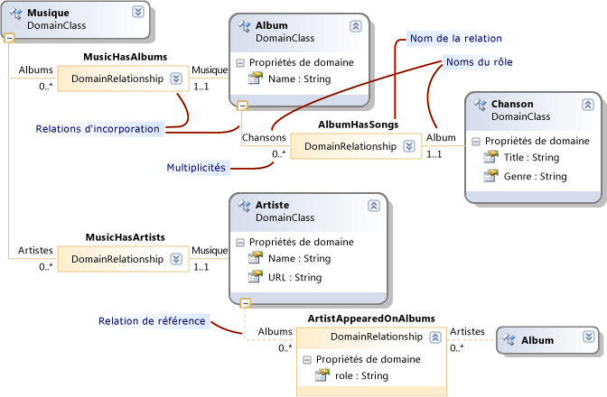
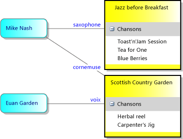
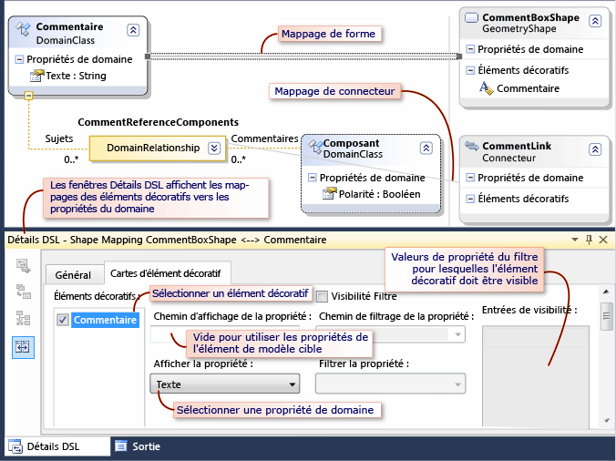
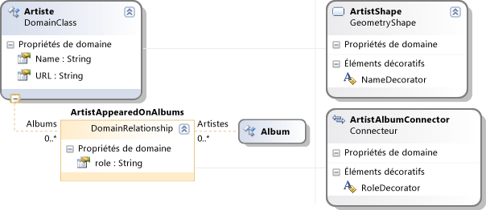
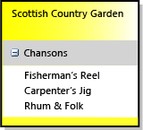
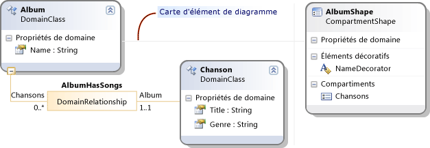
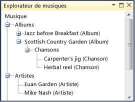

# Comment : définir un langage spécifique à un domaine
Pour définir un langage spécifique à un domaine (DSL), vous devez créer une solution Visual Studio à partir d’un modèle. Le composant principal de la solution est le diagramme de définition DSL, qui est stocké dans DslDefinition.dsl. La définition DSL définit les classes et les formes de la solution DSL. Après avoir modifié et ajouté à ces éléments, vous pouvez ajouter du code programme pour personnaliser la solution DSL plus en détail.

Si vous débutez avec DSL, nous vous recommandons d’utiliser le **laboratoire d’outils DSL**, que vous trouverez dans ce site : [Kit de développement logiciel de visualisation et de modélisation](https://code.msdn.microsoft.com/Visualization-and-Modeling-313535db)

##  Sélection d’une solution de modèle

Pour définir un DSL, vous devez avoir installé les composants suivants :

- Visual Studio
- Charge de travail développement d’extensions Visual Studio (y compris le kit de développement logiciel Visual Studio)
- Modeling SDK (installez-le en tant que composant individuel dans Visual Studio)

[!INCLUDE[modeling_sdk_info](includes/modeling_sdk_info.md)]

Pour créer un langage spécifique à un domaine, vous devez créer une solution Visual Studio à l’aide du modèle de projet Domain-Specific Language.

### Pour créer une solution DSL

1. Créez un projet de **langage spécifique à un domaine** .

   ::: moniker range="vs-2017"

    

   ::: moniker-end

    L' **Assistant langage spécifique à un domaine** s’ouvre et affiche une liste de modèles de solutions DSL.

2. Cliquez sur chaque modèle pour afficher une description. Choisissez la solution qui ressemble le plus à ce que vous voulez créer.

    Chaque modèle DSL définit une solution DSL de base opérationnelle. Vous modifierez cette solution DSL en fonction de vos exigences.

    Cliquez sur chaque exemple pour obtenir plus d'informations.

   - Sélectionnez le **déroulement des tâches** pour créer une solution DSL avec des couloirs. Les couloirs sont des partitions verticales ou horizontales du diagramme.

   - Sélectionnez **modèles de composants** pour créer une solution DSL avec des ports. Les ports sont de petites formes sur le bord d'une forme plus grande.

   - Sélectionnez des **diagrammes de classes** pour définir une solution DSL avec des formes de compartiments. Les formes de compartiments contiennent des listes d'éléments.

   - Sélectionnez le **langage minimal** dans d’autres cas, ou si vous n’êtes pas certain.

   - Sélectionnez **Concepteur WinForm minimal** ou **Concepteur WPF minimal** pour créer un DSL affiché sur un Windows Forms ou une surface WPF. Vous devrez écrire du code pour définir l'éditeur. Pour plus d'informations, voir les rubriques suivantes :

        [Création d'un langage spécifique à un domaine basé sur Windows Forms](../modeling/creating-a-windows-forms-based-domain-specific-language.md)

        [Création d’un langage spécifique à un domaine basé sur WPF](../modeling/creating-a-wpf-based-domain-specific-language.md)

3. Entrez une extension de nom de fichier pour votre solution DSL dans la page appropriée de l'Assistant. Il s'agit de l'extension qui sera utilisée par les fichiers contenant des instances de votre solution DSL.

   - Choisissez une extension de nom de fichier qui n'est associée à aucune application sur votre ordinateur ou sur l'ordinateur où vous voulez installer la solution DSL. Par exemple, **docx** et **htm** sont des extensions de nom de fichier inacceptable.

   - L'Assistant vous avertit si l'extension que vous avez entrée est utilisée actuellement comme DSL. Dans ce cas, utilisez une autre extension de nom de fichier. Vous pouvez aussi réinitialiser l'instance expérimentale du Kit SDK Visual Studio pour effacer les anciennes conceptions expérimentales. Cliquez **sur Démarrer**, sur **tous les programmes**, **Microsoft Visual Studio Kit de développement logiciel (SDK) 2010**, **Outils**, puis **réinitialisez l’instance Microsoft Visual Studio 2010 expérimentale**.

4. Vous pouvez ajuster les paramètres sur les autres pages ou conserver les valeurs par défaut.

5. Cliquez sur **Terminer**.

    L'Assistant crée une solution qui contient deux ou trois projets et il génère du code à partir de la définition DSL.

   L'interface utilisateur ressemble maintenant à l'image suivante.

   

   Cette solution définit un langage spécifique à un domaine. Pour plus d’informations, consultez [vue d’ensemble de l’interface utilisateur des outils de langage Domain-Specific](../modeling/overview-of-the-domain-specific-language-tools-user-interface.md).

### Tester la solution
 Le modèle de solution fournit une solution DSL opérationnelle, que vous pouvez modifier ou utiliser telle quelle.

 Pour tester la solution, appuyez sur F5 ou Ctrl+F5. Une nouvelle instance de Visual Studio s’ouvre en mode expérimental.

 Dans la nouvelle instance de Visual Studio, dans Explorateur de solutions, ouvrez l’exemple de fichier. Il s'ouvre sous forme de diagramme, avec une boîte à outils.

 Si vous exécutez une solution que vous avez créée à partir du modèle de **langue minimale** , votre Visual Studio expérimental ressemble à l’exemple suivant :

 

 Expérimentez avec les outils. Créez des éléments et raccordez-les.

 Fermez l’instance expérimentale de Visual Studio.

> [!NOTE]
> Une fois la solution DSL modifiée, vous ne pourrez plus voir les formes dans l'exemple de fichier test. En revanche, vous pourrez créer des éléments.

### Modification du modèle de solution DSL
 Renommez et conservez tout ou une partie des classes de domaine et des classes de forme dans le modèle de définition DSL. Vos nouveaux noms de classes doivent être des noms CLR valides, sans espace ni ponctuation.

 Il est particulièrement utile de conserver les classes suivantes :

- La classe racine apparaît dans l’angle supérieur gauche du diagramme de définition DSL, sous **classes et relations**. Affectez-lui un nom différent de la solution DSL. Par exemple, un DSL nommé **MusicLibrary** peut avoir une classe racine nommée **Music**.

- La classe Diagram apparaît dans la partie inférieure droite du diagramme de définition DSL, dans la colonne **éléments du diagramme** . Vous devrez peut-être faire défiler la page vers la droite pour la voir. Il est généralement nommé **diagramme** YourDsl.

- Si vous avez utilisé le modèle de **déroulement des tâches** et que vous souhaitez créer des diagrammes avec des couloirs, conservez et renommez la classe de domaine d’acteur et la forme ActorSwimlane.

  Supprimez ou renommez d'autres classes en fonction de vos exigences.

##  Modèles pour la définition d’un DSL
 Nous vous recommandons de développer une solution DSL en ajoutant ou en ajustant une ou deux fonctionnalités à la fois. Ajoutez une fonctionnalité, exécutez la solution DSL et testez-la, puis ajoutez une ou deux fonctionnalités supplémentaires. Une solution DSL ordinaire peut être constituée des éléments suivants :

- Une classe de domaine, la relation d'incorporation qui connecte l'élément au modèle, la forme requise pour afficher les éléments de cette classe sur le diagramme et l'outil d'élément qui permet aux utilisateurs de créer des éléments.

- Les propriétés de domaine d'une classe de domaine et les décorateurs qui les affichent sur une forme.

- Une relation de référence et le connecteur qui l'affiche sur le diagramme, ainsi que l'outil de connecteur qui permet aux utilisateurs de créer des liens.

- Une personnalisation qui nécessite du code de programme, telle qu'une contrainte de validation ou une commande de menu.

  Les sections suivantes expliquent comment construire les types de fonctionnalités DSL les plus utiles. Il existe de nombreux autres modèles avec lesquels vous pouvez construire une solution DSL, mais les modèles suivants sont les plus couramment utilisés.

> [!NOTE]
> Après avoir ajouté une fonctionnalité, n’oubliez pas de cliquer sur **transformer tous les modèles** dans la barre d’outils de Explorateur de solutions avant de générer et d’exécuter votre DSL.

 La figure suivante montre la partie classes et relations de la solution DSL qui est utilisée comme exemple dans cette rubrique.

 

 La figure suivante est un exemple de modèle de cette solution DSL :

 

> [!NOTE]
> Le terme « modèle » fait référence à une instance de votre solution DSL créée par les utilisateurs. Elle est généralement affichée sous forme de diagramme. Cette rubrique traite du diagramme de définition DSL et des diagrammes de modèles qui apparaissent lors de l'utilisation de votre solution DSL.

##  Définition des classes de domaine
 Les classes de domaine représentent les concepts de votre solution DSL. Les instances sont des *éléments de modèle*. Par exemple, dans un DSL **MusicLibrary** , vous pouvez avoir des classes de domaine nommées **album** et **chanson**.

 Pour créer une classe de domaine, vous pouvez faire glisser à partir de l’outil **classe de domaine nommée** vers le diagramme, puis renommer la classe.

 Pour plus d’informations, consultez [Propriétés des classes de domaine](../modeling/properties-of-domain-classes.md).

### Créer une relation d'incorporation pour chaque classe de domaine
 Chaque classe de domaine, à l'exception de la classe racine, doit être la cible d'au moins une relation d'incorporation ou elle doit hériter d'une classe qui est la cible d'une relation d'incorporation.

 Dans un modèle, chaque élément de modèle est un nœud dans une arborescence unique de relations d'incorporation. On utilise souvent les termes « parent » et « enfant » pour faire référence à la source et à la cible d'une relation d'incorporation.

 La sélection d'un parent pour une classe de domaine dépend de la façon dont vous souhaitez que la durée de vie de ses éléments dépende d'autres éléments. Si un nœud d'une arborescence est supprimé, sa sous-arborescence est généralement supprimée également. Les classes d'éléments qui ont une existence indépendante sont par conséquent incorporées directement sous la classe racine.

 En général, si vous affichez un élément dans un autre, vous devez indiquer une relation de propriété. Dans ce cas, la classe parente la plus appropriée est la classe du conteneur. Il y a toutefois une exception : quand l'élément que vous voyez dans un conteneur n'est en réalité qu'un lien de référence à un élément indépendant. Dans ce cas, le fait de supprimer le conteneur supprime la référence mais pas sa cible.

 Dans les modèles de définition DSL décrits dans cette rubrique, nous partons du principe que les éléments affichés dans un conteneur seront supprimés lors de la suppression du conteneur. Des schémas plus complexes sont possibles et peuvent être obtenus en définissant des règles.

|Mode d'affichage de l'élément|Classe parente (incorporation)|Exemple dans le modèle de solution DSL|
|-|-|-|
|Forme sur le diagramme.   Couloir.|Classe racine de solution DSL.|Langage minimal.   Flux de tâches : classe Actor.|
|Forme dans un couloir.|Classe de domaine d'éléments qui sont affichés sous forme de couloirs.|Flux de tâches : classe Task.|
|Élément dans une liste dans une forme, où l'élément est supprimé si le conteneur est supprimé.   Port sur le bord d'une forme.|Classe de domaine mappée à la forme de conteneur.|Diagramme de classes : classe Attribute.   Diagramme de composants : classe Port.|
|Élément dans une liste, non supprimé en cas de suppression du conteneur.|Classe racine de solution DSL.   La liste affiche des liens de référence.||
|Non affiché directement.|Classe dont il fait partie.||

 Dans l'exemple de bibliothèque musicale, les albums sont affichés sous forme de rectangles dans lesquels les titres des morceaux sont énumérés. Ainsi, le parent d'Album est la classe racine Music et le parent de Song est Album.

 Pour créer une classe de domaine et son incorporation en même temps, cliquez sur l’outil **relation d’incorporation** , puis sur la classe parente et sur une partie vide du diagramme.

 Il n'est généralement pas nécessaire d'ajuster le nom de la relation d'incorporation et de ses rôles, car ils effectueront le suivi des noms de classes automatiquement.

 Pour plus d’informations, consultez [Propriétés des relations de domaine](../modeling/properties-of-domain-relationships.md) et [Propriétés des rôles de domaine](../modeling/properties-of-domain-roles.md).

> [!NOTE]
> L'incorporation n'est pas la même chose que l'héritage. Les enfants dans une relation d'incorporation n'héritent pas des fonctionnalités de leurs parents.

### Ajouter des propriétés de domaine à chaque classe de domaine
 Les propriétés de domaine contiennent des valeurs. En voici quelques exemples : Nom, Titre, Date de publication.

 Cliquez sur **Propriétés de domaine** dans la classe, appuyez sur la touche entrée, puis tapez le nom d’une propriété. Le type par défaut d'une propriété de domaine est String. Si vous souhaitez modifier le type, sélectionnez la propriété de domaine et définissez le **type** dans la fenêtre **Propriétés** . Si le type que vous souhaitez ne figure pas dans la liste déroulante, consultez [Ajout de types de propriété](#addTypes).

 **Définissez une propriété de nom d'élément.**  Sélectionnez une propriété de domaine qui peut servir à identifier des éléments dans l'explorateur de langage. Par exemple, dans la classe de domaine Morceau, vous pourriez sélectionner la propriété de domaine Titre. Dans la fenêtre **Propriétés** , affectez à **nom d’élément** la valeur `true` .

### Créer des classes de domaine dérivées
 Si vous souhaitez qu'une classe de domaine ait des variantes qui héritent de ses propriétés et relations, créez des classes qui en dérivent. Par exemple, Album peut avoir des classes dérivées WMA et MP3.

 Créez la classe dérivée à l’aide de l’outil **classe de domaine** .

 Cliquez sur l’outil **héritage** , cliquez sur la classe dérivée, puis cliquez sur la classe de base.

 Envisagez de définir le **modificateur d’héritage** de la classe de base sur **abstract**. Si vous pensez que vous pourriez avoir besoin d'instances de la classe de base, créez plutôt une classe dérivée distincte pour elles.

 Les classes dérivées héritent des propriétés et des rôles de leurs classes de base.

### Mettre en ordre le diagramme de définition DSL
 Quand vous ajoutez des relations, certaines de vos classes apparaissent à plusieurs emplacements. Pour réduire le nombre d’apparences et élargir le diagramme, cliquez avec le bouton droit sur la classe cible d’une relation, puis cliquez sur **Placer l’arborescence ici**. Pour l’effet inverse, cliquez avec le bouton droit sur la classe cible d’une relation, puis cliquez sur **fractionner l’arborescence**. Si ces commandes de menu ne sont pas visibles, assurez-vous que seule la classe de domaine est sélectionnée.

 Utilisez Ctrl+Haut et Ctrl+Bas pour déplacer des classes de domaine et des classes de forme.

### Tester les classes de domaine

##### Pour tester les nouvelles classes de domaine

1. **Cliquez sur transformer tous les modèles** dans la barre d’outils de Explorateur de solutions pour générer le code du concepteur DSL. Vous pouvez automatiser cette étape. Pour plus d’informations, consultez [automatisation de la transformation de tous les modèles](/previous-versions/visualstudio/visual-studio-2012/ff521399\(v\=vs.110\)).

2. **Générez et exécutez la solution DSL.** Appuyez sur F5 ou sur CTRL + F5 pour exécuter une nouvelle instance de Visual Studio en mode expérimental. Dans l’instance expérimentale de Visual Studio, ouvrez ou créez un fichier avec l’extension de nom de fichier de votre DSL.

3. **Ouvrez l'explorateur.** La fenêtre de l’Explorateur de langage, généralement appelée *YourLanguage* Explorer, est située à côté du diagramme. Si cette fenêtre n'est pas visible, elle est peut-être sous un onglet sous l'Explorateur de solutions. Si vous ne le trouvez pas, dans le menu **affichage** , pointez sur **autres fenêtres**, puis cliquez sur *YourLanguage* **Explorer**.

     Votre explorateur présente une arborescence du modèle.

4. **Créez des éléments.** Cliquez avec le bouton droit sur le nœud racine en haut, puis cliquez sur **Ajouter un nouveau**_YourClass_.

     Une nouvelle instance de votre classe apparaît dans votre explorateur de langage.

5. Vérifiez que chaque instance possède un nom différent quand vous créez des instances. Cela se produit uniquement si vous avez défini l’indicateur **is element name** sur une propriété de domaine.

6. **Examinez les propriétés du domaine. Une fois que vous avez sélectionné une instance de votre classe,** examinez le fenêtre Propriétés. Elle doit contenir les propriétés de domaine que vous avez définies sur cette classe de domaine.

7. **Enregistrez le fichier, fermez-le, puis** rouvrez-le. Toutes les instances que vous avez créées doivent être visibles dans l'explorateur, une fois que vous avez développé les nœuds.

##  Définition de formes sur le diagramme
 Vous pouvez définir des classes d'éléments qui apparaissent sur un diagramme sous forme de rectangles, d'ellipses ou d'icônes.

#### Pour définir une classe d'éléments qui apparaissent en tant que formes sur un diagramme

1. **Définissez et testez une classe de domaine comme décrit dans définition des classes de**  [domaine](#classes) **.**

   - Le parent de la classe doit être la classe racine. Autrement dit, il doit y avoir une relation d'incorporation entre la classe racine et la nouvelle classe de domaine.

   - Si votre diagramme comporte des couloirs, le parent peut être la classe de domaine qui est mappée à un couloir. Avant de poursuivre cette procédure, consultez [définition d’un DSL avec des couloirs](#swimlanes).

2. **Ajoutez une classe de forme** pour représenter les éléments sur le diagramme de modèle. Faites glisser de l'un des outils suivants sur le diagramme de définition DSL :

   - La **forme Geometry** fournit un rectangle ou une ellipse.

   - **Forme d’image** affiche une image que vous fournissez.

   - La **forme de compartiment** est un rectangle qui contient une ou plusieurs listes d’éléments.

     Renommez la classe de forme, qui apparaîtra du côté droit du diagramme de définition DSL sous Formes et connecteurs.

3. **Définissez une image, si vous avez créé une forme d’image**.

   1. Créez un fichier image de n'importe quelle taille. Les formats BMP, JPEG, GIF et EMF sont pris en charge.

   2. Dans l'Explorateur de solutions, ajoutez le fichier à la solution sous Dsl\Resources.

   3. Revenez au diagramme de définition DSL et sélectionnez la nouvelle classe de forme d'image.

   4. Dans le Fenêtre Propriétés, cliquez sur la propriété **image** .

   5. Dans la boîte de dialogue **Sélectionner une image** , cliquez sur le menu déroulant sous **nom du fichier**, puis sélectionnez l’image.

4. **Ajoutez des décorateurs de texte à la forme pour afficher les propriétés de domaine.**

    Pour afficher le nom ou le titre de l'élément de modèle, vous aurez probablement besoin d'au moins un décorateur de texte.

    Cliquez avec le bouton droit sur l’en-tête de la classe de forme, pointez sur **Ajouter**, puis cliquez sur **Decorator de texte**. Définissez le nom de l’élément décoratif, puis dans la Fenêtre Propriétés définissez sa **position**.

5. **Connectez chaque forme avec un mappage d’élément de diagramme à la classe de domaine qu’elle doit afficher**.

    Cliquez sur l’outil **mappage d’élément de diagramme** , sur la classe de domaine, puis sur la classe de forme.

6. **Mappez les propriétés aux décorateurs de texte.**

   1. Sélectionnez la ligne grise entre la classe de domaine et la forme de classe qui représente le mappage d'élément de diagramme.

   2. Dans la fenêtre **Détails DSL** , cliquez sur l’onglet **mappages de décorateurs** . Si vous ne voyez pas la fenêtre **Détails DSL** , dans le menu **affichage** , pointez sur **autres fenêtres** , puis cliquez sur **Détails DSL**. Il est souvent nécessaire d'agrandir cette fenêtre vers le haut pour voir tout son contenu.

   3. Sélectionnez le nom d'un décorateur. Sous **propriété d’affichage**, sélectionnez le nom d’une propriété de la classe de domaine. Répétez cette opération pour chaque décorateur.

       Si vous souhaitez afficher une propriété d’un élément connexe, cliquez sur le navigateur d’arborescence déroulante sous **chemin d’accès à la propriété d’affichage**.

   4. Vérifiez qu'une coche apparaît à côté de chaque nom de décorateur.

      

7. **Fabriquez un élément de boîte à outils pour créer des éléments de la classe de domaine.**

   1. Dans l' **Explorateur DSL**, développez le nœud **éditeur** et tous ses sous-nœuds.

   2. Cliquez avec le bouton droit sur le nœud sous les **onglets de la boîte à outils** portant le même nom que votre DSL, par exemple MusicLibrary. Cliquez sur **outil Ajouter un élément**.

       > [!NOTE]
       > Si vous cliquez avec le bouton droit sur le nœud **Outils** , l' **outil Ajouter un élément** ne s’affiche pas. Cliquez plutôt sur le nœud juste au-dessus.

   3. Dans le Fenêtre Propriétés avec l’outil nouvel élément sélectionné, définissez **classe** sur la classe de domaine que vous avez récemment ajoutée.

   4. Définir la **légende** et l' **info-bulle**.

   5. Définissez l' **icône de boîte à outils** sur une icône qui s’affiche dans la boîte à outils. Vous pouvez la définir sur une nouvelle icône ou sur une icône déjà utilisée pour un autre outil.

        Pour créer une nouvelle icône, ouvrez Dsl\Resources dans **Explorateur de solutions**. Copiez et collez l'un des fichiers BMP d'outil d'élément existants. Renommez la copie collée, puis double-cliquez dessus pour la modifier.

        Revenez au diagramme de définition DSL, sélectionnez l’outil, puis dans la fenêtre Propriétés cliquez sur **[...]** dans l' **icône de boîte à outils**. Dans la boîte de dialogue **Sélectionner une image bitmap** , sélectionnez votre fichier .BMP dans le menu déroulant.

   Pour plus d’informations, consultez [Propriétés des formes géométriques](../modeling/properties-of-geometry-shapes.md) et [Propriétés des formes d’image](../modeling/properties-of-image-shapes.md).

#### Pour tester des formes

1. **Cliquez sur transformer tous les modèles** dans la barre d’outils de Explorateur de solutions pour générer le code du concepteur DSL.

2. **Générez et exécutez la solution DSL.** Appuyez sur F5 ou sur CTRL + F5 pour exécuter une nouvelle instance de Visual Studio en mode expérimental. Dans l’instance expérimentale de Visual Studio, ouvrez ou créez un fichier avec l’extension de nom de fichier de votre DSL.

3. **Vérifiez que les outils d'éléments apparaissent dans la boîte à outils.**

4. **Créez des formes** en faisant glisser un outil sur le diagramme de modèle.

5. **Vérifiez que chaque Decorator de texte apparaît** et que :

   1. Vous pouvez le modifier, sauf si vous avez défini l’indicateur **is UI Read Only** sur la propriété de domaine.

   2. quand vous modifiez la propriété dans la fenêtre Propriétés ou dans le décorateur, l'autre vue est mise à jour.

   Après avoir testé une forme, vous souhaiterez peut-être ajuster certaines de ses propriétés et ajouter certaines fonctionnalités avancées. Pour plus d’informations, consultez [personnalisation et extension d’un langage de Domain-Specific](../modeling/customizing-and-extending-a-domain-specific-language.md).

##  Définition des relations de référence
 Vous pouvez définir une relation de référence entre n'importe quelle classe de domaine source et n'importe quelle classe de domaine cible. Les relations de référence sont généralement affichées sur un diagramme sous forme de connecteurs, qui sont des lignes entre des formes.

 Par exemple, si Albums et Artistes sont affichés en tant que formes sur votre diagramme, vous pourriez définir une relation nommée ArtistesApparusSurAlbums qui relie des Artistes aux Albums sur lesquels ils ont travaillé. Voir l'exemple sur la figure.

 

 Les relations de référence peuvent aussi lier des éléments du même type. Par exemple, dans une solution DSL représentant un arbre généalogique, la relation entre les parents et leurs enfants est une relation de référence de Personne à Personne.

### Définir une relation de référence
 Cliquez sur l'outil Relation de référence, sur la classe de domaine source de la relation, puis sur la classe de domaine cible. La classe cible peut être identique à la classe source.

 Chaque relation à deux rôles, représentés par la ligne de chaque côté de la zone de relation. Vous pouvez sélectionner chaque rôle et définir ses propriétés dans la fenêtre Propriétés.

 **Envisagez de renommer les rôles**. Par exemple, dans une relation entre Personne et Personne, vous pourriez remplacer les noms par défaut par Parents et Enfants, Responsable et Subordonnés, Enseignant et Élève, et ainsi de suite.

 **Ajustez les multiplicités de chaque rôle**, si nécessaire. Si vous souhaitez que chaque Personne ait au plus un Responsable, affectez la valeur 0..1 à la multiplicité qui apparaît sous l'étiquette Responsable sur le diagramme.

 **Ajoutez des propriétés de domaine à la relation.**  Sur la figure, la relation Artist-Album a une propriété de rôle.

 **Définissez la propriété autoriser les doublons de la relation,** si plusieurs liens de la même classe peuvent exister entre la même paire d’éléments de modèle. Par exemple, vous pourriez autoriser un Enseignant à enseigner plusieurs Sujets au même Étudiant.

 

 Pour plus d’informations, consultez [Propriétés des relations de domaine](../modeling/properties-of-domain-relationships.md) et [Propriétés des rôles de domaine](../modeling/properties-of-domain-roles.md).

### Définir un connecteur pour afficher la relation
 Un connecteur affiche une ligne entre deux formes sur le diagramme de modèle.

 Faites glisser l’outil **connecteur** sur le diagramme de définition DSL.

 Ajoutez des décorateurs de texte si vous voulez afficher des étiquettes sur le connecteur. Définissez leurs positions. Pour permettre à l’utilisateur de déplacer un élément décoratif de texte, définissez sa propriété **est déplaçable** .

 Utilisez l’outil **mappage d’élément de diagramme** pour lier le connecteur à la relation de référence.

 Une fois le mappage d’élément de diagramme sélectionné, ouvrez la fenêtre **Détails DSL** et ouvrez l’onglet **mappages de décorateurs** .

 Sélectionnez chaque **Decorator** et définissez la **propriété d’affichage** sur la propriété de domaine correcte.

 Assurez-vous qu’une coche apparaît en regard de chaque élément dans la liste des **décorateurs** .

### Définir un outil générateur de connexion
 Dans la fenêtre de l' **Explorateur DSL** , développez le nœud **éditeur** et tous ses sous-nœuds.

 Cliquez avec le bouton droit sur le nœud qui porte le même nom que votre DSL, puis cliquez sur **Ajouter un nouvel outil de connexion**.

 Pendant que le nouvel outil est sélectionné, dans la fenêtre Propriétés :

- Définissez la **légende** et l' **info-bulle**.

- Cliquez sur **Générateur de connexions** et sélectionnez le générateur approprié pour la nouvelle relation.

- Définissez **icône de boîte à outils** sur l’icône que vous souhaitez voir apparaître dans la boîte à outils. Vous pouvez la définir sur une nouvelle icône ou sur une icône déjà utilisée pour un autre outil.

     Pour créer une nouvelle icône, ouvrez Dsl\Resources dans **Explorateur de solutions**. Copiez et collez l'un des fichiers BMP d'outil d'élément existants. Renommez la copie collée, puis double-cliquez dessus pour la modifier.

     Revenez au diagramme de définition DSL, sélectionnez l’outil, puis dans la fenêtre Propriétés cliquez sur **[...]** dans l' **icône de boîte à outils**. Dans la boîte de dialogue **Sélectionner une image bitmap** , sélectionnez votre fichier .BMP dans le menu déroulant.

##### Pour tester un connecteur et une relation de référence

1. **Cliquez sur transformer tous les modèles** dans la barre d’outils de Explorateur de solutions pour générer le code du concepteur DSL.

2. **Générez et exécutez la solution DSL.** Appuyez sur F5 ou sur CTRL + F5 pour exécuter une nouvelle instance de Visual Studio en mode expérimental. Dans l’instance expérimentale de Visual Studio, ouvrez ou créez un fichier avec l’extension de nom de fichier de votre DSL.

3. **Vérifiez que l'outil de connexion apparaît dans la boîte à outils.**

4. **Créez des formes** en faisant glisser un outil sur le diagramme de modèle.

5. **Créer des connexions** entre les formes. Cliquez sur l'outil de connecteur, cliquez sur une forme, puis sur une autre forme.

6. **Vérifiez que vous ne pouvez pas créer des connexions entre des classes inappropriées.**  Par exemple, si votre relation est entre Albums et Artistes, vérifiez que vous ne pouvez pas lier Artistes à Artistes.

7. **Vérifiez que les multiplicités sont correctes. Par exemple, vérifiez que vous ne pouvez pas connecter une personne à plusieurs responsables.**

8. **Vérifiez que chaque Decorator de texte apparaît** et que :

   1. Vous pouvez le modifier, sauf si vous avez défini l’indicateur **is UI Read Only** sur la propriété de domaine.

   2. quand vous modifiez la propriété dans la fenêtre Propriétés ou dans le décorateur, l'autre vue est mise à jour.

   Après avoir testé un connecteur, vous souhaiterez peut-être ajuster certaines de ses propriétés et ajouter certaines fonctionnalités avancées. Pour plus d’informations, consultez [personnalisation et extension d’un langage de Domain-Specific](../modeling/customizing-and-extending-a-domain-specific-language.md).

##  Définition de formes qui contiennent des listes : formes de compartiments
 Une forme de compartiment contient une ou plusieurs listes d'éléments. Par exemple, dans une solution DSL de bibliothèque musicale, vous pourriez utiliser des formes de compartiments pour représenter des albums. Dans chaque album figure une liste de morceaux.

 

 Dans une définition DSL, le moyen le plus simple d'obtenir cet effet consiste à définir une classe de domaine pour le conteneur et une classe de domaine pour chaque liste. La classe de conteneur est mappée à la forme de compartiment.

 

 Pour plus d’informations, consultez [Propriétés des formes de compartiments](../modeling/properties-of-compartment-shapes.md).

#### Pour définir une forme de compartiment

1. **Créez la classe de domaine de conteneur**. Cliquez sur l’outil **relation d’incorporation** , cliquez sur la classe racine du modèle, puis cliquez sur une partie vide du diagramme de définition DSL. Cela crée la classe domaine nommée Album dans la figure de l'exemple.

     En guise d'alternative, au lieu d'incorporer dans la classe racine, vous pouvez incorporer le conteneur dans une classe de domaine mappée à un couloir.

     Ajoutez une propriété de domaine telle que Name à la classe et définissez son indicateur **is element name** dans l’fenêtre Propriétés.

2. **Créez la classe de domaine de l’élément de liste**. Cliquez sur l’outil **relation d’incorporation** , cliquez sur la classe de conteneur (album), puis cliquez sur une partie vide du diagramme. Cela crée la classe domaine nommée Song dans la figure de l'exemple.

     Ajoutez une propriété de domaine telle que title à la classe et définissez son indicateur **is element name** .

     Ajoutez d'autres propriétés de domaine.

     Ajoutez une autre classe de domaine d'élément de liste pour chaque liste que vous souhaitez afficher.

3. **Pour mélanger plusieurs types d’élément dans la liste**, créez des classes qui héritent de la classe List. Rendez la classe de liste abstraite en définissant son **modificateur d’héritage**.

     Par exemple, si vous souhaitez que la musique classique soit triée par compositeur plutôt que par artiste, vous pourriez créer deux sous-classes de Morceau, Morceau_Classique et Morceau_Non_Classique.

4. **Créez la forme de compartiment**. Faites glisser à partir de l’outil de **forme de compartiment** dans le diagramme de définition DSL.

     Ajoutez un décorateur de texte et définissez son nom.

     Ajoutez un compartiment et définissez son nom.

5. Pour permettre à l’utilisateur de masquer les compartiments de liste, cliquez avec le bouton droit sur la classe de forme de compartiment, pointez sur **Ajouter**, puis cliquez sur **développer/réduire le Decorator**. Dans la fenêtre Propriétés, définissez la position du décorateur.

6. Cliquez sur l’outil **mappage d’élément de diagramme** , cliquez sur la classe de domaine de conteneur, puis cliquez sur la forme de compartiment.

7. Sélectionnez le lien de mappage d'élément de diagramme entre la classe de domaine et la forme. Dans la fenêtre **Détails DSL** :

    1. Cliquez sur l’onglet **décorateurs** . Cliquez sur le nom de l’élément décoratif, puis sélectionnez l’élément approprié sous **propriété d’affichage**. Vérifiez qu'une coche apparaît à côté du nom du décorateur.

    2. Cliquez sur l’onglet **mappages de compartiments** .

         Cliquez sur le nom du compartiment.

         Sous **chemin d’accès de la collection d’éléments affichés**, accédez à la classe d’élément de liste (chanson). Cliquez sur la flèche déroulante pour utiliser l'outil de navigation.

         Sous **propriété d’affichage**, sélectionnez la propriété à afficher dans la liste. Dans l'exemple, il s'agit de Title.

> [!NOTE]
> En utilisant les champs Chemin d'accès dans les champs Mappage de décorateur et Mappage de compartiment, vous pouvez créer des relations plus complexes entre les classes de domaine et la forme de compartiment.

#### Pour définir un outil pour la création de la forme

1. **Fabriquez un élément de boîte à outils pour créer des éléments de la classe de domaine.**

2. Dans l' **Explorateur DSL**, développez le nœud **éditeur** et tous ses sous-nœuds.

3. Cliquez avec le bouton droit sur le nœud sous les **onglets de la boîte à outils** portant le même nom que votre DSL, par exemple MusicLibrary. Cliquez sur **outil Ajouter un élément**.

    > [!NOTE]
    > Si vous cliquez avec le bouton droit sur le nœud **Outils** , l' **outil Ajouter un élément** ne s’affiche pas. Cliquez plutôt sur le nœud juste au-dessus.

4. Dans le Fenêtre Propriétés avec l’outil nouvel élément sélectionné, définissez **classe** sur la classe de domaine que vous avez récemment ajoutée.

5. Définir la **légende** et l' **info-bulle**.

6. Définissez l' **icône de boîte à outils** sur une icône qui s’affiche dans la boîte à outils. Vous pouvez la définir sur une nouvelle icône ou sur une icône déjà utilisée pour un autre outil.

     Pour créer une nouvelle icône, ouvrez Dsl\Resources dans **Explorateur de solutions**. Copiez et collez l'un des fichiers .BMP d'outil d'élément existants. Renommez la copie collée, puis double-cliquez dessus pour la modifier.

     Revenez au diagramme de définition DSL, sélectionnez l’outil, puis dans la fenêtre Propriétés cliquez sur **[...]** dans l' **icône de boîte à outils**. Dans la boîte de dialogue **Sélectionner une image bitmap** , sélectionnez votre fichier BMP dans le menu déroulant.

#### Pour tester une forme de compartiment

1. **Cliquez sur transformer tous les modèles** dans la barre d’outils de Explorateur de solutions pour générer le code du concepteur DSL.

2. **Générez et exécutez la solution DSL.** Appuyez sur F5 ou sur CTRL + F5 pour exécuter une nouvelle instance de Visual Studio en mode expérimental. Dans l’instance expérimentale de Visual Studio, ouvrez ou créez un fichier avec l’extension de nom de fichier de votre DSL.

3. **Vérifiez que l'outil apparaît dans la boîte à outils.**

4. Faites glisser l'outil sur le diagramme de modèle. Une forme est créée.

    Vérifiez que le nom de l'élément apparaît et qu'il est défini automatiquement à une valeur par défaut.

5. Cliquez avec le bouton droit sur l’en-tête de la nouvelle forme, puis cliquez sur Ajouter *votre élément de liste.* Dans l'exemple, la commande est Add Song.

    Vérifiez qu'un élément apparaît dans la liste et qu'il a un nouveau nom.

6. Cliquez sur l'un des éléments de la liste, puis examinez la fenêtre Propriétés. Vous devez voir les propriétés des éléments de liste.

7. Ouvrez l'explorateur de langage. Vérifiez que les nœuds conteneurs sont visibles, avec les nœuds d'éléments de liste à l'intérieur.

   

   Après avoir testé une forme de compartiment, vous souhaiterez peut-être ajuster certaines de ses propriétés et ajouter certaines fonctionnalités avancées. Pour plus d’informations, consultez [personnalisation et extension d’un langage de Domain-Specific](../modeling/customizing-and-extending-a-domain-specific-language.md).

### Affichage d'un lien de référence dans un compartiment
 En général, un élément que vous affichez dans un compartiment est un enfant de l'élément qui représenté par la forme de compartiment. Mais parfois, vous souhaitez afficher un élément qui y est lié avec une relation de référence.

 Par exemple, nous pourrions ajouter un second compartiment à AlbumShape qui affiche une liste des artistes liés à l'album.

 Dans ce cas, le compartiment doit afficher le lien au lieu de l'élément référencé. En effet, quand l'utilisateur sélectionne l'élément dans le compartiment et qu'il appuie sur la touche Suppression, vous souhaitez supprimer le lien, et non l'élément référencé.

 Néanmoins, vous pouvez faire en sorte d'afficher l'élément référencé dans le compartiment.

 La procédure suivante part du principe que vous avez déjà créé la classe de domaine, la relation de référence, la forme de compartiment et le mappage d'élément de diagramme, comme décrit précédemment dans cette section.

##### Pour afficher un lien de référence dans un compartiment

1. **Ajoutez un compartiment à la forme de compartiment**. Dans le diagramme de définition DSL, cliquez avec le bouton droit sur la classe de forme de compartiment, pointez sur **Ajouter**, puis cliquez sur **compartiment**.

2. Définissez le chemin d’accès de la **collection des éléments affichés** pour accéder au lien, plutôt qu’à son élément cible. Cliquez sur le menu déroulant et utilisez l'arborescence pour sélectionner la relation de référence au lieu de sa cible. Dans l’exemple, la relation est **ArtistAppearedOnAlbums**.

3. Définissez **chemin d’accès à la propriété afficher** pour naviguer du lien vers l’élément cible. Dans l’exemple, il s’agit de **Artist**.

4. Définissez la **propriété Display** sur la propriété appropriée de l’élément Target, par exemple **Name**.

5. **Transformez tous les modèles**, générez et exécutez le DSL, puis ouvrez un modèle de test.

6. Dans le diagramme de modèle, créez les classes de forme appropriées, définissez leurs noms, puis créez un lien entre elles. Dans la forme de compartiment, les noms des éléments liés doivent apparaître.

7. Sélectionnez le lien ou l'élément dans la forme de compartiment. Le lien et l'élément doivent tous deux apparaître.

##  Définition des ports sur la limite d’une autre forme
 Un port est une forme qui se trouve à la limite d'une autre forme.

 Les ports peuvent aussi servir à fournir un point de connexion fixe sur une autre forme, sur lequel l'utilisateur peut dessiner des connecteurs. Dans ce cas, vous pouvez rendre la forme de port transparente.

 Pour voir un exemple qui utilise des ports, sélectionnez le modèle **diagramme de composant** lorsque vous créez une solution DSL. Cet exemple montre les points principaux à prendre en compte lors de la définition des ports :

- Il existe une classe de domaine qui représente le conteneur des ports, `Component`.

- Il existe une classe de domaine qui représente des ports. dans l’exemple, il s’agit de `ComponentPort`.

- Il existe une relation d'incorporation de la classe de domaine de conteneur à la classe de domaine de port. Pour plus d’informations, consultez [définition des classes de domaine](#classes).

- Si vous souhaitez que différents types de ports soient combinés sur le même conteneur, vous pouvez créer des sous-classes de la classe de domaine de port. Dans l'exemple, `InPort` et `OutPort` héritent de `ComponentPort`.

- La classe de domaine de conteneur peut être mappée à n'importe quel type de forme. Dans l'exemple, il s'agit de `ComponentShape`. Pour plus d’informations, consultez [définition de formes](#shapes).

- Les classes de domaine de port sont mappées à des formes de ports. Vous pouvez soit mapper les classes dérivées à des classes de formes de ports distinctes, soit mapper la classe de base à une classe de forme de port.

  À d’autres égards, les formes de port se comportent comme décrit dans [définition de formes](#shapes).

  Pour plus d’informations, consultez [Propriétés des formes de port](../modeling/properties-of-port-shapes.md).

##  Définition d’une solution DSL avec des couloirs
 Les couloirs sont des partitions horizontales ou verticales d'un diagramme. Chaque couloir correspond à un élément de modèle. Votre définition DSL nécessite une classe de domaine pour les éléments de couloirs.

 Le meilleur moyen de créer une solution DSL avec des couloirs consiste à créer une solution DSL et à choisir le modèle de solution Flux de tâches. Dans la définition DSL, la classe Acteur est la classe de domaine mappée au couloir. Renommez celle-ci et les autres classes en fonction de votre projet.

 Pour ajouter une classe qui sera affichée en tant que forme à l'intérieur d'un couloir, créez une relation d'incorporation entre la classe de couloir et votre nouvelle classe. Les utilisateurs pourront faire glisser des éléments d'un couloir à un autre, mais chaque élément sera toujours à l'intérieur d'un couloir particulier. Dans le modèle de solution Flux de tâches, FlowElement est un enfant de la classe de couloir.

 Pour ajouter une classe qui sera affichée en tant que forme indépendamment des couloirs, créez une relation d'incorporation entre la classe racine et votre nouvelle classe. Les utilisateurs pourront placer ces formes n'importe où sur le diagramme, y compris de chaque côté des limites des couloirs et en dehors des couloirs. Dans le modèle de solution Flux de tâches, Comment est un enfant de la classe racine.

 Pour plus d’informations, consultez [Propriétés des couloirs](../modeling/properties-of-swimlanes.md).

##  Ajout de types de propriété

### Littéraux et énumérations de domaine
 Une énumération de domaine est un type avec plusieurs valeurs littérales.

 Pour ajouter une énumération de domaine, cliquez avec le bouton droit sur la racine du modèle dans l' **Explorateur DSL** , puis cliquez sur **Ajouter une nouvelle énumération de domaine**. L’élément s’affiche dans l' **Explorateur DSL** sous le nœud **types de domaine** . Cet élément n'apparaît pas sur le diagramme.

 Pour ajouter des littéraux d’énumération à l’énumération de domaine, cliquez avec le bouton droit sur l’énumération de domaine dans l' **Explorateur DSL** , puis cliquez sur **Ajouter un nouveau littéral d’énumération**.

 Par défaut, une propriété qui a un type d'énumération ne peut être définie qu'à une seule valeur de l'énumération à la fois. Si vous souhaitez que les utilisateurs et les programmeurs soient en mesure de définir n’importe quelle combinaison de valeurs (un « champ de bits »), définissez la propriété **IsFlags** de l’énumération.

### Types externes
 Lorsque vous définissez le type d’une propriété de domaine, si vous ne trouvez pas le type souhaité dans la liste déroulante **type** , vous pouvez ajouter un type externe. Par exemple, vous pouvez ajouter le type **System. Drawing. Color** à la liste.

 Pour ajouter un type, cliquez avec le bouton droit sur la racine du modèle dans l’Explorateur DSL, puis cliquez sur **Ajouter un nouveau type externe**. Dans le Fenêtre Propriétés, affectez à Name la valeur **Color** et à l’espace de noms la valeur **System. Drawing**. Ce type apparaît maintenant dans l’Explorateur DSL sous **types de domaines**. Vous pouvez le choisir chaque fois que vous définissez le type d'une propriété de domaine.

##  Personnalisation du DSL
 À l'aide des techniques décrites dans cette rubrique, vous pouvez rapidement créer une solution DSL avec une notation visuelle, un formulaire XML lisible et les outils de base nécessaires pour générer du code et d'autres artefacts.

 Il existe deux méthodes pour étendre la définition DSL :

1. Affinez la solution DSL en utilisant davantage de fonctionnalités de la définition DSL. Par exemple, vous pouvez créer un outil connecteur capable de créer plusieurs types de connecteurs et vous pouvez contrôler les règles selon lesquelles la suppression d'un élément supprime également les éléments associés. Ces techniques nécessitent la plupart du temps la définition de valeurs dans la définition DSL et certaines nécessitent quelques lignes de code de programme.

     Pour plus d’informations, consultez [personnalisation et extension d’un langage de Domain-Specific](../modeling/customizing-and-extending-a-domain-specific-language.md).

2. Étendez vos outils de modélisation à l'aide de code de programme pour obtenir des effets avancés. Par exemple, vous pouvez créer des commandes de menu qui peuvent modifier le modèle et vous pouvez créer des outils qui intègrent plusieurs solutions DSL. Le Kit VMSDK a été conçu spécifiquement pour simplifier l'intégration à vos extensions avec le code généré à partir de la définition DSL.  Pour plus d’informations, consultez [écriture de code pour personnaliser un langage de Domain-Specific](../modeling/writing-code-to-customise-a-domain-specific-language.md).

### Modification de la définition DSL
 Quand vous créez un élément dans une définition DSL, de nombreuses valeurs par défaut sont définies automatiquement. Une fois ces valeurs définies, vous pouvez les modifier. Cela simplifie le développement des solutions DSL tout en permettant d'effectuer de puissantes personnalisations.

 Par exemple, quand vous mappez une forme à un élément, le chemin d'accès à l'élément parent du mappage est défini automatiquement en fonction de la relation d'incorporation de la classe de domaine. Toutefois, si vous modifiez ultérieurement la relation d'incorporation, le chemin d'accès à l'élément parent n'est pas modifié automatiquement.

 Vous devez donc savoir que quand vous modifiez certaines relations dans votre définition DSL, il n'est pas rare que des erreurs soient signalées quand vous enregistrez la définition ou quand vous transformez tous les modèles. La plupart de ces erreurs sont faciles à corriger. Double-cliquez sur le rapport d'erreur pour afficher l'emplacement de l'erreur.

 Voir aussi [Comment : modifier l’espace de noms d’un langage de Domain-Specific](../modeling/how-to-change-the-namespace-of-a-domain-specific-language.md).

##  Dépannage
 Le tableau suivant mentionne certains des problèmes les plus courants qui peuvent être rencontrés lors de la conception d'une solution DSL, avec quelques suggestions de solution. D’autres conseils sont disponibles sur le [Forum extensibilité des outils de visualisation](https://social.msdn.microsoft.com/Forums/vstudio/en-US/home?forum=dslvsarchx).

| Problème | Suggestion |
|-|-|
| Les modifications que j'ai apportées dans le fichier de définition DSL n'ont aucun effet. | Cliquez sur **transformer tous les modèles** dans la barre d’outils ci-dessus Explorateur de solutions, puis régénérez la solution. |
| Les formes indiquent le nom d'un décorateur au lieu de la valeur de propriété. | Configurez le mappage de décorateur. Sur le diagramme de définition DSL, cliquez sur le mappage d'élément de diagramme, c'est-à-dire la ligne grise entre la classe de domaine et la classe de forme.   Ouvrez la fenêtre **Détails DSL** . Si vous ne le voyez pas, dans le menu Affichage, pointez sur **autres fenêtres**, puis cliquez sur **Détails DSL**.   Cliquez sur l’onglet **mappages de décorateurs** . Sélectionnez le nom de l’élément décoratif. Vérifiez que la case correspondante est cochée. Sous **propriété d’affichage**, sélectionnez le nom d’une propriété de domaine.   Pour plus d’informations, consultez [formes sur le diagramme](#shapes). |
| Dans l'Explorateur DSL, je ne parviens pas à ajouter de collection. Par exemple, quand je clique avec le bouton droit sur Outils, il n'y a pas de commande « Ajouter un outil » dans le menu.   Dans l'explorateur de ma solution DSL, je ne parviens pas à ajouter d'élément à une liste. | Cliquez avec le bouton droit sur l'élément au-dessus du nœud concerné. Quand vous souhaitez ajouter un élément à une liste, la commande Ajouter ne se trouve pas dans le nœud de la liste, mais dans son propriétaire. |
| J'ai créé une classe de domaine, mais je ne parviens pas à créer d'instances dans l'explorateur de langage. | Chaque classe de domaine, à l'exception de la racine, doit être la cible d'une relation d'incorporation. |
| Dans l'explorateur de ma solution DSL, les éléments sont affichés uniquement avec leur nom de type. | Dans la définition DSL, sélectionnez une propriété de domaine de la classe et, dans la Fenêtre Propriétés, affectez la valeur true à nom de l' **élément** . |
| Ma solution DSL s'ouvre toujours dans l'éditeur XML. | Cela peut être dû à une erreur lors de la lecture du fichier. Toutefois, même après avoir corrigé cette erreur, vous devez réinitialiser de manière explicite l'éditeur pour qu'il soit votre concepteur DSL.   Cliquez avec le bouton droit sur l’élément de projet, cliquez sur **Ouvrir avec** , puis sélectionnez * YourLanguage ***Designer (par défaut)**. |
| La boîte à outils de ma solution DSL n'apparaît pas après que j'ai modifié les noms des assemblys. | Inspecter et mettre à jour **DslPackage\GeneratedCode\Package.TT** pour plus d’informations, consultez [Comment : modifier l’espace de noms d’un Domain-Specific langage](../modeling/how-to-change-the-namespace-of-a-domain-specific-language.md). |
| La boîte à outils de ma solution DSL n'apparaît pas, mais je n'ai pas modifié le nom de l'assembly.   Ou une boîte de message apparaît et signale l'échec du chargement d'une extension. | Réinitialisez l'instance expérimentale et regénérez votre solution.   1. dans le menu Démarrer de Windows, sous **tous les programmes**, développez successivement [!INCLUDE[vssdk_current_long](../misc/includes/vssdk_current_long_md.md)] , puis **Outils**, puis cliquez sur **Réinitialiser l’instance expérimentale Microsoft Visual Studio**. 2. dans le menu **générer** , cliquez sur **régénérer la solution**. |

## Voir aussi

- [Mise en route des langages spécifiques à un domaine](../modeling/getting-started-with-domain-specific-languages.md)
- [Création d'un langage spécifique à un domaine basé sur Windows Forms](../modeling/creating-a-windows-forms-based-domain-specific-language.md)
- [Création d’un langage spécifique à un domaine basé sur WPF](../modeling/creating-a-wpf-based-domain-specific-language.md)
