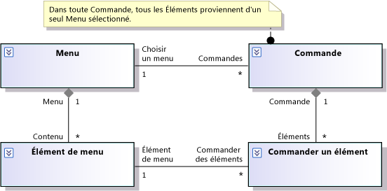

# Modéliser les besoins des utilisateurs

Visual Studio vous aide à comprendre, discuter et communiquer les besoins de vos utilisateurs en dessinant des diagrammes sur leurs activités et le rôle joué par votre système pour les aider à atteindre leurs objectifs. Un modèle d’impératifs est un ensemble de tels diagrammes, chacun étant axé sur un aspect différent des besoins des utilisateurs. Pour obtenir une démonstration vidéo, consultez : [Modeling the Business Domain (Modélisation du domaine d’entreprise)](https://channel9.msdn.com/blogs/clinted/uml-with-vs-2010-part-3-modeling-the-business-domain).

Pour connaître les versions de Visual Studio qui prennent en charge chaque type de modèle, consultez [Version support for architecture and modeling tools](../modeling/analyze-and-model-your-architecture.md#VersionSupport).

Un modèle d’impératifs vous aide à :

- Vous concentrer sur le comportement externe du système, indépendamment de sa conception interne

- Décrire les besoins des utilisateurs et des parties prenantes avec beaucoup moins d’ambiguïté qu’en langage naturel

- Définir un glossaire cohérent de termes qui peuvent être utilisés par les utilisateurs, les développeurs et les testeurs

- Réduire les oublis et les incohérences des impératifs

- Réduire la somme de travail nécessaire pour répondre aux changements d’impératifs

- Planifier l’ordre dans lequel les fonctionnalités seront développées

- Utiliser les modèles comme base pour les tests système et clarifier la relation entre les tests et les impératifs Quand les impératifs changent, cette relation vous aide à mettre à jour les tests correctement. Cela permet de s’assurer que le système répond aux nouveaux impératifs.

Un modèle d’impératifs est le plus utile si vous l’utilisez pour focaliser les discussions avec les utilisateurs ou leurs représentants et si vous le revisitez au début de chaque itération. Il est inutile de le remplir de manière détaillée avant d’écrire le code. Une application partiellement fonctionnelle, même si elle est grandement simplifiée, constitue en général la base la plus stimulante pour toute discussion des impératifs avec les utilisateurs. Le modèle permet de résumer les résultats de ces discussions de façon efficace. Pour plus d’informations, consultez [utiliser des modèles dans votre processus de développement](../modeling/use-models-in-your-development-process.md).

> [!NOTE]
> Tout au long de ces rubriques, le terme « système » faire référence au système ou à l’application que vous développez. Il peut s’agir d’une grande collection de nombreux composants matériels et logiciels, d’une application unique ou d’un composant logiciel à l’intérieur d’un système plus grand. Dans tous les cas, le modèle d’impératifs décrit le comportement qui est visible de l’extérieur de votre système, par le biais d’une interface utilisateur ou d’une API.

## Tâches courantes

Vous pouvez créer plusieurs vues différentes des impératifs des utilisateurs.  Chaque vue fournit un type particulier d’informations.  Lors de la création de ces vues, il est préférable de passer fréquemment de l’une à l’autre. Vous pouvez commencer à partir de n’importe quelle vue.

|Diagramme ou document|Ce qu’il décrit dans un modèle d’impératifs|Section|
|-|-|-|
|Diagramme de classes conceptuelles|Glossaire des types utilisés pour décrire les impératifs et des types visibles à l’interface du système.||
|Autres documents ou éléments de travail|Critères de performances, de sécurité, de facilité d’utilisation et de fiabilité.|[Description des impératifs de qualité de service](#QoSRequirements)|
|Autres documents ou éléments de travail|Contraintes et règles non spécifiques à un cas d’usage particulier|[Affichage des règles métier](#BusinessRules)|

Notez que la plupart des types de diagrammes peuvent être utilisés à d’autres fins. Pour obtenir une vue d’ensemble des types de diagrammes, consultez [créer des modèles pour votre application](../modeling/create-models-for-your-app.md).

##  Indication des règles d’entreprise

Une règle métier est un impératif qui n’est associé à aucun cas d’usage particulier et doit être respecté à l’échelle du système.

De nombreuses règles métier sont des contraintes sur les relations entre les classes conceptuelles. Vous pouvez écrire ces *règles métier statiques* en tant que commentaires associés aux classes pertinentes sur un diagramme de classes conceptuelles. Exemple :

Les *règles métier dynamiques* contraignent les séquences d’événements autorisées. Par exemple, vous utilisez un diagramme de séquence ou d’activités pour montrer qu’un utilisateur doit se connecter avant d’effectuer d’autres opérations sur votre système.

Toutefois, vous pouvez exprimer de nombreuses règles dynamiques plus efficacement et plus génériquement en les remplaçant par des règles statiques. Par exemple, vous pourriez ajouter un attribut booléen « Connecté » à une classe dans le modèle de classes conceptuelles. Vous ajouteriez « Connecté » comme post-condition du cas d’usage Connecté et vous l’ajouteriez comme précondition pour la plupart des autres cas d’usage. Cette approche vous permet d’éviter de définir toutes les combinaisons possibles de séquences d’événements. Elle offre aussi davantage de flexibilité quand vous devez ajouter de nouveaux cas d’usage au modèle.

Notez qu’ici le choix porte sur la façon dont vous définissez les impératifs et que cette décision est indépendante de la façon dont vous implémentez les impératifs dans le code du programme.

Les rubriques suivantes fournissent plus d'informations :

|Pour en savoir plus sur|Lire|
|-|-|
|Comment développer du code qui respecte des règles métier|[Modéliser l’architecture de votre application](../modeling/model-your-app-s-architecture.md)|

##  Describing Quality of Service Requirements

Il existe plusieurs catégories d’impératifs de qualité de service. Il s'agit des dossiers suivants :

- Performances

- Sécurité

- Facilité d'utilisation

- Fiabilité

- Robustesse

Vous pouvez inclure certains de ces impératifs dans les descriptions de cas d’usage particuliers. D’autres impératifs ne sont spécifiques à aucun cas d’usage et il est plus efficace de les rédiger dans un document distinct. Dans la mesure du possible, essayez d’adhérer à la terminologie définie par le modèle d’impératifs. Dans l’exemple suivant, notez que les principaux termes utilisés dans l’impératif sont les titres des acteurs, des cas d’usage et des classes des illustrations précédentes :

Si un Restaurant supprime un Élément de menu pendant qu’un Client Commande un Repas, tout Élément de commande qui fait référence à cet Élément de menu est affiché en rouge.

Consultez [modéliser l’architecture de votre application](../modeling/model-your-app-s-architecture.md) pour apprendre à développer du code conforme aux exigences de qualité de service.

## Voir aussi

- [Utiliser des modèles dans votre processus de développement](../modeling/use-models-in-your-development-process.md)
- [Modéliser l’architecture de votre application](../modeling/model-your-app-s-architecture.md)
