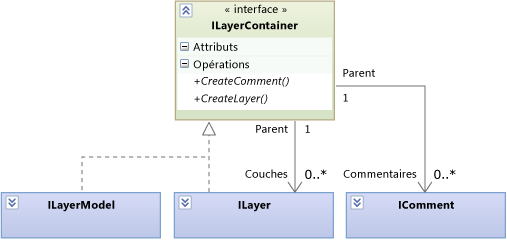
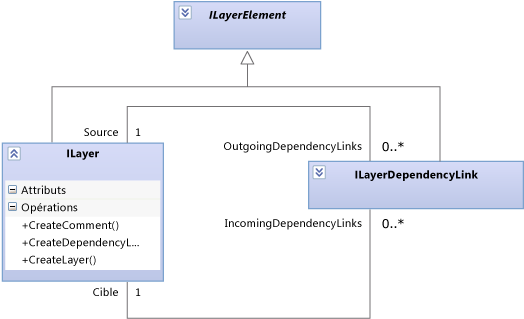
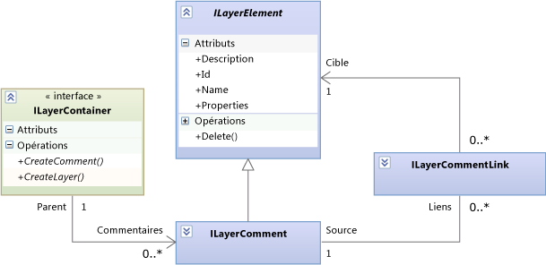
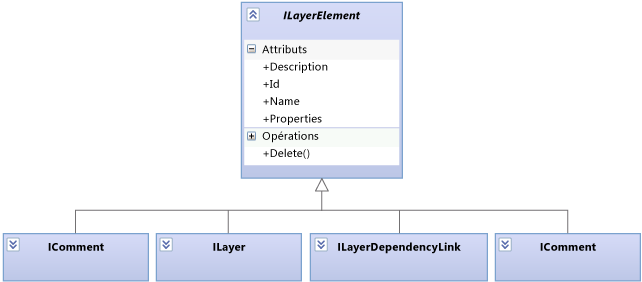

# <a name="navigate-and-update-layer-models-in-program-code"></a>Parcourir et mettre à jour les modèles de couche dans le code de programme

Cet article décrit les éléments et les relations dans les modèles de couche, que vous pouvez parcourir et mettre à jour à l’aide du code de programme. Pour plus d’informations sur les diagrammes de dépendance du point de vue de l’utilisateur, consultez [des diagrammes de dépendance : référence](../modeling/layer-diagrams-reference.md) et [des diagrammes de dépendance : recommandations](../modeling/layer-diagrams-guidelines.md).

Le <xref:Microsoft.VisualStudio.ArchitectureTools.Extensibility.Layer> modèle décrit dans cette rubrique est une façade plus général <xref:Microsoft.VisualStudio.GraphModel> modèle. Si vous écrivez un [extension de mouvements ou de commandes de menu](../modeling/add-commands-and-gestures-to-layer-diagrams.md), utilisez la `Layer` modèle. Si vous écrivez un [extension de validation de couche](../modeling/add-custom-architecture-validation-to-layer-diagrams.md), il est plus facile à utiliser le `GraphModel`.

## <a name="transactions"></a>Transactions

Lorsque vous mettez à jour un modèle, enserrez les modifications dans un `ILinkedUndoTransaction`, qui regroupent vos modifications en une seule transaction. Si les modifications échoue, la transaction entière est restaurée. Si l’utilisateur annule une modification, toutes les modifications sont annulées ensemble.

```csharp
using (ILinkedUndoTransaction t =
        LinkedUndoContext.BeginTransaction("a name"))
{
    // Make changes here ....
    t.Commit(); // Don't forget this!
}
```

## <a name="containment"></a>Imbrication



Les couches (<xref:Microsoft.VisualStudio.ArchitectureTools.Extensibility.Layer.ILayer>) et le modèle de couche (<xref:Microsoft.VisualStudio.ArchitectureTools.Extensibility.Layer.ILayerModel>) peuvent contenir des commentaires et des couches.

Une couche (`ILayer`) peut être contenue dans un modèle de couche (`ILayerModel`) ou imbriquée dans une autre couche `ILayer`.

Pour créer un commentaire ou une couche, utilisez les méthodes de création dans le conteneur approprié.

## <a name="dependency-links"></a>Liens de dépendance

Un lien de dépendance est représenté par un objet. Il peut être parcouru dans chaque direction :



Pour créer un lien de dépendance, appelez `source.CreateDependencyLink(target)`.

## <a name="comments"></a>Commentaires

Les commentaires peuvent être contenus à l'intérieur de couches ou du modèle de couche, mais aussi être liés à n'importe quel élément de couche :



Un commentaire peut être lié à autant d'éléments que nécessaire, voire à aucun.

Pour obtenir les commentaires joints à un élément de couche, utilisez :

```csharp
ILayerModel model = diagram.GetLayerModel();
IEnumerable<ILayerComment> comments =
   model.Comments.Where(comment =>
      comment.Links.Any(link => link.Target == layerElement));
```

> [!CAUTION]
> La propriété `Comments` d'une couche `ILayer` obtient les commentaires contenus dans cette couche `ILayer`. Elle n'obtient pas les commentaires qui lui sont liés.

Créer un commentaire en appelant `CreateComment()` dans le conteneur approprié.

Créez un lien en utilisant `CreateLink()` dans le commentaire.

## <a name="layer-elements"></a>Éléments de couche

Tous les types d'élément qui peuvent être contenus dans un modèle sont des éléments de couche :



## <a name="properties"></a>Properties

À chaque `ILayerElement` correspond un dictionnaire de chaînes nommé `Properties`. Vous pouvez utiliser ce dictionnaire pour joindre des informations arbitraires à n'importe quel élément de couche.

## <a name="artifact-references"></a>Références d'artefact

Une référence d'artefact (<xref:Microsoft.VisualStudio.ArchitectureTools.Extensibility.Layer.ILayerArtifactReference>) représente le lien entre une couche et un élément de projet, tel qu'un fichier, une classe ou un dossier. L’utilisateur crée des artefacts de créer une couche ou ajouter en faisant glisser des éléments depuis l’Explorateur de solutions, affichage de classes ou Explorateur d’objets sur un diagramme de dépendance. Il est possible de lier à une couche autant de références d’artefact que nécessaire.

Chaque ligne figurant dans l’Explorateur de couches affiche une référence d’artefact. Pour plus d’informations, consultez [créer des diagrammes de dépendance à partir de votre code](../modeling/create-layer-diagrams-from-your-code.md).

Les types et les méthodes de principal concernés par les références d’artefact sont les suivants :

<xref:Microsoft.VisualStudio.ArchitectureTools.Extensibility.Layer.ILayerArtifactReference>. La propriété Categories indique le type d’artefact référencé (par exemple, une classe, un fichier exécutable ou un assembly). La propriété Categories détermine comment Identifier identifie l’artefact cible.

<xref:Microsoft.VisualStudio.ArchitectureTools.Extensibility.Layer.ArtifactReferenceExtensions.CreateArtifactReferenceAsync%2A> crée une référence d'artefact à partir de <xref:EnvDTE.Project> ou <xref:EnvDTE.ProjectItem>. S'agissant d'une opération asynchrone, Par conséquent, vous fournissez généralement un rappel est appelée lorsque la création terminée.

Références d’artefact de couche sont différents pour les artefacts dans les diagrammes de cas d’utilisation.

## <a name="shapes-and-diagrams"></a>Formes et diagrammes

Chaque élément figurant dans un modèle de couche est représenté par deux objets : <xref:Microsoft.VisualStudio.ArchitectureTools.Extensibility.Layer.ILayerElement> et <xref:Microsoft.VisualStudio.ArchitectureTools.Extensibility.Presentation.IShape>. `IShape` représente la position et la taille de la forme dans le diagramme. Dans les modèles de couche, chaque `ILayerElement` possède un `IShape`et chaque `IShape` sur une dépendance diagramme possède un `ILayerElement`. `IShape` est aussi utilisé avec les modèles UML. Ainsi, tous les `IShape` ne possèdent pas nécessairement un élément de couche.

De la même façon, <xref:Microsoft.VisualStudio.ArchitectureTools.Extensibility.Layer.ILayerModel> est affiché dans un <xref:Microsoft.VisualStudio.ArchitectureTools.Extensibility.Presentation.IDiagram>.

Dans le code d'une commande personnalisée ou d'un gestionnaire de mouvements, vous pouvez obtenir le diagramme actif et la sélection de formes active à partir de l'importation de `DiagramContext` :

```csharp
public class ... {
[Import]
    public IDiagramContext DiagramContext { get; set; }
...
public void ... (...)
{ IDiagram diagram = this.DiagramContext.CurrentDiagram;
  ILayerModel model = diagram.GetLayerModel();
  if (model != null)
  { foreach (ILayer layer in model.Layers) { ... }}
  foreach (IShape selected in diagram.SelectedShapes)
  { ILayerElement element = selected.GetLayerElement();
    if (element != null) ... }}
```


<xref:Microsoft.VisualStudio.ArchitectureTools.Extensibility.Presentation.IShape> et <xref:Microsoft.VisualStudio.ArchitectureTools.Extensibility.Presentation.IDiagram> sont aussi utilisés pour afficher les modèles UML.

## <a name="see-also"></a>Voir aussi

- [Ajout de commandes et de mouvements aux diagrammes de dépendance](../modeling/add-commands-and-gestures-to-layer-diagrams.md)
- [Ajout d’une validation d’architecture personnalisée aux diagrammes de dépendance](../modeling/add-custom-architecture-validation-to-layer-diagrams.md)
- [Ajout de propriétés personnalisées à des diagrammes de dépendance](../modeling/add-custom-properties-to-layer-diagrams.md)
- [Diagrammes de dépendance : référence](../modeling/layer-diagrams-reference.md)
- [Diagrammes de dépendance : recommandations](../modeling/layer-diagrams-guidelines.md)
