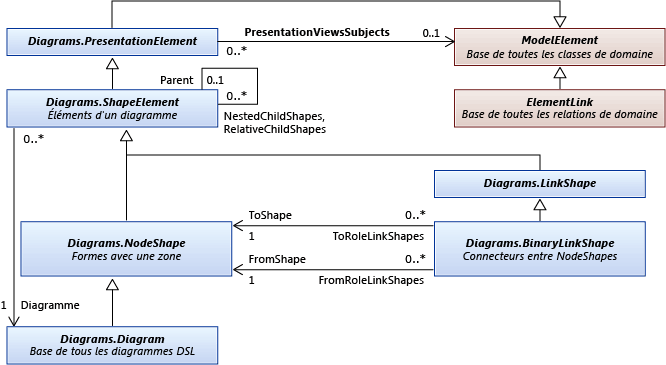

# <a name="navigate-and-update-a-model-in-program-code"></a>Accéder à un modèle et le mettre à jour dans le code du programme

Vous pouvez écrire du code pour créer et supprimer des éléments de modèle, définir leurs propriétés et créer et supprimer des liens entre des éléments. Toutes les modifications doivent être apportées dans une transaction. Si les éléments sont affichés sur un diagramme, le diagramme est « résolu » automatiquement à la fin de la transaction.

## <a name="an-example-dsl-definition"></a><a name="example"></a> Exemple de définition DSL
 Il s’agit de la partie principale de DslDefinition. DSL pour les exemples de cette rubrique :

 

 Ce modèle est une instance de ce DSL :

 

### <a name="references-and-namespaces"></a>Références et espaces de noms
 Pour exécuter le code de cette rubrique, vous devez référencer :

 `Microsoft.VisualStudio.Modeling.Sdk.11.0.dll`

 Votre code utilisera cet espace de noms :

 `using Microsoft.VisualStudio.Modeling;`

 En outre, si vous écrivez le code dans un autre projet que celui dans lequel votre DSL est défini, vous devez importer l’assembly généré par le projet DSL.

## <a name="navigating-the-model"></a><a name="navigation"></a> Navigation dans le modèle

### <a name="properties"></a>Propriétés
 Les propriétés de domaine que vous définissez dans la définition DSL deviennent des propriétés auxquelles vous pouvez accéder dans le code du programme :

 `Person henry = ...;`

 `if (henry.BirthDate < 1500) ...`

 `if (henry.Name.EndsWith("VIII")) ...`

 Si vous souhaitez définir une propriété, vous devez le faire à l’intérieur d’une [transaction](#transaction):

 `henry.Name = "Henry VIII";`

 Si, dans la définition DSL, le **genre** d’une propriété est **calculé**, vous ne pouvez pas le définir. Pour plus d’informations, consultez [Propriétés de stockage calculées et personnalisées](../modeling/calculated-and-custom-storage-properties.md).

### <a name="relationships"></a>Relations
 Les relations de domaine que vous définissez dans la définition DSL deviennent des paires de propriétés, une sur la classe à chaque terminaison de la relation. Les noms des propriétés s’affichent dans le diagramme DslDefinition sous forme d’étiquettes sur les rôles de chaque côté de la relation. Selon la multiplicité du rôle, le type de la propriété est soit la classe à l’autre terminaison de la relation, soit une collection de cette classe.

 `foreach (Person child in henry.Children) { ... }`

 `FamilyTreeModel ftree = henry.FamilyTreeModel;`

 Les propriétés des terminaisons opposées d’une relation sont toujours réciproques. Lorsqu’un lien est créé ou supprimé, les propriétés de rôle sur les deux éléments sont mises à jour. L’expression suivante (qui utilise les extensions de `System.Linq` ) est toujours true pour la relation ParentsHaveChildren dans l’exemple :

 `(Person p) => p.Children.All(child => child.Parents.Contains(p))`

 `&& p.Parents.All(parent => parent.Children.Contains(p));`

 **ElementLinks**. Une relation est également représentée par un élément de modèle appelé un *lien*, qui est une instance du type de relation de domaine. Un lien a toujours un élément source et un élément cible. L’élément source et l’élément cible peuvent être identiques.

 Vous pouvez accéder à un lien et à ses propriétés :

 `ParentsHaveChildren link = ParentsHaveChildren.GetLink(henry, edward);`

 `// This is now true:`

 `link == null || link.Parent == henry && link.Child == edward`

 Par défaut, une seule instance d’une relation est autorisée à lier n’importe quelle paire d’éléments de modèle. Toutefois, si dans la définition DSL, l' `Allow Duplicates` indicateur a la valeur true pour la relation, il peut y avoir plus d’un lien et vous devez utiliser `GetLinks` :

 `foreach (ParentsHaveChildren link in ParentsHaveChildren.GetLinks(henry, edward)) { ... }`

 Il existe également d’autres méthodes pour accéder aux liens. Exemple :

 `foreach (ParentsHaveChildren link in     ParentsHaveChildren.GetLinksToChildren(henry)) { ... }`

 **Rôles masqués.** Si, dans la définition DSL, la **propriété est générée** la **valeur false** pour un rôle particulier, aucune propriété n’est générée qui correspond à ce rôle. Toutefois, vous pouvez toujours accéder aux liens et parcourir les liens à l’aide des méthodes de la relation :

 `foreach (Person p in ParentsHaveChildren.GetChildren(henry)) { ... }`

 L’exemple le plus fréquemment utilisé est la <xref:Microsoft.VisualStudio.Modeling.Diagrams.PresentationViewsSubject> relation, qui lie un élément de modèle à la forme qui l’affiche sur un diagramme :

 `PresentationViewsSubject.GetPresentation(henry)[0] as PersonShape`

### <a name="the-element-directory"></a>Répertoire de l’élément
 Vous pouvez accéder à tous les éléments du magasin à l’aide du répertoire de l’élément :

 `store.ElementDirectory.AllElements`

 Il existe également des méthodes pour rechercher des éléments, tels que les suivants :

 `store.ElementDirectory.FindElements(Person.DomainClassId);`

 `store.ElementDirectory.GetElement(elementId);`

## <a name="accessing-class-information"></a><a name="metadata"></a> Accès aux informations de classe
 Vous pouvez obtenir des informations sur les classes, les relations et d’autres aspects de la définition DSL. Exemple :

 `DomainClassInfo personClass = henry.GetDomainClass();`

 `DomainPropertyInfo birthProperty =`

 `personClass.FindDomainProperty("BirthDate")`

 `DomainRelationshipInfo relationship =`

 `link.GetDomainRelationship();`

 `DomainRoleInfo sourceRole = relationship.DomainRole[0];`

 Les classes ancêtres des éléments de modèle sont les suivantes :

- ModelElement-tous les éléments et les relations sont ModelElements

- ElementLink : toutes les relations sont ElementLinks

## <a name="perform-changes-inside-a-transaction"></a><a name="transaction"></a> Effectuer des modifications à l’intérieur d’une transaction
 Chaque fois que votre code de programme change dans le magasin, il doit le faire à l’intérieur d’une transaction. Cela s’applique à tous les éléments de modèle, relations, formes, diagrammes et leurs propriétés. Pour plus d’informations, consultez <xref:Microsoft.VisualStudio.Modeling.Transaction>.

 La méthode la plus pratique pour gérer une transaction consiste à utiliser une `using` instruction placée dans une `try...catch` instruction :

```
Store store; ...
try
{
  using (Transaction transaction =
    store.TransactionManager.BeginTransaction("update model"))
    // Outermost transaction must always have a name.
  {
    // Make several changes in Store:
    Person p = new Person(store);
    p.FamilyTreeModel = familyTree;
    p.Name = "Edward VI";
    // end of changes to Store

    transaction.Commit(); // Don't forget this!
  } // transaction disposed here
}
catch (Exception ex)
{
  // If an exception occurs, the Store will be
  // rolled back to its previous state.
}
```

 Vous pouvez effectuer un nombre quelconque de modifications dans une transaction. Vous pouvez ouvrir de nouvelles transactions dans une transaction active.

 Pour rendre vos modifications permanentes, vous devez `Commit` la transaction avant qu’elle ne soit supprimée. Si une exception qui n’est pas interceptée à l’intérieur de la transaction se produit, le magasin est rétabli à son état avant les modifications.

## <a name="creating-model-elements"></a><a name="elements"></a> Création d’éléments de modèle
 Cet exemple ajoute un élément à un modèle existant :

```csharp
FamilyTreeModel familyTree = ...; // The root of the model.
using (Transaction t =
    familyTree.Store.TransactionManager
    .BeginTransaction("update model"))
{
  // Create a new model element
  // in the same partition as the model root:
  Person edward = new Person(familyTree.Partition);
  // Set its embedding relationship:
  edward.FamilyTreeModel = familyTree;
          // same as: familyTree.People.Add(edward);
  // Set its properties:
  edward.Name = "Edward VII";
  t.Commit(); // Don't forget this!
}
```

 Cet exemple illustre ces points essentiels sur la création d’un élément :

- Créez le nouvel élément dans une partition spécifique du magasin. Pour les éléments de modèle et les relations, mais pas les formes, il s’agit généralement de la partition par défaut.

- En fait, il s’agit de la cible d’une relation d’incorporation. Dans le DslDefinition de cet exemple, chaque personne doit être la cible de l’incorporation de la relation FamilyTreeHasPeople. Pour ce faire, nous pouvons soit définir la propriété de rôle FamilyTreeModel de l’objet Person, soit ajouter la personne à la propriété de rôle People de l’objet FamilyTreeModel.

- Définissez les propriétés d’un nouvel élément, en particulier la propriété pour laquelle `IsName` a la valeur true dans le DslDefinition. Cet indicateur marque la propriété qui sert à identifier l’élément de manière unique dans son propriétaire. Dans ce cas, la propriété Name a cet indicateur.

- La définition DSL de ce DSL doit avoir été chargée dans le magasin. Si vous écrivez une extension telle qu’une commande de menu, il s’agit généralement de la valeur true. Dans d’autres cas, vous pouvez charger explicitement le modèle dans le magasin, ou utiliser [ModelBus](/previous-versions/ee904639(v=vs.140)) pour le charger. Pour plus d’informations, consultez [Comment : ouvrir un modèle à partir d’un fichier dans le code de programme](../modeling/how-to-open-a-model-from-file-in-program-code.md).

  Lorsque vous créez un élément de cette manière, une forme est automatiquement créée (si le DSL a un diagramme). Il apparaît dans un emplacement assigné automatiquement, avec la forme par défaut, la couleur et d’autres fonctionnalités. Si vous souhaitez contrôler l’emplacement et la façon dont la forme associée s’affiche, consultez [création d’un élément et de sa forme](#merge).

## <a name="creating-relationship-links"></a><a name="links"></a> Création de liens de relation
 Deux relations sont définies dans l’exemple de définition DSL. Chaque relation définit une *propriété de rôle* sur la classe à chaque terminaison de la relation.

 Il existe trois façons de créer une instance d’une relation. Chacune de ces trois méthodes a le même effet :

- Définissez la propriété de l’acteur de rôle source. Exemple :

  - `familyTree.People.Add(edward);`

  - `edward.Parents.Add(henry);`

- Définissez la propriété de l’acteur de rôle cible. Exemple :

  - `edward.familyTreeModel = familyTree;`

       La multiplicité de ce rôle étant `1..1` , nous attribuons la valeur.

  - `henry.Children.Add(edward);`

       La multiplicité de ce rôle est `0..*` donc ajoutée à la collection.

- Construisez une instance de la relation explicitement. Exemple :

  - `FamilyTreeHasPeople edwardLink = new FamilyTreeHasPeople(familyTreeModel, edward);`

  - `ParentsHaveChildren edwardHenryLink = new ParentsHaveChildren(henry, edward);`

  La dernière méthode est utile si vous souhaitez définir des propriétés sur la relation elle-même.

  Lorsque vous créez un élément de cette manière, un connecteur sur le diagramme est automatiquement créé, mais il possède une forme, une couleur et d’autres fonctionnalités par défaut. Pour contrôler la façon dont le connecteur associé est créé, consultez [création d’un élément et de sa forme](#merge).

## <a name="deleting-elements"></a><a name="deleteelements"></a> Supprimer des éléments

Supprimez un élément en appelant `Delete()` :

`henry.Delete();`

Cette opération va également supprimer :

- Liens de relation vers et à partir de l’élément. Par exemple, `edward.Parents` ne contient plus `henry` .

- Éléments aux rôles pour lesquels l' `PropagatesDelete` indicateur a la valeur true. Par exemple, la forme qui affiche l’élément sera supprimée.

Par défaut, chaque relation d’incorporation a `PropagatesDelete` la valeur true au niveau du rôle cible. La suppression `henry` ne supprime pas le `familyTree` , mais `familyTree.Delete()` supprime tout le `Persons` .

Par défaut, `PropagatesDelete` n’est pas vrai pour les rôles de relations de référence.

Vous pouvez faire en sorte que les règles de suppression omettent des propagations spécifiques lorsque vous supprimez un objet. Cela est utile si vous substituez un élément à un autre. Vous fournissez le GUID d’un ou plusieurs rôles pour lesquels la suppression ne doit pas être propagée. Le GUID peut être obtenu à partir de la classe de relation :

`henry.Delete(ParentsHaveChildren.SourceDomainRoleId);`

(Cet exemple particulier n’aurait aucun effet, car `PropagatesDelete` est `false` destiné aux rôles de la `ParentsHaveChildren` relation.)

Dans certains cas, la suppression est empêchée par l’existence d’un verrou, soit sur l’élément, soit sur un élément qui serait supprimé par propagation. Vous pouvez utiliser `element.CanDelete()` pour vérifier si l’élément peut être supprimé.

## <a name="deleting-relationship-links"></a><a name="deletelinks"></a> Suppression de liens de relation
 Vous pouvez supprimer un lien de relation en supprimant un élément d’une propriété de rôle :

 `henry.Children.Remove(edward); // or:`

 `edward.Parents.Remove(henry);  // or:`

 Vous pouvez également supprimer le lien de manière explicite :

 `edwardHenryLink.Delete();`

 Ces trois méthodes ont toutes le même effet. Vous ne devez utiliser qu’un seul d’entre eux.

 Si le rôle a 0.. 1 ou 1.. 1 multiplicité, vous pouvez lui affecter la `null` valeur ou une autre valeur :

 `edward.FamilyTreeModel = null;` ni

 `edward.FamilyTreeModel = anotherFamilyTree;`

## <a name="re-ordering-the-links-of-a-relationship"></a><a name="reorder"></a> Réorganisation des liens d’une relation
 Les liens d’une relation particulière qui sont source ou ciblés sur un élément de modèle particulier ont une séquence spécifique. Ils s’affichent dans l’ordre dans lequel ils ont été ajoutés. Par exemple, cette instruction produira toujours les enfants dans le même ordre :

 `foreach (Person child in henry.Children) ...`

 Vous pouvez modifier l’ordre des liens :

 `ParentsHaveChildren link = GetLink(henry,edward);`

 `ParentsHaveChildren nextLink = GetLink(henry, elizabeth);`

 `DomainRoleInfo role =`

 `link.GetDomainRelationship().DomainRoles[0];`

 `link.MoveBefore(role, nextLink);`

## <a name="locks"></a><a name="locks"></a> Verrous
 Vos modifications peuvent être bloquées par un verrou. Les verrous peuvent être définis sur des éléments individuels, sur des partitions et sur le magasin. Si l’un de ces niveaux a un verrou qui empêche le type de modification que vous souhaitez effectuer, une exception peut être levée lorsque vous tentez de le faire. Vous pouvez déterminer si les verrous sont définis à l’aide de l’élément. GetLocks (), qui est une méthode d’extension définie dans l’espace de noms <xref:Microsoft.VisualStudio.Modeling.Immutability> .

 Pour plus d’informations, consultez [définition d’une stratégie de verrouillage pour créer des segments de Read-Only](../modeling/defining-a-locking-policy-to-create-read-only-segments.md).

## <a name="copy-and-paste"></a><a name="copy"></a> Copier et coller
 Vous pouvez copier des éléments ou des groupes d’éléments dans un <xref:System.Windows.Forms.IDataObject> :

```csharp
Person person = personShape.ModelElement as Person;
Person adopter = adopterShape.ModelElement as Person;
IDataObject data = new DataObject();
personShape.Diagram.ElementOperations
      .Copy(data, person.Children.ToList<ModelElement>());
```

 Les éléments sont stockés sous la forme d’un groupe d’éléments sérialisés.

 Vous pouvez fusionner des éléments d’un IDataObject dans un modèle :

```csharp
using (Transaction t = targetDiagram.Store.
        TransactionManager.BeginTransaction("paste"))
{
  adopterShape.Diagram.ElementOperations.Merge(adopter, data);
}
```

 `Merge ()` peut accepter un `PresentationElement` ou un `ModelElement` . Si vous lui donnez un `PresentationElement` , vous pouvez également spécifier une position sur le diagramme cible comme troisième paramètre.

## <a name="navigating-and-updating-diagrams"></a><a name="diagrams"></a> Navigation et mise à jour des diagrammes
 Dans un DSL, l’élément de modèle de domaine, qui représente un concept tel qu’une personne ou une chanson, est distinct de l’élément de forme, qui représente ce que vous voyez dans le diagramme. L’élément de modèle de domaine stocke les propriétés et les relations importantes des concepts. L’élément Shape stocke la taille, la position et la couleur de la vue de l’objet sur le diagramme, ainsi que la disposition de ses composants.

### <a name="presentation-elements"></a>Éléments de présentation
 

 Dans votre définition DSL, chaque élément que vous spécifiez crée une classe dérivée de l’une des classes standard suivantes.

|Genre d’élément|Classe de base|
|-|-|
|Classe de domaine|<xref:Microsoft.VisualStudio.Modeling.ModelElement>|
|Relation de domaine|<xref:Microsoft.VisualStudio.Modeling.ElementLink>|
|Graphique à base de formes|<xref:Microsoft.VisualStudio.Modeling.Diagrams.NodeShape>|
|Connecteur|<xref:Microsoft.VisualStudio.Modeling.Diagrams.BinaryLinkShape>|
|Diagramme|<xref:Microsoft.VisualStudio.Modeling.Diagrams.Diagram>|

 Un élément sur un diagramme représente généralement un élément de modèle. En général (mais pas toujours), un <xref:Microsoft.VisualStudio.Modeling.Diagrams.NodeShape> représente une instance de classe de domaine et un <xref:Microsoft.VisualStudio.Modeling.Diagrams.BinaryLinkShape> représente une instance de relation de domaine. La <xref:Microsoft.VisualStudio.Modeling.Diagrams.PresentationViewsSubject> relation lie un nœud ou une forme de lien à l’élément de modèle qu’elle représente.

 Chaque forme de nœud ou de lien appartient à un diagramme. Une forme de lien binaire connecte deux formes de nœud.

 Les formes peuvent avoir des formes enfants dans deux ensembles. Une forme de l' `NestedChildShapes` ensemble est limitée à la zone englobante de son parent. Une forme de la `RelativeChildShapes` liste peut apparaître en dehors ou en partie en dehors des limites du parent, par exemple une étiquette ou un port. Un diagramme n’a pas `RelativeChildShapes` de et de non `Parent` .

### <a name="navigating-between-shapes-and-elements"></a><a name="views"></a> Navigation entre les formes et les éléments
 Les éléments de modèle de domaine et les éléments de forme sont liés par la <xref:Microsoft.VisualStudio.Modeling.Diagrams.PresentationViewsSubject> relation.

```csharp
// using Microsoft.VisualStudio.Modeling;
// using Microsoft.VisualStudio.Modeling.Diagrams;
// using System.Linq;
Person henry = ...;
PersonShape henryShape =
  PresentationViewsSubject.GetPresentation(henry)
    .FirstOrDefault() as PersonShape;
```

 La même relation lie les relations aux connecteurs sur le diagramme :

```
Descendants link = Descendants.GetLink(henry, edward);
DescendantConnector dc =
   PresentationViewsSubject.GetPresentation(link)
     .FirstOrDefault() as DescendantConnector;
// dc.FromShape == henryShape && dc.ToShape == edwardShape
```

 Cette relation lie également la racine du modèle au diagramme :

```
FamilyTreeDiagram diagram =
   PresentationViewsSubject.GetPresentation(familyTree)
      .FirstOrDefault() as FamilyTreeDiagram;
```

 Pour obtenir l’élément de modèle représenté par une forme, utilisez :

 `henryShape.ModelElement as Person`

 `diagram.ModelElement as FamilyTreeModel`

### <a name="navigating-around-the-diagram"></a>Navigation dans le diagramme
 En général, il n’est pas recommandé de naviguer entre les formes et les connecteurs dans le diagramme. Il est préférable de parcourir les relations dans le modèle, en se déplaçant entre les formes et les connecteurs uniquement lorsqu’il est nécessaire de travailler sur l’apparence du diagramme. Ces méthodes lient les connecteurs aux formes à chaque extrémité :

 `personShape.FromRoleLinkShapes, personShape.ToRoleLinkShapes`

 `connector.FromShape, connector.ToShape`

 De nombreuses formes sont des composites ; ils sont constitués d’une forme parente et d’une ou plusieurs couches d’enfants. Les formes positionnées par rapport à une autre forme sont considérées comme des *enfants*. Lorsque la forme parente se déplace, les enfants se déplacent avec elle.

 Les *enfants relatifs* peuvent apparaître en dehors du cadre englobant de la forme parente. Les enfants *imbriqués* apparaissent strictement à l’intérieur des limites du parent.

 Pour obtenir le jeu de formes supérieur sur un diagramme, utilisez :

 `Diagram.NestedChildShapes`

 Les classes ancêtres des formes et des connecteurs sont les suivantes :

 <xref:Microsoft.VisualStudio.Modeling.ModelElement>

 -- <xref:Microsoft.VisualStudio.Modeling.Diagrams.PresentationElement>

 -- <xref:Microsoft.VisualStudio.Modeling.Diagrams.ShapeElement>

 ----- <xref:Microsoft.VisualStudio.Modeling.Diagrams.NodeShape>

 ------- <xref:Microsoft.VisualStudio.Modeling.Diagrams.Diagram>

 ------- *YourShape*

 ----- <xref:Microsoft.VisualStudio.Modeling.Diagrams.LinkShape>

 ------- <xref:Microsoft.VisualStudio.Modeling.Diagrams.BinaryLinkShape>

 --------- *YourConnector*

### <a name="properties-of-shapes-and-connectors"></a><a name="shapeProperties"></a> Propriétés des formes et des connecteurs
 Dans la plupart des cas, il n’est pas nécessaire d’apporter des modifications explicites aux formes. Lorsque vous avez modifié les éléments du modèle, les règles de « correction » mettent à jour les formes et les connecteurs. Pour plus d’informations, consultez [réponse aux modifications et propagation](../modeling/responding-to-and-propagating-changes.md).

 Toutefois, il est utile d’apporter des modifications explicites aux formes dans les propriétés qui sont indépendantes des éléments du modèle. Par exemple, vous pouvez modifier ces propriétés :

- <xref:Microsoft.VisualStudio.Modeling.Diagrams.NodeShape.Size%2A> -détermine la hauteur et la largeur de la forme.

- <xref:Microsoft.VisualStudio.Modeling.Diagrams.NodeShape.Location%2A> -position relative à la forme ou au diagramme parent

- <xref:Microsoft.VisualStudio.Modeling.Diagrams.ShapeElement.StyleSet%2A> : ensemble de stylets et de pinceaux utilisés pour dessiner la forme ou le connecteur

- <xref:Microsoft.VisualStudio.Modeling.Diagrams.ShapeElement.Hide%2A> -rend la forme invisible

- <xref:Microsoft.VisualStudio.Modeling.Diagrams.ShapeElement.Show%2A> -rend la forme visible après une `Hide()`

### <a name="creating-an-element-and-its-shape"></a><a name="merge"></a> Création d’un élément et de sa forme

Lorsque vous créez un élément et le liez à l’arborescence des relations d’incorporation, une forme est automatiquement créée et associée à celle-ci. Cela est effectué par les règles de « correction » qui s’exécutent à la fin de la transaction. Toutefois, la forme apparaîtra dans un emplacement assigné automatiquement, et sa forme, sa couleur et d’autres fonctionnalités auront des valeurs par défaut. Pour contrôler la façon dont la forme est créée, vous pouvez utiliser la fonction Merge. Vous devez d’abord ajouter les éléments que vous souhaitez ajouter à un ElementGroup, puis fusionner le groupe dans le diagramme.

Cette méthode :

- Définit le nom, si vous avez assigné une propriété comme nom d’élément.

- Observe toutes les directives de fusion d’éléments que vous avez spécifiées dans la définition DSL.

Cet exemple crée une forme à la position de la souris, lorsque l’utilisateur double-clique sur le diagramme. Dans la définition DSL de cet exemple, la `FillColor` propriété de `ExampleShape` a été exposée.

```csharp
using Microsoft.VisualStudio.Modeling;
using Microsoft.VisualStudio.Modeling.Diagrams;
partial class MyDiagram
{
  public override void OnDoubleClick(DiagramPointEventArgs e)
  {
    base.OnDoubleClick(e);

    using (Transaction t = this.Store.TransactionManager
        .BeginTransaction("double click"))
    {
      ExampleElement element = new ExampleElement(this.Store);
      ElementGroup group = new ElementGroup(element);

      { // To use a shape of a default size and color, omit this block.
        ExampleShape shape = new ExampleShape(this.Partition);
        shape.ModelElement = element;
        shape.AbsoluteBounds = new RectangleD(0, 0, 1.5, 1.0);
        shape.FillColor = System.Drawing.Color.Azure;
        group.Add(shape);
      }

      this.ElementOperations.MergeElementGroupPrototype(
        this,
        group.CreatePrototype(),
        PointD.ToPointF(e.MousePosition));
      t.Commit();
    }
  }
}
```

 Si vous fournissez plusieurs formes, définissez leurs positions relatives à l’aide de `AbsoluteBounds` .

 Vous pouvez également définir la couleur et d’autres propriétés exposées des connecteurs à l’aide de cette méthode.

### <a name="use-transactions"></a>Utiliser des transactions
 Les formes, les connecteurs et les diagrammes sont des sous-types de <xref:Microsoft.VisualStudio.Modeling.ModelElement> et en direct dans le magasin. Vous devez donc apporter des modifications uniquement à l’intérieur d’une transaction. Pour plus d’informations, consultez [Comment : utiliser des transactions pour mettre à jour le modèle](../modeling/how-to-use-transactions-to-update-the-model.md).

## <a name="document-view-and-document-data"></a><a name="docdata"></a> Vue de document et données de document
 

## <a name="store-partitions"></a>Stocker les partitions
 Lorsqu’un modèle est chargé, le diagramme d’accompagnement est chargé en même temps. En règle générale, le modèle est chargé dans Store. DefaultPartition et le contenu du diagramme est chargé dans une autre partition. En règle générale, le contenu de chaque partition est chargé et enregistré dans un fichier séparé.

## <a name="see-also"></a>Voir aussi

- <xref:Microsoft.VisualStudio.Modeling.ModelElement>
- [Validation dans un langage spécifique à un domaine](../modeling/validation-in-a-domain-specific-language.md)
- [Génération de code à partir d’un langage spécifique à un domaine](../modeling/generating-code-from-a-domain-specific-language.md)
- [Comment : utiliser des transactions pour mettre à jour le modèle](../modeling/how-to-use-transactions-to-update-the-model.md)
- [Intégration de modèles à l’aide de Visual Studio Modelbus](../modeling/integrating-models-by-using-visual-studio-modelbus.md)
- [Propagation et réponse aux modifications en attente](../modeling/responding-to-and-propagating-changes.md)
