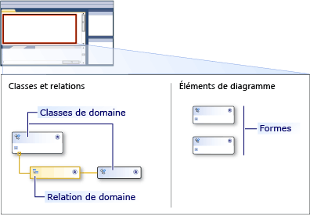

# Vue d'ensemble de l'interface utilisateur des outils de langage spécifique à un domaine
Lorsque vous ouvrez pour la première fois une solution Domain-Specific Language Tools (outils DSL) dans Visual Studio, l’interface utilisateur ressemble à l’image suivante.

 

 Le tableau suivant explique comment les parties de l’interface utilisateur sont utilisées.

|**Element**|**Définition**|
|-|-|
|Diagramme|Le diagramme affiche le modèle de domaine.   Le diagramme comporte deux parties. Une partie définit les types des éléments de vos modèles. L’autre partie définit comment vos modèles apparaissent à l’écran.|
|Boîte à outils|Faites glisser les outils de la boîte à outils vers le diagramme pour ajouter des classes de domaine et des types de forme. Pour ajouter des connecteurs, des relations et des mappages de formes, cliquez sur l’outil, sur le nœud source du diagramme, puis sur le nœud cible.|
|explorateur DSL|L’**Explorateur DSL** s’affiche lorsqu’une définition DSL est la fenêtre active. Il montre le langage DSL sous forme d’arborescence. L’Explorateur DSL vous permet de modifier les fonctionnalités du modèle qui ne sont pas affichées sur le diagramme. Par exemple, vous pouvez ajouter des éléments de boîte à outils et basculer sur le processus de validation à l’aide de l’**Explorateur DSL**.|
|Fenêtre Détails DSL|La fenêtre **Détails DSL** montre les propriétés des éléments du modèle de domaine qui vous permettent de contrôler la façon dont les éléments sont affichés, copiés et supprimés.   Par défaut, la fenêtre **Détails DSL** s’affiche à côté des fenêtres **Liste d’erreurs** et **Sortie**.|

## Diagramme du modèle de domaine
 Le diagramme du modèle de domaine est divisé en deux parties. Une partie du diagramme montre les éléments et les relations du modèle. L’autre partie montre comment le modèle doit être affiché et inclut les formes qui sont utilisées pour afficher les éléments et les propriétés du diagramme de modèle. L’image suivante montre les éléments du diagramme.

 

 Le tableau suivant décrit certains des éléments du diagramme du modèle de domaine.

|**Terme**|**Définition**|
|-|-|
|Classe de domaine|Les classes de domaine sont les types d’éléments de vos modèles.   Une classe de domaine peut apparaître plusieurs fois dans un diagramme, si elle est la cible de plusieurs relations.   Pour ajouter une classe de domaine, faites glisser l’outil de classe de domaine depuis la **Boîte à outils** vers la partie **Classes et relations** du diagramme.|
|Relation de domaine|Les relations de domaine sont les types de liens entre les éléments de vos modèles.   Une *relation d’incorporation* indique que l’élément cible est détenu ou contenu par l’élément source et apparaît sous la forme d’une ligne pleine. Chaque élément d’un modèle doit être la cible d’une relation d’incorporation afin que le modèle forme une arborescence. Une *relation de référence* indique un lien général entre les éléments de modèle et apparaît sous la forme d’une ligne en pointillés. Les éléments peuvent avoir n’importe quel nombre de liens de référence.   Créez une relation en cliquant sur l’outil dans la **Boîte à outils**, sur la classe de domaine source, puis sur la classe cible.|
|Formes et connecteurs|Les formes spécifient comment les éléments de modèle doivent être affichés sur un diagramme DSL. Les connecteurs spécifient les lignes d’un diagramme DSL qui peuvent être utilisées pour afficher les relations.   Pour créer une forme ou un connecteur, faites glisser l’outil dans la partie **Éléments du diagramme** du diagramme.|
|Mappages de formes|Une carte de forme s’affiche sous forme de ligne sur le diagramme du modèle de domaine et lie une forme à la classe de domaine qu’elle affiche, ou un connecteur à la relation de domaine qu’elle affiche.|

## Voir aussi

- [Vue d'ensemble des outils de langage spécifique à un domaine](../modeling/overview-of-domain-specific-language-tools.md)
- [Glossaire des Outils Domain-Specific Language](/previous-versions/bb126564(v=vs.100))
- [Personnalisation et extension d’un langage spécifique à un domaine](../modeling/customizing-and-extending-a-domain-specific-language.md)