# Scénario : modifier votre conception à l'aide de la visualisation et de la modélisation

Assurez-vous que votre système logiciel répond aux besoins des utilisateurs à l’aide des outils de visualisation et de modélisation dans Visual Studio.
Utilisez des outils tels que les cartes de code, les diagrammes de dépendance et les diagrammes de classes pour effectuer les opérations suivantes :

Pour connaître les versions de Visual Studio qui prennent en charge chaque outil, consultez [Version support for architecture and modeling tools](../modeling/analyze-and-model-your-architecture.md#VersionSupport).

- Clarifier les besoins des utilisateurs et les processus d’entreprise.

- Visualiser et explorer le code existant.

- Décrire les modifications apportées à un système existant.

- Vérifier que le système satisfait à ses spécifications.

- Maintenir la cohérence du code avec la conception.

Cette procédure pas à pas :

- décrit ce que ces outils peuvent apporter à votre projet de logiciel ;

- montre comment utiliser ces outils, quelle que soit votre approche du développement, à l’aide d’un exemple de scénario.

Pour en savoir plus sur ces outils et les scénarios qu’ils prennent en charge, consultez :

- [Analyse et modélisation de l’architecture](../modeling/analyze-and-model-your-architecture.md)

- [Visualiser du code](../modeling/visualize-code.md)

## Présentation du scénario

Ce scénario décrit certaines étapes des cycles de vie du développement de logiciels dans deux entreprises fictives : Dinner Now et Lucerne Publishing. Dinner Now propose un service web de livraison de repas à Seattle. Les clients peuvent commander des repas et les payer sur le site Web de Dinner Now. Les commandes sont alors envoyées au restaurant local chargé de les livrer. Lucerne Publishing, une société implantée à New York, exerce plusieurs activités liées ou non au web. Par exemple, ils exécutent un site Web sur lequel les clients peuvent poster des revues de restaurant.

Lucerne a récemment acquis Dinner Now et veut apporter les modifications suivantes :

- Intégrez leurs sites Web en ajoutant des fonctionnalités de revue de restaurant à Dinner Now.

- Remplacer le système de paiement de Dinner Now par celui de Lucerne.

- Développer les services Dinner Now dans toute la région.

Dinner Now utilise SCRUM et eXtreme Programming, des outils qui offrent une couverture de test très élevée et comportent très peu de code non pris en charge. Dinner Now réduit les risques en créant des versions légères mais fonctionnelles d’un système, puis en ajoutant progressivement des fonctionnalités. Elle développe le code sur des itérations courtes et fréquentes. Cela lui permet d’intégrer les modifications en toute confiance, de refactoriser fréquemment le code et d’éviter un lourd travail de conception en amont.

Lucerne tient à jour une collection bien plus importante et complexe de systèmes,  certains d’entre eux datant de plus de 40 ans. La société fait preuve d’une grande prudence pour apporter des modifications en raison de la complexité et de la portée du code hérité. Elle suit un processus de développement plus rigoureux, préférant concevoir des solutions détaillées, et documenter la conception et les modifications effectuées pendant le développement.

Les deux équipes utilisent des diagrammes de modélisation dans Visual Studio pour développer des systèmes qui répondent mieux aux besoins des utilisateurs. Elles utilisent Team Foundation Server en parallèle d’autres outils pour planifier, organiser et gérer leur travail.

Pour plus d’informations sur Team Foundation Server, consultez :

- [Planifier et suivre le travail](#plan-and-track-work)

- [Test, validation et archivage du code mis à jour](#TestValidateCheckInCode)

##  Rôles des diagrammes d’architecture et de modélisation dans le développement de logiciels

Le tableau suivant décrit les rôles que ces outils peuvent jouer pendant diverses étapes du cycle de développement logiciel :

|Outil/rôle|Modélisation des besoins des utilisateurs|Modélisation des processus d’entreprise|Architecture et conception du système|Visualisation et exploration du code|Vérification|
|------|-|-|-|-|-|
|Diagramme de langage spécifique à un domaine (DSL)|Oui|Oui|Oui|||
|Diagramme de dépendance, validation de couche|||Oui|Oui|Oui|
|Carte de code|||Oui|Oui|Oui|
|Concepteur de classes (basé sur le code)||||Oui||

Pour dessiner des diagrammes de dépendance, vous devez créer un projet de modélisation dans le cadre d’une solution existante ou d’un nouveau. Ces diagrammes doivent être créés dans le projet de modélisation.
Les éléments des diagrammes de dépendance se trouvent dans le projet de modélisation, mais ils ne sont pas stockés dans le modèle commun. Les cartes de code et les diagrammes de classes .NET créés à partir du code sont externes au projet de modélisation.

Consultez l'article :

- [Créer des diagrammes de dépendance à partir de votre code](../modeling/create-layer-diagrams-from-your-code.md)

- [Mapper les dépendances à travers vos solutions](../modeling/map-dependencies-across-your-solutions.md)

- [Guide pratique pour ajouter des diagrammes de classes aux projets (Concepteur de classes)](../ide/class-designer/how-to-add-class-diagrams-to-projects.md)

- [SDK de modélisation pour Visual Studio - Langages spécifiques à un domaine](../modeling/modeling-sdk-for-visual-studio-domain-specific-languages.md)

[!INCLUDE[modeling_sdk_info](includes/modeling_sdk_info.md)]

Les deux équipes utilisent également la validation de dépendance pour s’assurer que le code en cours de développement reste cohérent avec la conception. Consultez l'article :

- [Maintien de la cohérence du code avec la conception](#ValidatingCode)

- [Décrire l’architecture logique : diagrammes de dépendance](#DescribeLayers)

- [Valider du code avec des diagrammes de dépendance](../modeling/validate-code-with-layer-diagrams.md)

> [!NOTE]
> Certaines versions de Visual Studio prennent en charge la validation des dépendances et les versions en lecture seule des cartes de code pour la visualisation et la modélisation. Pour connaître les éditions de Visual Studio qui prennent en charge cette fonctionnalité, consultez [prise en charge d’édition pour les outils d’architecture et de modélisation](../modeling/analyze-and-model-your-architecture.md#VersionSupport).

## Comprendre et communiquer les informations relatives au système

Il n’y a pas d’ordre impératif pour l’utilisation des diagrammes de modélisation Visual Studio. Vous pouvez donc les utiliser comme vous le voulez, en fonction de vos besoins ou de votre approche. En règle générale, les équipes revoient leurs modèles de façon répétée et fréquente au cours d’un projet. Chaque diagramme possède ses propres atouts pour vous aider à comprendre, décrire et communiquer différents aspects du système en cours de développement.

Dinner Now et Lucerne communiquent entre eux et avec les parties prenantes des projets en utilisant des diagrammes comme langage commun. Par exemple, Dinner Now utilise des diagrammes pour effectuer ces tâches :

- visualiser le code existant ;

- communiquer avec Lucerne sur les récits utilisateur nouveaux ou mis à jour ;

- identifier les modifications requises pour prendre en charge des récits utilisateur nouveaux ou mis à jour.

Lucerne utilise des diagrammes pour effectuer ces tâches :

- découvrir le processus d’entreprise de Dinner Now ;

- comprendre la conception du système ;

- communiquer avec Dinner Now sur les besoins nouveaux ou mis à jour des utilisateurs ;

- documenter les mises à jour du système.

Les diagrammes sont intégrés à Team Foundation Server pour que les équipes puissent planifier, gérer et suivre leur travail plus facilement. Par exemple, les équipes utilisent des modèles pour identifier des cas de test et des tâches de développement, et pour estimer leur travail. Lucerne lie les éléments de travail Team Foundation Server aux éléments de modèle, ce qui permet aux équipes de surveiller la progression du travail et de s’assurer que le système répond aux besoins des utilisateurs. Par exemple, la liaison de cas d’usage à des éléments de travail de cas de test permet de savoir que les cas d’usage sont remplis quand tous les tests sont réussis.

Avant que les équipes archivent leurs modifications, elles valident le code par rapport aux tests et à la conception en exécutant des builds qui incluent la validation de dépendance et les tests automatisés. Ainsi, le code mis à jour n’entre pas en conflit avec la conception et ne nuit pas aux fonctionnalités qui étaient opérationnelles auparavant.

### Identifier les modifications apportées au système existant

Dinner Now doit estimer le coût de réalisation pour remplir le nouveau besoin. Ce coût dépend en partie des répercussions de cette modification sur les autres parties du système. Pour mieux déterminer ce coût, l’un des développeurs de Dinner Now crée ces cartes et diagrammes à partir du code existant :

|**Carte ou diagramme**|**Affiche**|
|-|-|
|*Carte du code*   Consultez l'article :   - [Mapper les dépendances dans vos solutions](../modeling/map-dependencies-across-your-solutions.md) - [Parcourir et réorganiser les cartes de code](../modeling/browse-and-rearrange-code-maps.md) - [Personnaliser les cartes de code en modifiant les fichiers DGML](../modeling/customize-code-maps-by-editing-the-dgml-files.md)|Dépendances et autres relations dans le code.   Par exemple, Dinner Now peut commencer par examiner les cartes de code des assemblys pour avoir une vue d’ensemble des assemblys et de leurs dépendances. La société peut explorer les cartes pour examiner les espaces de noms et les classes figurant dans ces assemblys.   Dinner Now peut également créer des cartes pour examiner certaines zones et d’autres types de relations dans le code. Elle utilise l’Explorateur de solutions pour rechercher et sélectionner les zones et les relations qui l’intéressent.|
|*Diagramme de classes basé sur le code*   Consultez [Guide pratique pour ajouter des diagrammes de classes aux projets (Concepteur de classes)](../ide/class-designer/how-to-add-class-diagrams-to-projects.md).|Classes existantes dans le code|

 Par exemple, le développeur crée une carte de code. Il ajuste la portée pour se concentrer sur les zones concernées par le nouveau scénario. Ces zones sont sélectionnées et mises en surbrillance sur la carte :

 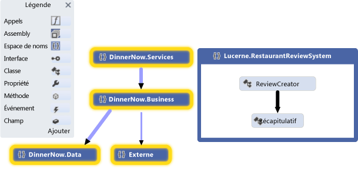

 **Carte de code des espaces de noms**

 Le développeur développe les espaces de noms sélectionnés pour en voir les classes, les méthodes et les relations :

 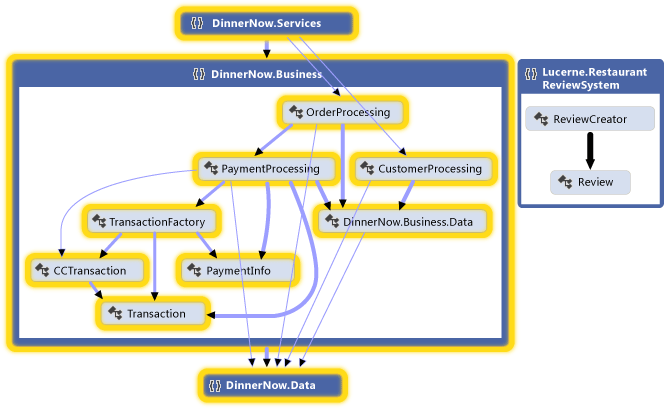

 **Carte de code des espaces de noms développée avec les liens entre les groupes**

 Le développeur examine le code pour trouver les classes et méthodes affectées. Pour voir les effets de chaque modification apportée, régénérez les cartes de code après chaque modification. Consultez visualiser le [code](../modeling/visualize-code.md).

 Pour décrire les modifications apportées à d’autres parties du système, notamment les composants ou les interactions, l’équipe peut dessiner ces éléments sur des tableaux blancs. Elle peut également dessiner les diagrammes suivants dans Visual Studio pour que les détails puissent être capturés, gérés et compris par les deux équipes :

|**Diagrammes**|**Éléments décrits**|
|-|-|
|*Diagramme de classes basé sur le code*   Consultez [Guide pratique pour ajouter des diagrammes de classes aux projets (Concepteur de classes)](../ide/class-designer/how-to-add-class-diagrams-to-projects.md).|Classes existantes dans le code.|

###  Assurer la cohérence du code avec la conception
 Dinner Now doit s’assurer que le code mis à jour demeure cohérent avec la conception. Ils créent des diagrammes de dépendance qui décrivent les couches de fonctionnalité dans le système, spécifient les dépendances autorisées entre eux et associent des artefacts de solution à ces couches.

|**Diagramme**|**Éléments décrits**|
|-|-|
|*Diagramme de dépendance*   Consultez l'article :   - [Créer des diagrammes de dépendance à partir de votre code](../modeling/create-layer-diagrams-from-your-code.md) - [Diagrammes de dépendance : référence](../modeling/layer-diagrams-reference.md) - [Diagrammes de dépendance : indications](../modeling/layer-diagrams-guidelines.md) - [Valider du code avec des diagrammes de dépendance](../modeling/validate-code-with-layer-diagrams.md)|Architecture logique du code.   Un diagramme de dépendance organise et mappe les artefacts d’une solution Visual Studio à des groupes abstraits appelés *couches*. Ces couches identifient les rôles, les tâches ou les fonctions que ces artefacts effectuent dans le système.   Les diagrammes de dépendance sont utiles pour décrire la conception prévue du système et valider le code en constante évolution par rapport à cette conception.   Pour créer des couches, faites glisser des éléments à partir de l’Explorateur de solutions, des cartes de code, de l’affichage de classes et de l’Explorateur d’objets. Pour dessiner de nouvelles couches, utilisez la boîte à outils ou cliquez avec le bouton droit sur la surface du diagramme.   Pour afficher les dépendances existantes, cliquez avec le bouton droit sur la surface du diagramme de dépendance, puis cliquez sur **générer des dépendances**. Pour spécifier les dépendances prévues, dessinez de nouvelles dépendances.|

Par exemple, le diagramme de dépendance suivant décrit les dépendances entre les couches et le nombre d’artefacts associés à chaque couche :

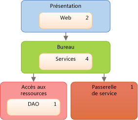

 **Diagramme de dépendance**

Pour vous assurer que les conflits avec la conception ne se produisent pas pendant le développement du code, les équipes utilisent la validation des dépendances sur les builds exécutées sur Azure DevOps. Ils créent également une tâche MSBuild personnalisée pour exiger la validation de dépendance dans leurs opérations d’archivage. Elles utilisent des rapports de build pour collecter les erreurs de validation.

Consultez l'article :

- [Utiliser le concepteur visuel](/azure/devops/pipelines/get-started-designer)

- [Archivage contrôlé TFVC](/azure/devops/pipelines/build/triggers)

- [Tâches de génération et de mise en production](/azure/devops/pipelines/tasks/index)

### Conseils généraux sur la création et l’utilisation de modèles

- La plupart des diagrammes sont constitués de nœuds connectés par des lignes. Pour chaque type de diagramme, la boîte à outils fournit différents types de nœuds et de lignes.

   Pour ouvrir la boîte à outils, dans le menu **Affichage** , cliquez sur **Boîte à outils**.

- Pour créer un nœud, faites-le glisser de la boîte à outils vers le diagramme. Certains types de nœuds doivent être déplacés vers des nœuds existants. Par exemple, sur un diagramme de composant, un nouveau port doit être ajouté à un composant existant.

- Pour créer une ligne ou une connexion, cliquez sur l’outil approprié dans la boîte à outils, cliquez sur le nœud source, puis cliquez sur le nœud cible. Certaines lignes peuvent être créées uniquement entre certains types de nœuds. Quand vous déplacez le pointeur sur une source ou une cible possible, le pointeur indique si vous pouvez créer une connexion.

### Planifier et suivre le travail

Des diagrammes de modélisation Visual Studio sont intégrés à Team Foundation Server pour que vous puissiez planifier, gérer et suivre le travail plus facilement. Les deux équipes utilisent des modèles pour identifier des cas de test et des tâches de développement, et pour estimer leur travail. Lucerne crée des éléments de travail Team Foundation Server et les lie à des éléments de modèle,tels que des cas d’usage ou des composants. Ainsi, les équipes peuvent suivre leur progression et tracer le travail par rapport aux besoins des utilisateurs. Elles peuvent mieux contrôler le maintien de la cohérence des modifications avec ces besoins.

Au fur et à mesure que le travail avance, les équipes mettent à jour leurs éléments de travail pour prendre en compte le temps dévolu à leurs tâches. Elles surveillent et signalent également l’état de leur travail en utilisant les fonctionnalités Team Foundation Server suivantes :

- *Rapports d’avancement* quotidiens qui indiquent s’ils effectuent le travail planifié dans le temps prévu. Les équipes génèrent d’autres rapports similaires à partir de Team Foundation Server pour suivre la progression des bogues.

- Une *feuille de calcul d’itération* qui utilise Microsoft Excel pour aider les équipes à surveiller et équilibrer la charge de travail entre ses membres. Cette feuille de calcul est liée à Team Foundation Server et fournit le thème de discussion lors des réunions d’avancement régulières.

- Un *tableau de bord de développement* qui utilise Office Project pour tenir l’équipe informée sur les points importants du projet.

Consultez l'article :

- [À propos des outils agile et de la gestion de projet agile](/azure/devops/boards/backlogs/backlogs-overview?view=vsts&preserve-view=true)

- [Graphiques, tableaux de bord et widgets (Azure DevOps Services)](/azure/devops/report/dashboards/overview?view=vsts&preserve-view=true)

- [Créer votre journal des travaux en souffrance et vos tâches à l'aide de Project](/azure/devops/boards/backlogs/office/create-your-backlog-tasks-using-project)

###  Test, validation et archivage du code

À mesure que les équipes effectuent chaque tâche, elles vérifient leur code dans le contrôle de code source et reçoivent des rappels de Team Foundation Server, si elles l’oublient. Avant que Team Foundation Server n’accepte leurs archivages, les équipes exécutent des tests unitaires et la validation des dépendances pour vérifier le code par rapport à leurs cas de test et à la conception. Ils utilisent Team Foundation Server pour exécuter régulièrement des builds, des tests unitaires automatisés et la validation des dépendances. Ainsi, elles vérifient que le code respecte les critères suivants :

- Il fonctionne.

- Il n’empêche pas du code opérationnel existant de fonctionner.

- Il n’entre pas en conflit avec la conception.

Dinner Now possède une grande collection de tests automatisés. Lucerne peut réutiliser ces tests, car ils sont presque tous encore applicables. Lucerne peut également s’appuyer sur ces tests et en ajouter de nouveaux pour couvrir les nouvelles fonctionnalités. Les deux sociétés utilisent également Visual Studio pour exécuter des tests manuels.

Pour vous assurer que le code est conforme à la conception, les équipes configurent leurs builds dans Azure DevOps pour inclure la validation des dépendances. En cas de conflit, un rapport détaillé est généré.

Consultez l'article :

- [Test de l’application](/azure/devops/test/overview?view=vsts&preserve-view=true)

- [Validation de votre système pendant le développement](../modeling/validate-your-system-during-development.md)

- [Utiliser le contrôle de version](/azure/devops/repos/tfvc/overview?view=azure-devops&preserve-view=true)

- [Azure Pipelines](/azure/devops/pipelines/index?view=vsts&preserve-view=true)

## Mettre à jour le système à l’aide de la visualisation et de la modélisation

Lucerne et Dinner Now doivent intégrer leurs systèmes de paiement. Les sections suivantes présentent les diagrammes de modélisation dans Visual Studio qui les aident à effectuer cette tâche :

- [Visualiser le code existant : cartes de code](#VisualizeCode)

- [Définir un glossaire des types : diagrammes de classes](#DefineClasses)

- [Décrire l’architecture logique : diagrammes de dépendance](#DescribeLayers)

Consultez l'article :

- [Visualiser du code](../modeling/visualize-code.md)

- [Utiliser des modèles dans votre processus de développement](../modeling/use-models-in-your-development-process.md)

- [Modéliser l’architecture de votre application](../modeling/model-your-app-s-architecture.md)

###  Visualiser le code existant : cartes de code

Les cartes de code montrent l’organisation et les relations actuelles dans le code. Les éléments sont représentés par des *nœuds* dans la carte et les relations sont représentées par des *liens*. Les cartes de code peuvent vous aider à effectuer les types de tâches suivants :

- Explorer du code méconnu.

- Comprendre où et comment une modification suggérée peut affecter du code existant.

- Rechercher des zones de complexité, des dépendances naturelles ou des modèles, ou d’autres zones qui peuvent tirer parti de l’amélioration.

Par exemple, Dinner Now doit estimer le coût de la mise à jour du composant PaymentProcessing. Ce coût dépend en partie des répercussions de cette modification sur les autres parties du système. Pour mieux déterminer ce coût, l’un des développeurs de Dinner Now génère des cartes de code à partir du code existant et ajuste la portée pour se concentrer sur les zones éventuellement concernées par la modification.

La carte suivante montre les dépendances entre la classe PaymentProcessing et d’autres parties du système Dinner Now, qui sont mises en surbrillance :

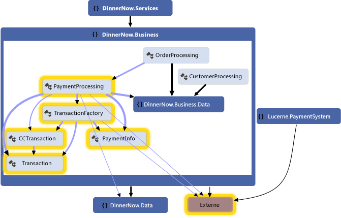

**Carte de code du système de paiement de Dinner Now**

Le développeur explore la carte en développant la classe PaymentProcessing et en sélectionnant ses membres pour voir les zones éventuellement affectées :

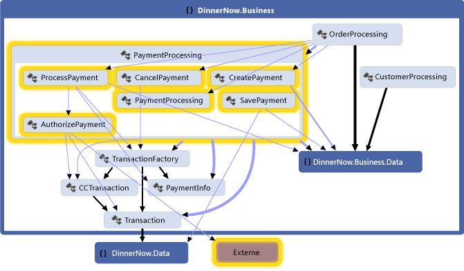

**Méthodes dans la classe PaymentProcessing et leurs dépendances**

L’équipe génère la carte suivante pour le système de paiement de Lucerne pour inspecter ses classes, méthodes et dépendances. Elle constate que le système Lucerne risque aussi de devoir être modifié pour interagir avec les autres parties de Dinner Now :

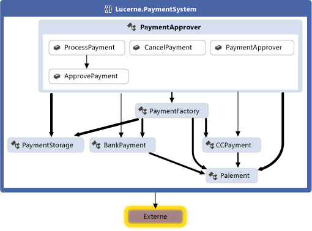

**Carte de code pour le système de paiement de Lucerne**

Les deux équipes travaillent ensemble pour déterminer les modifications requises pour intégrer les deux systèmes. Elles décident de refactoriser une partie du code pour faciliter sa mise à jour. La classe PaymentApprover est déplacée vers l’espace de noms DinnerNow.Business et nécessite quelques méthodes nouvelles. Les classes Dinner Now qui gèrent les transactions ont leur propre espace de noms. Les équipes créent et utilisent des éléments de travail pour planifier, organiser et suivre leur travail. Elles lient les éléments de travail à des éléments de modèle quand cela s’avère utile.

Après avoir réorganisé le code, les équipes génèrent une nouvelle carte de code pour voir la structure et les relations mises à jour :

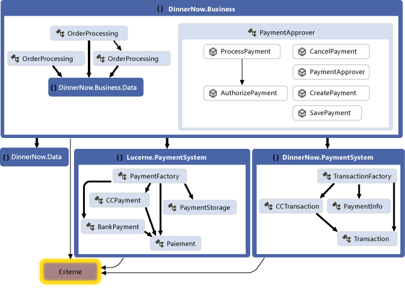

**Carte de code après la réorganisation du code**

Cette carte montre que la classe PaymentApprover se trouve maintenant dans l’espace de noms DinnerNow.Business et qu’elle comporte de nouvelles méthodes. Les classes de transaction Dinner Now ont maintenant leur propre espace de noms PaymentSystem, ce qui facilitera l’utilisation ultérieure de ce code.

#### Création d’une carte de code

- Pour obtenir un aperçu rapide du code source, générez une carte de code en procédant comme suit :

     Dans le menu **Architecture** , cliquez sur **Générer une carte du code pour la solution**.

     Pour obtenir un aperçu rapide du code compilé, créez une carte de code vide, puis faites glisser des fichiers d’assembly ou des fichiers binaires vers la surface de la carte.

- Pour explorer du code spécifique ou des éléments de solution, utilisez l’Explorateur de solutions pour sélectionner les éléments et les relations que vous voulez visualiser. Vous pouvez ensuite générer une nouvelle carte ou ajouter les éléments sélectionnés à une carte existante. Consultez [Map dependencies across your solutions](../modeling/map-dependencies-across-your-solutions.md).

- Pour explorer la carte plus facilement, réorganisez la disposition pour qu’elle corresponde aux types de tâches à effectuer.

     Par exemple, pour visualiser les couches dans le code, sélectionnez une disposition en arborescence. Consultez [Parcourir et réorganiser les cartes de code](../modeling/browse-and-rearrange-code-maps.md).

#### Résumé : atouts des cartes de code
 Les cartes de code vous aident à :

- comprendre l’organisation et les relations du code existant ;

- identifier les zones qui peuvent être affectées par une modification proposée ;

- identifier des zones de complexité, des modèles, des couches ou d’autres zones à améliorer pour rendre le code plus facile à tenir à jour, modifier et réutiliser.

#### Relation aux autres diagrammes

|**Diagramme**|**Éléments décrits**|
|-|-|
|Diagramme de dépendance|L’architecture logique du système. Utilisez la validation des dépendances pour vous assurer que le code reste cohérent avec la conception.   Pour vous aider à identifier les dépendances existantes ou les dépendances prévues, créez une carte de code et regroupez les éléments associés. Pour créer un diagramme de dépendance, consultez :   - [Créer des diagrammes de dépendance à partir de votre code](../modeling/create-layer-diagrams-from-your-code.md) - [Diagrammes de dépendance : indications](../modeling/layer-diagrams-guidelines.md)|
|Diagramme de classes (basé sur le code)|Classes existantes dans le code d’un projet spécifique.   Pour visualiser et modifier une classe existante dans le code, utilisez le Concepteur de classes.   Consultez [Guide pratique pour ajouter des diagrammes de classes aux projets (Concepteur de classes)](../ide/class-designer/how-to-add-class-diagrams-to-projects.md).|

###  Définir un glossaire de types : diagrammes de classes
 Les diagrammes de classes définissent les entités, les termes ou les concepts qui participent au système, et leurs relations. Par exemple, vous pouvez utiliser ces diagrammes pendant le développement pour décrire les attributs et les opérations de chaque classe, indépendamment de leur langage ou mode d’implémentation.

 Pour permettre à Lucerne de décrire et d’étudier les entités qui participent au cas d’usage Traiter le paiement, le diagramme suivant est dessiné :

 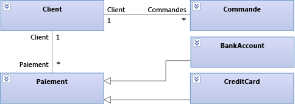

 **Entités Traiter le paiement dans un diagramme de classes**

 Ce diagramme montre qu’un client peut effectuer plusieurs commandes et utiliser différents modes de paiement pour les commandes. BankAccount et CreditCard héritent de Payment.

 Pendant le développement, Lucerne utilise le diagramme de classes suivant pour décrire et étudier les détails de chaque classe :

 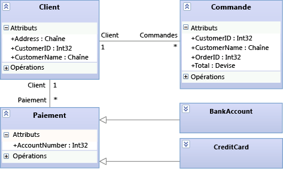

 **Détails de l’entité Traiter le paiement dans le diagramme de classes**

#### Dessin d’un diagramme de classes

Un diagramme de classes comporte les principales fonctionnalités suivantes :

- Des types, tels que des classes, des interfaces et des énumérations :

  - Une *classe* est la définition d’objets qui partagent des caractéristiques structurelles ou comportementales spécifiques.

  - Une *interface* définit une partie du comportement extérieurement visible d’un objet.

  - Une *énumération* est un classifieur qui contient une liste de valeurs littérales.

- Les *attributs* sont des valeurs d’un type donné qui décrivent chaque instance d’un *classifieur*. Un classifieur est un nom générique attribué aux types, aux composants, aux cas d’usage et même aux acteurs.

- Les *opérations* sont des méthodes ou des fonctions que les instances d’un classifieur peuvent exécuter.

- Une *association* indique une sorte de relation entre deux classifieurs.

  - Une *agrégation* est une association qui indique une propriété partagée entre des classifieurs.

  - Une *composition* est une association qui indique une relation ensemble à partie entre des classifieurs.

    Pour afficher les agrégations ou les compositions, définissez la propriété **Aggregation** sur une association. La valeur **Shared** et la valeur **Composite** affichent les agrégations et les compositions, respectivement.

- Une *dépendance* indique que la modification de la définition d’un classifieur peut modifier la définition d’un autre classifieur.

- Une *généralisation* indique qu’un classifieur spécifique hérite une partie de sa définition d’un classifieur général. Une *réalisation* indique qu’une classe implémente les opérations et attributs fournis par une interface.

     Pour créer ces relations, utilisez l’outil **Héritage** . Sinon, une réalisation peut être représentée sous forme d’interface *lollipop*.

- Les *packages* sont des groupes de classifieurs, d’associations, de lignes de vie, de composants et d’autres packages. Les relations d’*importation* indiquent qu’un package inclut toutes les définitions d’un autre package.

Pour commencer l’exploration et l’examen des classes existantes, vous pouvez utiliser le Concepteur de classes pour créer des diagrammes de classes à partir du code.

- [Guide pratique pour ajouter des diagrammes de classes aux projets (Concepteur de classes)](../ide/class-designer/how-to-add-class-diagrams-to-projects.md)

#### Résumé : atouts des diagrammes de classes
 Les diagrammes de classes vous permettent de définir :

- Un glossaire commun des termes à utiliser pour étudier les besoins des utilisateurs et les entités qui participent au système. Consultez [Configuration requise pour les utilisateurs du modèle](../modeling/model-user-requirements.md).

- Les types qui sont utilisés par des parties du système, notamment les composants, indépendamment de leur implémentation. Consultez [modéliser l’architecture de votre application](../modeling/model-your-app-s-architecture.md).

- Les relations, telles que les dépendances, entre les types. Par exemple, vous pouvez montrer qu’un type peut être associé à plusieurs instances d’un autre type.

#### Relation aux autres diagrammes

|**Diagramme**|**Description**|
|-|-|
|Diagramme de dépendance|Définit l’architecture logique du système relative aux classes.   Utilisez la validation des dépendances pour vous assurer que le code reste cohérent avec la conception.   Consultez l'article :   - [Créer des diagrammes de dépendance à partir de votre code](../modeling/create-layer-diagrams-from-your-code.md) - [Diagrammes de dépendance : référence](../modeling/layer-diagrams-reference.md) - [Diagrammes de dépendance : indications](../modeling/layer-diagrams-guidelines.md) - [Valider du code avec des diagrammes de dépendance](../modeling/validate-code-with-layer-diagrams.md)|
|Carte de code|Permet de visualiser l’organisation et les relations dans le code existant.   Pour identifier les classes, leurs relations et leurs méthodes, créez une carte de code qui montre ces éléments.   Consultez l'article :   - [Mapper les dépendances dans vos solutions](../modeling/map-dependencies-across-your-solutions.md)|

###  Décrire l’architecture logique : diagrammes de dépendance
 Les diagrammes de dépendance décrivent l’architecture logique d’un système en organisant les artefacts de votre solution en groupes abstraits ou *couches*. Les artefacts peuvent correspondre à beaucoup de choses, notamment des espaces de noms, des projets, des classes, des méthodes, etc. Les couches représentent et décrivent les rôles ou les tâches que les artefacts exécutent dans le système. Vous pouvez également inclure la validation de couche dans votre build et des opérations d’archivage pour vous assurer que le code reste cohérent avec sa conception.

 Pour garantir la cohérence du code avec la conception, Dinner Now et Lucerne utilisent le diagramme de dépendances suivant pour valider leur code à mesure qu’il évolue :

 

 **Diagramme de dépendance pour Dinner Now intégré à Lucerne**

 Les couches de ce diagramme sont liées aux artefacts de solution Dinner Now et Lucerne correspondants. Par exemple, la couche Business est liée à l’espace de noms DinnerNow.Business et à ses membres, qui incluent maintenant la classe PaymentApprover. La couche Resource Access est liée à l’espace de noms DinnerNow.Data. Les flèches, ou *dépendances*, indiquent que seule la couche Business peut utiliser la fonctionnalité dans la couche Resource Access. Quand les équipes mettent à jour leur code, une validation de couche est exécutée régulièrement pour détecter les conflits dès qu’ils se produisent et permettre aux équipes de les résoudre rapidement.

 Les équipes travaillent ensemble pour intégrer et tester progressivement les deux systèmes. Elles vérifient d’abord que PaymentApprover et le reste du système Dinner Now fonctionnent correctement ensemble avant de s’occuper du code PaymentProcessing.

 La carte de code suivante montre les nouveaux appels entre Dinner Now et PaymentApprover :

 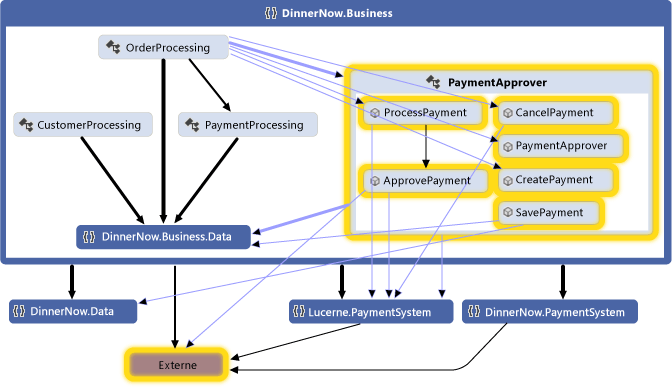

 **Carte de code avec les appels de méthode mis à jour**

 Après avoir vérifié que le système fonctionne comme prévu, Dinner Now commente le code PaymentProcessing. Les rapports de validation de couche sont satisfaisants et la carte de code obtenue indique qu’il n’existe plus aucune dépendance PaymentProcessing :

 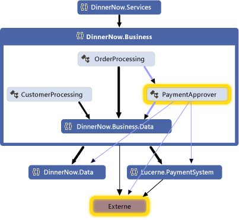

 **Carte de code sans PaymentProcessing**

#### Dessin d’un diagramme de dépendance

Un diagramme de dépendance présente les principales fonctionnalités suivantes :

- Des *couches* décrivent des groupes logiques d’artefacts.

- Un *lien* est une association entre une couche et un artefact.

     Pour créer des couches à partir d’artefacts, faites glisser des éléments depuis l’Explorateur de solutions, des cartes de code, de l’affichage de classes ou de l’Explorateur d’objets. Pour dessiner de nouvelles couches et les lier aux artefacts, utilisez la boîte à outils, ou cliquez avec le bouton droit sur la surface du diagramme pour créer les couches, puis faites glisser des éléments vers ces couches.

     Le nombre indiqué sur une couche représente le nombre d’artefacts liés à cette couche. Ces artefacts peuvent correspondre à des espaces de noms, des projets, des classes, des méthodes, etc. Quand vous analysez le nombre d’artefacts sur une couche, tenez compte des points suivants :

  - Si une couche est liée à un artefact contenant d'autres artefacts, mais n'est pas directement liée à ces autres artefacts, le nombre représentera uniquement les artefacts auxquels elle est directement liée. Toutefois, les autres artefacts sont inclus dans l'analyse pendant la validation de couche.

       Par exemple, si une couche est liée à un espace de noms unique, le nombre d'artefacts liés est égal à 1, même si l'espace de noms contient des classes. Si la couche a également des liens vers chaque classe de l'espace de noms, le nombre comprendra les classes liées.

  - Si une couche contient d'autres couches liées à des artefacts, la couche du conteneur est également liée à ces artefacts, même si le nombre indiqué sur la couche du conteneur ne comprend pas ces artefacts.

    Pour afficher les artefacts liés à une couche, cliquez avec le bouton droit sur la dépendance, puis cliquez sur **afficher les liens** pour ouvrir l’Explorateur de **couches**.

- Une *dépendance* indique qu’une couche peut utiliser la fonctionnalité d’une autre couche, mais pas l’inverse. Une *dépendance bidirectionnelle* indique qu’une couche peut utiliser la fonctionnalité d’une autre couche, et vice versa.

     Pour afficher les dépendances existantes sur le diagramme de dépendances, cliquez avec le bouton droit sur la surface du diagramme, puis cliquez sur **générer des dépendances**. Pour décrire les dépendances prévues, dessinez-en de nouvelles.

Consultez l'article :

- [Créer des diagrammes de dépendance à partir de votre code](../modeling/create-layer-diagrams-from-your-code.md)

- [Diagrammes de dépendance : référence](../modeling/layer-diagrams-reference.md)

- [Diagrammes de dépendance : recommandations](../modeling/layer-diagrams-guidelines.md)

- [Valider du code avec des diagrammes de dépendance](../modeling/validate-code-with-layer-diagrams.md)

#### Résumé : atouts des diagrammes de dépendance

Les diagrammes de dépendance vous aident à :

- décrire l’architecture logique d’un système selon les fonctionnalités de ses artefacts ;

- vérifier que le code en cours de développement est conforme à la conception spécifiée.

#### Relation aux autres diagrammes

|**Diagramme**|**Description**|
|-|-|
|Carte de code|Permet de visualiser l’organisation et les relations dans le code existant.   Pour créer des couches, générez une carte de code, puis regroupez les éléments sur la carte en tant que couches potentielles. Faites glisser les groupes de la carte vers le diagramme de dépendance.   Consultez l'article :   - [Mapper les dépendances dans vos solutions](../modeling/map-dependencies-across-your-solutions.md) - [Parcourir et réorganiser les cartes de code](../modeling/browse-and-rearrange-code-maps.md)|

## Ressources externes

|**Catégorie**|**Liens**|
|-|-|
|**Forums**|- [Outils de visualisation et de modélisation Visual Studio](https://social.msdn.microsoft.com/Forums/en-US/home?forum=vsarch) - [Kit de développement logiciel (SDK) Visual Studio Visualization and Modeling (outils DSL)](https://social.msdn.microsoft.com/Forums/home?forum=dslvsarchx)|

## Voir aussi

- [Visualiser du code](../modeling/visualize-code.md)
- [Utiliser des modèles dans votre processus de développement](../modeling/use-models-in-your-development-process.md)
- [Utiliser des modèles dans le développement Agile](/previous-versions/ff398061(v=vs.140))
- [Validation de votre système pendant le développement](../modeling/validate-your-system-during-development.md)