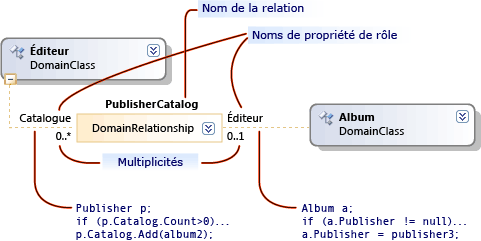

# Présentation des modèles, des classes et des relations
Un langage spécifique à un domaine (DSL) est défini par son fichier de définition DSL, ainsi que tout code de programme personnalisé que vous pouvez écrire. La majeure partie du code de programme dans la solution DSL est générée à partir de ce fichier.

 Cette rubrique décrit les fonctionnalités centrales de la définition DSL.

## Définition DSL
 Lorsque vous ouvrez `Dsl\DslDefinition.dsl` , votre fenêtre Visual Studio ressemble à l’image suivante.

 

 Les informations les plus importantes de la définition DSL s’affichent dans le diagramme de définition DSL. Des informations supplémentaires, qui font également partie de DslDefinition. DSL, s’affichent dans l’Explorateur DSL, qui apparaît généralement sur le côté du diagramme. Vous utilisez le diagramme pour les tâches les plus fréquentes et avec l’Explorateur DSL pour des personnalisations plus avancées.

 Le diagramme de définition DSL affiche les classes de domaine qui définissent des éléments de modèle, ainsi que les relations qui définissent des liens entre des éléments de modèle. Il montre également les formes et les connecteurs utilisés pour afficher les éléments de modèle pour l’utilisateur.

 

 Lorsque vous sélectionnez un élément dans la définition DSL, sur le diagramme ou dans l’Explorateur DSL, les informations le concernant s’affichent dans la Fenêtre Propriétés. Des informations supplémentaires peuvent s’afficher dans la fenêtre Détails DSL.

### Les modèles sont des instances de DSL
 Un *modèle* est une instance de votre DSL créée par un utilisateur. Un modèle contient des éléments de modèle, qui sont des instances des classes de domaine que vous définissez, et des liens entre les éléments, qui sont des instances des relations de domaine que vous définissez. Un modèle peut également avoir des formes et des connecteurs, qui affichent les éléments de modèle et les liens sur un diagramme. La définition DSL comprend les classes de forme, les classes de connecteur et une classe pour le diagramme.

 Une définition DSL est également connue sous le nom de *modèle de domaine*. Une définition DSL ou un modèle de domaine est la représentation au moment du design du langage spécifique à un domaine, tandis que le modèle est l’instanciation au moment de l’exécution du langage spécifique à un domaine.

## Les classes de domaine définissent les éléments de modèle
 Les classes de domaine sont utilisées pour créer les différents éléments dans le domaine, et les relations de domaine sont les liens entre les éléments. Il s’agit de la représentation au moment du design des éléments et des liens qui seront instanciés par les utilisateurs du langage spécifique à la conception lorsqu’ils créent leurs modèles.

 Cette illustration montre un modèle qui a été créé par l’utilisateur d’une bibliothèque musicale DSL. Les albums musicaux sont représentés par des zones qui contiennent des listes de chansons. Les artistes sont représentés par des rectangles arrondis et sont connectés aux albums auxquels ils ont participé.

 

 La définition DSL sépare deux aspects. L’apparence des éléments de modèle sur le diagramme de modèle est définie à l’aide des classes de formes et des classes de connecteur. Les informations contenues dans le modèle sont définies à l’aide des classes de domaine et des relations de domaine.

 L’illustration suivante montre les classes de domaine et les relations dans la définition DSL de la bibliothèque Music.

 

 L’illustration montre quatre classes de domaine : musique, album, artiste et chanson. Les classes de domaine définissent les propriétés de domaine, telles que le nom, le titre et ainsi de suite. Dans le modèle d’instance, les valeurs de certaines de ces propriétés sont affichées dans le diagramme.

 Entre les classes, les relations de domaine sont les suivantes : MusicHasAlbums, MusicHasArtists, AlbumbHasSongs et ArtistAppearedOnAlbums. Les relations ont des multiplicités telles que 1.. 1, 0.. *. Par exemple, chaque chanson doit être liée à un seul album par le biais de la relation AlbumHasSongs. Chaque album peut comporter un nombre quelconque de chansons.

### Réorganisation du diagramme de définition DSL
 Notez qu’une classe de domaine peut apparaître plusieurs fois dans le diagramme de définition DSL, car l’album le fait dans cette image. Il y a toujours une vue principale, et il peut y avoir des vues de *référence* .

 Pour réorganiser le diagramme de définition DSL, vous pouvez :

- Échangez les vues main et Reference à l’aide des commandes **Placer l’arborescence ici** et **fractionner l’arborescence** . Cliquez avec le bouton droit sur une classe de domaine unique pour afficher ces commandes.

- Réorganisez les classes de domaine et les classes de forme en appuyant sur CTRL + haut et Ctrl + PG.

- Réduisez ou développez les classes à l’aide de l’icône située en haut à droite de chaque forme.

- Réduisez les parties de l’arborescence en cliquant sur le signe moins (-) en bas d’une classe de domaine.

## Héritage
 Les classes de domaine peuvent être définies à l’aide de l’héritage. Pour créer une dérivation d’héritage, cliquez sur l’outil héritage, sur la classe dérivée, puis sur la classe de base. Un élément de modèle possède toutes les propriétés qui sont définies sur sa propre classe de domaine, ainsi que toutes les propriétés héritées de la classe de base. Elle hérite également de ses rôles dans les relations.

 L’héritage peut également être utilisé entre les relations, les formes et les connecteurs. L’héritage doit rester au sein du même groupe. Une forme ne peut pas hériter d’une classe de domaine.

## Relations de domaine
 Les éléments de modèle peuvent être liés par des relations. Les liens sont toujours binaires ; elles lient exactement deux éléments. Toutefois, tout élément peut avoir de nombreux liens vers d’autres objets, et il peut même y avoir plusieurs liens entre la même paire d’éléments.

 Tout comme vous pouvez définir différentes classes d’éléments, vous pouvez définir différentes classes de liens. La classe d’un lien est appelée *relation de domaine*. Une relation de domaine spécifie les classes d’éléments que ses instances peuvent connecter. Chaque terminaison d’une relation est appelée un *rôle*, et la relation de domaine définit des noms pour les deux rôles, ainsi que pour la relation proprement dite.

 Il existe deux types de relations de domaine : les relations d’incorporation et les relations de référence. Dans le diagramme de définition DSL, les relations d’incorporation comportent des lignes pleines à chaque rôle, et les relations de référence comportent des lignes en pointillés.

### Incorporation de relations
 Chaque élément d’un modèle, à l’exception de sa racine, est la cible d’un lien d’incorporation. Par conséquent, l’ensemble du modèle constitue une arborescence unique de liens d’incorporation. Une relation d’incorporation représente une relation contenant-contenu ou propriété. Deux éléments de modèle qui sont associés de cette façon sont également appelés parent et enfant. L’enfant est dit incorporé dans le parent.

 Les liens d’incorporation ne sont généralement pas affichés explicitement comme connecteurs sur un diagramme. Au lieu de cela, elles sont généralement représentées par la relation contenant-contenu. La racine du modèle est représentée par le diagramme, et les éléments incorporés dans celui-ci sont affichés sous forme de formes sur le diagramme.

 Dans l’exemple, la classe racine Music a une relation d’incorporation MusicHasAlbums à album, qui a une AlbumHasSongs d’incorporation à la chanson. Les chansons s’affichent sous la forme d’éléments dans une liste à l’intérieur de chaque album. Music intègre également une MusicHasArtists à la classe Artist, dont les instances apparaissent également sous forme de formes sur le diagramme.

 Par défaut, les éléments incorporés sont automatiquement supprimés lors de la suppression de leurs parents.

 Quand un modèle est enregistré dans un fichier au format XML, les éléments incorporés sont imbriqués dans leurs parents, à moins que vous n’ayez personnalisé la sérialisation.

> [!NOTE]
> L'incorporation n'est pas la même chose que l'héritage. Les enfants d’une relation d’incorporation n’héritent pas des propriétés du parent. Une incorporation est un type de lien entre des éléments de modèle. L’héritage est une relation entre les classes et ne crée pas de liens entre les éléments de modèle.

### Règles d’incorporation
 Chaque élément d’un modèle d’instance doit être la cible d’un seul lien d’incorporation, à l’exception de la racine du modèle.

 Par conséquent, chaque classe de domaine non abstraite, à l’exception de la classe racine, doit être la cible d’au moins une relation d’incorporation, ou elle doit hériter d’une incorporation d’une classe de base. Une classe peut être la cible d’au moins deux incorporations, mais ses éléments de modèle d’instance ne peuvent avoir qu’un seul parent à la fois. La multiplicité de la cible à la source doit être 0.. 1 ou 1.. 1.

### L’Explorateur affiche l’arborescence d’incorporation
 Votre définition DSL crée également un explorateur, que les utilisateurs voient à côté de leur diagramme de modèle.

 

 L’Explorateur affiche tous les éléments du modèle, y compris ceux pour lesquels vous n’avez défini aucune forme. Il montre les éléments et les relations d’incorporation, mais pas les relations de référence.

 Pour afficher les valeurs des propriétés de domaine d’un élément, l’utilisateur sélectionne un élément, dans le diagramme de modèle ou dans l’Explorateur de modèles, et ouvre le Fenêtre Propriétés. Elle affiche toutes les propriétés de domaine, y compris celles qui ne sont pas affichées dans le diagramme. Dans l’exemple, chaque chanson a à la fois un titre et un genre, mais seule la valeur du titre est indiquée sur le diagramme.

## Relations de référence
 Une relation de référence représente tout type de relation qui n’est pas incorporée.

 Les relations de référence sont généralement affichées sur un diagramme sous forme de connecteurs entre les formes.

 Dans la représentation XML du modèle, un lien de référence entre deux éléments est représenté à l’aide de *monikers.* Autrement dit, les monikers sont des noms qui identifient de façon unique chaque élément dans le modèle. Le nœud XML de chaque élément de modèle contient un nœud qui spécifie le nom de la relation et le moniker de l’autre élément.

## Rôles
 Chaque relation de domaine a deux rôles : un rôle source et un rôle cible.

 Dans l’image suivante, la ligne entre la classe de domaine de l' **éditeur** et la relation de domaine **PublisherCatalog** est le rôle source. La ligne entre la relation de domaine et la classe de domaine de l' **album** est le rôle cible.

 

 Les noms associés à une relation sont particulièrement importants lorsque vous écrivez du code de programme qui traverse le modèle. Par exemple, lorsque vous générez la solution DSL, le serveur de publication de classe généré possède un catalogue de propriétés qui est une collection d’albums. L’album de classe a un éditeur de propriétés qui est une instance unique de l’éditeur de classe.

 Lorsque vous créez une relation dans une définition DSL, les noms de propriété et de relation reçoivent des valeurs par défaut. Toutefois, vous pouvez les modifier.

## Multiplicités
 Les multiplicités spécifient le nombre d’éléments qui peuvent avoir le même rôle dans une relation de domaine. Dans l’exemple, le paramètre de multiplicité zéro-à-plusieurs (0... \* ) sur le rôle de **catalogue** spécifie qu’une instance de la classe de domaine de l' **éditeur** peut avoir autant de liens de relation **PublisherCatalog** que vous le souhaitez.

 Configurez la multiplicité d’un rôle en tapant sur le diagramme ou en modifiant la `Multiplicity` propriété dans la fenêtre **Propriétés** . Le tableau suivant décrit les paramètres de cette propriété.

|Type de multiplicité|Description|
|-|-|
|0.. * (zéro à plusieurs)|Chaque instance de la classe de domaine peut avoir plusieurs instances de la relation ou aucune instance de la relation.|
|0.. 1 (zéro à un)|Chaque instance de la classe de domaine ne peut avoir qu’une seule instance de la relation ou aucune instance de la relation.|
|1.. 1 (un)|Chaque instance de la classe de domaine peut avoir une instance de la relation. Vous ne pouvez pas créer plus d’une instance de cette relation à partir de n’importe quelle instance de la classe Role. Si la validation est activée, une erreur de validation s’affiche quand une instance de la classe de rôle n’a aucune instance de la relation.|
|1.. * (un-à-plusieurs)|Chaque instance de la classe sur le rôle qui a cette multiplicité peut avoir plusieurs instances de la relation, et chaque instance doit avoir au moins une instance de la relation. Si la validation est activée, une erreur de validation s’affiche quand une instance de la classe de rôle n’a aucune instance de la relation.|

## Relations de domaine en tant que classes
 Un lien est représenté dans le magasin sous la forme d’une instance de LinkElement, qui est une classe dérivée de ModelElement. Vous pouvez définir ces propriétés dans le diagramme de modèle de domaine sur les relations de domaine.

 Vous pouvez également définir une relation comme source ou cible d’autres relations. Dans le diagramme de modèle de domaine, cliquez avec le bouton droit sur la relation de domaine, puis cliquez sur **afficher en tant que classe**. Une zone de classe supplémentaire s’affiche. Vous pouvez ensuite y connecter des relations.

 Vous pouvez définir une relation en partie par héritage, comme vous le feriez avec des classes de domaine. Sélectionnez la relation dérivée et définissez la **relation de base** dans la fenêtre Propriétés.

 Une relation dérivée spécialise sa relation de base. Les classes de domaine qu’il lie doivent être dérivées de ou de la même façon que les classes liées par la relation de base. Lorsqu’un lien de la relation dérivée est créé dans un modèle, il s’agit d’une instance des relations de base et dérivées. Dans le code de programme, vous pouvez accéder à l’extrémité opposée du lien à l’aide des propriétés générées par la base ou par la classe dérivée.

## Voir aussi

- [Glossaire des Outils Domain-Specific Language](/previous-versions/bb126564(v=vs.100))