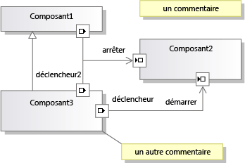

# <a name="understanding-the-dsl-code"></a>Fonctionnement du code DSL

Une solution DSL (Domain-Specific Language) génère une API que vous pouvez utiliser pour lire et mettre à jour des instances de la DSL dans Visual Studio. Cette API est définie dans le code généré à partir de la définition DSL. Cette rubrique décrit l'API générée.

## <a name="the-example-solution-component-diagrams"></a>Exemple de solution : diagrammes de composants

Pour créer la solution qui est la source de la plupart des exemples de cette rubrique, créez un DSL à partir du modèle de solution **modèles de composants** . Il s'agit de l'un des modèles standard qui apparaissent quand vous créez une solution DSL.

> [!NOTE]
> Le modèle DSL diagrammes de composants est appelé **Concepteur Domain-specific language**.

Appuyez sur **F5** et expérimentez si vous n’êtes pas familiarisé avec ce modèle de solution. Notez en particulier que pour créer des ports, vous devez faire glisser un outil « port » sur un composant et que vous pouvez connecter des ports.



## <a name="the-structure-of-the-dsl-solution"></a>Structure de la solution DSL
 Le projet **DSL** définit l’API pour votre DSL. Le projet **DslPackage** définit la manière dont il s’intègre à Visual Studio. Vous pouvez aussi ajouter vos propres projets, qui peuvent également contenir du code généré à partir du modèle.

### <a name="the-code-directories"></a>Les répertoires de code
 La majeure partie du code de chacun de ces projets est générée à partir de **Dsl\DslDefinition.DSL**. Le code généré se trouve dans le dossier de **code généré** . Pour afficher un fichier généré, cliquez sur **[+]** en regard du fichier Generation **. TT** .

 Nous vous recommandons d'inspecter le code généré pour mieux comprendre le DSL. Pour afficher les fichiers générés, développez les fichiers *.tt dans l'Explorateur de solutions.

 Les \* fichiers. TT contiennent très peu de code de génération. Au lieu de cela, ils utilisent des directives `<#include>` pour inclure des fichiers de modèles partagés. Les fichiers partagés se trouvent dans **\Program Files\Microsoft Visual Studio 10.0 \ COMMON7\IDE\EXTENSIONS\MICROSOFT\DSL SDK\DSL Designer\11.0\TextTemplates**

 Quand vous ajoutez votre propre code de programme à la solution DSL, ajoutez-le dans un fichier distinct, en dehors du dossier Generated Code. Vous souhaiterez peut-être créer un dossier de **code personnalisé** . (Quand vous ajoutez un nouveau fichier de code à un dossier personnalisé, n'oubliez pas de corriger l'espace de noms dans le squelette de code initial.)

 Nous vous recommandons vivement de ne pas modifier le code généré directement, car vos modifications seront perdues quand vous regénérerez la solution. Au lieu de cela, pour personnaliser votre DSL :

- Ajustez les nombreux paramètres dans la définition DSL.

- Écrivez des classes partielles dans des fichiers de code distincts pour substituer les méthodes qui sont définies dans, ou héritées par, les classes générées. Dans certains cas, vous devez définir l’option **génère une double dérivée** d’une classe dans la définition DSL, afin de pouvoir substituer une méthode générée.

- Définissez les options de la définition DSL qui obligent le code généré à fournir des « hooks » pour votre propre code.

     Par exemple, si vous définissez l’option **a un constructeur personnalisé** d’une classe de domaine, puis générez la solution, des messages d’erreur s’affichent. Quand vous double-cliquez sur l'un de ces messages d'erreur, des commentaires s'affichent dans le code généré pour expliquer ce que votre code personnalisé doit fournir.

- Écrivez vos propres modèles de texte pour générer du code spécifique à votre application. Vous pouvez utiliser des fichiers include pour partager des parties des modèles qui sont communes à de nombreux projets, et vous pouvez créer des modèles de projet Visual Studio pour configurer des projets qui sont initialisés avec votre propre structure de fichiers.

## <a name="generated-files-in-dsl"></a>Fichiers générés dans la solution DSL
 Les fichiers générés suivants apparaissent dans le projet **DSL** .

 *YourDsl*`Schema.xsd`

 Schéma pour les fichiers qui contient les instances de votre DSL. Ce fichier est copié dans le répertoire de compilation (**bin**). Lorsque vous installez votre DSL, vous pouvez copier ce fichier dans **\Program Files\Microsoft Visual Studio 11.0 \ Xml\Schemas** pour que les fichiers de modèle puissent être validés. Pour plus d’informations, consultez [Déploiement de solutions de langage spécifique à un domaine](msi-and-vsix-deployment-of-a-dsl.md).

 Si vous personnalisez la sérialisation en définissant des options dans l'Explorateur DSL, le schéma changera en conséquence. Toutefois, si vous écrivez votre propre code de sérialisation, ce fichier peut ne plus représenter le schéma réel. Pour plus d’informations, consultez [Personnalisation du stockage de fichiers et SÉRIALISATION XML](../modeling/customizing-file-storage-and-xml-serialization.md).

 `ConnectionBuilders.cs`

 Un générateur de connexion est une classe qui crée des relations. Il s'agit du code derrière un outil de connexion. Ce fichier contient une paire de classes pour chaque outil de connexion. Leurs noms sont dérivés des noms de la relation de domaine et de l’outil de connexion : le générateur de *relations* et *connectortool* ConnectAction.

 (Dans l'exemple de solution de composant, l'un des générateurs de connexions se nomme ConnectionBuilder. Il s'agit d'une coïncidence, car la relation de domaine se nomme Connection.)

 La relation est créée dans la méthode *Relationship* `Builder.Connect()` . La version par défaut vérifie que les éléments de modèle cibles et sources sont acceptables, puis elle instancie la relation. Exemple :

 `CommentReferencesSubject(sourceAccepted, targetAccepted);`

 Chaque classe de générateur est générée à partir d’un nœud dans la section générateurs de **connexions** de l’Explorateur DSL. Une méthode `Connect` peut créer des relations entre une ou plusieurs paires de classes de domaine. Chaque paire est définie par une directive de connexion de lien, que vous pouvez trouver dans l'Explorateur DSL sous le nœud du générateur.

 Par exemple, vous pourriez ajouter à un générateur de connexion des directives de connexion de lien pour chacun des trois types de relations dans l'exemple de DSL. L'utilisateur disposerait ainsi d'un seul outil de connexion. Le type de relation instancié dépendrait des types des éléments sources et cibles sélectionnés par l'utilisateur.  Pour ajouter des directives de connexion de lien, cliquez avec le bouton droit sur un générateur dans l'explorateur DSL.

 Pour écrire du code personnalisé qui s'exécute quand un type de relation de domaine spécifique est créé, sélectionnez la directive de connexion de lien appropriée sous le nœud du générateur. Dans le Fenêtre Propriétés, Set **utilise une connexion personnalisée**. Regénérez la solution, puis fournissez le code pour corriger les erreurs résultantes.

 Pour écrire du code personnalisé qui s’exécute chaque fois que l’utilisateur utilise cet outil de connexion, définissez la propriété **est personnalisé** du générateur de connexions. Vous pouvez fournir du code qui décide si un élément source est permis, si une combinaison spécifique de source et de cible est permise et qui détermine les mises à jour qui doivent être apportées au modèle quand une connexion est établie. Vous pourriez par exemple autoriser une connexion uniquement si elle ne crée pas de boucle dans le diagramme. Au lieu d'un lien à relation unique, vous pourriez instancier un modèle plus complexe de plusieurs éléments interconnectés entre la source et la cible.

 `Connectors.cs`

 Contient les classes pour les connecteurs, qui sont les éléments de diagramme qui représentent généralement des relations de référence. Chaque classe est générée à partir d'un connecteur dans la définition DSL. Chaque classe de connecteur est dérivée de <xref:Microsoft.VisualStudio.Modeling.Diagrams.BinaryLinkShape>.

 Pour rendre la couleur et d’autres fonctionnalités de style variables au moment de l’exécution, cliquez avec le bouton droit sur la classe dans le diagramme de définition DSL et pointez sur **Ajouter exposé**.

 Pour rendre variables d'autres fonctionnalités de style au moment de l'exécution, consultez par exemple <xref:Microsoft.VisualStudio.Modeling.Diagrams.TextField> et <xref:Microsoft.VisualStudio.Modeling.Diagrams.ShapeElement>.

 `Diagram.cs`

 Contient la classe qui définit le diagramme. Il est dérivé de <xref:Microsoft.VisualStudio.Modeling.Diagrams.Diagram>.

 Pour rendre la couleur et d’autres fonctionnalités de style variables au moment de l’exécution, cliquez avec le bouton droit sur la classe dans le diagramme de définition DSL et pointez sur **Ajouter exposé**.

 De plus, ce fichier contient la règle `FixupDiagram`, qui répond quand un nouvel élément est ajouté au modèle. La règle ajoute une nouvelle forme et relie la forme à l'élément de modèle.

 `DirectiveProcessor.cs`

 Ce processeur de directive aide vos utilisateurs à écrire des modèles de texte qui lisent une instance de votre DSL. Le processeur de directive charge les assemblys (DLL) pour votre DSL et insère des instructions `using` pour votre espace de noms. Cela permet au code dans les modèles de texte d'utiliser les classes et les relations que vous avez définies dans votre DSL.

 Pour plus d’informations, consultez [génération de code à partir d’un langage Domain-Specific](../modeling/generating-code-from-a-domain-specific-language.md) et [création de processeurs de directive de modèle de texte T4 personnalisés](../modeling/creating-custom-t4-text-template-directive-processors.md).

 `DomainClasses.cs`

 Implémentations des classes de domaine que vous avez définies, y compris les classes abstraites et la classe racine du modèle. Elles sont dérivées de <xref:Microsoft.VisualStudio.Modeling.ModelElement>.

 Chaque classe de domaine contient :

- Une définition de propriété et une classe de gestionnaire imbriquée pour chaque propriété de domaine. Vous pouvez substituer OnValueChanging() et OnValueChanged(). Pour plus d’informations, consultez [gestionnaires de modification de valeur de propriété de domaine](../modeling/domain-property-value-change-handlers.md).

   Dans l'exemple de DSL, la classe `Comment` contient une propriété `Text` et une classe de gestionnaire `TextPropertyHandler`.

- Des propriétés d'accesseurs pour les relations auxquelles cette classe de domaine participe. (Il n'y a pas de classe imbriquée pour les propriétés de rôle.)

   Dans l'exemple de DSL, la classe `Comment` à des accesseurs qui accèdent à son modèle parent par l'intermédiaire de la relation d'incorporation `ComponentModelHasComments`.

- Des constructeurs. Si vous souhaitez les remplacer, définissez a un **constructeur personnalisé** sur la classe de domaine.

- Des méthodes de gestionnaire EGP (Element Group Prototype). Ils sont nécessaires si l’utilisateur peut *fusionner* (ajouter) un autre élément sur des instances de cette classe. En général, l'utilisateur effectue pour cela une opération glisser-déplacer à partir d'un outil d'élément ou d'une autre forme, ou une opération de collage.

   Dans l'exemple de DSL, un port d'entrée ou un port de sortie peuvent être fusionnés sur un composant. De plus, des composants et des commentaires peuvent être fusionnés sur le modèle. Les

   Les méthodes de gestionnaire EGP dans la classe Components autorisent un composant à accepter des ports, mais pas des commentaires. Le gestionnaire EGP dans la classe de modèle racine accepte des commentaires et des composants, mais pas des ports.

  `DomainModel.cs`

  Classe qui représente le modèle du domaine. Il est dérivé de <xref:Microsoft.VisualStudio.Modeling.DomainModel>.

> [!NOTE]
> Elle est différente de la classe racine du modèle.

 Les fermetures Copier et Supprimer définissent les autres éléments qui doivent être inclus quand un élément est copié ou supprimé. Vous pouvez contrôler ce comportement en définissant les propriétés **propager la copie** et **propager la suppression** des rôles de chaque côté de chaque relation. Si vous voulez que les valeurs soient déterminées de manière dynamique, vous pouvez écrire du code pour substituer les méthodes des classes Closure.

 `DomainModelResx.resx`

 Ce fichier contient des chaînes telles que les descriptions des classes de domaine et des propriétés, des noms de propriétés, des étiquettes de boîte à outils, des messages d'erreur standard et d'autres chaînes qui peuvent être affichées à l'utilisateur. Il contient également des icônes d'outils et des images pour les formes d'images.

 Ce fichier est lié à l'assembly généré et fournit les valeurs par défaut de ces ressources. Vous pouvez localiser votre DSL en créant un assembly satellite qui contient une version localisée des ressources. Cette version sera utilisée lors de l'installation de la solution DSL dans une culture correspondant aux ressources localisées. Pour plus d’informations, consultez [Déploiement de solutions de langage spécifique à un domaine](msi-and-vsix-deployment-of-a-dsl.md).

 `DomainRelationships.cs`

 Chaque lien entre deux éléments dans un modèle est représentée par une instance d'une classe de relation de domaine. Toutes les classes de relations sont dérivées de <xref:Microsoft.VisualStudio.Modeling.ElementLink> qui, à son tour, est dérivée de <xref:Microsoft.VisualStudio.Modeling.ModelElement>. S'agissant d'un ModelElement, une instance d'une relation peut avoir des propriétés et peut être la source ou la cible d'une relation.

 `HelpKeywordHelper.cs`

 Fournit des fonctions qui sont utilisées quand l'utilisateur appuie sur la touche F1.

 `MultiplicityValidation.cs`

 Dans les rôles de relation où vous spécifiez une multiplicité de 1..1 ou 1..*, l'utilisateur doit être averti qu'au moins une instance de la relation est nécessaire. Ce fichier fournit des contraintes de validation qui implémentent ces avertissements. Le lien 1..1 à un parent d'incorporation n'est pas vérifié.

 Pour que ces contraintes soient exécutées, vous devez avoir défini l’une des options **uses...** dans le nœud **Editor\Validation** dans l’Explorateur DSL. Pour plus d’informations, consultez [validation dans un langage de Domain-Specific](../modeling/validation-in-a-domain-specific-language.md).

 `PropertiesGrid.cs`

 Ce fichier contient du code uniquement si vous avez attaché un descripteur de type personnalisé à une propriété de domaine. Pour plus d’informations, consultez [Personnalisation de la fenêtre Propriétés](../modeling/customizing-the-properties-window.md).

 `SerializationHelper.cs`

- Méthode de validation permettant de s'assurer que deux éléments ne sont pas référencés par le même moniker. Pour plus d’informations, consultez [Personnalisation du stockage de fichiers et SÉRIALISATION XML](../modeling/customizing-file-storage-and-xml-serialization.md).

- Classe SerializationHelper qui fournit des fonctions utilisées en commun avec les classes de sérialisation.

  `Serializer.cs`

  Classe de sérialiseur pour chaque modèle, diagramme, connecteur, forme, relation et classe de domaine.

  La plupart des fonctionnalités de ces classes peuvent être contrôlées par les paramètres dans l’Explorateur DSL sous **comportement de sérialisation XML**.

  `Shapes.cs`

  Classe pour chaque classe de forme dans la définition DSL. Les formes sont dérivées de <xref:Microsoft.VisualStudio.Modeling.Diagrams.NodeShape>. Pour plus d’informations, consultez [Personnalisation du stockage de fichiers et SÉRIALISATION XML](../modeling/customizing-file-storage-and-xml-serialization.md).

  Pour remplacer les méthodes générées par vos propres méthodes dans une classe partielle, Set **génère une valeur double dérivée** pour le connecteur dans la définition DSL. Pour remplacer un constructeur par votre propre code, Set **a un constructeur personnalisé**.

  Pour rendre la couleur et d’autres fonctionnalités de style variables au moment de l’exécution, cliquez avec le bouton droit sur la classe dans le diagramme de définition DSL et pointez sur **Ajouter exposé**.

  Pour rendre variables d'autres fonctionnalités de style au moment de l'exécution, consultez par exemple <xref:Microsoft.VisualStudio.Modeling.Diagrams.TextField> et <xref:Microsoft.VisualStudio.Modeling.Diagrams.ShapeElement>.

  `ToolboxHelper.cs`

  Configure la boîte à outils en installant des prototypes de groupes d'éléments dans les outils d'éléments. Les copies de ces prototypes sont fusionnées avec les éléments cibles quand l'utilisateur exécute l'outil.

  Vous pourriez substituer `CreateElementPrototype()` pour définir un élément de boîte à outils qui crée un groupe de plusieurs objets. Vous pourriez par exemple définir un élément pour représenter des objets ayant des sous-composants. Après avoir modifié le code, réinitialisez l’instance expérimentale de Visual Studio pour effacer le cache de la boîte à outils.

## <a name="generated-files-in-the-dslpackage-project"></a>Fichiers générés dans le projet DslPackage
 DslPackage associe le modèle DSL au shell Visual Studio, en gérant la fenêtre, la boîte à outils et les commandes de menu. La plupart des classes sont dérivées deux fois, ce qui vous permet de substituer n'importe lesquelles de leurs méthodes.

 `CommandSet.cs`

 Les commandes de menu contextuel qui sont visibles sur le diagramme. Vous pouvez adapter cet ensemble ou y ajouter des éléments. Ce fichier contient le code pour les commandes. L'emplacement des commandes dans les menus est déterminé par le fichier Commands.vsct. Pour plus d’informations, consultez [écriture de commandes et d’actions utilisateur](how-to-modify-a-standard-menu-command-in-a-domain-specific-language.md).

 `Constants.cs`

 GUID.

 `DocData.cs`

 *YourDsl* `DocData` gère le chargement et l’enregistrement d’un modèle dans un fichier et crée l’instance de magasin.

 Par exemple, si vous voulez enregistrer votre DSL dans une base de données plutôt que dans un fichier, vous pourriez substituer les méthodes `Load` et `Save`.

 `DocView.cs`

 *YourDsl* `DocView` gère la fenêtre dans laquelle le diagramme apparaît. Par exemple, vous pourriez incorporer le diagramme dans un formulaire Windows :

 Ajoutez un fichier Contrôle utilisateur au projet DslPackage. Ajoutez un panneau dans lequel le diagramme peut être affiché. Ajoutez des boutons et d'autres contrôles. Dans l'affichage de code du formulaire, ajoutez le code suivant, en ajustant les noms en fonction de votre DSL :

```csharp
using System;
using System.Collections.Generic;
using System.ComponentModel;
using System.Drawing;
using System.Data;
using System.Linq;
using System.Text;
using System.Windows.Forms;
using Microsoft.VisualStudio.Modeling;
using Microsoft.VisualStudio.Modeling.Shell;

namespace Company.EmbedInForm
{
  public partial class UserControl1 : UserControl
  {
    public UserControl1()
    {
      InitializeComponent();
    }

    private DiagramDocView docView;

    public UserControl1(DiagramDocView docView, Control content)
      : this()
    {
      this.docView = docView;
      panel1.Controls.Add(content);
    }

    private void button1_Click(object sender, EventArgs e)
    {
      ExampleModel modelRoot = this.docView.CurrentDiagram.ModelElement as ExampleModel;
      foreach (ExampleElement element in modelRoot.Elements)
      {
       listBox1.Items.Add(element.Name);
      }
    }
  }
  internal partial class EmbedInFormDocView
  {

    private ContainerControl container;

    /// <summary>
    /// Return a User Control instead of the DSL window.
    /// The user control will contain the DSL window.
    /// </summary>

    public override System.Windows.Forms.IWin32Window Window
    {
      get
      {
        if (container == null)
        {
          // Put the normal DSL Window inside our control
          container = new UserControl1(this, (Control)base.Window);
        }
        return container;
      }
    }
  }

}
```

 `EditorFactory.cs`

 Instancie `DocData` et `DocView`. Il accomplit une interface standard utilisée par Visual Studio pour ouvrir un éditeur au démarrage de votre package DSL. Il est référencé dans l'attribut `ProvideEditorFactory` dans Package.cs.

 `GeneratedVSCT.vsct`

 Localise les commandes de menu standard dans les menus, tels que le menu contextuel du diagramme, cliquez avec le bouton droit (contexte), le menu **Edition** , et ainsi de suite. Le code pour les commandes se trouve dans CommandSet.cs. Vous pouvez déplacer ou modifier les commandes standard et vous pouvez ajouter vos propres commandes. Pour plus d’informations, consultez [écriture de commandes et d’actions utilisateur](how-to-modify-a-standard-menu-command-in-a-domain-specific-language.md).

 `ModelExplorer.cs`

 Définit l'Explorateur de modèles pour votre DSL. Il s'agit de l'arborescence du modèle vue par l'utilisateur à côté du diagramme.

 Par exemple, vous pourriez substituer `InsertTreeView()` pour changer l'ordre dans lequel les éléments apparaissent dans l'Explorateur de modèles.

 Si vous souhaitez que la sélection dans l'Explorateur de modèles soit synchronisée avec la sélection du diagramme, vous pouvez utiliser le code suivant :

```csharp
protected override void OnSelectionChanged(global::System.EventArgs e)
{
base.OnSelectionChanged(e);
// get the selected element
DslModeling::ModelElement selectedElement =
this.PrimarySelection as DslModeling::ModelElement;
// Select in the model explorer
SelectInModelExplorer<YOURLANGUAGEExplorerToolWindow>(selectedElement);
}
private void SelectInModelExplorer<T>(DslModeling::ModelElement modelElement)
where T : DslShell.ModelExplorerToolWindow
{
DslShell::ModelingPackage package =
this.GetService(typeof(VSShell.Package)) as DslShell::ModelingPackage;

if (package != null)
{
// find the model explorer window
T explorerWindow = package.GetToolWindow(typeof(T), true) as T;
if (explorerWindow != null)
{
// get the tree container
DslShell.ModelExplorerTreeContainer treeContainer =
explorerWindow.TreeContainer;
// find the tree node
DslShell.ExplorerTreeNode treeNode =
treeContainer.FindNodeForElement(modelElement);
// select the node
explorerWindow.TreeContainer.ObjectModelBrowser.SelectedNode = treeNode;
}
}
}
```

 `ModelExplorerToolWindow.cs`

 Définit la fenêtre dans laquelle l'Explorateur de modèles est affiché. Gère la sélection des éléments dans l'explorateur.

 `Package.cs`

 Ce fichier définit le mode d’intégration de la solution DSL dans Visual Studio. Les attributs sur la classe de package inscrivent la solution DSL comme gestionnaire pour les fichiers ayant votre extension de fichier, définissent sa boîte à outils et définissent comment ouvrir une nouvelle fenêtre. La méthode Initialize () est appelée une fois lorsque le premier DSL est chargé dans une instance de Visual Studio.

 `Source.extension.vsixmanifest`

 Pour personnaliser ce fichier, modifiez le fichier `.tt`.

> [!WARNING]
> Si vous modifiez le fichier .tt pour inclure des ressources telles que des icônes et des images, assurez-vous que la ressource est incluse dans la build VSIX. Dans Explorateur de solutions, sélectionnez le fichier et assurez-vous que la propriété **inclure dans VSIX** est `True` .

 Ce fichier contrôle comment la solution DSL est empaquetée dans un fichier VSIX (Visual Studio Integration Extension). Pour plus d’informations, consultez [Déploiement de solutions de langage spécifique à un domaine](msi-and-vsix-deployment-of-a-dsl.md).

## <a name="see-also"></a>Voir aussi

- [Guide pratique pour définir un langage spécifique à un domaine](../modeling/how-to-define-a-domain-specific-language.md)
- [Présentation des modèles, des classes et des relations](../modeling/understanding-models-classes-and-relationships.md)
- [Personnalisation et extension d’un langage spécifique à un domaine](../modeling/customizing-and-extending-a-domain-specific-language.md)
- [Écriture de code pour personnaliser un langage de Domain-Specific](../modeling/writing-code-to-customise-a-domain-specific-language.md)
