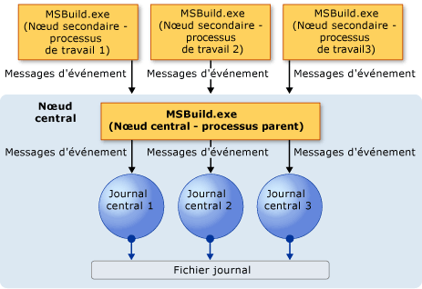
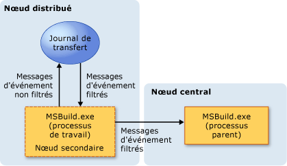

# <a name="writing-multi-processor-aware-loggers"></a>Écriture de journaux prenant en charge plusieurs processeurs
La capacité de [!INCLUDE[vstecmsbuild](../extensibility/internals/includes/vstecmsbuild_md.md)] à tirer parti de plusieurs processeurs peut accélérer le temps de génération d’un projet. Toutefois, elle rend plus complexe la journalisation des événements de build. Dans un environnement à un seul processeur, les événements, messages, avertissements et erreurs arrivent au journal (logger) de manière prévisible et séquentielle. Toutefois, dans un environnement multiprocesseur, les événements provenant de différentes sources peuvent arriver en même temps ou dans le désordre. Pour résoudre ce problème, [!INCLUDE[vstecmsbuild](../extensibility/internals/includes/vstecmsbuild_md.md)] fournit un journal multiprocesseur, ainsi qu’un nouveau modèle de journalisation, qui vous permet de créer des « journaux de transfert » personnalisés.  
  
## <a name="multi-processor-logging-challenges"></a>Difficultés liées à la journalisation multiprocesseur  
 Lorsque vous générez un ou plusieurs projets sur un système multiprocesseur ou multicœur, les événements de build [!INCLUDE[vstecmsbuild](../extensibility/internals/includes/vstecmsbuild_md.md)] de tous les projets sont générés en même temps. De très nombreux messages d’événements peuvent arriver au journal d’événements en même temps ou dans le désordre. Le journal [!INCLUDE[vstecmsbuild](../extensibility/internals/includes/vstecmsbuild_md.md)] 2.0 n’est pas conçu pour gérer cette situation. De fait, il peut saturer, et accroître la durée des générations, provoquer une sortie de journal incorrecte, voire aboutir à l’arrêt de la génération. Pour résoudre ces problèmes, le journal (à compter de [!INCLUDE[vstecmsbuild](../extensibility/internals/includes/vstecmsbuild_md.md)] 3.5) peut traiter les événements qui arrivent dans le désordre et associer les événements à leur source.  
  
 Vous pouvez améliorer l’efficacité de la journalisation en créant un journal de transfert personnalisé. Un journal de transfert personnalisé agit comme un filtre en vous permettant de sélectionner, avant la génération, les événements que vous souhaitez suivre. Lorsque vous utilisez un journal de transfert personnalisé, vous n’avez pas d’événements inutiles qui saturent le journal, polluent vos journaux ou ralentissent la génération.  
  
## <a name="multi-processor-logging-models"></a>Modèles de journalisation multiprocesseur  
 Pour répondre aux problèmes liés à la génération multiprocesseur, [!INCLUDE[vstecmsbuild](../extensibility/internals/includes/vstecmsbuild_md.md)] prend en charge deux modèles de journalisation, un centralisé et un distribué.  
  
### <a name="central-logging-model"></a>Modèle de journalisation centralisé  
 Dans le modèle de journalisation centralisé, une seule instance de MSBuild.exe agit comme « nœud central », et les instances enfants du nœud central (les « nœuds secondaires ») sont jointes au nœud central pour l’aider à effectuer les tâches de génération.  
  
   
  
 Les journaux de différents types qui sont joints au nœud central sont appelés « journaux centraux ». Une seule instance de chaque type de journal peut être jointe au nœud central.  
  
 Lors d’une génération, les nœuds secondaires routent leurs événements de build vers le nœud central. Le nœud central route tous ses événements, ainsi que ceux des nœuds secondaires, vers un ou plusieurs des journaux centraux joints. Les journaux créent ensuite les fichiers journaux qui sont basés sur les données entrantes.  
  
 Même si seul <xref:Microsoft.Build.Framework.ILogger> doit être implémenté par le journal central, nous vous recommandons d’implémenter également <xref:Microsoft.Build.Framework.INodeLogger> afin que le journal central soit initialisé avec le nombre de nœuds qui participent à la génération. La surcharge suivante de la méthode <xref:Microsoft.Build.Framework.ILogger.Initialize%2A> émet un appel lorsque le moteur initialise le journal.  
  
```csharp
public interface INodeLogger: ILogger  
{  
    public void Initialize(IEventSource eventSource, int nodeCount);  
}  
```  
  
 Tous les journaux <xref:Microsoft.Build.Framework.ILogger> existants peuvent agir comme des journaux centraux et peuvent être joints à la génération. Toutefois, les journaux centraux qui sont écrits sans prise en charge explicite des scénarios de journalisation multiprocesseur et des événements non ordonnés peuvent causer l’arrêt de la génération ou produire une sortie incorrecte.  
  
### <a name="distributed-logging-model"></a>Modèle d'enregistrement distribué  
 Dans le modèle de journalisation centralisé, un trop grand nombre de messages entrants peut saturer le nœud central, comme lorsque de nombreux projets sont générés en même temps. Cela peut provoquer une contrainte sur les ressources système et affecter les performances de génération. Pour résoudre ce problème, [!INCLUDE[vstecmsbuild](../extensibility/internals/includes/vstecmsbuild_md.md)] prend en charge un modèle de journalisation distribué.  
  
   
  
 Le modèle de journalisation distribué étend le modèle de journalisation centralisé en vous permettant de créer un journal de transfert.  
  
#### <a name="forwarding-loggers"></a>Journaux de transfert  
 Un journal de transfert est un journal léger et secondaire. Il comprend un filtre d’événement qui est joint à un nœud secondaire et qui reçoit de ce nœud des événements de build entrants. Il filtre les événements entrants et transfère uniquement ceux que vous spécifiez au nœud central. Cela réduit le trafic des messages qui sont envoyés au nœud central et améliore les performances globales de génération.  
  
 Il existe deux façons d’utiliser la journalisation distribuée :  
  
-   Personnalisez le journal de transfert prédéfini nommé <xref:Microsoft.Build.BuildEngine.ConfigurableForwardingLogger>.  
  
-   Écrivez votre propre journal de transfert personnalisé.  
  
 Vous pouvez modifier ConfigurableForwardingLogger pour l’adapter à vos besoins. Pour ce faire, appelez le journal sur la ligne de commande à l’aide de MSBuild.exe et créez une liste des événements de build que le journal doit transférer au nœud central.  
  
 En guise d’alternative, vous pouvez créer un journal de transfert personnalisé. La création d’un journal de transfert personnalisé vous permet d’ajuster le comportement du journal. Toutefois, la création d’un journal de transfert personnalisé est plus complexe que la simple personnalisation de ConfigurableForwardingLogger. Pour plus d’informations, consultez [Création de journaux de transfert](../msbuild/creating-forwarding-loggers.md).  
  
## <a name="using-the-configurableforwardinglogger-for-simple-distributed-logging"></a>Utilisation de ConfigurableForwardingLogger pour une journalisation distribuée simple  
 Pour joindre ConfigurableForwardingLogger ou un journal de transfert personnalisé, utilisez le commutateur `/distributedlogger` (`/dl`, en abrégé) dans une build de ligne de commande MSBuild.exe. Le format de nom des types et des classes du journal est le même que celui du commutateur `/logger`, sauf qu’un journal distribué a toujours deux classes de journalisation au lieu d’une : le journal de transfert et le journal central. Voici un exemple dans lequel est joint un journal de transfert personnalisé nommé XMLForwardingLogger.  
  
```cmd  
msbuild.exe myproj.proj/distributedlogger:XMLCentralLogger,MyLogger,Version=1.0.2,Culture=neutral*XMLForwardingLogger,MyLogger,Version=1.0.2,Culture=neutral  
```  
  
> [!NOTE]
>  Un astérisque (*) doit séparer les deux noms de journaux dans le commutateur `/dl`.  
  
 L’utilisation de ConfigurableForwardingLogger est similaire à celle des autres journaux (comme décrit dans [Obtention de journaux de génération](../msbuild/obtaining-build-logs-with-msbuild.md)), sauf que vous joignez le journal ConfigurableForwardingLogger au lieu du journal [!INCLUDE[vstecmsbuild](../extensibility/internals/includes/vstecmsbuild_md.md)] type, et que vous spécifiez, comme paramètres, les événements que ConfigurableForwardingLogger doit passer au nœud central.  
  
 Par exemple, si vous souhaitez être averti uniquement au début et à la fin d’une génération, et lorsqu’une erreur se produit, vous pouvez passer `BUILDSTARTEDEVENT`, `BUILDFINISHEDEVENT` et `ERROREVENT` comme paramètres. Pour passer plusieurs paramètres, séparez-les par des points-virgules. Voici un exemple d’utilisation de ConfigurableForwardingLogger pour transférer uniquement les événements `BUILDSTARTEDEVENT`, `BUILDFINISHEDEVENT` et `ERROREVENT`.  
  
```cmd  
msbuild.exe myproj.proj /distributedlogger:XMLCentralLogger,MyLogger,Version=1.0.2,Culture=neutral*ConfigureableForwardingLogger,C:\My.dll;BUILDSTARTEDEVENT; BUILDFINISHEDEVENT;ERROREVENT  
```  
  
 Voici la liste des paramètres disponibles pour ConfigurableForwardingLogger.  
  
|Paramètres de ConfigurableForwardingLogger|  
|---------------------------------------------|  
|BUILDSTARTEDEVENT|  
|BUILDFINISHEDEVENT|  
|PROJECTSTARTEDEVENT|  
|PROJECTFINISHEDEVENT|  
|TARGETSTARTEDEVENT|  
|TARGETFINISHEDEVENT|  
|TASKSTARTEDEVENT|  
|TASKFINISHEDEVENT|  
|ERROREVENT|  
|WARNINGEVENT|  
|HIGHMESSAGEEVENT|  
|NORMALMESSAGEEVENT|  
|LOWMESSAGEEVENT|  
|CUSTOMEVENT|  
|COMMANDLINE|  
|PERFORMANCESUMMARY|  
|NOSUMMARY|  
|SHOWCOMMANDLINE|  
  
## <a name="see-also"></a>Voir aussi  
 [Création d’enregistreurs d’événements de transfert](../msbuild/creating-forwarding-loggers.md)