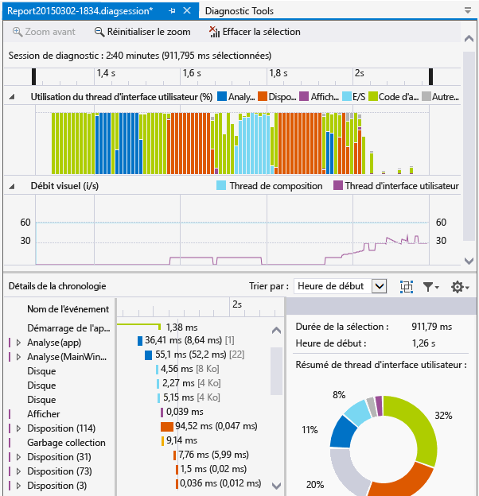
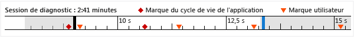
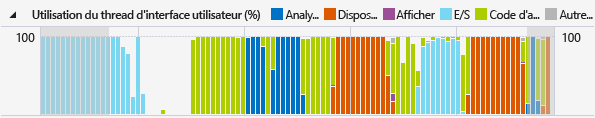
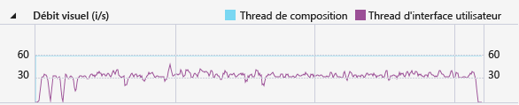

# Analyser la consommation des ressources et l’activité des threads de l’interface utilisateur (XAML)

Utilisez le profileur **Chronologie de l'application** pour rechercher et corriger les problèmes de performances liés à l'interaction d'application dans les applications XAML. Cet outil vous aide à améliorer les performances des applications XAML en montrant une vue détaillée de la consommation des ressources des applications. Vous pouvez analyser le temps passé par votre application à préparer les trames de l'interface utilisateur (mise en page et rendu), à traiter les demandes du réseau et des disques, et dans les scénarios comme le démarrage de l'application, le chargement des pages et le redimensionnement des fenêtres.

La **Chronologie de l’application** fait partie des outils que vous pouvez démarrer avec la commande **Déboguer** > **Profileur de performances**.

Cet outil remplace l'outil **Réactivité de l'interface utilisateur XAML** , qui faisait partie de l'ensemble d'outils de diagnostic pour Visual Studio 2013.

Vous pouvez utiliser cet outil sur les plateformes suivantes :

- Applications universelles Windows (sur Windows 10)
- Windows 8.1
- Windows Presentation Foundation (.Net 4.0 et ultérieur)
- Windows 7

> [!NOTE]
> Vous pouvez collecter et analyser les données d'utilisation de l'UC et les données de consommation d'énergie en même temps que les données de **Chronologie de l'application** . Consultez [exécuter les outils de profilage avec ou sans le débogueur](../profiling/running-profiling-tools-with-or-without-the-debugger.md).

## Collecter les données de chronologie de l’application

Vous pouvez profiler la réactivité de votre application sur votre ordinateur local, sur votre appareil connecté, sur le simulateur ou les émulateurs Visual Studio, ou sur un appareil distant. Consultez [exécuter les outils de profilage avec ou sans le débogueur](../profiling/running-profiling-tools-with-or-without-the-debugger.md).

> [!TIP]
> Si possible, exécutez l'application directement sur l'appareil. Les performances de l'application observées sur le simulateur ou via une connexion Bureau à distance peuvent ne pas être identiques aux performances réelles sur l'appareil. D’autre part, la collecte des données à l’aide des outils de contrôle à distance de Visual Studio n’affecte pas les données de performances.

Les étapes de base sont les suivantes :

1. Ouvrez votre application XAML.

2. Cliquez sur **Déboguer/profileur de performances**. Vous devez voir une liste des outils de profilage dans la fenêtre .diagsession.

3. Sélectionnez **Chronologie de l'application** , puis cliquez sur **Démarrer** dans le bas de la fenêtre.

   

   > [!NOTE]
   > Une fenêtre contrôle de compte d’utilisateur peut s’afficher et vous demander l’autorisation d’exécuter *VsEtwCollector.exe*. Cliquez sur **Oui**.

4. Exécutez le scénario qui vous intéresse quant au profilage dans votre application pour collecter des données de performances.

5. Pour arrêter le profilage, revenez à la fenêtre .diagsession et cliquez sur **Arrêter** dans le haut de la fenêtre.

   Visual Studio analyse les données collectées et affiche les résultats.

   

## Analyser les données de profilage de la chronologie

Après avoir collecté les données de profilage, vous pouvez utiliser ces étapes pour démarrer votre analyse :

1. Consultez les informations dans les graphiques **Utilisation du thread d’interface utilisateur** et **Débit visuel (IPS)**, puis utilisez les barres de navigation de la chronologie pour sélectionner une plage de temps à analyser.

2. À l’aide des informations des graphiques **Utilisation du thread d’interface utilisateur** ou **Débit visuel (IPS)**, examinez les détails de la vue **Détails de la chronologie** pour découvrir les causes possibles d’un manque apparent de réactivité.

###  Scénarios de rapport, catégories et événements

L'outil **Chronologie de l'application** affiche les données de la chronologie pour les scénarios, les catégories et les événements liés aux performances XAML.

###  Chronologie de session de diagnostic

La règle située en haut de la page affiche la chronologie des informations profilées. Cette chronologie s'applique aux deux graphiques **Utilisation de threads d'interface utilisateur** et **Débit visuel** . Vous pouvez limiter la portée du rapport en faisant glisser les barres de navigation sur la chronologie pour sélectionner un segment de la chronologie.

La chronologie affiche également les marques utilisateur que vous avez insérées, ainsi que les événements du cycle de vie d’activation de l’application.

###  Graphique d'utilisation du thread d'interface utilisateur

Le graphique **Utilisation des threads d'interface utilisateur (%)** est un graphique à barres qui affiche la quantité relative de temps passé dans une catégorie pendant un intervalle de collecte.

###  Graphique du débit visuel (images par seconde)

Le diagramme linéaire **Débit visuel (i/s)** montre les images par seconde (FPS) sur l'interface utilisateur et le thread de composition pour l'application.

###  Détails de la chronologie

C’est dans la vue Détails que vous passez le plus de temps à analyser le rapport. Il montre l’utilisation de l’UC par votre application, en fonction de la catégorie du sous-système du framework d’interface utilisateur ou du composant système qui a consommé l’UC.

Les événements suivants sont pris en charge :

|Nom|Description|
|-|-|
|**Analyse**|Temps passé à l'analyse de fichiers XAML et à la création d'objets.   Le développement d’un nœud **Analyse** dans **Détails de la chronologie** affiche la chaîne des dépendances de tous les fichiers XAML qui ont été analysés en raison de l’événement racine. Ceci vous permet d’identifier l’analyse de fichiers et la création d’objets inutiles dans les scénarios critiques de performances, et de les optimiser.|
|**Disposition**|Dans les grandes applications, des milliers d'éléments peuvent s'afficher en même temps sur l'écran. Ceci peut aboutir à un débit faible des images de l’interface utilisateur et à la faible réactivité de l’application qui en découle. L’événement Layout détermine avec précision le coût de la disposition de chaque élément (c’est-à-dire le temps passé dans Arrange, Measure, ApplyTemplate, ArrangeOverride et MeasureOverride). Il génère également les arborescences d’éléments visuels qui ont participé à une passe de disposition. Vous pouvez utiliser cette visualisation pour déterminer les arborescences logiques à élaguer, ou pour évaluer d’autres mécanismes de report pour optimiser votre passe de disposition.|
|**Render**|Temps passé à dessiner les éléments XAML à l'écran.|
|**E/S**|Durée de récupération de données à partir du disque local ou à partir des ressources réseau qui sont accessibles par le biais de l’ [API Microsoft Windows Internet (WinINet)](/windows/desktop/WinInet/portal).|
|**Code de l’application**|Indique le temps passé à l’exécution du code de l’application (utilisateur) qui n’est pas lié à l’analyse ou à la disposition.|
|**Autres Xaml**|Temps passé à exécuter le code du runtime XAML.|

> [!TIP]
> Choisissez l'outil **Utilisation de l'UC** ainsi que l'outil **Chronologie de l'application** quand vous démarrez le profilage pour afficher les méthodes de l'application qui s'exécutent sur le thread d'interface utilisateur. Le déplacement d'un code d'application de longue durée vers un thread d'arrière-plan peut améliorer la réactivité de l'interface utilisateur.

####  Personnalisation des détails de la chronologie

Utilisez la barre à outils **Détails de la chronologie** pour trier, filtrer et spécifier les annotations des entrées de la vue **Détails de la chronologie** .

|Nom|Description|
|-|-|
|**Trier par**|Triez par heure de début ou sur la longueur des événements.|
||Ajoute ou supprime une catégorie **Image** qui regroupe les événements par image.|
||Filtre la liste par catégories sélectionnées et longueur des événements.|
||Permet de spécifier des annotations sur les événements.|

## Voir aussi

- [Blog de l’équipe WPF : nouvel outil d’analyse des performances de l’interface utilisateur pour les applications WPF](/archive/blogs/wpf/new-ui-performance-analysis-tool-for-wpf-applications)
- [Bonnes pratiques pour les performances des applications UWP en C++, C# et Visual Basic](/previous-versions/windows/apps/hh750313\(v\=win.10\))
- [Optimiser les performances des applications WPF](/dotnet/framework/wpf/advanced/optimizing-wpf-application-performance)
- [Profilage dans Visual Studio](../profiling/index.yml)
- [Découvrir les outils de profilage](../profiling/profiling-feature-tour.md)