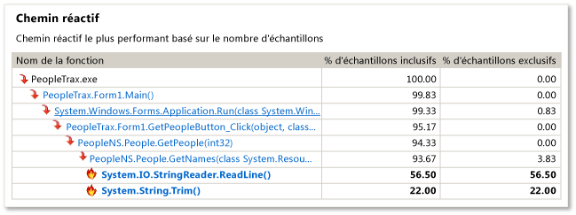
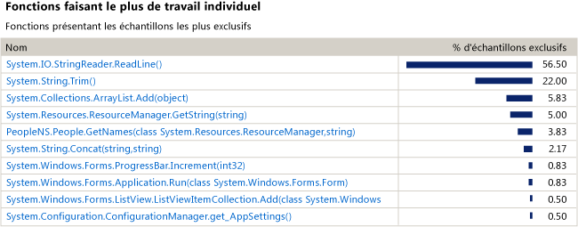
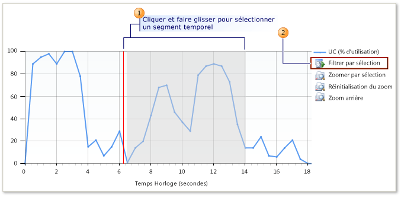

# Guide du débutant en échantillonnage de l’UC
Vous pouvez utiliser les outils de profilage de Visual Studio pour analyser les problèmes de performances dans votre application. Cette procédure montre comment utiliser des données **d’échantillonnage**.

> [!NOTE]
> Nous vous recommandons d’utiliser l’outil [Utilisation de l’UC](../profiling/beginners-guide-to-performance-profiling.md), situé dans la fenêtre Outils de diagnostics, plutôt que l’outil hérité d’échantillonnage de l’UC, sauf si vous avez besoin de fonctionnalités spécifiques comme la prise en charge de l’instrumentation.

 **L’échantillonnage** est une méthode de profilage statistique qui vous montre les fonctions permettant d’effectuer la majeure partie du travail en mode utilisateur dans l’application. L'échantillonnage est un bon point de départ pour rechercher des pistes pour accélérer votre application.

 La méthode **d’échantillonnage** collecte les informations relatives aux fonctions qui s’exécutent dans votre application aux intervalles spécifiés. Une fois que vous avez terminé une exécution de profilage, la vue **Résumé** des données de profilage affiche l’arborescence des appels de fonctions les plus actifs, appelée **chemin réactif**, où la plupart du travail de l’application a été effectué. Cette vue répertorie également les fonctions qui effectuaient le plus de travail individuel et fournit un graphique chronologique que vous pouvez utiliser pour vous concentrer sur des segments spécifiques de la session d'échantillonnage.

 Si **l’échantillonnage** ne vous fournit pas les données dont vous avez besoin, les méthodes de collecte d’autres outils de profilage fournissent des types d’informations différents qui peuvent vous être utiles. Pour plus d’informations sur ces autres méthodes, consultez [Comment : choisir des méthodes de collection](../profiling/how-to-choose-collection-methods.md).

> [!TIP]
> Si vous profilez du code qui appelle des fonctions Windows, vous devez vérifier que vous disposez des fichiers .*pdb* les plus récents. Sans ces fichiers, vos vues de rapports répertorient des noms de fonctions Windows cryptés et difficiles à comprendre. Pour plus d’informations sur la façon de s’assurer que vous disposez des fichiers dont vous avez besoin, consultez [Guide pratique pour référencer les informations de symboles Windows](../profiling/how-to-reference-windows-symbol-information.md).

## Créer et exécuter une session de performance
 Pour obtenir les données que vous devez analyser, vous devez d'abord créer une session de performance, puis exécuter cette session. **L’Assistant Performance** vous permet de faire les deux.

 Si vous ne profilez pas une application de bureau Windows ou ASP.NET, vous devez utiliser un autre outil de profilage. Consultez [Découvrir les outils de profilage](../profiling/profiling-feature-tour.md).

#### Pour créer et exécuter une session de performance

1. Ouvrez la solution dans Visual Studio. Définissez la configuration en Release. (Recherchez la zone **Configurations de solutions** de la barre d’outils, qui a par défaut la valeur **Debug**. Remplacez-la par **Release**.)

    > [!IMPORTANT]
    > Si vous n'êtes pas administrateur sur l'ordinateur que vous utilisez, vous devez exécuter Visual Studio en tant qu'administrateur lorsque vous utilisez le profileur. Cliquez avec le bouton droit sur l’icône de l’application Visual Studio, puis cliquez sur **Exécuter en tant qu’administrateur**.

2. Dans le menu **Débogage**, sélectionnez **Profileur**, puis **Profileur de performances**.

3. Cochez l’option **Assistant Performance**, puis cliquez sur **Démarrer**.

4. Cochez l’option **Échantillonnage de l’UC (recommandé)**, puis cliquez sur **Terminer**.

5. Votre application démarre et le profileur commence à collecter des données.

6. Testez les fonctionnalités qui peuvent contenir des problèmes de performances.

7. Fermez l'application normalement.

     Une fois que vous avez terminé d’exécuter l’application, la vue **Résumé** des données de profilage s’affiche dans la fenêtre principale de Visual Studio et une icône s’affiche pour la nouvelle session dans la fenêtre **Explorateur de performances**.

## Étape 2 : Analyser les données d’échantillonnage
 Lorsque vous terminez d’exécuter une session de performance, la vue **Résumé** du rapport de profilage s’affiche dans la fenêtre principale de Visual Studio.

 Nous vous recommandons de commencer à analyser vos données en examinant le **chemin réactif**, puis la liste des fonctions qui effectuent la majeure partie du travail, et enfin, en vous concentrant sur d’autres fonctions à l’aide de la **chronologie Résumé**. Vous pouvez également consulter des avertissements et des suggestions de profilage dans la fenêtre **Liste d’erreurs**.

 Notez bien que la méthode d'échantillonnage peut ne pas vous donner les informations dont vous avez besoin. Par exemple, les échantillons sont collectés uniquement lorsque l'application exécute le code du mode utilisateur. Par conséquent, certaines fonctionnalités, telles que les opérations d'entrée et de sortie, ne sont pas capturées par l'échantillonnage. Les outils de profilage fournissent plusieurs méthodes de collection qui peuvent vous permettre de vous concentrer sur les données importantes. Pour plus d’informations sur les autres méthodes, consultez [Comment : choisir des méthodes de collection](../profiling/how-to-choose-collection-methods.md).

 Chaque zone numérotée dans l'illustration est en rapport avec une étape de la procédure.

 

#### Pour analyser les données d'échantillonnage

1. Dans la vue **Résumé**, le **chemin réactif** affiche la branche de l’arborescence des appels de votre application avec les échantillons inclusifs les plus élevés. Il s’agit du chemin d’exécution qui était le plus actif au moment de la collecte des données. Les valeurs inclusives élevées peuvent indiquer que l'algorithme qui génère l'arborescence des appels peut être optimisé. Recherchez dans votre code la fonction qui se trouve au niveau le plus profond du chemin. Notez que le chemin d’accès peut également inclure des fonctions système ou des fonctions dans des modules externes.

     

    1. Les **échantillons inclusifs** indiquent la quantité de travail effectué par la fonction et toute autre fonction qu’elle a appelée. Les nombres inclusifs élevés pointent vers les fonctions qui sont généralement les plus coûteuses.

    2. Les **échantillons exclusifs** indiquent la quantité de travail effectué par le code dans le corps de la fonction, à l’exception du travail effectué par les fonctions qu’elle a appelées. Les nombres exclusifs élevés peuvent indiquer un goulot d'étranglement au niveau des performances dans la fonction elle-même.

2. Cliquez sur le nom de la fonction pour afficher la vue **Informations relatives à la fonction** des données de profilage. La vue **Informations relatives à la fonction** présente une vue graphique des données de profilage pour la fonction sélectionnée, en affichant toutes les fonctions qui ont appelé cette fonction et toutes les fonctions appelées par la fonction sélectionnée.

    - La taille des blocs des fonctions d'appel et des fonctions appelées représente la fréquence relative à laquelle les fonctions ont appelé ou ont été appelées.

    - Vous pouvez cliquer sur le nom d'une fonction d'appel ou d'une fonction appelée afin de la sélectionner dans la vue Informations relatives à la fonction.

    - Le volet inférieur des fenêtres **Informations relatives à la fonction** affiche le code de la fonction. Si vous examinez le code et recherchez une possibilité d’optimiser ses performances, cliquez sur le nom du fichier source pour ouvrir le fichier dans l’éditeur Visual Studio.

3. Pour continuer votre analyse, retournez à la vue **Résumé** en sélectionnant **Résumé** dans la liste déroulante **Vue**. Examinez ensuite les fonctions dans **Fonctions faisant le plus de travail individuel**. Cette liste affiche les fonctions avec les échantillons exclusifs les plus élevés. Le code du corps de fonction de ces fonctions a effectué un travail significatif et vous pouvez peut-être l'optimiser. Pour approfondir l’analyse d’une fonction particulière, cliquez sur le nom de la fonction afin de l’afficher dans la vue **Informations relatives à la fonction**.

     

     Pour continuer votre examen de l’exécution du profilage, vous pouvez réanalyser un segment des données de profilage en utilisant la chronologie dans la vue **Résumé** afin d’afficher le **Chemin réactif** et les **Fonctions faisant le plus de travail individuel** d’un segment sélectionné. Par exemple, si vous vous concentrez sur un pic plus petit dans la chronologie, vous pouvez noter des arborescences des appels coûteuses et des fonctions qui n’étaient pas affichées dans l’analyse de l’exécution du profilage toute entière.

     Pour réanalyser un segment, sélectionnez-le dans la zone **Chronologie Résumé**, puis cliquez sur **Filtrer par sélection**.

     

4. Le profileur utilise également un ensemble de règles pour suggérer des façons d'améliorer l'exécution du profilage et pour identifier les éventuels problèmes de performances. Si un problème est détecté, un avertissement s’affiche dans la fenêtre **Liste d’erreurs**. Pour ouvrir la fenêtre **Liste d’erreurs**, cliquez sur **Liste d’erreurs** dans le menu **Affichage**.

    - Pour voir quelle fonction a déclenché un avertissement, double-cliquez sur l’avertissement dans la vue **Informations relatives à la fonction**.

    - Pour afficher des informations détaillées sur l’avertissement, cliquez avec le bouton droit sur l’erreur, puis cliquez sur **Afficher l’aide sur l’erreur**.

## Étape 3 : Réviser le code et réexécuter une session
 Après avoir recherché et optimisé une ou plusieurs fonctions, vous pouvez répéter l'exécution du profilage et comparer les données pour afficher les différences de performances de votre application suite aux modifications que vous avez apportées.

#### Pour réviser le code et réexécuter le profileur

1. Modifiez votre code.

2. Pour ouvrir **l’Explorateur de performances**, dans le menu **Déboguer**, cliquez sur **Profileur**, sur **Explorateur de performances**, puis sur **Afficher l’Explorateur de performances**.

3. Dans **l’Explorateur de performances**, cliquez avec le bouton droit sur la session que vous voulez réexécuter, puis cliquez sur **Démarrer avec le profilage**.

4. Une fois que vous avez réexécuté la session, un autre fichier de données est ajouté au dossier *Rapports* de la session dans **l’Explorateur de performances**. Sélectionnez les données de profilage d’origine et les nouvelles données de profilage, cliquez avec le bouton droit sur la sélection, puis cliquez sur **Comparer les rapports de performances**.

     Une nouvelle fenêtre de rapport s'ouvre et affiche les résultats de la comparaison. Pour plus d’informations sur l’utilisation de la vue de comparaison, consultez [Comment : comparer des fichiers de données de performances](../profiling/how-to-compare-performance-data-files.md).

## Voir aussi
- [Explorateur de performances](../profiling/performance-explorer.md)
- [Bien démarrer](../profiling/getting-started-with-performance-tools.md)
- [Vues d'ensemble](../profiling/overviews-performance-tools.md)
- [Profilage dans Visual Studio](../profiling/index.yml)
- [Découvrir les outils de profilage](../profiling/profiling-feature-tour.md)
