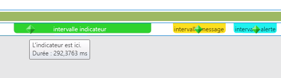
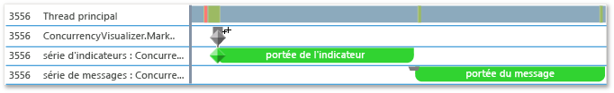
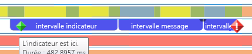
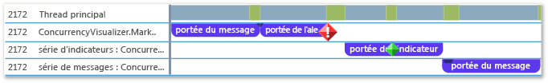

# <a name="how-to-use-the-concurrency-visualizer-markers-sdk"></a>Procédure : Utiliser le SDK des marqueurs du visualiseur concurrentiel
Cette rubrique montre comment utiliser le kit SDK du visualiseur concurrentiel pour créer des étendues et écrire des indicateurs, des messages et des alertes.

### <a name="to-use-c"></a>Pour utiliser C++

1. Ajoutez la prise en charge du kit SDK du visualiseur concurrentiel à votre application. Pour plus d’informations, consultez [Kit SDK du visualiseur concurrentiel](../profiling/concurrency-visualizer-sdk.md).

2. Ajoutez une instruction `include` et une instruction `using` pour le kit SDK.

    ```cpp
    #include <cvmarkersobj.h>
    using namespace Concurrency::diagnostic;
    ```

3. Ajoutez du code pour créer trois étendues dans la série de marqueurs par défaut et écrire un indicateur, un message et une alerte (un pour chaque étendue). Les méthodes permettant d’écrire des indicateurs, des alertes et des messages sont membres de la classe [marker_series](../profiling/marker-series-class.md). Le constructeur de la classe [span](../profiling/span-class.md) exige un objet `marker_series`, afin que chaque étendue soit associée à une série de marqueurs spécifique. Un `span` se termine quand il est supprimé.

    ```cpp
    marker_series series;
    span *flagSpan = new span(series, 1, _T("flag span"));
    series.write_flag(_T("Here is the flag."));
    delete flagSpan;

    span *messageSpan = new span(series, 2, _T("message span"));
    series.write_flag(_T("Here is the message."));
    delete messageSpan;

    span *alertSpan = new span(series, 3, _T("alert span"));
    series.write_flag(_T("Here is the alert."));
    delete alertSpan;
    ```

4. Dans la barre de menus, choisissez **Analyser**, **Visualiseur concurrentiel** et **Commencer par le projet en cours** pour exécuter l’application et afficher le visualiseur concurrentiel. L’illustration suivante montre les trois étendues et trois marqueurs dans le visualiseur concurrentiel.

     

5. Ajoutez du code pour créer des séries de marqueurs supplémentaires et personnalisés en appelant le constructeur de `marker_series` qui accepte un nom de chaîne pour la série de marqueurs.

    ```cpp
    marker_series flagSeries(_T("flag series"));
    span *flagSeriesSpan = new span(flagSeries, 1, _T("flag span"));
    flagSeries.write_flag(1, _T("flag"));
    // Sleep to even out the display in the Concurrency Visualizer.
    Sleep(50);
    delete flagSeriesSpan;

    marker_series messageSeries(_T("message series"));
    span *messageSeriesSpan = new span(messageSeries, 1, _T("message span"));
    messageSeries.write_message(1, _T("message"));
    // Sleep to even out the display in the Concurrency Visualizer.
    Sleep(50);
    delete messageSeriesSpan;
    ```

6. Démarrez le projet actuel pour afficher le visualiseur concurrentiel. Les deux séries de marqueurs s’affichent dans leurs propres couloirs dans la vue Threads. L’illustration suivante présente les deux nouvelles étendues.

     

### <a name="to-use-visual-basic-or-c"></a>Pour utiliser Visual Basic ou C\#

1. Ajoutez la prise en charge du kit SDK du visualiseur concurrentiel à votre application. Pour plus d’informations, consultez [Kit SDK du visualiseur concurrentiel](../profiling/concurrency-visualizer-sdk.md).

2. Ajoutez une instruction `using` ou `Imports` pour le kit SDK.

    ```vb
    Imports Microsoft.ConcurrencyVisualizer.Instrumentation
    ```

    ```csharp
    using Microsoft.ConcurrencyVisualizer.Instrumentation;
    ```

3. Ajoutez du code pour créer trois étendues dans la série de marqueurs par défaut et écrire un indicateur, un message et une alerte (un pour chaque étendue). Créez un objet [Span](/previous-versions/hh694189(v=vs.140)) en appelant la méthode statique `EnterSpan`. Pour écrire dans la série par défaut, utilisez les méthodes d’écriture statiques de la classe [Markers](/previous-versions/hh694099(v=vs.140)).

    ```vb
    Dim flagSpan As Span = Markers.EnterSpan("flag span")
    Markers.WriteFlag("Here is the flag.")
    flagSpan.Leave()

    Dim messageSpan As Span = Markers.EnterSpan("message span")
    ' Sleep for a millisecond to even out the display in the Concurrency Visualizer.
    System.Threading.Thread.Sleep(1)
    Markers.WriteMessage("Here is a message")
    messageSpan.Leave()

    Dim alertSpan As Span = Markers.EnterSpan("alert span")
    ' Sleep for a millisecond to even out the display in the Concurrency Visualizer.
    System.Threading.Thread.Sleep(1)
    Markers.WriteAlert("Here is an alert")
    alertSpan.Leave()
    ```

    ```csharp
    Span flagSpan = Markers.EnterSpan("flag span");
    Markers.WriteFlag("Here is the flag.");
    flagSpan.Leave();

    Span messageSpan = Markers.EnterSpan("message span");
    // Sleep for a millisecond to even out the display in the Concurrency Visualizer.
    System.Threading.Thread.Sleep(1);
    Markers.WriteMessage("Here is a message");
    messageSpan.Leave();

    Span alertSpan = Markers.EnterSpan("alert span");
    // Sleep for a millisecond to even out the display in the Concurrency Visualizer.
    System.Threading.Thread.Sleep(1);
    Markers.WriteAlert("Here is an alert");
    alertSpan.Leave();
    ```

4. Dans la barre de menus, choisissez **Analyser**, **Visualiseur concurrentiel** et **Commencer par le projet en cours** pour exécuter l’application et afficher le visualiseur concurrentiel. L’illustration suivante montre les trois étendues et les trois marqueurs dans la vue Threads du visualiseur concurrentiel.

     

5. Ajoutez du code pour créer une série de marqueurs de client à l’aide de la méthode statique [CreateMarkerSeries](/previous-versions/hh694171(v=vs.140)). La classe [MarkerSeries](/previous-versions/hh694127(v=vs.140)) contient des méthodes pour créer des étendues et écrire des indicateurs, des messages et des alertes.

    ```VB

    Dim flagSeries As MarkerSeries = Markers.DefaultWriter.CreateMarkerSeries("flag series")
    Dim flagSeriesSpan As Span = flagSeries.EnterSpan("flag span")
    System.Threading.Thread.Sleep(1)
    flagSeries.WriteFlag(1, "flag")
    System.Threading.Thread.Sleep(1)
    flagSeriesSpan.Leave()

    Dim messageSeries As MarkerSeries = Markers.DefaultWriter.CreateMarkerSeries("message series")
    Dim messageSeriesSpan As Span = messageSeries.EnterSpan("message span")
    messageSeries.WriteMessage("message")
    System.Threading.Thread.Sleep(1)
    messageSeriesSpan.Leave()
    ```

    ```csharp

    MarkerSeries flagSeries = Markers.DefaultWriter.CreateMarkerSeries("flag series");
    Span flagSeriesSpan = flagSeries.EnterSpan("flag span");
    System.Threading.Thread.Sleep(1);
    flagSeries.WriteFlag(1, "flag");
    System.Threading.Thread.Sleep(1);
    flagSeriesSpan.Leave();

    MarkerSeries messageSeries = Markers.DefaultWriter.CreateMarkerSeries("message series");
    Span messageSeriesSpan = messageSeries.EnterSpan("message span");
    messageSeries.WriteMessage("message");
    System.Threading.Thread.Sleep(1);
    messageSeriesSpan.Leave();
    ```

6. Démarrez le projet actuel pour afficher le visualiseur concurrentiel. Les trois séries de marqueurs s’affichent dans leurs propres couloirs dans la vue Threads. L’illustration suivante présente les trois nouvelles étendues.

     

## <a name="see-also"></a>Voir aussi
- [Kit SDK du visualiseur concurrentiel](../profiling/concurrency-visualizer-sdk.md)
