# Analyser l’utilisation de la mémoire sans débogage dans le profileur de performances

L’outil **Utilisation de la mémoire** permet de superviser l’utilisation de la mémoire par votre application. Vous pouvez l’utiliser pour étudier les effets en temps réel sur la mémoire des scénarios que vous développez activement dans Visual Studio. Vous pouvez prendre des instantanés des états de la mémoire de l’application, et comparer les instantanés pour trouver les causes racines des problèmes de mémoire. L’outil utilisation de la mémoire est pris en charge sur les applications .NET, ASP.NET, C++ ou en mode mixte (.NET et natif).

L’outil utilisation de la mémoire peut s’exécuter [avec ou sans le débogueur](../profiling/running-profiling-tools-with-or-without-the-debugger.md). Dans cet article, nous expliquons comment utiliser l’outil utilisation de la mémoire sans le débogueur dans le **profileur de performances** de Visual Studio, ce qui est recommandé pour les versions release.

## Sessions de diagnostic d’utilisation de la mémoire

**Pour démarrer une session de diagnostic d’utilisation de la mémoire**

1. Ouvrez un projet dans Visual Studio.

   L’outil utilisation de la mémoire prend en charge les applications .NET, ASP.NET, C++ ou en mode mixte (.NET et natif).

1. Dans le menu Déboguer, définissez la configuration de la solution sur **version finale** , puis sélectionnez **débogueur Windows local** (ou **ordinateur local** ) comme cible de déploiement.

1. Dans la barre de menus, choisissez **Déboguer** le  >  **profileur de performances** .

1. Sous **outils disponibles** , sélectionnez **utilisation** de la mémoire, puis cliquez sur **Démarrer** .

   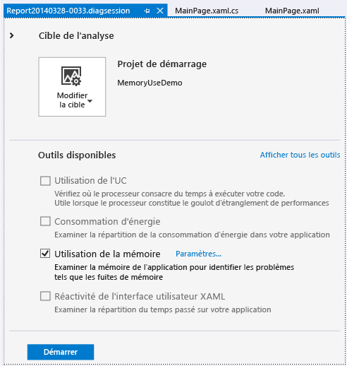

### Surveiller l'utilisation de la mémoire

Quand vous démarrez une session de diagnostic, votre application démarre et la fenêtre **outils de diagnostic** affiche un graphique chronologique de l’utilisation de la mémoire de votre application.

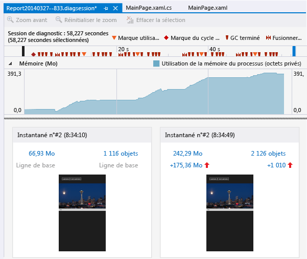

Le graphe de chronologie montre les fluctuations de la mémoire durant l’exécution de l’application. Les pointes du graphe indiquent généralement que du code collecte ou crée des données, puis les supprime une fois le traitement terminé. Les pointes prononcées indiquent des zones que vous pourriez optimiser. Une hausse de la consommation de mémoire sans retour est plus préoccupante, car elle peut indiquer une utilisation inefficace de la mémoire, voire une fuite de mémoire.

### Prendre des instantanés des états de la mémoire d’application

Une application utilise un grand nombre d’objets, et vous souhaiterez peut-être concentrer votre analyse sur un seul scénario. Ou il se peut que vous détectiez des problèmes de mémoire à examiner. Vous pouvez prendre des instantanés pendant une session de diagnostic afin de capturer l’utilisation de la mémoire à des moments précis. Il peut être utile d’avoir un instantané de référence de l’application avant qu’un problème de mémoire ne se produise, un autre instantané après la première occurrence du problème et d’autres instantanés si vous pouvez répéter le scénario.

Pour recueillir des instantanés, sélectionnez **Prendre un instantané** quand vous souhaitez capturer les données de mémoire.

###  Fermer la session de diagnostic

Pour arrêter une session de surveillance sans créer de rapport, fermez simplement la fenêtre de diagnostic. Pour générer un rapport quand vous avez terminé la collecte ou la prise d’instantanés, sélectionnez **Arrêter la collecte** .

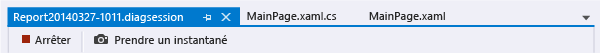

## Rapports d’utilisation de la mémoire

Une fois que vous avez arrêté la collecte des données, l’outil **Utilisation de la mémoire** arrête l’application et affiche la page de vue d’ensemble d’ **Utilisation de la mémoire** .

###  Instantanés d’utilisation de la mémoire

Les chiffres mentionnés dans les volets **Instantané** indiquent les octets et objets en mémoire quand chaque instantané a été réalisé ainsi que la différence entre cet instantané et le précédent.

Les chiffres sont des liens qui permettent d’ouvrir des vues de rapports détaillées d’ **Utilisation de la mémoire** dans de nouvelles fenêtres Visual Studio. Un [rapport de détails d’instantané](#snapshot-details-reports) montre les types et les instances d’un seul instantané. Un [rapport de différences d’instantanés](#snapshot-difference-diff-reports) compare les types et les instances de deux instantanés.

  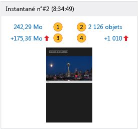

|Image|Description|
|-|-|
||Nombre total d’octets en mémoire au moment où l’instantané a été pris.   Sélectionnez ce lien pour afficher un rapport détaillé de l’instantané, trié d’après la taille totale des instances du type.|
||Nombre total d’objets en mémoire au moment où l’instantané a été pris.   Sélectionnez ce lien pour afficher un rapport détaillé de l’instantané, trié d’après le nombre total d’instances des types.|
||Différence entre la taille totale des objets mémoire dans cet instantané et l’instantané précédent.    Un nombre positif signifie que la taille en mémoire de cet instantané est supérieure à celle du précédent, et un nombre négatif signifie l’inverse. **Base de référence** signifie qu’un instantané est le premier dans une session de diagnostic. **Aucune différence** signifie que la différence est nulle.   Sélectionnez ce lien pour afficher un rapport différentiel des instantanés, trié d’après la différence de taille totale des instances des types.|
||Différence entre le nombre total d’objets mémoire dans cet instantané et l’instantané précédent.   Sélectionnez ce lien pour afficher un rapport différentiel des instantanés, trié d’après la différence du nombre total des instances des types.|

## Rapports d’instantanés d’utilisation de la mémoire

 Quand vous sélectionnez l’un des liens d’instantané dans la page de vue d’ensemble **Utilisation de la mémoire** , un rapport d’instantané s’ouvre dans une nouvelle page.

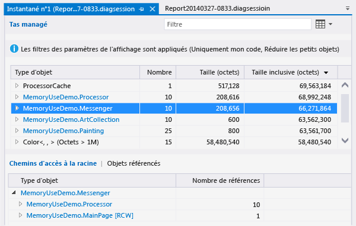

Dans un rapport d’instantané, vous pouvez développer les entrées **Type d’objet** pour afficher les entrées enfants. Les noms d'instance sont des ID uniques générés par l'outil Utilisation de la mémoire.

Si un **Type d’objet** est bleu, vous pouvez le sélectionner pour accéder à l’objet dans le code source, dans une fenêtre distincte.

Les types que vous ne pouvez pas identifier ou dont l’implication dans votre code ne comprend pas sont probablement des objets .NET, du système d’exploitation ou du compilateur. L’ outil **Utilisation de la mémoire** affiche ces objets s’ils sont impliqués dans les chaînes de propriétés de vos objets.

Dans le rapport d’instantané :

- L’arborescence **Tas managé** montre les types et instances du rapport. La sélection d’un type ou d’une instance affiche les arborescences **Chemins d’accès à la racine** et **Objets référencés** pour l’élément sélectionné.

- L’arborescence **chemins d’accès à la racine** affiche la chaîne d’objets qui référencent un type ou une instance. Le garbage collector .NET nettoie la mémoire pour un objet uniquement lorsque toutes les références à ce dernier ont été libérées.

- L’arborescence **Types référencés** ou **Objets référencés** montre les objets référencés par le type ou l’instance sélectionné.

###  Filtres des arborescences de rapport

De nombreux types dans les applications ne sont pas très intéressants pour les développeurs d’applications. Les filtres de rapport d’instantané peuvent masquer la plupart de ces types dans les arborescences **Tas managé** et **Chemins d’accès à la racine** .

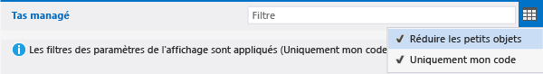

-  Pour filtrer une arborescence par nom de type, entrez le nom dans la zone **Filtre** . Le filtre ne respecte pas la casse, et il reconnaît la chaîne spécifiée dans toutes les parties du nom de type.

-  Sélectionnez **Réduire les petits objets** dans la liste déroulante **Filtre** pour masquer les types dont la **Taille (octets)** est inférieure à 0,5 % de la mémoire totale.

-  Sélectionnez **Uniquement mon code** dans la liste déroulante **Filtre** pour masquer la plupart des instances qui sont générées par du code externe. Les types externes appartiennent aux composants de framework ou de système d’exploitation, ou ils sont générés par le compilateur.

## Rapports détaillés d'instantané

 Un rapport détaillé d’instantané décrit un instantané spécifique d’une session de diagnostic. Pour ouvrir le rapport, sélectionnez le lien de taille ou d’objets dans un volet de l’instantané.

 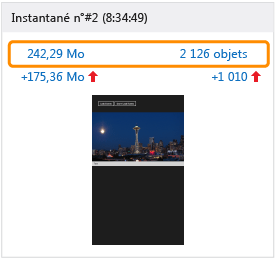

Les deux liens ouvrent le même rapport. La seule différence concerne l’ordre de tri de départ de l’arborescence **Tas managé** . Le lien de taille trie le rapport en fonction de la colonne **Taille inclusive (octets)** . Le lien d’objets trie le rapport en fonction de la colonne **Nombre** . Vous pouvez changer l’ordre ou la colonne de tri après l’ouverture du rapport.

###  Arborescence Tas managé (rapports de détails de l’instantané)
 L’arborescence **Tas managé** répertorie les types d’objets contenus dans la mémoire. Développez le nom d’un type pour afficher les dix instances du type les plus volumineuses, triées par taille. Sélectionnez un type ou une instance pour afficher les arborescences **Chemins d’accès à la racine** et **Objets référencés** pour l’élément sélectionné.

 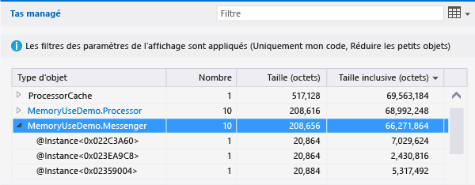

L’arborescence **Tas managé** dans un rapport détaillé d’instantané comporte les colonnes suivantes :

|Nom|Description|
|-|-|
|**Type d'objet**|Nom du type ou instance de l'objet.|
|**Count**|Nombre d'instances d'objet du type. La valeur **Nombre** est toujours égale à 1 pour une instance.|
|**Taille (octets)**|Pour un type, taille de toutes les instances du type dans l’instantané, moins la taille des objets contenus dans les instances.   Pour une instance, taille de l’objet, moins la taille des objets contenus dans l’instance. |
|**Taille inclusive (octets)**|Taille des instances du type ou taille d’une seule instance, y compris la taille des objets contenus.|
|**Module**|Module qui contient l’objet.|

###  Arborescence Chemins d’accès à la racine (rapports de détails de l’instantané)
L’arborescence **Chemins d’accès à la racine** montre la chaîne d’objets qui référencent un type ou une instance. Le garbage collector .NET nettoie la mémoire pour un objet uniquement lorsque toutes les références à ce dernier ont été libérées.

Pour un type dans l’arborescence **Chemins d’accès à la racine** , le nombre d’objets qui comportent des références à ce type est affiché dans la colonne **Nombre de références** .

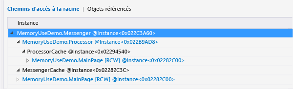

###  Arborescence Types référencés ou Objets référencés (rapports détaillés de l’instantané)
L’arborescence **Types référencés** ou **Objets référencés** montre les objets référencés par le type ou l’instance sélectionné.

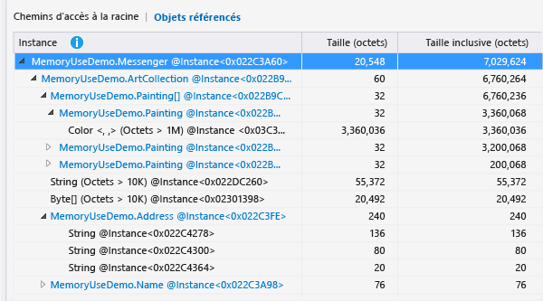

Une arborescence **Types référencés** dans un rapport détaillé d’instantané comporte les colonnes suivantes. Une arborescence **Objets référencés** n’a pas de colonne **Nombre de références** .

|Nom|Description|
|-|-|
|**Type d’objet** ou **Instance**|Nom du type ou de l’instance.|
|**Nombre de références**|Pour les types, nombre d’instances d’objets du type.|
|**Taille (octets)**|Pour un type, taille de toutes les instances du type, moins la taille des objets contenus dans le type.   Pour une instance, taille de l’objet, moins la taille des objets contenus dans l’objet.|
|**Taille inclusive (octets)**|Taille totale des instances du type ou taille de l’instance, y compris la taille des objets contenus.|
|**Module**|Module qui contient l’objet.|

## Rapports différentiels d'instantanés

Un rapport différentiel d’instantanés montre les changements entre un instantané principal et l’instantané précédent. Pour ouvrir un rapport différentiel, sélectionnez l’un des liens de différence dans un volet d’instantané.

Les deux liens ouvrent le même rapport. La seule différence concerne l’ordre de tri de départ de l’arborescence **Tas managé** dans le rapport. Le lien de taille trie le rapport en fonction de la colonne **Différence de taille inclusive (octets)** . Le lien d’objets trie le rapport en fonction de la colonne **Différence de nombre** . Vous pouvez changer l’ordre ou la colonne de tri après l’ouverture du rapport.

 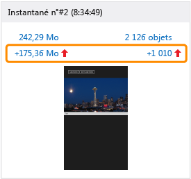

###  Arborescence Tas managé (rapports différentiels d’instantanés)

 L’arborescence **Tas managé** répertorie les types d’objets contenus dans la mémoire. Vous pouvez développer le nom d’un type pour afficher les dix instances du type les plus volumineuses, triées par taille. Sélectionnez un type ou une instance pour afficher les arborescences **Chemins d’accès à la racine** et **Objets référencés** pour l’élément sélectionné.

 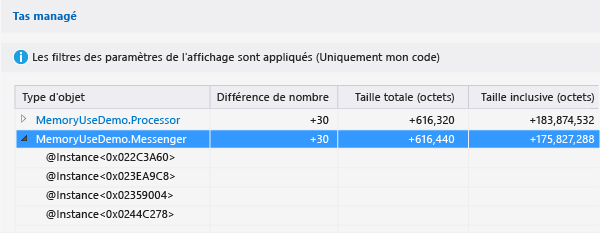

L’arborescence **Tas managé** dans un rapport différentiel d’instantanés comporte les colonnes suivantes :

|Nom|Description|
|-|-|
|**Type d'objet**|Nom du type ou instance de l'objet.|
|**Count**|Nombre d'instances d'un type dans l'instantané principal. **Count** est toujours 1 pour une instance.|
|**Différence de nombre**|Pour un type, différence du nombre d'instances du type entre l'instantané principal et l'instantané précédent. Le champ est vide pour une instance.|
|**Taille (octets)**|Taille des objets dans l’instantané principal, moins la taille des objets dans les objets. Pour un type, **Taille (octets)** et **Taille inclusive (octets)** sont les totaux des tailles des instances du type.|
|**Diff. taille totale (octets)**|Pour un type, différence de taille totale des instances du type entre l’instantané principal et l’instantané précédent, moins la taille des objets dans les instances. Le champ est vide pour une instance.|
|**Taille inclusive (octets)**|Taille des objets dans l’instantané principal, y compris la taille des objets dans les objets.|
|**Diff. de taille inclusive (octets)**|Pour un type, différence de taille de toutes les instances du type entre l’instantané principal et l’instantané précédent, y compris la taille des objets dans les objets. Le champ est vide pour une instance.|
|**Module**|Module qui contient l’objet.|

###  Arborescence Chemins d’accès à la racine (rapports différentiels d’instantanés)

L’arborescence **Chemins d’accès à la racine** montre la chaîne d’objets qui référencent un type ou une instance. Le garbage collector .NET nettoie la mémoire pour un objet uniquement lorsque toutes les références à ce dernier ont été libérées.

Pour un type dans l’arborescence **Chemins d’accès à la racine** , le nombre d’objets qui comportent des références à ce type est affiché dans la colonne **Nombre de références** . La différence de nombre par rapport à l’instantané précédent se trouve dans la colonne **Différence au niveau du nombre de références** .

 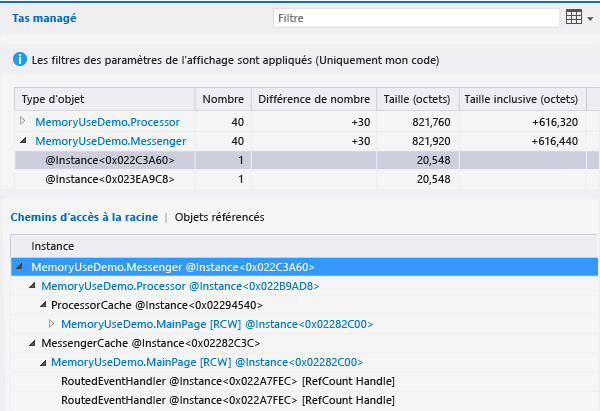

###  Arborescence Types référencés ou Objets référencés (rapports différentiels d’instantanés)

L’arborescence **Types référencés** ou **Objets référencés** montre les objets référencés par le type ou l’instance sélectionné.

Une arborescence **Types référencés** dans un rapport différentiel d’instantanés comporte les colonnes suivantes. Une arborescence **Objets référencés** comporte les colonnes **Instance** , **Taille (octets)** , **Taille Inclusive (octets)** et **Module** .

|Nom|Description|
|-|-|
|**Type d’objet** ou **Instance**|Nom du type ou instance de l'objet.|
|**Nombre de références**|Nombre d'instances d'un type dans l'instantané principal.|
|**Différence au niveau du nombre de références**|Pour un type, différence du nombre d'instances du type entre l'instantané principal et l'instantané précédent.|
|**Taille (octets)**|Taille des objets dans l’instantané principal, moins la taille des objets dans les objets. Pour un type, **Taille (octets)** et **Taille inclusive (octets)** sont les totaux des tailles des instances du type.|
|**Diff. taille totale (octets)**|Pour un type, différence de taille totale des instances du type entre l’instantané principal et l’instantané précédent, moins la taille des objets dans les instances. |
|**Taille inclusive (octets)**|Taille des objets dans l’instantané principal, y compris la taille des objets dans les objets.|
|**Diff. de taille inclusive (octets)**|Pour un type, différence de taille de toutes les instances du type entre l’instantané principal et l’instantané précédent, y compris la taille des objets dans les objets.|
|**Module**|Module qui contient l’objet.|

## Voir aussi
- [Mémoire JavaScript](../profiling/javascript-memory.md)
- [Profilage dans Visual Studio](../profiling/index.yml)
- [Découvrir les outils de profilage](../profiling/profiling-feature-tour.md)
- [Bonnes pratiques pour les performances des applications UWP en C++, C# et Visual Basic](/previous-versions/windows/apps/hh750313\(v\=win.10\))
- [Diagnostic des problèmes de mémoire avec le nouvel outil utilisation de la mémoire dans Visual Studio](https://devblogs.microsoft.com/devops/diagnosing-memory-issues-with-the-new-memory-usage-tool-in-visual-studio/)