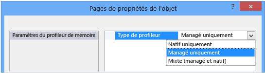
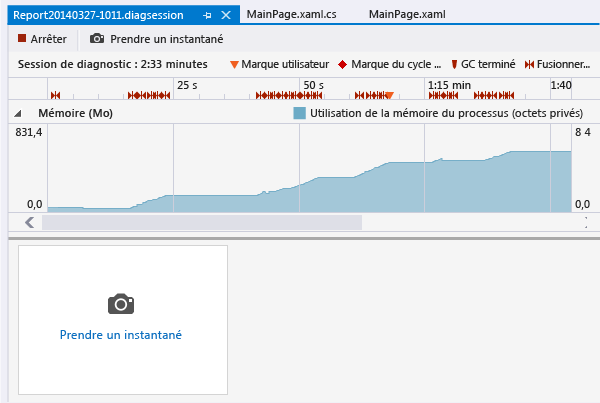

# Analyser l&#39;utilisation de la m&#233;moire des applications du Windows Store (VB, C#, C++)
[!INCLUDE[vs2017banner](../code-quality/includes/vs2017banner.md)]

Dans Visual Studio 2013 Update 2, vous pouvez utiliser l'outil Utilisation de la mémoire du hub Performances et diagnostics pour analyser l'utilisation de mémoire des applications Windows Runtime écrites en C\#, Visual Basic, ou C\+\+ et XAML.  En particulier, vous pouvez effectuer les actions suivantes :  
  
-   Surveiller l'utilisation de mémoire de vos applications directement dans Visual Studio quand vous développez un scénario.  Vous n'êtes pas obligé d'utiliser des outils système ou tiers.  
  
-   Créer des instantanés de l'état de la mémoire de vos applications en un seul clic.  
  
-   Comparer les instantanés pour trouver la cause principale des problèmes de mémoire discrets ou complexes.  
  
> [!NOTE]
>  Cette rubrique décrit comment utiliser l'outil Utilisation de la mémoire pour analyser les applications C\# et Visual Basic.  
>   
>  Le hub Performances et diagnostics vous offre plusieurs options pour exécuter et gérer une session de diagnostic.  Par exemple, vous pouvez exécuter l'outil Utilisation de l'UC sur des applications Windows Phone ou Windows Store, ou exécuter la session de diagnostic sur l'ordinateur Visual Studio, sur un appareil Windows Phone ou Windows Store, ou dans l'un des émulateurs ou simulateurs Visual Studio.  Consultez [Exécuter les outils de performance et diagnostic](../Topic/Run%20analysis%20tools%20from%20the%20Performance%20and%20Diagnostic%20page.md).  
>   
>  Si vous voulez analyser l'utilisation de mémoire d'applications Windows Store en JavaScript et HTML, voir [Analyser l'utilisation de la mémoire \(JavaScript\)](http://msdn.microsoft.com/fr-fr/library/windows/apps/jj819176.aspx).  
>   
>  Pour plus d'informations sur l'outil Utilisation de la mémoire, notamment comment analyser des applications C\+\+ et C\+\+\/Cx, voir l'article sur le [diagnostic des problèmes de mémoire avec le nouvel outil Utilisation de la mémoire de Visual Studio](http://go.microsoft.com/fwlink/p/?LinkId=394706) du blog Microsoft Application Lifecycle Management.  
  
##   Démarrer une session de diagnostic d'utilisation de la mémoire  
  
1.  Ouvrez votre projet dans Visual Studio.  
  
2.  Dans la barre de menus, sélectionnez **Déboguer**, **Performances et diagnostics**.  
  
3.  Dans la page du hub Performances et diagnostics, sélectionnez **Utilisation de la mémoire**, puis choisissez le bouton **Démarrer**.  
  
       
  
###   Choisir le mode de profilage  
 Vous pouvez vouloir tester un composant natif en même temps que l'application gérée qui est le projet de démarrage.  Ou bien, l'application gérée est peut\-être seulement un atelier de test et vous vous intéressez uniquement à la mémoire native.  Ou encore, vous voulez connaître la relation entre votre application gérée et Windows Runtime.  Dans ce type de situation, choisissez **Paramètres**, puis sélectionnez le ou les langages à cibler.  
  
   
  
##   Surveiller l'utilisation de la mémoire  
 Même si vous pouvez utiliser l'outil **Utilisation de la mémoire** pour générer des rapports détaillés afin d'identifier et corriger des problèmes, il peut également vous servir pour étudier les effets de la mémoire en temps réel d'un scénario que vous développez activement.  
  
 Quand vous démarrez une session de diagnostic, votre application démarre et la page Performances et diagnostics affiche un graphique chronologique de l'utilisation de mémoire de votre application.  
  
   
  
 Pendant l'exécution de votre application, vous pouvez tester de nouvelles fonctionnalités ou étudier des scénarios susceptibles d'engendrer des problèmes.  Le graphique chronologique d'utilisation de la mémoire montre les fluctuations de la mémoire de votre application pendant son exécution.  
  
 Les pointes du graphique indiquent généralement qu'une routine de l'application collecte ou crée des données, puis les ignore une fois le traitement terminé.  Les pointes prononcées indiquent des méthodes que vous pourriez optimiser.  Une hausse de la consommation de mémoire sans retour est plus préoccupante, car elle peut indiquer une utilisation inefficace de la mémoire ou une fuite de mémoire.  
  
###   Fermer une session de surveillance  
   
  
 Pour arrêter une session de surveillance sans créer de rapport, fermez simplement la fenêtre de diagnostic.  Pour générer un rapport quand vous avez créé des instantanés, choisissez **Arrêter**.  
  
##   Créer des instantanés pour analyser l'état de la mémoire de votre application  
 Si vous détectez un problème de mémoire que vous voulez examiner, vous pouvez prendre des instantanés pendant la session de diagnostic pour capturer des objets de mémoire à des moments précis.  Dans la mesure où une application utilise un grand nombre de plusieurs type d'objets, il peut être utile de concentrer votre analyse sur un seul scénario.  Il peut être également utile de disposer d'un instantané de référence de l'application avant qu'un problème de mémoire ne se produise, d'un autre instantané après la première occurrence du problème et d'un ou plusieurs instantanés supplémentaires si vous pouvez répéter le scénario.  
  
 Pour collecter des instantanés, démarrez une nouvelle session de diagnostic.  Choisissez **Prendre un instantané** quand vous voulez capturer les données de mémoire.  Pour générer un rapport, choisissez **Arrêter**.  
  
##   Page de vue d'ensemble de l'utilisation de la mémoire  
 Une fois que vous avez arrêté la collecte des données, l'outil Utilisation de la mémoire arrête l'application et affiche le rapport de vue d'ensemble.  
  
   
  
###   Vues d'instantanés d'utilisation de la mémoire  
 Vous utilisez les vues d'instantanés pour ouvrir des rapports détaillés dans de nouvelles fenêtres Visual Studio.  Il existe deux types de vues d'instantanés :  
  
-   Un [Rapports détaillés d'instantané](../profiling/memory-usage-without-debugging2.md#BKMK_Snapshot_details_reports) indique les types et les instances d'un seul instantané.  
  
-   Un [Rapports différentiels d'instantanés](../profiling/memory-usage-without-debugging2.md#BKMK_Snapshot_difference__diff__reports) compare les types et les instances de deux instantanés.  
  
   
  
 Les éléments numérotés de l'image de la vue d'instantané sont des liens ouvrant les vues de rapport d'utilisation de la mémoire.  
  
|||  
|-|-|  
||Le texte du lien indique le nombre total d'octets dans la mémoire au moment où l'instantané a été pris.   Choisissez ce lien pour afficher un rapport détaillé de l'instantané, trié selon la taille totale des instances du type.|  
||Le texte du lien indique le nombre total d'objets dans la mémoire au moment où l'instantané a été pris.   Choisissez ce lien pour afficher un rapport détaillé de l'instantané, trié selon le nombre total d'instances des types.|  
||Le texte du lien indique la différence entre la taille totale des objets dans la mémoire au moment de l'instantané et la taille totale de l'instantané précédent.   Le texte du lien est un nombre positif quand la taille de la mémoire de cet instantané est supérieure à celle du précédent, et un nombre négatif quand la taille est inférieure.  Le texte du lien **Ligne de base** indique que cet instantané est le premier de la session de diagnostic. **Aucune différence** indique que la différence est nulle.   Choisissez ce lien pour afficher un rapport différentiel des instantanés, trié selon la différence de taille totale des instances des types.|  
||Le texte du lien indique la différence entre le nombre total d'objets mémoire dans cet instantané et le nombre d'objets de l'instantané précédent.   Choisissez ce lien pour afficher un rapport différentiel des instantanés, trié selon le nombre total d'instances des types.|  
  
##   Rapports d'instantané  
   
  
###   Arborescences de rapport d'instantané  
  
####   Tas géré  
 Les arborescences de tas géré [Arborescence Tas géré (détails de l'instantané)](../profiling/memory-usage-without-debugging2.md#BKMK_Managed_Heap_tree__Snapshot_details_) et [Arborescence Tas géré (diff d'instantanés)](../profiling/memory-usage-without-debugging2.md#BKMK_Managed_Heap_tree__Snapshot_diff_) indiquent les types et instances du rapport.  En choisissant un type ou une instance, vous affichez les arborescences **Chemins d'accès à la racine** et **Objets référencés** pour l'élément sélectionné.  
  
####   Chemins d'accès à la racine  
 [Arborescence Chemins d'accès à la racine (détails de l'instantané)](../profiling/memory-usage-without-debugging2.md#BKMK_Paths_to_Root_tree__Snapshot_details_) et [Arborescence Chemins d'accès à la racine (diff. d'instantanés)](../profiling/memory-usage-without-debugging2.md#BKMK_Paths_to_Root_tree__Snapshot_diff_) indiquent la chaîne d'objets faisant référence au type ou à l'instance.  Le récupérateur de mémoire .NET Framework nettoie la mémoire d'un objet uniquement quand toutes les références à cet objet ont été libérées.  
  
####   Objets référencés  
 [Arborescence Objets référencés (détails de l'instantané)](../profiling/memory-usage-without-debugging2.md#BKMK_Referenced_Objects_tree__Snapshot_details_) et [Arborescence Objets référencés (diff d'instantanés)](../profiling/memory-usage-without-debugging2.md#BKMK_Referenced_Objects_tree__Snapshot_diff_) indiquent les objets référencés par le type ou l'instance sélectionnés.  
  
###   Champs Type d'objet et Instance  
 Quand une entrée **Type d'objet** comporte des entrées enfants, vous pouvez choisir l'icône fléchée pour les afficher.  Si la couleur du texte du **Type d'objet** est bleue, vous pouvez le choisir pour naviguer vers l'objet dans son fichier de code source.  Le fichier source s'ouvre dans une fenêtre séparée.  
  
 Les noms d'instance sont des ID uniques générés par l'outil Utilisation de la mémoire.  
  
> [!TIP]
>  Si vous notez un type difficilement identifiable ou si vous ne savez pas de quelle façon il est impliqué dans votre code, ne vous en préoccupez pas.  Il s'agit probablement d'un objet du Framework, du système d'exploitation ou du compilateur que l'outil Utilisation de la mémoire affiche, car il est impliqué dans les chaînes de propriétés de vos objets.  
  
###   Filtres des arborescences de rapport  
 La plupart des applications contiennent un très grand nombre de types, dont une majorité n'est pas très utile au développeur d'application.  L'outil Utilisation de la mémoire définit deux filtres permettant de masquer la plupart de ces types dans les arborescences **Tas géré** et **Chemins d'accès à la racine**.  Vous pouvez également filtrer une arborescence par nom de type.  
  
   
  
####   Filtre  
 Entrez une chaîne dans la zone **Filtre** pour restreindre l'affichage des arborescences aux types qui contiennent le texte spécifié.  Le filtre n'est pas sensible à la casse et reconnaît la chaîne spécifiée dans toutes les parties des noms de type.  
  
####   Réduire les petits objets  
 Quand ce filtre est appliqué, les types dont la **Taille \(octets\)** est inférieure à 0,5 % de la taille totale de la mémoire de l'instantané sont masqués dans la liste **Tas géré**.  
  
####   Uniquement mon code  
 Le filtre **Uniquement mon code** masque la plupart des instances générées par du code externe.  Les types externes sont détenus par le système d'exploitation ou les composants Framework. Ils peuvent aussi être générés par le compilateur.  
  
##   Rapports détaillés d'instantané  
 Vous utilisez un rapport détaillé d'instantané pour vous concentrer sur un seul instantané d'une session de diagnostic.  Pour ouvrir un rapport détaillé, choisissez l'un des deux liens dans une vue d'instantané, comme indiqué dans l'image suivante.  Les deux liens ouvrent le même rapport. La seule différence concerne l'ordre de tri de départ de l'arborescence **Tas géré** dans le rapport.  Dans les deux cas, vous pouvez modifier l'ordre de tri après ouverture du rapport.  
  
   
  
-   Le lien **Mo** trie le rapport en fonction de la colonne **Taille inclusive \(octets\)**.  
  
-   Le lien **objets** trie le rapport en fonction de la colonne **Nombre**.  
  
###   Arborescence Tas géré \(détails de l'instantané\)  
 L'arborescence **Tas géré** répertorie les types d'objets dans la mémoire.  Vous pouvez développer le nom d'un type pour afficher les dix instances du type les plus volumineuses, triées par taille.  En choisissant un type ou une instance, vous affichez les arborescences **Chemins d'accès à la racine** et **Objets référencés** pour l'élément sélectionné.  
  
   
  
|||  
|-|-|  
|**Type d'objet**|Nom du type ou instance de l'objet.|  
|**Nombre**|Nombre d'instances d'objet du type.  Le nombre est toujours égal à 1 pour une instance.|  
|**Taille \(octets\)**|Pour un type, taille de toutes les instances du type dans l'instantané de la mémoire, sans compter la taille des objets contenus dans les instances.   Pour une instance ou un type, taille de l'objet sans compter la taille des objets contenus dans l'instance.  instances.|  
|**Taille inclusive \(octets\)**|Taille des instances du type ou taille d'une seule instance, y compris la taille des objets contenus.|  
  
###   Arborescence Chemins d'accès à la racine \(détails de l'instantané\)  
 **Chemins d'accès à la racine** indique la chaîne d'objets faisant référence au type ou à l'instance.  Le récupérateur de mémoire .NET Framework nettoie la mémoire d'un objet uniquement quand toutes les références à cet objet ont été libérées.  
  
   
  
 Quand vous affichez un type dans l'arborescence **Chemins d'accès à la racine**, le nombre d'objets des types qui comportent des références vers ce type est affiché dans la colonne **Nombre de références**.  La colonne n'apparaît pas quand vous analysez une instance.  
  
###   Arborescence Objets référencés \(détails de l'instantané\)  
 L'arborescence **Objets référencés** indique les objets référencés par le type ou l'instance sélectionnés.  
  
   
  
|||  
|-|-|  
|**Type d'objet \/ Instance**|Nom du type ou instance de l'objet.|  
|**Taille \(octets\)**|Pour un type, taille de toutes les instances du type, sans compter la taille des objets contenus dans le type.   Pour une instance, taille de l'objet, sans compter la taille des objets contenus dans l'objet.|  
|**Taille inclusive \(octets\)**|Taille totale des instances du type ou taille de l'instance, y compris la taille des objets contenus.|  
  
##   Rapports différentiels d'instantanés  
 Un rapport différentiel d'instantanés indique les modifications entre un instantané principal et l'instantané qui a été pris immédiatement avant.  Pour ouvrir un rapport différentiel, choisissez l'un des deux liens dans une vue d'instantané, comme indiqué dans l'image suivante.  Les deux liens ouvrent le même rapport. La seule différence concerne l'ordre de tri de départ de l'arborescence **Tas géré** dans le rapport.  Vous pouvez modifier l'ordre de tri après ouverture du rapport.  
  
   
  
-   Le lien **Mo** trie le rapport en fonction de la colonne **Taille inclusive \(octets\)**.  
  
-   Le lien **objets** trie le rapport en fonction de la colonne **Nombre**.  
  
###   Arborescence Tas géré \(diff d'instantanés\)  
 L'arborescence **Tas géré** répertorie les types d'objets dans la mémoire.  Vous pouvez développer le nom d'un type pour afficher les dix instances du type les plus volumineuses, triées par taille.  En choisissant un type ou une instance, vous affichez les arborescences **Chemins d'accès à la racine** et **Objets référencés** pour l'élément sélectionné.  
  
   
  
 Notez que les colonnes **Nombre**, **Taille \(octets\)** et **Taille inclusive \(octets\)** ont été réduites dans l'image.  
  
|||  
|-|-|  
|**Type d'objet**|Nom du type ou instance de l'objet.|  
|**Nombre**|Nombre d'instances d'un type dans l'instantané principal.  Le **Nombre** est toujours égal à 1 pour une instance.|  
|**Différence de nombre**|Pour un type, différence du nombre d'instances du type entre l'instantané principal et l'instantané précédent.  Le champ est vide pour une instance.|  
|**Taille \(octets\)**|Taille des objets dans l'instantané principal, sans compter la taille des objets contenus dans les objets.  Pour un type, **Taille \(octets\)** et **Taille inclusive \(octets\)** sont les totaux des tailles des instances du type.|  
|**Diff. taille totale \(octets\)**|Pour un type, différence de taille totale des instances du type entre l'instantané principal et l'instantané précédent, sans compter la taille des objets contenus dans les instances.  Le champ est vide pour une instance.|  
|**Taille inclusive \(octets\)**|Taille des objets dans l'instantané principal, y compris la taille des objets contenus dans les objets.|  
|**Diff. de taille inclusive \(octets\)**|Pour un type, différence de taille de toutes les instances du type entre l'instantané principal et l'instantané précédent, y compris la taille des objets contenus dans les objets.  Le champ est vide pour une instance.|  
  
###   Arborescence Chemins d'accès à la racine \(diff. d'instantanés\)  
 **Chemins d'accès à la racine** indique la chaîne d'objets faisant référence au type ou à l'instance.  Le récupérateur de mémoire .NET Framework nettoie la mémoire d'un objet uniquement quand toutes les références à cet objet ont été libérées.  
  
   
  
###   Arborescence Objets référencés \(diff d'instantanés\)  
 L'arborescence **Objets référencés** indique les objets référencés par le type ou l'instance principaux.  
  
   
  
|||  
|-|-|  
|**Type d'objet \/ Instance**|Nom du type ou instance de l'objet.|  
|**Taille \(octets\)**|Pour une instance, taille de l'objet dans l'instantané principal, sans compter la taille des objets contenus dans l'instance.   Pour un type, taille totale des instances du type dans l'instantané principal, sans compter la taille des objets contenus dans l'instance.|  
|**Taille inclusive \(octets\)**|Taille des objets dans l'instantané principal, y compris la taille des objets contenus dans les objets.|  
  
## Voir aussi  
 [Mémoire JavaScript](../profiling/javascript-memory.md)   
 [Analyser les performances des applications](../Topic/Analyze%20the%20performance%20of%20Windows%20Store%20apps%20using%20Visual%20Studio%20diagnostic%20tools.md)   
 [Exécuter les outils de performance et diagnostic](../Topic/Run%20analysis%20tools%20from%20the%20Performance%20and%20Diagnostic%20page.md)   
 [Meilleures pratiques pour les performances des applications du Windows Store en C\+\+, C\# et Visual Basic](http://msdn.microsoft.com/library/windows/apps/hh750313.aspx)