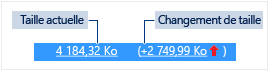

# Utilisation de la m&#233;moire
[!INCLUDE[vs2017banner](../code-quality/includes/vs2017banner.md)]

Recherchez les fuites de mémoire et les utilisations inefficaces de la mémoire lors du débogage avec l’outil de diagnostic **Utilisation de la mémoire** intégré au débogueur. L’outil Utilisation de la mémoire vous permet de prendre un ou plusieurs *instantanés* du tas de mémoire managée et native. Vous pouvez collecter des instantanés d’applications .NET, natives ou en mode mixte \(.NET et native\).  
  
-   Vous pouvez analyser un instantané pour comprendre l’impact relatif des types d’objets sur l’utilisation de la mémoire et pour rechercher le code dans votre application qui utilise la mémoire de manière inefficace.  
  
-   Vous pouvez aussi comparer \(diff\) deux instantanés d’une application pour rechercher les sections de votre code qui provoquent une augmentation de l’utilisation de la mémoire au fil du temps.  
  
 L’illustration suivante montre la fenêtre **Outils de diagnostic** de Visual Studio 2015 Update 1 :  
  
   
  
 Bien que vous puissiez collecter des instantanés de la mémoire à tout moment dans l’outil **Utilisation de la mémoire**, vous pouvez utiliser le débogueur Visual Studio pour contrôler la façon dont votre application s’exécute lors de l’examen des problèmes de performances. La définition de points d’arrêt, l’exécution pas à pas, Interrompre tout et d’autres actions du débogueur peuvent vous aider à concentrer vos investigations en matière de performances sur les chemins du code qui sont les plus pertinents. Le fait d’effectuer ces actions pendant l’exécution de votre application peut éliminer le bruit du code qui ne vous intéresse pas et réduire considérablement la quantité de temps nécessaire pour diagnostiquer un problème.  
  
 Vous pouvez également utiliser l’outil Utilisation de la mémoire en dehors du débogueur. Consultez [Analyser l'utilisation de la mémoire sans débogage](../Topic/Memory%20Usage%20without%20Debugging1.md).  
  
> [!NOTE]
>  **Prise en charge des allocateurs personnalisés** Le profileur de mémoire native fonctionne en collectant des données d’événements [ETW](https://msdn.microsoft.com/en-us/library/windows/desktop/bb968803\(v=vs.85\).aspx) d’allocation émises pendant l’exécution.  Les allocateurs dans le CRT et le Kit de développement logiciel \(SDK\) Windows ont été annotés au niveau de la source afin que leurs données d’allocation puissent être capturées.  Si vous écrivez vos propres allocateurs, toutes les fonctions qui retournent un pointeur vers la mémoire du tas nouvellement allouée peuvent être décorées avec [\_\_declspec](/visual-cpp/cpp/declspec)\(allocator\), comme illustré dans cet exemple pour myMalloc :  
>   
>  `__declspec(allocator) void* myMalloc(size_t size)`  
  
## Analyser l’utilisation de la mémoire avec le débogueur  
  
> [!NOTE]
>  Comme la collecte des données de la mémoire peut affecter les performances du débogage de vos applications natives ou en mode mixte, les instantanés de la mémoire sont désactivés par défaut. Pour activer les instantanés des applications natives ou en mode mixte, démarrez une session de débogage \(touche de raccourci : **F5**\). Quand la fenêtre **Outils de diagnostic** apparaît, choisissez l’onglet Utilisation de la mémoire, puis **Activer les instantanés**.  
>   
>    
>   
>  Arrêtez \(touche de raccourci : **Maj \+ F5**\) et redémarrez le débogage.  
  
 Quand vous voulez capturer l’état de la mémoire, choisissez **Prendre un instantané** dans la barre d’outils de synthèse **Utilisation de la mémoire**.  
  
   
  
> [!TIP]
>  -   Pour créer une ligne de base pour les comparaisons de mémoire, envisagez de prendre un instantané au démarrage de votre session de débogage.  
> -   Comme il peut être difficile de capturer le profil de mémoire d’une opération qui vous intéresse si votre application alloue et libère fréquemment de la mémoire, définissez des points d’arrêt au début et à la fin de l’opération ou bien exécutez pas à pas l’opération pour trouver le point exact où la mémoire a été modifiée.  
  
## Affichage des détails d’un instantané de la mémoire  
 Les lignes de la table de résumé Utilisation de la mémoire répertorient les instantanés que vous avez pris pendant la session de débogage.  
  
 Les colonnes de la ligne varient selon le mode de débogage que vous choisissez dans les propriétés du projet : .NET, natif ou mixte \(.NET et natif\).  
  
-   Les colonnes **Objets managés** et **Allocations natives** affichent le nombre d’objets dans la mémoire .NET et dans la mémoire native au moment où l’instantané a été pris.  
  
-   Les colonnes **Taille du tas managé** et **Taille du tas natif** affichent le nombre d’octets dans les tas .NET et natif.  
  
-   Quand vous avez pris plusieurs instantanés, les cellules de la table de résumé contiennent la différence de valeur entre l’instantané d’une ligne et l’instantané précédent.  
  
       
  
 **Pour afficher un rapport détaillé :**  
  
-   Pour afficher les détails de l’instantané sélectionné, choisissez le lien Actuel.  
  
-   Pour afficher les détails de la différence entre l’instantané actuel et l’instantané précédent, cliquez sur le lien Modification.  
  
 Le rapport s’affiche dans une fenêtre distincte.  
  
## Rapports détaillés sur l’utilisation de la mémoire  
  
### Rapports sur les types managés  
 Choisissez le lien Actuel d’une cellule **Objets managés** ou **Taille du tas managé** dans la table de résumé de l’utilisation de la mémoire.  
  
   
  
 Le volet du haut affiche le nombre et la taille des types de l’instantané, y compris la taille de tous les objets qui sont référencés par le type \(**Taille inclusive**\).  
  
 L’arborescence **Chemins d’accès à la racine** du volet du bas affiche les objets qui référencent le type sélectionné dans le volet du haut. Le Garbage Collector .NET Framework nettoie la mémoire pour un objet seulement quand le dernier type qui le référence a été publié.  
  
 L’arborescence **Types référencés** affiche les références qui sont détenues par le type sélectionné dans le volet du haut.  
  
   
  
 Pour afficher les instances d’un type sélectionné dans le volet du haut, choisissez l’icône .  
  
   
  
 La vue **Instances** affiche les instances de l’objet sélectionné dans l’instantané dans le volet du haut. Les volets Chemins d’accès à la racine et Objets référencés affichent les objets qui référencent l’instance sélectionnée et les types référencés par l’instance sélectionnée. Quand le débogueur est arrêté du point où l’instantané a été pris, vous pouvez pointer sur la cellule Valeur pour afficher les valeurs de l’objet dans une info\-bulle.  
  
### Rapports sur les types natifs  
 Cliquez sur le lien Actuel d’une cellule **Allocations native** ou **Taille du tas natif** dans la table de résumé de l’utilisation de la mémoire de la fenêtre **Outils de diagnostic**.  
  
   
  
 La **vue Types** affiche le nombre et la taille des types dans l’instantané.  
  
-   Cliquez sur l’icône des instances \(\) d’un type sélectionné pour afficher des informations sur les objets du type sélectionné dans l’instantané.  
  
     La vue **Instances** affiche chaque instance du type sélectionné. La sélection d’une instance affiche la pile des appels qui a entraîné la création de l’instance dans le volet **Pile des appels d’allocation**.  
  
       
  
-   Choisissez **Affichage des piles** dans la liste **Mode Affichage** pour afficher la pile des allocations pour le type sélectionné.  
  
       
  
### Rapports sur les modifications \(Différences\)  
  
-   Cliquez sur le lien Modification dans une cellule de la table de résumé de l’onglet **Utilisation de la mémoire** dans la fenêtre **Outils de diagnostic**.  
  
       
  
-   Choisissez un instantané dans la liste **Comparer à** d’un rapport sur la mémoire managée ou native.  
  
       
  
 Le rapport des modifications ajoute des colonnes \(marquées par la mention **\(Diff\)**\) au rapport de base, qui affichent la différence entre la valeur de l’instantané de base et celle de l’instantané comparé. Voici à quoi peut ressembler un rapport des différences de la vue des types natifs :  
  
   
  
## Blogs et vidéos  
 [Diagnostic Tools debugger window in Visual Studio 2015](http://blogs.msdn.com/b/visualstudioalm/archive/2015/01/16/diagnostic-tools-debugger-window-in-visual-studio-2015.aspx)  
  
 [Blog : Memory Usage Tool while debugging in Visual Studio 2015](http://blogs.msdn.com/b/visualstudioalm/archive/2014/11/13/memory-usage-tool-while-debugging-in-visual-studio-2015.aspx)  
  
 [Blog Visual C\+\+ : Native Memory Diagnostics in VS2015 Preview](http://blogs.msdn.com/b/vcblog/archive/2014/11/21/native-memory-diagnostics-in-vs2015-preview.aspx)  
  
 [Blog Visual C\+\+ : Native Memory Diagnostic Tools for Visual Studio 2015 CTP](http://blogs.msdn.com/b/vcblog/archive/2014/06/04/native-memory-diagnostic-tools-for-visual-studio-14-ctp1.aspx)