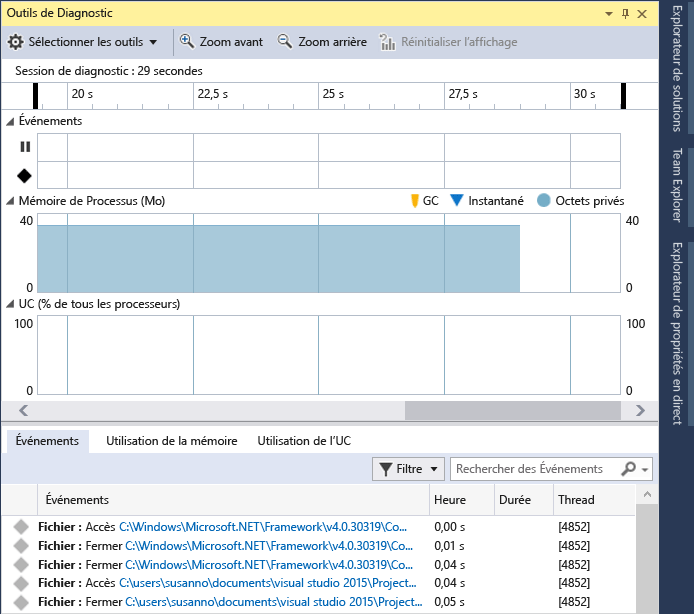
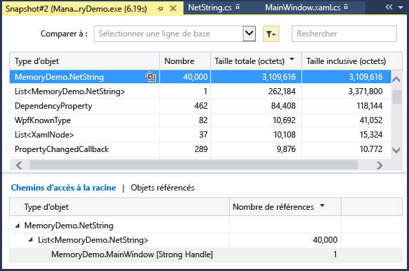
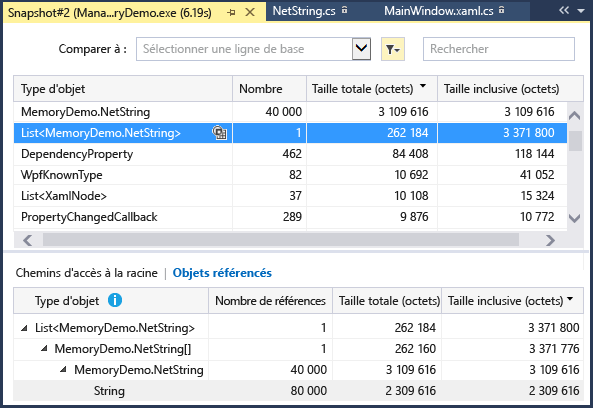
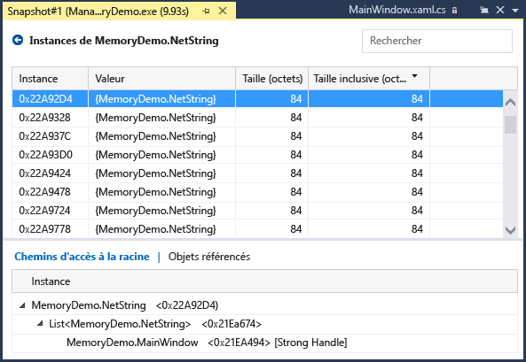
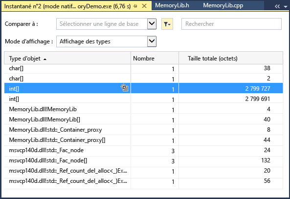
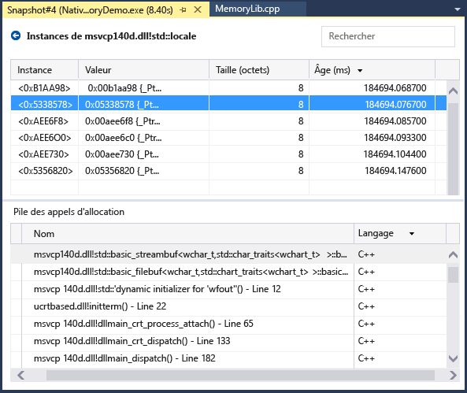
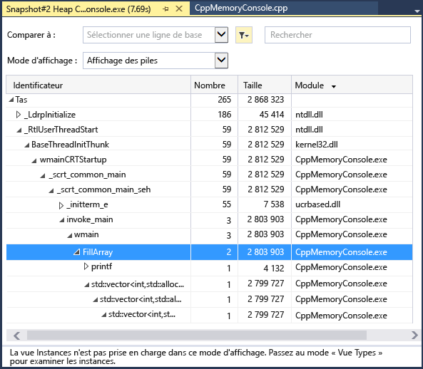
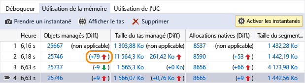
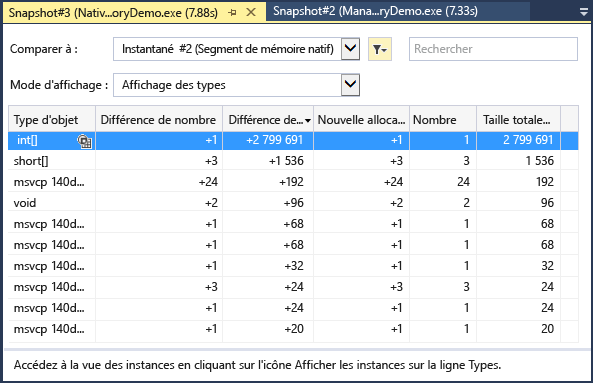

# Mesurer l’utilisation de la mémoire dans Visual Studio
Recherchez les fuites de mémoire et les utilisations inefficaces de la mémoire durant le débogage avec l’outil de diagnostic **Utilisation de la mémoire** intégré au débogueur. L’outil Utilisation de la mémoire vous permet de prendre un ou plusieurs *instantanés* du tas de mémoire managée et native afin de mieux comprendre l’impact de l’utilisation de la mémoire des types d’objets. Vous pouvez collecter des instantanés d’applications .NET, natives ou en mode mixte (.NET et native).  
  
 L’illustration suivante montre la fenêtre **Outils de diagnostic** (disponible dans Visual Studio 2015 Update 1 et ultérieur) :  
  
   
  
 Bien que vous puissiez collecter des instantanés de la mémoire à tout moment dans l’outil **Utilisation de la mémoire** , vous pouvez utiliser le débogueur Visual Studio pour contrôler la façon dont votre application s’exécute lors de l’examen des problèmes de performances. La définition de points d’arrêt, l’exécution pas à pas, Interrompre tout et d’autres actions du débogueur peuvent vous aider à concentrer vos investigations en matière de performances sur les chemins du code qui sont les plus pertinents. Le fait d’effectuer ces actions pendant l’exécution de votre application peut éliminer le bruit du code qui ne vous intéresse pas et réduire considérablement le temps nécessaire pour diagnostiquer un problème.  
  
 Vous pouvez également utiliser l’outil Utilisation de la mémoire en dehors du débogueur. Consultez [Utilisation de la mémoire sans débogage](../profiling/memory-usage-without-debugging2.md). Vous pouvez utiliser les Outils de profilage sans débogueur attaché avec Windows 7 et les versions ultérieures. Windows 8 et les versions ultérieures sont nécessaires pour exécuter les Outils de profilage avec le débogueur (fenêtre **Outils de diagnostic**).
  
> [!NOTE]
>  **Prise en charge des allocateurs personnalisés** Le profileur de mémoire native fonctionne en collectant des données d’événements [ETW](/windows-hardware/drivers/devtest/event-tracing-for-windows--etw-) d’allocation émises pendant l’exécution.  Les allocateurs dans le CRT et le Kit de développement logiciel (SDK) Windows ont été annotés au niveau de la source afin que leurs données d’allocation puissent être capturées.  Si vous écrivez vos propres allocateurs, toutes les fonctions qui retournent un pointeur vers la mémoire du tas nouvellement allouée peuvent être décorées avec [__declspec](/cpp/cpp/declspec)(allocator), comme l’illustre cet exemple pour myMalloc :  
>   
>  `__declspec(allocator) void* myMalloc(size_t size)` 

Dans ce didacticiel, vous allez effectuer les actions suivantes :

> [!div class="checklist"]
> * Réaliser des instantanés de la mémoire
> * Analyser l’utilisation de la mémoire

## Collecter les données d’utilisation de la mémoire

1.  Ouvrez le projet que vous voulez déboguer dans Visual Studio, puis définissez un point d’arrêt dans votre application à l’endroit où vous voulez commencer à examiner l’utilisation de la mémoire.

    Si vous suspectez un problème de mémoire dans une zone spécifique, définissez le premier point d’arrêt avant que le problème de mémoire se produise.

    > [!TIP]
    >  Comme il peut être difficile de capturer le profil de mémoire d’une opération qui vous intéresse si votre application alloue et libère fréquemment de la mémoire, définissez des points d’arrêt au début et à la fin de l’opération (ou bien exécutez pas à pas l’opération) pour trouver le point exact où la mémoire a été modifiée. 

2.  Définissez un deuxième point d’arrêt à la fin de la fonction ou de la région de code que vous voulez analyser (ou après qu’un problème mémoire supposé se soit produit).
  
3.  La fenêtre **Outils de diagnostic** apparaît automatiquement, sauf si vous l’avez désactivée. Pour réafficher la fenêtre, cliquez sur **Déboguer** > **Fenêtres** > **Afficher les outils de diagnostic**.

4.  Choisissez **Utilisation de la mémoire** avec **Sélectionner les outils** dans la barre d’outils.

     

5.  Cliquez sur **Déboguer / Démarrer le débogage** (ou **Démarrer** dans la barre d’outils, ou **F5**).

     Lorsque l’application est chargée, la vue Résumé des outils de diagnostics s’affiche.

     

     > [!NOTE]
     >  Comme la collecte des données de la mémoire peut affecter les performances du débogage de vos applications natives ou en mode mixte, les instantanés de la mémoire sont désactivés par défaut. Pour activer les instantanés dans des applications natives ou en mode mixte, démarrez une session de débogage (touche de raccourci : **F5**). Quand la fenêtre **Outils de diagnostic** apparaît, choisissez l’onglet **Utilisation de la mémoire**, puis choisissez **Profilage du tas**.  
     >   
     >    
     >   
     >  Arrêtez (touche de raccourci : **Maj**+**F5**) et redémarrez le débogage.  

6.  Pour prendre un instantané au début de votre session de débogage, choisissez **Prendre un instantané** dans la barre d’outils récapitulative **Utilisation de la mémoire**. (Il peut être utile de définir un point d’arrêt ici aussi.)

     
     
     > [!TIP]
     >  Pour créer une ligne de base pour les comparaisons de mémoire, envisagez de prendre un instantané au démarrage de votre session de débogage.  

6.  Exécutez le scénario qui doit provoquer le premier point d’arrêt.

7.  Quand le débogueur est en pause sur le premier point d’arrêt, choisissez **Prendre un instantané** dans la barre d’outils récapitulative **Utilisation de la mémoire**.  

8.  Appuyez sur **F5** pour exécuter l’application jusqu’au deuxième point d’arrêt.

9.  Prenez maintenant un autre instantané.

     À ce stade, vous pouvez commencer à analyser les données.    
  
## Analyser l’utilisation de la mémoire
Les lignes du tableau récapitulatif Utilisation de la mémoire listent les instantanés que vous avez pris pendant la session de débogage et fournissent des liens vers des vues plus détaillées.

 Les noms des colonnes varient selon le mode de débogage que vous choisissez dans les propriétés du projet : .NET, natif ou mixte (.NET et natif).  
  
-   Les colonnes **Objets (Diff.)** et **Allocations (Diff.)** montrent le nombre d’objets dans la mémoire .NET et dans la mémoire native au moment où l’instantané a été pris.  
  
-   La colonne **Taille du tas (Diff.)** montre le nombre d’octets dans les tas .NET et natif. 

Quand vous avez pris plusieurs instantanés, les cellules de la table de résumé contiennent la différence de valeur entre l’instantané d’une ligne et l’instantané précédent.  

Pour analyser l’utilisation de la mémoire, cliquez sur un des liens qui ouvrent un rapport détaillé de l’utilisation de la mémoire :  

- Pour voir les détails de la différence entre l’instantané actif et l’instantané précédent, cliquez sur le lien Modification à gauche de la flèche (). Une flèche rouge indique une augmentation de l’utilisation de la mémoire et une flèche verte indique une baisse.

  > [!TIP]
  >  Pour aider à identifier les problèmes de mémoire plus rapidement, les rapports de comparaison sont triés selon les types d’objets dont le nombre total a le plus augmenté (cliquez sur le lien de modification dans la colonne **Objets (Diff.)**) ou qui ont le plus augmenté dans la taille de segment totale (cliquez sur le lien de modification dans la colonne **Taille du tas (Diff.)**).

- Pour afficher les détails de l’instantané sélectionné, cliquez sur le lien de non-modification. 
  
  Le rapport s’affiche dans une fenêtre distincte.   
  
### Rapports sur les types managés  
 Choisissez le lien actif d’une cellule **Objets (Diff.)** ou **Allocations (Diff.)** dans le tableau récapitulatif Utilisation de la mémoire.  
  
   
  
 Le volet du haut affiche le nombre et la taille des types de l’instantané, y compris la taille de tous les objets qui sont référencés par le type (**Taille inclusive**).  
  
 L’arborescence **Chemins d’accès à la racine** du volet du bas affiche les objets qui référencent le type sélectionné dans le volet du haut. Le Garbage Collector .NET Framework nettoie la mémoire pour un objet seulement quand le dernier type qui le référence a été publié.  
  
 L’arborescence **Types référencés** affiche les références qui sont détenues par le type sélectionné dans le volet du haut.  
  
   
  
 Pour afficher les instances d’un type sélectionné dans le volet du haut, choisissez l’icône .  
  
   
  
 La vue **Instances** affiche les instances de l’objet sélectionné dans l’instantané dans le volet du haut. Les volets **Chemins d’accès à la racine** et **Objets référencés** affichent les objets qui référencent l’instance sélectionnée, ainsi que les types référencés par l’instance sélectionnée. Quand le débogueur est arrêté du point où l’instantané a été pris, vous pouvez pointer sur la cellule **Valeur** pour afficher les valeurs de l’objet dans une info-bulle.  
  
### Rapports sur les types natifs  
 Cliquez sur le lien actif d’une cellule **Allocations (Diff.)** ou **Taille du tas (Diff.)** dans la table récapitulative Utilisation de la mémoire de la fenêtre **Outils de diagnostic**.  
  
   
  
 La **vue Types** affiche le nombre et la taille des types dans l’instantané.  
  
-   Cliquez sur l’icône des instances () d’un type sélectionné pour afficher des informations sur les objets du type sélectionné dans l’instantané.  
  
     La vue **Instances** affiche chaque instance du type sélectionné. La sélection d’une instance affiche la pile des appels qui a entraîné la création de l’instance dans le volet **Pile des appels d’allocation** .  
  
       
  
-   Choisissez **Affichage des piles** dans la liste **Mode Affichage** pour afficher la pile des allocations pour le type sélectionné.  
  
       
  
### Rapports sur les modifications (Différences)  
  
- Cliquez sur le lien Modification dans une cellule du tableau récapitulatif de l’onglet **Utilisation de la mémoire** dans la fenêtre **Outils de diagnostic** .  
  
     
  
- Choisissez un instantané dans la liste **Comparer à** d’un rapport sur la mémoire managée ou native.  
  
     
  
  Le rapport des modifications ajoute des colonnes (marquées par la mention **(Diff)**) au rapport de base, qui affichent la différence entre la valeur de l’instantané de base et celle de l’instantané comparé. Voici à quoi peut ressembler un rapport des différences de la vue des types natifs :  
  
    
  
## Blogs et vidéos  

| | |
|---------|---------|
|  | [Regardez une vidéo](https://mva.microsoft.com/en-US/training-courses-embed/getting-started-with-visual-studio-2017-17798/Profiling-with-Diagnostics-Tools-in-Visual-Studio-2017-daHnzMD6D_9211787171) sur l’utilisation des outils de diagnostic qui montre comment analyser l’utilisation de la mémoire et l’utilisation de l’UC dans Visual Studio 2017. |

 [Analyser l’UC et la mémoire pendant le débogage](https://blogs.msdn.microsoft.com/visualstudio/2016/02/15/analyze-cpu-memory-while-debugging/)  
  
 [Blog Visual C++ : Profilage de la mémoire dans Visual C++ 2015](https://blogs.msdn.microsoft.com/vcblog/2015/10/21/memory-profiling-in-visual-c-2015/)  

## Étapes suivantes

Dans ce didacticiel, vous avez appris comment collecter et analyser les données d’utilisation de la mémoire. Si vous avez déjà fait la [visite guidée du profileur](../profiling/profiling-feature-tour.md), vous pouvez souhaiter avoir une vue d’ensemble rapide de la manière d’analyser l’utilisation de l’UC dans vos applications.

> [!div class="nextstepaction"]
> [Analyser l’utilisation de l’UC](../profiling/beginners-guide-to-performance-profiling.md) 