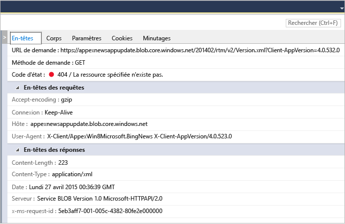

# Analyser l’utilisation du réseau dans les applications UWP
L’outil de diagnostic **Réseau** de Visual Studio collecte les données relatives aux opérations réseau effectuées à l’aide de l’[API Windows.Web.Http](/uwp/api/windows.web.http). L'analyse des données peut vous aider à résoudre les problèmes tels que les problèmes d'accès et d'authentification, l'utilisation incorrecte du cache et les médiocres performances d'affichage et de téléchargement.  
  
 L’outil Réseau prend uniquement en charge les applications UWP. Les autres plateformes ne sont pas prises en charge pour l'instant.  
  
> [!NOTE]
>  Pour obtenir une description plus complète de l’outil Réseau, consultez [Introducing Visual Studio's network tool](http://blogs.msdn.com/b/visualstudio/archive/2015/05/04/introducing-visual-studios-network-tool.aspx).  
  
## Collecter des données de l'outil Réseau  
 Vous devez exécuter l’outil **Réseau** avec un projet Visual Studio ouvert sur l’ordinateur Visual Studio.  
  
1.  Ouvrez le projet dans Visual Studio.  
  
2.  Cliquez sur **Déboguer/Profileur de performances**. Choisissez **Réseau**, puis **Démarrer**.  
  
3.  L’outil Réseau commence à collecter le trafic HTTP de votre application.  
  
     Quand vous exécutez votre application, la vue récapitulative dans le volet gauche affiche automatiquement une liste des opérations HTTP capturées. Sélectionnez un élément dans la vue récapitulative pour afficher plus d'informations dans le panneau des détails du volet droit.  
  
4.  Choisissez **Arrêter** pour fermer l’application.  
  
 La fenêtre de rapport doit ressembler à ce qui suit :  
  
   
  
## Analyser des données  
 Vous pouvez analyser le trafic HTTP capturé pendant l'exécution de votre application, ou même après la fermeture de l'application, en sélectionnant l'une des opérations réseau affichées sur la vue récapitulative.  
  
 La vue de résumé **Réseau** affiche les données de chaque opération réseau de l’exécution de votre application. Choisissez un en-tête de colonne pour trier la liste ou choisissez les types de contenu à afficher dans la vue de filtre **Type de contenu**.  
  
 Choisissez **Enregistrer en tant que HAR** pour créer un fichier JSON qui peut être utilisé par des outils tiers, comme Fiddler.  
  
 Les vues des détails **Réseau** affichent des informations supplémentaires sur une opération réseau dans la vue de résumé.  
  
   
  
|||  
|-|-|  
|**En-têtes**|Informations sur les en-têtes de demande de l'événement.|  
|**Corps**|Données de charge utile de la demande et de la réponse.|  
|**Paramètres**|Noms et valeurs des paramètres de la chaîne de requête.|  
|**Cookies**|Données de cookie de la demande et de la réponse.|  
|**Minutages**|Graphique des étapes lors de l'acquisition des ressources sélectionnées.|  
  
 La barre de **résumé** de l’outil Réseau indique le nombre d’opérations réseau affichées à un moment donné, la quantité de données qui ont été transférées, le temps qu’il a fallu pour les télécharger et le nombre d’erreurs (demandes avec des réponses 4xx ou 5xx).  
  
### Conseils pour l'analyse  
 Cet outil met en évidence certaines parties qui peuvent être utiles quand vous effectuez une analyse liée au réseau :  
  
1.  Les demandes qui sont entièrement traitées à partir du cache sont indiquées par la mention **(du cache)** dans la colonne **Reçu**. Ce marquage peut vous aider à déterminer si vous utilisez le cache efficacement pour économiser la bande passante de l'utilisateur, ou si vous placez par erreur des réponses dans le cache et que vous fournissez donc des données obsolètes à l'utilisateur final de votre application.  
  
2.  Les réponses d’erreur (4xx ou 5xx) sont affichées dans la colonne **Résultats** avec un code d’état rouge et sont également mises en surbrillance dans la barre de résumé. Le repérage des erreurs parmi les demandes potentiellement nombreuses de votre application est ainsi facilité.  
  
3.  Le bouton d’impression automatique des réponses (à l’intérieur de l’onglet du corps) peut vous aider à analyser les charges utiles des réponses JSON, XML, HTML, CSS, JavaScript et TypeScript en améliorant la lisibilité du contenu.  
  
## Voir aussi  
 [Exécuter des outils de profilage avec ou sans le débogueur](../profiling/running-profiling-tools-with-or-without-the-debugger.md)  
 [Blog Visual Studio : Présentation de l’inspecteur de réseau de Visual Studio](http://go.microsoft.com/fwlink/?LinkId=535022)   
 [Vidéo Channel 9 : Diagnostics tools – New Network Profiler](http://channel9.msdn.com/Series/ConnectOn-Demand/206)  
 [Profilage dans Visual Studio](../profiling/index.md)  
 [Visite guidée des fonctionnalités de profilage](../profiling/profiling-feature-tour.md)
