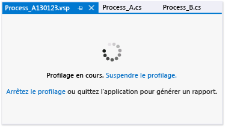

# Définir les options générales d’une session de performances

Vous pouvez définir la méthode de collecte et les conventions de nommage des données de profilage pour une session de performance des Outils de profilage de Visual Studio sur la page **Général** de la boîte de dialogue des propriétés de la session de performance. Pour ouvrir cette boîte de dialogue depuis **l’Explorateur de performances**, cliquez avec le bouton droit sur la session de performances, puis cliquez sur **Propriétés**.

## Choix des méthodes de collecte de données

Vous définissez la méthode de collecte de base en sélectionnant une des options sous **Collecte du profilage**. Les options sont décrites dans le tableau suivant :

|||
|-|-|
|**Échantillonnage**. La méthode d’échantillonnage collecte des informations de profilage à intervalles réguliers. Cette méthode est pratique pour détecter les problèmes d’utilisation du processeur ; il s’agit de la méthode recommandée pour commencer la plupart des investigations sur les performances.|- [Collecte des statistiques de rendement à l’aide de l’échantillonnage](../profiling/collecting-performance-statistics-by-using-sampling.md)|
|**Instrumentation**. La méthode d’instrumentation injecte du code de profilage dans une copie d’un module, qui enregistre chaque entrée, sortie et appel de fonction des fonctions du module pendant une exécution du profilage. Cette méthode permet de collecter des informations de temporisation détaillées à propos d’une partie précise de votre code. Elle vous aide à comprendre l’impact des opérations d’entrée et de sortie sur les performances de l’application.|- [Collecte de données détaillées sur le calendrier en utilisant l’instrumentation](../profiling/collecting-detailed-timing-data-by-using-instrumentation.md)|
|**Concordurrency**. La méthode d’accès concurrentiel collecte des données pour chaque événement qui bloque l’exécution de votre code, par exemple quand un thread attend la libération d’un verrou d’accès à une ressource d’application. Cette méthode est utile pour l’analyse des applications multithread.|- [Collecte de données sur le fil et la concordance des processus](../profiling/collecting-thread-and-process-concurrency-data.md)|

 Vous pouvez collecter des données de mémoire .NET en utilisant les méthodes d’échantillonnage ou d’instrumentation. Vous sélectionnez le type de données sous **Profilage de mémoire .NET**.

|||
|-|-|
|**Collectez les informations d’allocation d’objets .NET**. Par défaut, les données incluent le nombre et la taille des objets alloués. Cochez ou décochez cette case pour activer ou désactiver la collecte de données mémoire .NET. |- [Collecte de données liées à l’allocation et à la durée de vie de la mémoire .NET](../profiling/collecting-dotnet-memory-allocation-and-lifetime-data.md)|
|**Collecter aussi les informations de durée de vie des objets .NET**. Cochez cette case pour inclure des données sur les générations de garbage collection qui ont été utilisées pour récupérer les objets en mémoire.|- [Collecte de données liées à l’allocation et à la durée de vie de la mémoire .NET](../profiling/collecting-dotnet-memory-allocation-and-lifetime-data.md) |

 Une page de session de profilage apparaît quand vous commencez à profiler une application, où vous pouvez suspendre, reprendre et arrêter le profilage.

 

## Définir les options des fichiers de données de profilage

|||
|-|-|
|**Rapport**. Par défaut, le nom du fichier de données de profilage (.vsp) est le nom de l’application profilée ; ce fichier se trouve dans le dossier de la solution ou du projet. Une chaîne de date est également ajoutée au nom ; en outre, un numéro incrémenté est ajouté aux fichiers de données qui sans cela auraient des noms en doublon. Vous pouvez modifier ces options.|- [Comment : Définir les options de nom de fichiers de données de performance](../profiling/how-to-set-performance-data-file-name-options.md)|
