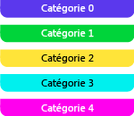

# Marqueurs d’étendue
Un marqueur d’étendue représente une phase significative d’une application. Par exemple, vous pouvez utiliser une étendue pour représenter un intervalle de temps pendant lequel un élément de travail particulier est traité. Sa longueur représente la durée de la phase correspondante de l’application. Cette illustration montre une étendue dans le visualiseur concurrentiel :

  Marqueur d’étendue dans le visualiseur concurrentiel

## Catégories d’étendues
 Un marqueur d’étendue peut être affiché dans cinq couleurs différentes en fonction de sa catégorie. Les couleurs sont répétées quand il y a plus de cinq catégories. La catégorie peut correspondre à n’importe quel entier. Cette illustration présente les cinq couleurs possibles :

  Couleurs des cinq premières catégories

## Marqueurs d’agrégation d’étendues
 Parfois, les marqueurs d’étendue sont si proches les uns des autres dans le visualiseur concurrentiel qu’ils ne peuvent pas être dessinés individuellement. Quand c’est le cas, un *marqueur d’agrégation d’étendues* représentant les étendues sous-jacentes est affiché. Quand vous placez le pointeur sur une de ces icônes, une info-bulle montre le nombre d’étendues sous-jacentes qui sont représentées. Pour voir les étendues, faites un zoom avant. Si vous zoomez au maximum et que vous voyez toujours un marqueur d’agrégation d’étendues, vous pouvez voir les marqueurs des étendues sous-jacentes dans le [rapport Marqueurs](../profiling/markers-report.md). Cette illustration montre un marqueur d’agrégation d’étendues :

  Marqueur d’agrégation d’étendues

## Voir aussi
- [Marqueurs du visualiseur concurrentiel](../profiling/concurrency-visualizer-markers.md)
- [Kit SDK du visualiseur concurrentiel](../profiling/concurrency-visualizer-sdk.md)