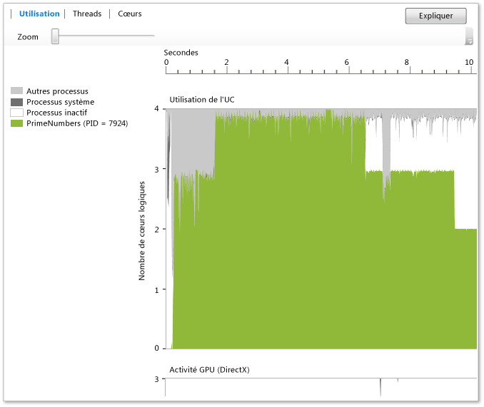

# Vue Utilisation
La **vue Utilisation** affiche des informations sur le processeur, le GPU et d’autres ressources système utilisées par le processus en cours (choisissez **Analyser** > **Visualiseur concurrentiel** pour démarrer le visualiseur concurrentiel). Il montre l’utilisation moyenne des cœurs par le processus analysé, le processus inactif, le processus système et d’autres processus qui s’exécutent sur le système au fil du temps. Il ne montre pas quel cœur spécifique est actif à un moment donné. Par exemple, si deux cœurs s’exécutent chacun à 50 % de leur capacité pendant une période de temps donnée, cette vue ne montre qu’un seul cœur logique en cours d’utilisation. La vue est générée en décomposant la durée du profilage en petits segments de temps. Pour chaque segment, le graphique indique le nombre moyen de threads du processus qui s’exécutent sur les cœurs logiques pendant cet intervalle.  
  
   
  
 Le graphique affiche le temps (sur l’axe des X) et les cœurs logiques moyens utilisés par le processus cible, le processus inactif et le processus système. (Le processus inactif montre des cœurs inactifs. Le processus système est un processus dans Windows qui peut exécuter un travail pour le compte d’autres processus.) Les autres processus qui s’exécutent sur système comptent pour l’utilisation des cœurs restants.  
  
 Le nombre de cœurs logiques est indiqué sur l’axe des Y. Windows traite la prise en charge du multithreading simultané dans le matériel comme des cœurs logiques (par exemple Hyper-Threading). Ainsi, un système avec un processeur à quatre cœurs qui prend en charge deux threads matériels par cœur apparaît comme un système avec huit cœurs logiques. Ceci s’applique également à la vue Cœurs. Pour plus d’informations, consultez [Vue Cœurs](../profiling/cores-view.md).  
  
 Le graphique Activité GPU montre le nombre de moteurs de DirectX utilisés au fil du temps.  Un moteur est utilisé s’il traite un paquet DMA.  Le graphique ne montre pas un moteur DirectX spécifique (par exemple le moteur 3D, le moteur vidéo, etc.).  
  
## Objectif  
 Nous recommandons la vue Utilisation comme point de départ pour examiner les performances quand vous utilisez le visualiseur concurrentiel. Comme il fournit une vue d’ensemble du degré de concurrence dans une application au fil du temps, vous pouvez l’utiliser pour identifier rapidement les zones nécessitant une optimisation des performances ou la parallélisation.  
  
 Si vous êtes intéressé par l’optimisation des performances, vous pouvez essayer d’identifier un comportement qui ne répond pas à vos attentes. Vous pouvez également rechercher l’existence et la cause des régions où l’utilisation des cœurs d’UC logiques est faible. Vous pouvez également rechercher des modèles d’utilisation entre l’UC et le GPU.  
  
 Si vous êtes intéressé par la parallélisation d’une application, vous recherchez probablement deux zones d’exécution liées à l’UC ou des zones où vous n’utilisez pas l’UC.  
  
 Les zones liées à l’UC sont en vert. Le graphique montre un seul cœur utilisé si l’application est en série.  
  
 Les zones où le processeur n’est pas utilisé sont en gris. Elles peuvent représenter des points auxquels l’application est inactive ou effectue des E/S bloquantes qui offrent des opportunités de parallélisme via un chevauchement avec un autre travail lié à l’UC.  
  
 Quand vous trouvez un comportement intéressant, vous pouvez effectuer un zoom avant sur cette région en la sélectionnant. Après avoir effectué un zoom, vous pouvez passer à la vue Threads ou à la vue Cœurs pour une analyse plus détaillée.  
  
 Si vous utilisez le GPU via AMP C++ ou DirectX, vous pouvez être intéressé par la détermination du nombre de moteurs GPU utilisés ou les zones où, de façon inattendue, le GPU est inactif.  
  
## Zoom  
 Pour effectuer un zoom avant sur le graphique Utilisation de l’UC ou sur le graphique Activité du GPU, sélectionnez une section ou utilisez le curseur de zoom au-dessus du graphique. La valeur du zoom est conservée quand vous passez à d’autres vues. Pour refaire un zoom arrière, utilisez le curseur de zoom. Vous pouvez également effectuer un zoom avec **Ctrl**+**Défilement**.  
  
## Voir aussi  
 [Visualiseur concurrentiel](../profiling/concurrency-visualizer.md)   
 [Affichage Cœurs](../profiling/cores-view.md)