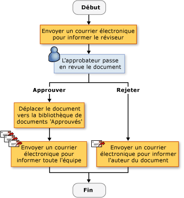
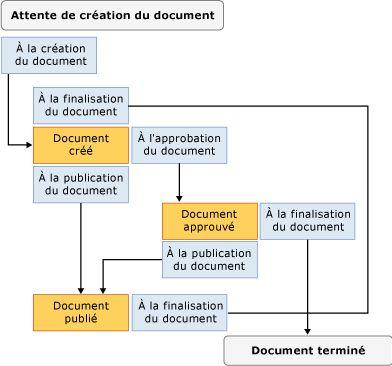

# Créer des solutions de flux de travail SharePoint

[!INCLUDE[vsprvs](../sharepoint/includes/vsprvs-md.md)] Fournit des outils pour vous aider à créer des flux de travail personnalisés qui gèrent le cycle de vie des documents et éléments de liste dans un site SharePoint Web. Les éléments fournis incluent un concepteur, un ensemble de contrôles de l’activité et les références d’assembly nécessaires. [!INCLUDE[vsprvs](../sharepoint/includes/vsprvs-md.md)] inclut également le **Assistant Personnalisation de SharePoint**, pour aider à créer et configurer les flux de travail.

Pour plus d’informations sur SharePoint, consultez [Microsoft produits et Technologies SharePoint](http://go.microsoft.com/fwlink/?LinkId=178470).

## Flux de travail dans SharePoint
 Lorsque vous ajoutez un flux de travail à une bibliothèque ou liste SharePoint, vous appliquer un processus d’entreprise sur tous les éléments dans la liste ou bibliothèque. Un flux de travail décrit les actions que le système ou les utilisateurs doivent effectuer sur chaque élément, telles que l’envoi de l’élément à modifier puis à réviser. Ces actions, connu sous le nom *activités*, sont les blocs de construction du flux de travail.

 Vous pouvez créer des flux de travail SharePoint dans [!INCLUDE[vsprvs](../sharepoint/includes/vsprvs-md.md)] et les déployer sur un site SharePoint Web. Une fois un flux de travail est déployé sur SharePoint, associez-la à une bibliothèque ou liste. Il peut ensuite être démarrée automatiquement, par un processus, ou manuellement, par un utilisateur. Pour plus d’informations sur l’opération de flux de travail, consultez [SharePoint de développer des flux de travail à l’aide de Visual Studio](https://docs.microsoft.com/sharepoint/dev/general-development/develop-sharepoint-workflows-using-visual-studio).

## Créer des flux de travail SharePoint personnalisés
 Deux projets de flux de travail SharePoint sont disponibles dans [!INCLUDE[vsprvs](../sharepoint/includes/vsprvs-md.md)]: **Workflow séquentiel** et **Workflow d’ordinateur d’état**.

 Un *workflow séquentiel* représente une série d’étapes. Les étapes sont effectuées une après l’autre jusqu'à ce que la dernière activité est terminée. Flux de travail séquentiels est toujours strictement séquentiel dans leur exécution. Car ils peuvent recevoir des événements externes et inclure des flux logiques parallèles, l’ordre exact d’exécution peut varier. L’illustration suivante montre un exemple de workflow séquentiel.

 

 Un *workflow d’ordinateur d’état* représente un ensemble d’états, transitions et d’actions. Les étapes décrites dans un workflow d’ordinateur d’état exécuter de façon asynchrone. Cela signifie qu’ils ne sont pas nécessairement effectuées une après l’autre, mais elles sont déclenchées par des actions et des États. Un état est désignée comme l’état de démarrage, et puis, en fonction d’un événement, une transition est effectuée vers un autre état. L’ordinateur d’état peut avoir un état final qui détermine la fin du flux de travail. Le diagramme suivant montre un exemple d’un workflow de machine d’état.

 

 Pour plus d’informations sur les types de flux de travail, consultez [les Types de flux de travail](http://go.microsoft.com/fwlink/?LinkId=178995).

### Utilisez l’Assistant
 Lorsque vous créez un projet de flux de travail SharePoint dans [!INCLUDE[vsprvs](../sharepoint/includes/vsprvs-md.md)], vous spécifiez tout d’abord ses paramètres dans le **Assistant Personnalisation de SharePoint**. L’Assistant utilise ces paramètres pour créer un projet dans **l’Explorateur de solutions**. Ce projet contient un fichier de code, plusieurs fichiers qui sont utilisés pour déployer le flux de travail, et des références aux assemblys qui sont nécessaires pour créer un flux de travail SharePoint personnalisé.

 Après avoir créé le flux de travail, vous pouvez modifier ses propriétés dans la fenêtre Propriétés. Bien que la plupart des propriétés de flux de travail peuvent être modifiées directement dans la fenêtre Propriétés, certaines vous oblige à cliquer sur un bouton de sélection () à modifier leurs valeurs. Ce bouton redémarre le **Assistant Personnalisation de SharePoint**. Après avoir apporté la propriété valeur est modifiée, choisissez le **Terminer** bouton pour finaliser les.

> [!NOTE]
>  Le **Type de Workflow** propriété est en lecture seule et ne peut pas être modifiée. Si vous souhaitez modifier le type de flux de travail, vous devez créer un autre workflow.

## Concevoir un flux de travail SharePoint
 Après avoir défini toutes les étapes dans le processus d’entreprise, utilisez le [!INCLUDE[vsprvs](../sharepoint/includes/vsprvs-md.md)] Concepteur de flux de travail pour concevoir le flux de travail SharePoint. Pour ouvrir le concepteur, double-cliquez sur Workflow1.cs ou Workflow1.vb dans **l’Explorateur de solutions**, ou ouvrez le menu contextuel pour une de ces fichiers, puis choisissez **ouvrir**.

### Activités
 Pour concevoir un flux de travail, ajouter des activités à partir de la **boîte à outils** à un *planification de flux de travail* sur le concepteur. Une planification de flux de travail contient la séquence d’activités dans l’ordre qu’ils doivent être effectuées.

 Il existe deux types d’activités :

- *Les activités simples* exécutent une seule unité de travail, telle que « retenir pendant 1 jour » ou « démarrer le service Web ».

- *Activités composites* contenir d’autres activités ; par exemple, une activité conditionnelle peut contenir deux branches.

  Les deux types d’activités sont disponibles dans le **boîte à outils**.

  Activités peuvent avoir des propriétés, méthodes et événements. Utilisez le **propriétés** fenêtre pour définir les propriétés d’une activité.

  Vous pouvez également créer une activité personnalisée. Pour plus d’informations, consultez [Procédure pas à pas : Créer une activité de flux de travail de site personnalisé](../sharepoint/walkthrough-create-a-custom-site-workflow-activity.md).

  Les activités sont réparties dans les onglets suivants dans le **boîte à outils**:

- **Flux de travail SharePoint**

- **Windows Workflow v3.0**

- **Windows Workflow v3.5**

  Pas toutes les activités de flux de travail de core sont pris en charge par SharePoint. Pour plus d’informations, consultez [vue d’ensemble des activités de flux de travail pour Windows SharePoint Services](http://go.microsoft.com/fwlink/?LinkID=156094).

#### Activités de flux de travail SharePoint
 Le **flux de travail SharePoint** onglets contiennent des activités spécialisées pour une utilisation dans [!INCLUDE[wss_14_long](../sharepoint/includes/wss-14-long-md.md)]. Ces activités simplifient et rationaliser le développement de workflows de cycle de vie de document. Pour plus d’informations sur les activités répertoriées dans le **flux de travail SharePoint** , consultez la rubrique [vue d’ensemble des activités de flux de travail pour Windows SharePoint Services](http://go.microsoft.com/fwlink/?LinkID=156094).

#### Activités de flux de travail Windows
 Le **Windows Workflow** onglets contiennent les activités fournies par le [!INCLUDE[TLA#tla_workflow](../sharepoint/includes/tlasharptla-workflow-md.md)]. Vous pouvez utiliser ces activités pour créer des planifications de flux de travail pour tout type d’application de flux de travail Windows.

 Pour plus d’informations sur les activités répertoriées dans le **des flux de travail Windows** , consultez la rubrique [activités Windows Workflow Foundation](http://go.microsoft.com/fwlink/?LinkID=156096). Pour plus d’informations sur Windows Workflow Foundation, consultez [vue d’ensemble de Windows Workflow Foundation](http://go.microsoft.com/fwlink/?LinkID=128632).

### Utiliser des activités dans le Concepteur
 Planification de votre flux de travail peut contenir une combinaison des activités de flux de travail Windows et les activités de flux de travail SharePoint.

 Le concepteur affiche des signaux visuels pour vous aider à positionner et configurer correctement des activités. Lorsque vous faites glisser ou copiez une activité sur la planification de flux de travail, le concepteur affiche des icônes signe plus (+) qui vous indiquent les emplacements valides pour cette activité dans le flux de travail. Vous ne pouvez pas placer une activité dans un emplacement où il ne serait pas valide. Par exemple, vous ne pouvez pas placer une activité d’envoi comme première activité dans une branche d’activité Listen. Pour plus d’informations, consultez [centre de développement SharePoint Designer](http://go.microsoft.com/fwlink/?LinkId=178476).

## Collecter des informations pendant le flux de travail
 Vous pouvez souhaiter recueillir des informations provenant des utilisateurs à des moments prédéfinis dans le flux de travail. Vous pouvez collecter des informations à l’aide de formulaires ou des propriétés de l’élément.

### Formulaires
 Les formulaires sont comme des boîtes de dialogue qui contiennent des questions et permettent aux utilisateurs de fournir des réponses.

 Il existe quatre types de formulaires qui peuvent être utilisées dans un flux de travail :

- Association

- Initiation

- Modification

- Tâche

  Parmi ceux-ci, [!INCLUDE[vsprvs](../sharepoint/includes/vsprvs-md.md)] inclut des modèles d’élément pour les formulaires d’association et d’initiation. Un exemple d’un *formulaire d’association* est qui permet à l’administrateur de l’installation du flux de travail permet d’entrer les paramètres relatifs au flux de travail, telles que la limite de dépense pour un workflow de dépenses. Un exemple d’un *formulaire d’initiation* est celle qui permet à l’utilisateur d’un workflow dépenses d’entrer la quantité qu’ils passent dans le flux de travail. Pour plus d’informations sur ces types de formulaires, consultez [SharePoint modèles d’élément de projet et le projet](../sharepoint/sharepoint-project-and-project-item-templates.md).

### Propriétés de l’élément
 Vous pouvez également collecter des informations à partir des utilisateurs en utilisant les propriétés d’un élément dans la liste ou bibliothèque SharePoint. Le fichier de code principal (Workflow1.cs ou Workflow1.vb) déclare une instance de la classe Microsoft.SharePoint.Workflow.SPWorkflowActivationProperties.WorkflowProperties nommée `workflowProperties`. Utilisez le `workflowProperties` objet pour accéder aux propriétés de la bibliothèque ou une liste dans le code. Pour obtenir un exemple, consultez [procédure pas à pas : Créer et déboguer une solution de flux de travail SharePoint](../sharepoint/walkthrough-creating-and-debugging-a-sharepoint-workflow-solution.md).

## Déboguer un modèle de flux de travail SharePoint
 Vous pouvez déboguer un projet de flux de travail SharePoint le même comme vous autres [!INCLUDE[vsprvs](../sharepoint/includes/vsprvs-md.md)] projets basés sur le Web. Lorsque vous démarrez le [!INCLUDE[vsprvs](../sharepoint/includes/vsprvs-md.md)] débogueur, [!INCLUDE[vsprvs](../sharepoint/includes/vsprvs-md.md)] utilise les paramètres que vous spécifiez dans le **Assistant Personnalisation de SharePoint** pour ouvrir le site SharePoint Web approprié et associer automatiquement le modèle de flux de travail avec la bibliothèque appropriée ou la liste. [!INCLUDE[vsprvs](../sharepoint/includes/vsprvs-md.md)] attache également le [!INCLUDE[vsprvs](../sharepoint/includes/vsprvs-md.md)] du débogueur pour le [!INCLUDE[wss_14_long](../sharepoint/includes/wss-14-long-md.md)] processus nommé *w3wp.exe*.

 Pour tester le flux de travail, vous devez démarrer manuellement. Pour plus d’informations, consultez la section « Débogage de Workflows » dans [débogage de Solutions SharePoint](../sharepoint/debugging-sharepoint-solutions.md). Pour plus d’informations sur [!INCLUDE[vsprvs](../sharepoint/includes/vsprvs-md.md)] débogage de l’application Web, consultez [déboguer les applications web et scripts](../debugger/how-to-enable-debugging-for-aspnet-applications.md).

## Déployer un modèle de flux de travail SharePoint
 [!INCLUDE[vsprvs](../sharepoint/includes/vsprvs-md.md)] Déploiement des projets de flux de travail SharePoint comme autre [!INCLUDE[vsprvs](../sharepoint/includes/vsprvs-md.md)] projets SharePoint. Pour plus d’informations, consultez [Package et déployer de SharePoint solutions](../sharepoint/packaging-and-deploying-sharepoint-solutions.md).

## Importer des flux de travail réutilisables dans le monde entier
 Outre la création de flux de travail réutilisables spécifiques au site, SharePoint Designer vous permet de créer *globalement réutilisables*, qui sont des flux de travail qui peut être utilisé par n’importe quel site SharePoint. Le projet importer le flux de travail réutilisable dans [!INCLUDE[vsprvs](../sharepoint/includes/vsprvs-md.md)] n’importe pas les flux de travail réutilisables dans le monde entier. Toutefois, vous pouvez utiliser SharePoint Designer pour convertir un flux de travail réutilisable dans le monde entier en un flux de travail réutilisable, ou importer le flux de travail comme un flux de travail déclaratif non converti. Pour plus d’informations, consultez [les éléments à importer à partir d’un site SharePoint existant](../sharepoint/importing-items-from-an-existing-sharepoint-site.md).

## Rubriques connexes

|Titre|Description|
|-----------|-----------------|
|[Procédure pas à pas : Créer et déboguer une solution de flux de travail SharePoint](../sharepoint/walkthrough-creating-and-debugging-a-sharepoint-workflow-solution.md)|Dans la création et débogage d’une simple pas à pas vous guide [!INCLUDE[vsprvs](../sharepoint/includes/vsprvs-md.md)] flux de travail.|
|[Procédure pas à pas : Créer un flux de travail avec des formulaires d’association et d’initiation](../sharepoint/walkthrough-creating-a-workflow-with-association-and-initiation-forms.md)|Vous guide pas à pas à la création d’un plus complet [!INCLUDE[vsprvs](../sharepoint/includes/vsprvs-md.md)] flux de travail se termine avec des formulaires d’Association et d’Initiation.|
|[Procédure pas à pas : Ajouter une page d’application à un flux de travail](../sharepoint/walkthrough-add-an-application-page-to-a-workflow.md)|S’appuie sur la rubrique [procédure pas à pas : Créer un flux de travail avec des formulaires d’association et d’initiation](../sharepoint/walkthrough-creating-a-workflow-with-association-and-initiation-forms.md) en ajoutant un autre *.aspx* page d’application qui signale des données entrées dans le flux de travail.|
|[Procédure pas à pas : Créer une activité de flux de travail de site personnalisée](../sharepoint/walkthrough-create-a-custom-site-workflow-activity.md)|Montre comment effectuer deux tâches principales : créer un flux de travail au niveau du site et créer une activité de flux de travail personnalisé.|
|[Procédure pas à pas : Importer un flux de travail réutilisable de SharePoint Designer dans Visual Studio](../sharepoint/walkthrough-import-a-sharepoint-designer-reusable-workflow-into-visual-studio.md)|Montre comment importer des flux de travail déclaratifs réutilisables créés dans SharePoint Designer 2010 dans un [!INCLUDE[vsprvs](../sharepoint/includes/vsprvs-md.md)] projet SharePoint.|

## Voir aussi

- [Développer des solutions SharePoint](../sharepoint/developing-sharepoint-solutions.md)
- [Générer et déboguer des solutions SharePoint](../sharepoint/building-and-debugging-sharepoint-solutions.md)
- [Créer des pages d’application pour SharePoint](../sharepoint/creating-application-pages-for-sharepoint.md)