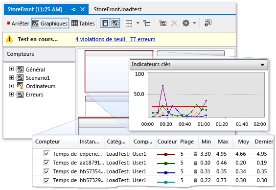

# Profiler les performances des applications SharePoint

Si vos applications SharePoint fonctionnent lentement ou mal, vous pouvez utiliser les fonctionnalités de profilage dans Visual Studio pour identifier le code problématique et autres éléments. À l’aide de la fonctionnalité de test de charge, vous pouvez déterminer comment une application SharePoint fonctionne en situation de stress, tels que lorsque plusieurs utilisateurs accéder à l’application simultanément. En exécutant des tests de performances web, vous pouvez mesurer le fonctionnement de l’application sur le web. À l’aide de tests codés d’IU, vous pouvez vérifier si l’application SharePoint, y compris son interface utilisateur, fonctionne correctement. Lorsque vous utilisez ces tests ensemble, ils peuvent vous aider à identifier les problèmes de performances avant de déployer votre application.

## Vue d’ensemble des outils de profil

Le profilage fait référence au processus d’observation et d’enregistrement du comportement de performance de votre application en cours d’exécution. En profilant votre application, vous pouvez découvrir des problèmes tels que les goulots d’étranglement, un code inefficace et les problèmes d’allocation de mémoire, qui s’exécutent lentement ou utilisent trop de mémoire par les applications. Par exemple, vous pouvez utiliser le profilage pour identifier les zones réactives dans votre code, qui sont des segments de code qui sont fréquemment appelées et peuvent ralentir les performances globales de votre application. Après avoir identifié les zones réactives, vous pouvez souvent optimiser ou de les éliminer.

Vous pouvez utiliser plusieurs outils de profilage dans l’environnement de développement intégré (IDE) pour identifier et localiser ces genres de problèmes de performances. Ces outils fonctionnent de la même façon pour les projets SharePoint que pour d’autres types de projets Visual Studio. L’Assistant Performance des outils de profilage vous guide tout au long de la création d’une session de performance qui utilise les tests que vous spécifiez. Une session de performance est un ensemble de données de configuration qui sont utilisés pour la collecte des informations sur les performances d’une application, ainsi que les résultats d’une ou plusieurs exécutions de profilage. Sessions de performance sont stockées dans votre dossier de projet, et vous pouvez les afficher dans **Explorateur de performances**. Pour plus d’informations, consultez [Understanding Performance Collection Methods](../profiling/understanding-performance-collection-methods.md) (Fonctionnement des méthodes de collecte des données de performances).

Une fois que vous créez et exécutez une analyse de profil sur votre application, un rapport fournit des détails sur ses performances. Ce rapport peut inclure des éléments tels qu’un graphique d’utilisation du processeur au fil du temps, une pile d’appels hiérarchique de fonction ou une arborescence des appels. Le contenu exact du rapport peut varier, selon le type de test que vous exécutez, telles que l’échantillonnage ou instrumentation. Pour plus d’informations, consultez [vue d’ensemble de rapports pour les outils de profilage](http://go.microsoft.com/fwlink/?LinkId=224689).

## Processus de session de performance

Pour profiler une application, vous démarrez à l’aide de l’Assistant Performance des outils de profilage pour créer une session de performance. Dans la barre de menus, choisissez **analyser**, **lancer l’Assistant Performance**. Comme l’Assistant est terminé, vous entrez les informations requises pour votre session de performance, telles que la méthode de profil et de l’application que vous voulez profiler. Pour plus d'informations, voir [Procédure : Profiler un Site Web ou une Application Web à l’aide de l’Assistant Performance](http://go.microsoft.com/fwlink/?LinkId=224692). Comme alternative, vous pouvez utiliser les options de ligne de commande pour configurer et exécuter une session de performance. Pour plus d’informations, consultez [à l’aide du profilage outils à partir de la ligne de commande](http://go.microsoft.com/fwlink/?LinkId=224703). Si vous souhaitez configurer tous les aspects d’une session de performance manuellement, consultez [Comment : Créer manuellement des Sessions de Performance avec les outils de profilage](http://go.microsoft.com/fwlink/?LinkId=224691). Vous pouvez également créer une session de performance à partir d’un test unitaire par, dans le **des résultats des tests** fenêtre, ouvrez le menu contextuel pour le test unitaire, puis en choisissant **créer une Session de Performance**.

Après avoir configuré une session de performance, la configuration de session est enregistrée, le serveur est configuré pour fournir des données de profilage, et l’application s’exécute. Lorsque vous utilisez l’application, les données de performances sont écrites dans un fichier journal. Sessions de performance sont répertoriées dans **Explorateur de performances** sous le **cibles** dossier. Une fois une session de performance se termine, son rapport apparaît dans le **rapports** dossier **Explorateur de performances**. Pour afficher le rapport, ouvrez-le dans **Explorateur de performances**. Pour afficher ou configurer les propriétés d’une session de performance, ouvrez le menu contextuel dans **Explorateur de performances**, puis choisissez **propriétés**. Pour plus d’informations sur les propriétés spécifiques d’une session de performance, consultez [configuration des Sessions de Performance pour les outils de profilage](http://go.microsoft.com/fwlink/?LinkId=224694). Pour plus d’informations sur la façon d’interpréter les résultats d’une session de performance, consultez [analyse des données des outils de profilage](http://go.microsoft.com/fwlink/?LinkId=224704).

## Test de contrainte

Vous pouvez analyser les performances de stress de vos applications en créant des tests de charge et tests de performances web dans Visual Studio. Lorsque vous créez un test de charge dans Visual Studio, vous spécifiez une combinaison de facteurs, appelée un scénario, pour tester votre application sur. Ces facteurs incluent le modèle de charge, modèle de combinaison de tests, la combinaison de tests, la combinaison de réseaux et la combinaison de navigateurs web. Scénarios de test de charge peuvent inclure des tests unitaires et tests de performances web.

Figure 1 : Exemple de résultats de test de charge

Tests de performances Web simulent la manière dont un utilisateur final peut interagir avec une application SharePoint. Vous pouvez créer des tests de performances web en enregistrant des requêtes HTTP dans une session de navigateur ou à l’aide de la **enregistreur de Test de performances Web**. Les requêtes web apparaissent dans le **éditeur de Test de performances Web** après la fin de la session de navigateur. Vous pouvez alors déboguer les résultats dans le **Afficheur de résultats de Test de performances Web**. Vous pouvez également générer manuellement des tests de performances web à l’aide de la **éditeur de Test de performances Web**.

## Interfaces utilisateur de test

Tests codés d’IU contrôlent automatiquement votre application SharePoint via son interface utilisateur (IU). Ces tests couvrent les contrôles de l’interface utilisateur, tels que des boutons et des menus, pour vérifier qu’ils fonctionnent correctement. Ce type de test est particulièrement utile si la validation ou une autre logique est effectuée dans l’interface utilisateur, comme dans une page web. Vous pouvez également utiliser des tests codés d’IU pour automatiser les tests manuels. Vous créez tests codés de l’interface utilisateur pour vos applications SharePoint de la même façon que vous créez des tests pour d’autres types d’applications. Pour plus d’informations, consultez [test d’Applications SharePoint 2010 avec des Tests codés de l’interface utilisateur](../test/testing-sharepoint-2010-applications-with-coded-ui-tests.md).

## Rubriques connexes

|Titre|Description|
|-----------|-----------------|
|[Procédure pas à pas : Profiler une application SharePoint](../sharepoint/walkthrough-profiling-a-sharepoint-application.md)|Montre comment effectuer une analyse de profil d’échantillonnage sur une application SharePoint.|
|[Tester les performances de votre application avant publication](/azure/devops/test/load-test/run-performance-tests-app-before-release?view=vsts)|Décrit comment créer des tests de charge, ce qui vous aident à un test de stress des applications SharePoint.|
|[Tests unitaires sur votre code](../test/unit-test-your-code.md)|Décrit comment rechercher des erreurs de logique dans votre code à l’aide de tests unitaires.|
|[Test des applications SharePoint 2010 avec des tests codés de l’interface utilisateur](../test/testing-sharepoint-2010-applications-with-coded-ui-tests.md)|Décrit comment tester l’interface utilisateur de vos applications SharePoint.|

## Voir aussi

- [Générer et déboguer des solutions SharePoint](../sharepoint/building-and-debugging-sharepoint-solutions.md)
- [Améliorer la qualité du code](../test/improve-code-quality.md)