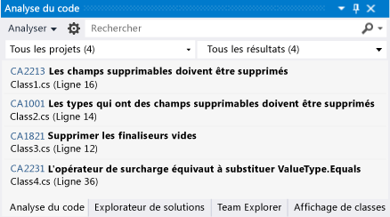
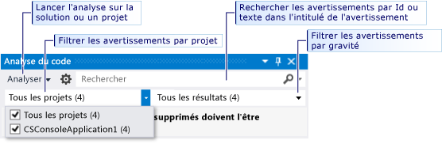

# Analyse de la qualité du code Visual Basic et C# dans les applications UWP à l’aide de l’analyse statique du code Visual Studio
  
  
 L'outil d'analyse du code dans Visual Studio Express examine votre code à la recherche d'un ensemble d'erreurs courantes et du non-respect d'une bonne approche en matière de programmation. Les avertissements de l'analyse du code diffèrent des erreurs et des avertissements du compilateur parce que l'outil d'analyse du code recherche des modèles de code spécifiques qui sont valides, mais qui peuvent créer des problèmes pour vous ou d'autres utilisateurs de votre code. L'analyse du code peut également trouver des erreurs dans votre code qui seraient difficiles à détecter en testant. L'exécution de l'outil d'analyse du code à intervalles réguliers pendant le processus de développement peut améliorer la qualité de votre application terminée.  
  
> [!NOTE]
>  Dans Visual Studio Ultimate, Visual Studio Premium et Visual Studio Professional, vous pouvez utiliser les fonctionnalités complètes d'analyse du code. Consultez [Analyse de la qualité des applications à l’aide des outils d’analyse du code](http://msdn.microsoft.com/library/dd264897.aspx) dans MSDN Library.  
  
## Dans cette rubrique  
 Vous allez découvrir ce qui suit :  
  
 [Exécution de l’analyse du code](../test/analyze-visual-basic-and-csharp-code-quality-in-store-apps-using-visual-studio-static-code-analysis.md#BKMK_Run)  
  
 [Analyse et résolution des avertissements de l’analyse du code](../test/analyze-visual-basic-and-csharp-code-quality-in-store-apps-using-visual-studio-static-code-analysis.md#BKMK_Analyze)  
  
 [Suppression des avertissements de l’analyse du code](../test/analyze-visual-basic-and-csharp-code-quality-in-store-apps-using-visual-studio-static-code-analysis.md#BKMK_Suppress)  
  
 [Explorer et filtrer les résultats d’analyse du code](../test/analyze-visual-basic-and-csharp-code-quality-in-store-apps-using-visual-studio-static-code-analysis.md#BKMK_Search)  
  
 [Avertissements de l’analyse du code Visual Basic et C#](../test/analyze-visual-basic-and-csharp-code-quality-in-store-apps-using-visual-studio-static-code-analysis.md#BKMK_Warnings)  
  
##   Exécution de l’analyse du code  
 Pour exécuter l'analyse du code sur votre solution Visual Studio :  
  
-   Dans le menu **Générer**, choisissez **Exécuter l’analyse du code sur la solution**.  
  
 Pour exécuter automatiquement l'analyse du code chaque fois que vous générez un projet :  
  
1.  Dans l’Explorateur de solutions, cliquez avec le bouton droit sur le nom du projet, puis choisissez **Propriétés**.  
  
2.  Dans la page des propriétés du projet, choisissez **Analyse du code**, puis **Activer l’analyse du code sur la build (définit la constante CODEANALYSIS)**.  
  
 La solution est compilée et l'analyse du code s'exécute. Les résultats s'affichent dans la fenêtre Analyse du code.  
  
   
  
##   Analyse et résolution des avertissements de l’analyse du code  
 Pour analyser un avertissement spécifique, cliquez sur son titre dans la fenêtre Analyse du code. L'avertissement se développe pour afficher des informations détaillées sur le problème.  
  
   
  
 Lorsque vous développez un avertissement, la ligne de code à l’origine de l’avertissement est mise en surbrillance dans l’éditeur de Visual Studio Code.  
  
   
  
 Une fois que vous avez compris le problème, vous pouvez le résoudre dans votre code. Réexécutez l'analyse du code pour vérifier que l'avertissement n'apparaît plus dans la fenêtre Analyse du code et que votre correctif n'a pas généré de nouveaux avertissements.  
  
> [!TIP]
>  Vous pouvez réexécuter l'analyse du code dans la fenêtre Analyse du code. Cliquez sur le bouton **Analyser** et choisissez l’étendue de l’analyse. Vous pouvez réexécuter l'analyse sur la solution complète ou sur un projet sélectionné.  
  
##   Suppression des avertissements de l’analyse du code  
 Vous pouvez décider, dans certaines situations, de ne pas corriger un avertissement de l'analyse du code. Vous pouvez décider que la résolution de l'avertissement requiert un recodage trop important par rapport à la probabilité que le problème se produise dans une implémentation réelle de votre code. Vous pouvez également estimer que l'analyse utilisée dans l'avertissement est inadéquate pour le contexte particulier. Vous pouvez supprimer des avertissements individuels afin qu'ils n'apparaissent plus dans la fenêtre Analyse du code.  
  
 Pour supprimer un avertissement :  
  
1.  Si les informations détaillées ne s’affichent pas, cliquez sur le titre de l’avertissement pour le développer.  
  
2.  Choisissez le lien **Actions** au bas de l’avertissement.  
  
3.  Pointez sur **Supprimer le message**, puis choisissez **Dans la source** ou **Dans le fichier de suppression**.  
  
    -   **Dans la source** insère un attribut `SuppressMessage` dans le fichier source au-dessus de la méthode qui a généré l’avertissement. Cela rend la suppression plus détectable.  
  
    -   **Dans le fichier de suppression** ajoute un attribut `SuppressMessage` au fichier **GlobalSuppressions.cs** du projet. Cela peut simplifier la gestion des suppressions. Notez que l’attribut `SuppressMessage` ajouté au fichier **GlobalSuppression.cs** cible également la méthode qui a généré l’avertissement. Il n'effectue pas une suppression globale de l'avertissement.  
  
     Votre décision de supprimer l'avertissement dans le fichier source ou dans le fichier de suppression dépend de votre style de codage et de vos besoins.  
  
##   Explorer et filtrer les résultats d’analyse du code  
 Vous pouvez effectuer une recherche dans de longues listes de messages d'avertissement, et vous pouvez filtrer les avertissements dans les solutions à projets multiples.  
  
   
  
 Dans [!INCLUDE[vs_dev11_expwin_long](../misc/includes/vs_dev11_expwin_long_md.md)], tous les avertissements de l'analyse du code ont le niveau de gravité Avertissement.  
  
##   Avertissements de l’analyse du code Visual Basic et C#  
 L'analyse du code génère les avertissements suivants :  
  
 [CA1001 : Les types qui ont des champs supprimables doivent être supprimables](http://msdn.microsoft.com/library/ms182172.aspx)  
  
 [CA1821 : Supprimez les finaliseurs vides](http://msdn.microsoft.com/library/bb264476.aspx)  
  
 [CA2213 : Les champs pouvant être supprimés doivent l’être](http://msdn.microsoft.com/library/ms182328.aspx)  
  
 [CA2229 : Implémentez des constructeurs de sérialisation](http://msdn.microsoft.com/library/ms182343.aspx)  
  
 [CA2231 : Surchargez l’opérateur égal (equals) en remplaçant ValueType.Equals](http://msdn.microsoft.com/library/ms182359.aspx)
