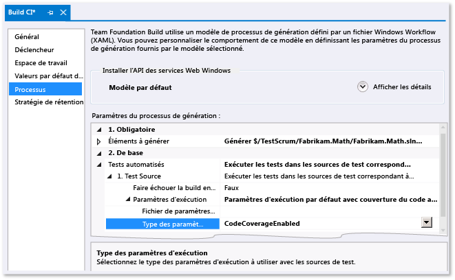

# Analyse de la couverture du code dans les tests de vérification de build
L’analyse de la couverture du code dans Microsoft Visual Studio vous montre le volume de code traité par les tests automatisés. Pour plus d’informations, consultez [Utilisation de la couverture du code pour déterminer la quantité de code testé](../test/using-code-coverage-to-determine-how-much-code-is-being-tested.md).  
  
 Lorsque vous archivez votre code, vos tests s’exécutent sur le serveur de builds, avec l’ensemble des tests des autres membres de l’équipe. (Si vous ne l’avez pas déjà fait, consultez [Exécuter des tests dans votre processus de génération](http://msdn.microsoft.com/Library/d05743a1-c5cf-447e-bed9-bed3cb595e38).) L’analyse de la couverture du code dans le service de build est très utile, car elle permet d’obtenir l’image la plus récente et la plus complète de la couverture du code dans l’ensemble du projet. Elle inclut également des tests système automatisés et d’autres tests codés qui ne sont généralement pas exécutés sur les ordinateurs de développement.  
  
1.  Dans Team Explorer, ouvrez **Builds**, puis ajoutez ou modifiez une définition de build.  
  
2.  Dans la page **Processus**, développez **Tests automatisés**, **Source de test**, **Paramètres d’exécution**. Affectez à **Type des paramètres d’exécution** la valeur **Couverture du code activée**.  
  
     Si vous avez plusieurs définitions de source de test, répétez cette étape pour chaque définition.  
  
    -   *Mais aucun champ n’est nommé **Type de fichier des paramètres d’exécution**.*  
  
         Sous **Tests automatisés**, sélectionnez **Assembly de test**, puis choisissez le bouton de sélection **[...]** situé à la fin de la ligne. Dans la boîte de dialogue **Ajouter/Modifier une série de tests**, sous **Test Runner**, choisissez **Visual Studio Test Runner**.  
  
   
  
 Après l’exécution de la build, les résultats de la couverture du code s’affichent dans le résumé de la build.  
  
## Voir aussi  
 [Utilisation de la couverture du code pour déterminer la quantité de code testé](../test/using-code-coverage-to-determine-how-much-code-is-being-tested.md)
