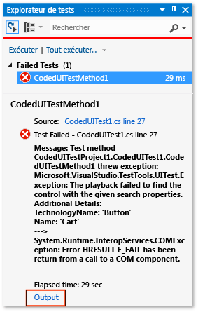
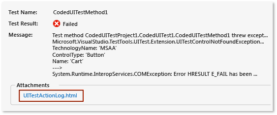
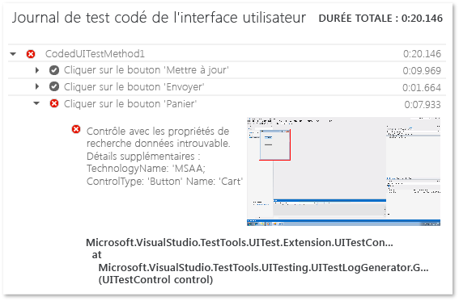

# <a name="analyzing-coded-ui-tests-using-coded-ui-test-logs"></a>Analyse des tests codés de l’interface utilisateur à l’aide des journaux de test codé de l’interface utilisateur

Les journaux de tests codés de l'interface utilisateur filtrent et enregistrent des informations importantes sur l'exécution de vos tests codés de l'interface utilisateur. Les journaux sont présentés dans un format qui permet de déboguer les problèmes rapidement.

## <a name="step-1-enable-logging"></a>Étape 1 : Activer la journalisation

Selon votre scénario, appliquez l’une des méthodes suivantes pour activer le journal :

- Cibler .NET Framework version 4 sans fichier *App.config* présent dans le projet de test :

   1. Ouvrez le fichier *QTAgent32_40.exe.config*. Par défaut, ce fichier se trouve dans *%ProgramFiles(x86)%\Microsoft Visual Studio\2017\Enterprise\Common7\IDE*.

   2. Réglez la valeur de EqtTraceLevel au niveau de journalisation souhaité.

   3. Enregistrez le fichier.

- Cibler .NET Framework version 4.5 sans fichier *App.config* présent dans le projet de test :

   1. Ouvrez le fichier *QTAgent32.exe.config*. Par défaut, ce fichier se trouve dans *%ProgramFiles(x86)%\Microsoft Visual Studio\2017\Enterprise\Common7\IDE*.

   2. Réglez la valeur de EqtTraceLevel au niveau de journalisation souhaité.

   3. Enregistrez le fichier.

- Fichier *App.config* présent dans le projet de test :

    - Ouvrez le fichier *App.config* dans le projet, puis ajoutez le code suivant sous le nœud de configuration :

      ```xml
      <system.diagnostics>
        <switches>
          <add name="EqtTraceLevel" value="4" />
        </switches>
      </system.diagnostics>`
      ```

- Activer la journalisation à partir du code de test proprement dit :

   <xref:Microsoft.VisualStudio.TestTools.UITesting.PlaybackSettings.LoggerOverrideState%2A> = HtmlLoggerState.AllActionSnapshot;

## <a name="step-2-run-your-coded-ui-test-and-view-the-log"></a>Étape 2 : Exécuter votre test codé de l'interface utilisateur et afficher le journal

Quand vous exécutez un test codé de l’interface utilisateur avec les modifications du fichier *QTAgent32.exe.config* en place, vous constatez qu’un lien de sortie figure dans les résultats de l’**Explorateur de tests**. Des fichiers journaux sont générés non seulement quand votre test échoue, mais aussi quand les tests réussissent si le niveau de trace a la valeur « Commentaires ».

1.  Dans le menu **Test**, choisissez **Fenêtres**, puis **Explorateur de tests**.

2.  Dans le menu **Générer** , choisissez **Générer la solution**.

3.  Dans l’**Explorateur de tests**, sélectionnez le test codé de l’interface utilisateur à exécuter, ouvrez son menu contextuel, puis choisissez **Exécuter les tests sélectionnés**.

     Les tests automatisés s’exécutent, puis un message indique s’ils sont une réussite ou un échec.

    > [!TIP]
    > Pour afficher l’**Explorateur de tests**, choisissez **Test** > **Fenêtres**, puis choisissez **Explorateur de tests**.

4.  Choisissez le lien **Sortie** dans les résultats de l’**Explorateur de tests**.

     

     Cela permet d’afficher la sortie du test, qui inclut un lien vers le journal des actions.

     

5.  Choisissez le lien *UITestActionLog.html*.

     Le journal s'affiche dans votre navigateur web.

     

## <a name="see-also"></a>Voir aussi

- [Utiliser l’automatisation de l’interface utilisateur pour tester votre code](../test/use-ui-automation-to-test-your-code.md)
- [Guide pratique pour exécuter des tests à partir de Microsoft Visual Studio](https://msdn.microsoft.com/Library/1a1207a9-2a33-4a1e-a1e3-ddf0181b1046)