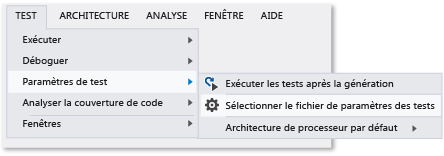

# <a name="configure-unit-tests-by-using-a-runsettings-file"></a>Configurer des tests unitaires à l'aide d'un fichier .runsettings
Les tests unitaires dans Visual Studio peuvent être configurés à l’aide d’un fichier *.runsettings. (Le nom du fichier n'a pas d'importance, à condition que l'extension soit « .runsettings ».) Par exemple, vous pouvez modifier le .NET Framework sur lequel les tests sont exécutés, le répertoire dans lequel les résultats des tests sont remis et les données recueillies pendant une série de tests.  
  
 Si vous ne voulez pas appliquer de configuration spéciale, vous n’avez pas besoin de fichier *.runsettings. L’utilisation la plus fréquente consiste à personnaliser la [couverture du code](../test/customizing-code-coverage-analysis.md).  
  
> [!NOTE]
>  **.runsettings et .testsettings**  
>   
>  Il existe deux types de fichiers pour configurer des tests. Les fichiers *.runsettings sont utilisés pour les tests unitaires. Les fichiers \*.testsettings sont utilisés pour les [tests d’environnement lab](/devops-test-docs/test/specifying-test-settings-for-visual-studio-tests), les tests de charge et de performance web, ainsi que la personnalisation de certains types d’adaptateur de données de diagnostic tels qu’IntelliTrace et les adaptateurs de journaux des événements.  
>   
>  Dans les éditions précédentes de Visual Studio jusqu’à la version 2010, vous pouvez aussi personnaliser les tests unitaires à l’aide de fichiers *.testsettings. Cela est toujours possible, mais les tests s’exécutent plus lentement que si vous utilisez les configurations équivalentes dans un fichier \*.runsettings.  
  
## <a name="customizing-tests-with-a-runsettings-file"></a>Personnalisation des tests avec un fichier .runsettings  
  
1.  Ajoutez un fichier XML à votre solution Visual Studio et renommez-le test.runsettings. (Le nom du fichier n’a pas d’importance, mais l’extension doit être .runsettings.)  
  
2.  Remplacez le contenu du fichier par l’ [exemple](#example).  
  
     Effectuez des modifications en fonction de vos propres besoins.  
  
3.  Dans le menu **Test** , choisissez **Paramètres de test**, **Sélectionner le fichier de paramètres des tests**.  
  
 Vous pouvez créer plusieurs fichiers \*.runsettings dans votre solution et les activer ou les désactiver à différents moments via le menu **Paramètres de test**.  
  
   
  
##  <a name="example"></a> Copier cet exemple de fichier .runsettings  
 Voici un fichier *.runsettings classique. Chaque élément du fichier est facultatif, car chaque valeur est définie par défaut.  
  
```xml  
<?xml version="1.0" encoding="utf-8"?>  
<RunSettings>  
  <!-- Configurations that affect the Test Framework -->  
  <RunConfiguration>  
    <MaxCpuCount>1</MaxCpuCount>  
    <!-- Path relative to solution directory -->  
    <ResultsDirectory>.\TestResults</ResultsDirectory>  
  
    <!-- [x86] | x64    
      - You can also change it from menu Test, Test Settings, Default Processor Architecture -->  
    <TargetPlatform>x86</TargetPlatform>  
  
    <!-- Framework35 | [Framework40] | Framework45 -->  
    <TargetFrameworkVersion>Framework40</TargetFrameworkVersion>  
  
    <!-- Path to Test Adapters -->  
    <TestAdaptersPaths>%SystemDrive%\Temp\foo;%SystemDrive%\Temp\bar</TestAdaptersPaths>  
  </RunConfiguration>  
  
  <!-- Configurations for data collectors -->  
  <DataCollectionRunSettings>  
    <DataCollectors>  
      <DataCollector friendlyName="Code Coverage" uri="datacollector://Microsoft/CodeCoverage/2.0" assemblyQualifiedName="Microsoft.VisualStudio.Coverage.DynamicCoverageDataCollector, Microsoft.VisualStudio.TraceCollector, Version=11.0.0.0, Culture=neutral, PublicKeyToken=b03f5f7f11d50a3a">  
        <Configuration>  
          <CodeCoverage>  
            <ModulePaths>  
              <Exclude>  
                <ModulePath>.*CPPUnitTestFramework.*</ModulePath>  
              </Exclude>  
            </ModulePaths>  
  
            <!-- We recommend you do not change the following values: -->  
            <UseVerifiableInstrumentation>True</UseVerifiableInstrumentation>  
            <AllowLowIntegrityProcesses>True</AllowLowIntegrityProcesses>  
            <CollectFromChildProcesses>True</CollectFromChildProcesses>  
            <CollectAspDotNet>False</CollectAspDotNet>  
  
          </CodeCoverage>  
        </Configuration>  
      </DataCollector>  
  
    </DataCollectors>  
  </DataCollectionRunSettings>  
  
  <!-- Parameters used by tests at runtime -->  
  <TestRunParameters>  
    <Parameter name="webAppUrl" value="http://localhost" />  
    <Parameter name="webAppUserName" value="Admin" />  
    <Parameter name="webAppPassword" value="Password" />  
  </TestRunParameters>  
  
  <!-- Adapter Specific sections -->  
  
  <!-- MSTest adapter -->  
  <MSTest>  
    <MapInconclusiveToFailed>True</MapInconclusiveToFailed>  
    <CaptureTraceOutput>false</CaptureTraceOutput>  
    <DeleteDeploymentDirectoryAfterTestRunIsComplete>False</DeleteDeploymentDirectoryAfterTestRunIsComplete>  
    <DeploymentEnabled>False</DeploymentEnabled>  
    <AssemblyResolution>  
      <Directory Path="D:\myfolder\bin\" includeSubDirectories="false"/>  
    </AssemblyResolution>  
  </MSTest>  
  
</RunSettings>  
```  
  
 Le fichier .runsettings sert aussi à configurer la [couverture du code](../test/customizing-code-coverage-analysis.md).  
  
 Le reste de cette rubrique décrit le contenu du fichier.  
  
## <a name="edit-your-runsettings-file"></a>Modifier votre fichier .runsettings  
 Le fichier .runsettings possède les éléments suivants.  
  
### <a name="test-run-configuration"></a>Configuration de série de tests  
  
|Nœud|Par défaut|Valeurs|  
|----------|-------------|------------|  
|`ResultsDirectory`||Répertoire où les résultats de test seront placés.|  
|`TargetFrameworkVersion`|Framework40|Framework35, Framework40, Framework45<br /><br /> Spécifie la version de l’infrastructure de tests unitaires qui est utilisée pour découvrir et exécuter les tests. Elle peut être différente de la version de la plateforme .NET. que vous spécifiez dans les propriétés de génération du projet de test unitaire.|  
|`TargetPlatform`|x86|x86, x64|  
|`TreatTestAdapterErrorsAsWarnings`|false|false, true|  
|`TestAdaptersPaths`||Un ou plusieurs chemins au répertoire où se trouvent les TestAdapters|  
|`MaxCpuCount`|1|Cela permet de contrôler le degré d’exécution de tests parallèles pendant les tests unitaires, en utilisant les cœurs disponibles sur la machine.  Le moteur d’exécution de test démarre en tant que processus distinct sur chaque cœur disponible et donne à chaque cœur un conteneur de tests à exécuter, tel qu’un assembly, une DLL ou l’artefact correspondant.  Le conteneur de test est l’unité de planification.  Dans chaque conteneur, les tests sont exécutés en fonction de l’infrastructure de tests configurée.  S’il y a beaucoup de conteneurs, chaque processus reçoit le conteneur disponible suivant dès qu’il a terminé l’exécution des tests d’un conteneur.<br /><br /> Valeur possible pour MaxCpuCount :<br /><br /> n, où 1 < = n < = nombre de cœurs : jusqu’à n processus peuvent être lancés.<br /><br /> n, où n = toute autre valeur : le nombre de processus lancés dépend du nombre de cœurs disponibles sur la machine.|  
  
### <a name="diagnostic-data-adapters-data-collectors"></a>Diagnostic des adaptateurs de données (collecteurs de données)  
 L’élément `DataCollectors` spécifie les paramètres des adaptateurs de données de diagnostic. Les adaptateurs de données de diagnostic sont utilisés pour rassembler des informations supplémentaires sur l’environnement et l’application testée. Chaque adaptateur a des paramètres par défaut. Il vous suffit de fournir des paramètres si vous ne souhaitez pas utiliser les valeurs par défaut.  
  
#### <a name="code-coverage-adapter"></a>Adaptateur de couverture du code  
 Le collecteur de données de couverture du code crée un journal des parties du code d’application qui ont été testées. Pour plus d’informations sur la personnalisation des paramètres pour la couverture du code, consultez [Personnalisation de l’analyse de la couverture du code](../test/customizing-code-coverage-analysis.md).  
  
#### <a name="other-diagnostic-data-adapters"></a>Autres adaptateurs de données de diagnostic  
 L’adaptateur de couverture du code est actuellement le seul adaptateur qui peut être personnalisé à l’aide du fichier de paramètres d’exécution.  
  
 Pour personnaliser un autre type d’adaptateur de données de diagnostic, vous devez utiliser un fichier de paramètres de test. Pour plus d’informations, consultez [Spécification des paramètres de test pour les tests Visual Studio](/devops-test-docs/test/specifying-test-settings-for-visual-studio-tests).  
  
#### <a name="testrunparameters"></a>TestRunParameters  
 TestRunParameters fournit un moyen de définir des variables et des valeurs qui sont disponibles pour les tests au moment de l’exécution.  
  
### <a name="mstest-run-settings"></a>Paramètres d’exécution MSTest  
 Ces paramètres sont spécifiques à l’adaptateur de test qui exécute les méthodes de test disposant de l’attribut `[TestMethod]` .  
  
|Configuration|Par défaut|Valeurs|  
|-------------------|-------------|------------|  
|ForcedLegacyMode|false|Dans Visual Studio 2012, l’adaptateur MSTest a été optimisé afin d’être plus rapide et plus scalable. Un comportement, tel que l’ordre dans lequel les tests sont exécutés, peut ne pas être exactement identique à celui d’éditions précédentes de Visual Studio. Attribuez la valeur `true` pour utiliser l’adaptateur de test le plus ancien.<br /><br /> Par exemple, vous pouvez utiliser ce scénario si un fichier app.config est spécifié pour un test unitaire.<br /><br /> Il est recommandé d’envisager de refactoriser vos tests pour vous permettre d’utiliser le nouvel adaptateur.|  
|IgnoreTestImpact|false|La fonctionnalité d’impact de test classe par priorité les tests affectés par des modifications récentes, lorsqu’ils sont exécutés dans MSTest ou à partir de Microsoft Test Manager. Ce paramètre désactive la fonctionnalité. Pour plus d’informations, consultez [Guide pratique pour collecter des données et vérifier les tests à exécuter après des modifications du code](http://msdn.microsoft.com/Library/2f921ea1-9bb0-4870-a30f-0521fc22cb47).|  
|SettingsFile||Vous pouvez spécifier un fichier de paramètres de test à utiliser avec l’adaptateur MSTest ici. Vous pouvez également spécifier un fichier de paramètres de test via le menu **Test**, **Paramètres de test**, **Sélectionner le fichier de paramètres des tests**.<br /><br /> Si vous spécifiez cette valeur, vous devez également affecter à **ForcedlegacyMode** la valeur **true**.<br /><br /> `<RunSettings>   <MSTest>     <SettingsFile>my.testsettings</SettingsFile>      <ForcedLegacyMode>true</ForcedLegacyMode>    </MSTest> </RunSettings>`|  
|KeepExecutorAliveAfterLegacyRun|false|Une fois qu’une série de tests est terminée, MSTest est arrêté. Tout processus qui est lancé dans le cadre du test sera également supprimé à ce moment. Si vous souhaitez conserver l’exécuteur de test actif, définissez cette configuration sur true.<br /><br /> Par exemple, vous pouvez l’utiliser pour que le navigateur continue à s’exécuter entre les tests de l’interface utilisateur codés.|  
|DeploymentEnabled|true|Si vous définissez cette valeur sur false, les éléments de déploiement que vous avez spécifiés dans votre méthode de test ne seront pas copiés vers le répertoire de déploiement.|  
|CaptureTraceOutput|true|Vous pouvez écrire dans la trace du débogage à partir de votre méthode de test en utilisant Trace.WriteLine. Cette configuration vous permet de désactiver ces traces de débogage.|  
|DeleteDeploymentDirectoryAfterTestRunIsComplete|true|Vous pouvez conserver le répertoire de déploiement après une série de tests en définissant cette valeur sur false.|  
|MapInconclusiveToFailed|false|Si un test retourne un état Non concluant, il est généralement mappé à l’état Ignoré dans l’Explorateur de tests. Si vous souhaitez que les tests non concluants s’affichent comme ayant échoué, utilisez cette configuration.|  
|InProcMode|false|Si vous souhaitez que vos tests soient exécutés dans le même processus que l’adaptateur de test Microsoft, définissez cette valeur sur True. Ce paramètre offre un gain de performances mineur. Mais si un test s’arrête à cause d’une exception, les autres tests s’arrêteront également.|  
|AssemblyResolution|false|Vous pouvez spécifier des chemins d’assemblys supplémentaires pour la recherche et l’exécution des tests unitaires.  Par exemple, utilisez ces chemins pour les assemblys de dépendance qui ne se trouvent pas dans le même répertoire que l’assembly de test.  Pour spécifier un chemin, utilisez un élément « Directory Path ».  Les chemins peuvent contenir des variables d’environnement.<br /><br /> `<AssemblyResolution>  <Directory Path>"D:\myfolder\bin\" includeSubDirectories="false"/> </AssemblyResolution>`|  
  
## <a name="see-also"></a>Voir aussi  
 [Personnalisation de l’analyse de la couverture du code](../test/customizing-code-coverage-analysis.md)   
 [Spécification des paramètres de test pour les tests Visual Studio](/devops-test-docs/test/specifying-test-settings-for-visual-studio-tests)

