# Cr&#233;ation d&#39;un test cod&#233; de l&#39;interface utilisateur pilot&#233; par les donn&#233;es
[!INCLUDE[vs2017banner](../code-quality/includes/vs2017banner.md)]

Pour tester différentes conditions, vous pouvez exécuter vos tests à plusieurs reprises avec différentes valeurs de paramètre. Les tests codés de l'interface utilisateur pilotés par les données sont un moyen pratique pour cela. Vous définissez des valeurs de paramètre dans une source de données et chaque ligne de la source de données est une itération du test codé de l'interface utilisateur. Le résultat global du test repose sur le résultat de toutes les itérations. Par exemple, si une itération de test échoue, le résultat global du test est un échec.  
  
 **Requirements**  
  
-   Visual Studio Enterprise  
  
## <a name="create-a-data-driven-coded-ui-test"></a>Créer un test codé de l'interface utilisateur piloté par les données  
 Cet exemple crée un test codé de l'interface utilisateur qui s'exécute sur l'application Calculatrice de Windows. Il additionne deux nombres et utilise une assertion pour valider que la somme est correcte. Ensuite, l'assertion et les valeurs de paramètre des deux nombres sont codées pour devenir pilotées par les données et stockées dans un fichier de valeurs séparées par des virgules (.csv).  
  
#### <a name="step-1---create-a-coded-ui-test"></a>Étape 1 : Créer un test codé de l'interface utilisateur  
  
1.  Créez un projet.  
  
     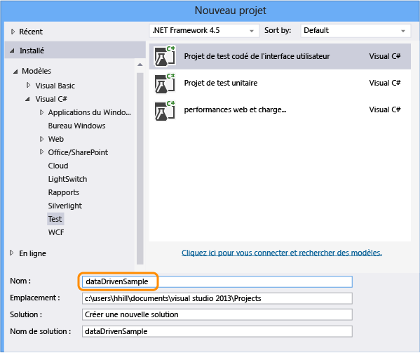  
  
2.  Choisissez d'enregistrer les actions.  
  
     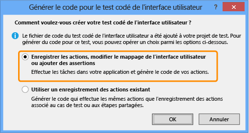  
  
3.  Ouvrez l'application Calculatrice et démarrez l'enregistrement du test.  
  
     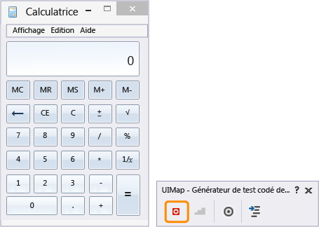  
  
4.  Additionnez 1 et 2, interrompez l'enregistreur et générez la méthode de test. Plus tard, nous allons remplacer les valeurs de cette entrée utilisateur par les valeurs d'un fichier de données.  
  
     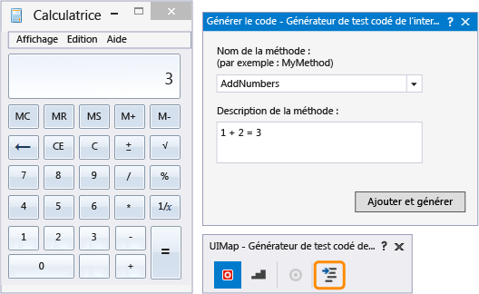  
  
     Fermez le générateur de test. La méthode est ajoutée au test :  
  
    ```c#  
    [TestMethod]  
    public void CodedUITestMethod1()  
    {  
        // To generate code for this test, select "Generate Code for Coded UI Test" from the shortcut menu and select one of the menu items.  
        this.UIMap.AddNumbers();  
  
    }  
    ```  
  
5.  Utilisez la méthode `AddNumbers()` pour vérifier que le test s'exécute. Placez le curseur dans la méthode de test illustrée ci-dessus, ouvrez le menu contextuel et choisissez **exécuter des Tests**. (Raccourci clavier : Ctrl+R, T).  
  
     Le résultat du test qui indique si le test a réussi ou a échoué apparaît dans la fenêtre Explorateur de tests. Pour ouvrir la fenêtre Explorateur de tests, à partir de la **TEST** menu, choisissez **Windows** puis **Explorateur de tests**.  
  
6.  Dans la mesure où une source de données peut également être utilisée pour les valeurs de paramètre d'assertion (qui sont utilisées par le test pour vérifier les valeurs attendues), ajoutons une assertion pour confirmer que la somme des deux nombres est correcte. Placez le curseur dans la méthode de test illustrée ci-dessus, ouvrez le menu contextuel et choisissez **Générer le Code pour le Test codé de l’interface Utilisateur**, puis **utiliser le Générateur de Test codé de l’interface Utilisateur**.  
  
     Mappez le contrôle de texte dans la calculatrice qui affiche la somme.  
  
     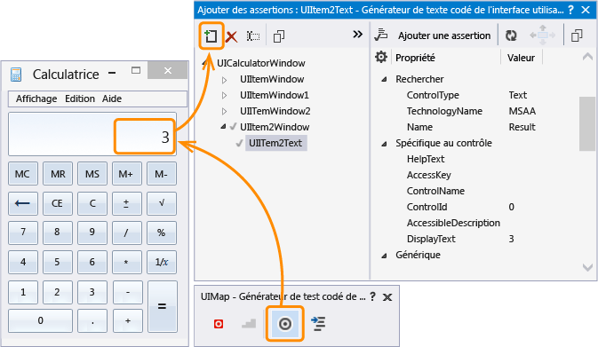  
  
7.  Ajoutez une assertion qui vérifie que la valeur de la somme est correcte. Choisissez le **DisplayText** dont la valeur de propriété **3** puis **Ajouter une Assertion**. Utilisez le **AreEqual** comparateur et vérifiez que la valeur de comparaison est **3**.  
  
     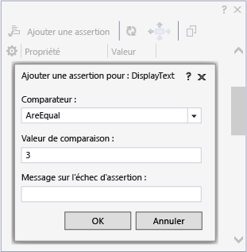  
  
8.  Après avoir configuré l'assertion, générez à nouveau le code à partir du générateur. Une nouvelle méthode pour la validation est ainsi créée.  
  
     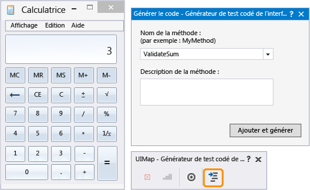  
  
     Étant donné que la méthode `ValidateSum` valide les résultats de la méthode `AddNumbers`, déplacez-la vers le bas du bloc de code.  
  
    ```c#  
    public void CodedUITestMethod1()  
    {  
  
        // To generate code for this test, select "Generate Code for Coded UI Test" from the shortcut menu and select one of the menu items.  
        this.UIMap.AddNumbers();  
        this.UIMap.ValidateSum();  
  
    }  
    ```  
  
9. Vérifiez que le test s'exécute à l'aide de la méthode `ValidateSum()`. Placez le curseur dans la méthode de test illustrée ci-dessus, ouvrez le menu contextuel et choisissez **exécuter des Tests**. (Raccourci clavier : Ctrl+R, T).  
  
     À ce stade, toutes les valeurs de paramètre sont définies dans leurs méthodes en tant que constantes. Ensuite, nous allons créer un jeu de données pour créer notre test piloté par les données.  
  
#### <a name="step-2---create-a-data-set"></a>Étape 2 : créer un jeu de données  
  
1.  Ajoutez un fichier texte au projet dataDrivenSample nommé `data.csv`.  
  
     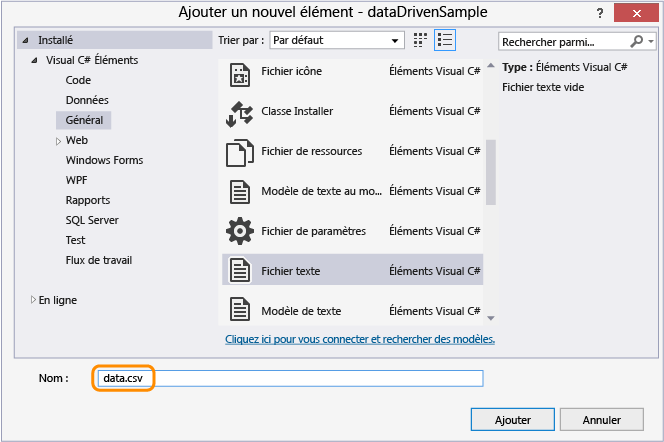  
  
2.  Renseignez le fichier .csv avec les données suivantes :  
  
    |Num1|Num2|Sum|  
    |----------|----------|---------|  
    |3|4|7|  
    |5|6|11|  
    |6|8|14|  
  
     Après avoir ajouté les données, le fichier doit ressembler à ce qui suit :  
  
     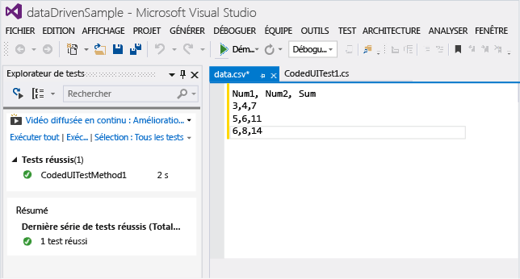  
  
3.  Il est important d'enregistrer le fichier .csv en utilisant le bon encodage. Sur le **FICHIER** menu, choisissez **Options d’enregistrement avancées** et choisissez **Unicode (UTF-8 sans signature)-page de codes 65001** comme le codage.  
  
4.  Le fichier .csv doit être copié dans le répertoire de sortie, sans quoi le test ne peut pas s'exécuter. Utilisez la fenêtre Propriétés pour le copier.  
  
       
  
     Maintenant que nous avons créé le jeu de données, nous allons lier les données au test.  
  
#### <a name="step-3-add-data-source-binding"></a>Étape 3 : ajouter une liaison de source de données  
  
1.  Pour lier la source de données, ajoutez un attribut `DataSource` dans l'attribut `[TestMethod]` existant qui se trouve juste au-dessus de la méthode de test.  
  
    ```  
    [DataSource("Microsoft.VisualStudio.TestTools.DataSource.CSV", "|DataDirectory|\\data.csv", "data#csv", DataAccessMethod.Sequential), DeploymentItem("data.csv"), TestMethod]  
    public void CodedUITestMethod1()  
    {  
  
        // To generate code for this test, select "Generate Code for Coded UI Test" from the shortcut menu and select one of the menu items.  
        this.UIMap.AddNumbers();  
        this.UIMap.ValidateSum();  
  
    }  
  
    ```  
  
     La source de données est maintenant disponible pour cette méthode de test.  
  
    > [!TIP]
    >  Consultez [exemples d’attribut de source de données](#CreateDataDrivenCUIT_QA_DataSourceAttributes) dans la section questions pour obtenir des exemples d’utilisation des autres types de sources de données telles que XML, SQL Express et Excel.  
  
2.  Exécutez le test.  
  
     Notez que le test s'exécute via trois itérations. En effet, la source de données qui a été liée contient trois lignes de données. En revanche, vous pouvez remarquer que le test utilise toujours les valeurs de paramètre constantes et additionne 1 + 2 avec une somme de 3 à chaque fois.  
  
     Ensuite, nous allons configurer le test pour utiliser les valeurs incluses dans le fichier de la source de données.  
  
#### <a name="step-4-use-the-data-in-the-coded-ui-test"></a>Étape 4 : utiliser les données dans le test codé de l'interface utilisateur  
  
1.  Ajoutez `using Microsoft.VisualStudio.TestTools.UITesting.WinControls` en début du fichier CodedUITest.cs :  
  
    ```  
    using System;  
    using System.Collections.Generic;  
    using System.Text.RegularExpressions;  
    using System.Windows.Input;  
    using System.Windows.Forms;  
    using System.Drawing;  
    using Microsoft.VisualStudio.TestTools.UITesting;  
    using Microsoft.VisualStudio.TestTools.UnitTesting;  
    using Microsoft.VisualStudio.TestTools.UITest.Extension;  
    using Keyboard = Microsoft.VisualStudio.TestTools.UITesting.Keyboard;  
    using Microsoft.VisualStudio.TestTools.UITesting.WinControls;  
    ```  
  
2.  Ajoutez `TestContext.DataRow[]` dans la méthode `CodedUITestMethod1()` qui va appliquer les valeurs de la source de données. Les valeurs de la source de données se substituent aux constantes affectées aux contrôles UIMap en utilisant les contrôles `SearchProperties` :  
  
    ```  
    public void CodedUITestMethod1()  
    {  
  
        // To generate code for this test, select "Generate Code for Coded UI Test" from the shortcut menu and select one of the menu items.  
        this.UIMap.UICalculatorWindow.UIItemWindow.UIItem1Button.SearchProperties[WinButton.PropertyNames.Name] = TestContext.DataRow["Num1"].ToString();this.UIMap.UICalculatorWindow.UIItemWindow21.UIItem2Button.SearchProperties[WinButton.PropertyNames.Name] = TestContext.DataRow["Num2"].ToString();  
        this.UIMap.AddNumbers();  
        this.UIMap.ValidateSumExpectedValues.UIItem2TextDisplayText = TestContext.DataRow["Sum"].ToString();  
        this.UIMap.ValidateSum();  
  
    }  
    ```  
  
     Pour déterminer vers quelles propriétés de recherche coder les données, utilisez l'éditeur de test codé de l'interface utilisateur.  
  
    -   Ouvrez le fichier UIMap.uitest.  
  
         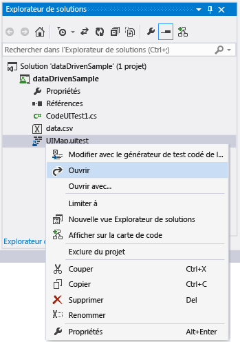  
  
    -   Choisissez l'action d'interface utilisateur et observez le mappage des contrôles d'interface utilisateur correspondant. Remarquez que le mappage correspond au code, par exemple, `this.UIMap.UICalculatorWindow.UIItemWindow.UIItem1Button`.  
  
         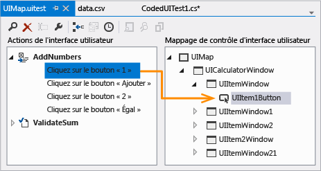  
  
    -   Dans la fenêtre Propriétés, ouvrez **Propriétés de recherche**. Les propriétés de recherche **nom** valeur est celle manipulée dans le code à l’aide de la source de données. Par exemple, `SearchProperties` se voit attribué les valeurs de la première colonne de chaque ligne de données : `UIItem1Button.SearchProperties[WinButton.PropertyNames.Name] = TestContext.DataRow["Num1"].ToString();`. Pour les trois itérations, ce test va remplacer le **nom** valeur pour la propriété de recherche à 3, 5 et 6.  
  
         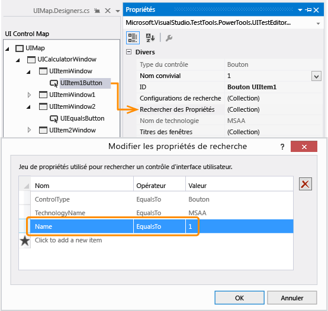  
  
3.  Enregistrez la solution.  
  
#### <a name="step-5-run-the-data-driven-test"></a>Étape 5 : exécuter le test piloté par les données  
  
1.  Vérifiez que le test est maintenant piloté par les données en l'exécutant de nouveau.  
  
     Vous devez voir le test s'exécuter via trois itérations à l'aide des valeurs incluses dans le fichier .csv. La validation doit également fonctionner et le test doit s’afficher comme réussi dans l’Explorateur de tests.  
  
 **Conseils**  
  
 Pour plus d’informations, consultez [test de livraison continue avec Visual Studio 2012 – chapitre 2 : test unitaire : test de l’intérieur](http://go.microsoft.com/fwlink/?LinkID=255188) et [test de livraison continue avec Visual Studio 2012 – chapitre 5 : automatisation des Tests système](http://go.microsoft.com/fwlink/?LinkID=255196)  
  
## <a name="q-a"></a>Q et R  
  
###  <a name="a-namecreatedatadrivencuitqadatasourceattributesa-what-are-the-data-source-attributes-for-other-data-source-types-such-as-sql-express-or-xml"></a><a name="CreateDataDrivenCUIT_QA_DataSourceAttributes"></a> Quels sont les attributs de source de données pour d’autres types de source de données, telles que SQL Express ou XML ?  
 Vous pouvez utiliser les exemples de chaînes de source de données indiqués dans le tableau ci-dessous en les copiant dans votre code et en effectuant les personnalisations nécessaires.  
  
 **Types de sources de données et les attributs**  
  
-   CSV  
  
     `[DataSource("Microsoft.VisualStudio.TestTools.DataSource.CSV", "|DataDirectory|\\data.csv", "data#csv", DataAccessMethod.Sequential), DeploymentItem("data.csv"), TestMethod]`  
  
-   Excel  
  
     `DataSource("System.Data.Odbc", "Dsn=ExcelFiles;Driver={Microsoft Excel Driver (*.xls)};dbq=|DataDirectory|\\Data.xls;defaultdir=.;driverid=790;maxbuffersize=2048;pagetimeout=5;readonly=true", "Sheet1$", DataAccessMethod.Sequential), DeploymentItem("Sheet1.xls"), TestMethod]`  
  
-   Cas de test dans Team Foundation Server  
  
     `[DataSource("Microsoft.VisualStudio.TestTools.DataSource.TestCase", "http://vlm13261329:8080/tfs/DefaultCollection;Agile", "30", DataAccessMethod.Sequential), TestMethod]`  
  
-   XML  
  
     `[DataSource("Microsoft.VisualStudio.TestTools.DataSource.XML", "|DataDirectory|\\data.xml", "Iterations", DataAccessMethod.Sequential), DeploymentItem("data.xml"), TestMethod]`  
  
-   SQL Express  
  
     `[DataSource("System.Data.SqlClient", "Data Source=.\\sqlexpress;Initial Catalog=tempdb;Integrated Security=True", "Data", DataAccessMethod.Sequential), TestMethod]`  
  
### <a name="q-can-i-use-data-driven-tests-on-my-windows-phone-app"></a>Q : puis-je utiliser des tests pilotés par les données dans mon application Windows Phone ?  
 **R :** Oui. Les tests codés de l’interface utilisateur pilotés par les données pour Windows Phone sont définis à l’aide de l’attribut DataRow sur une méthode de test. Dans l’exemple suivant, x et y utilisent les valeurs 1 et 2 pour la première itération et -1 et -2 pour la seconde itération du test.  
  
```  
[DataRow(1, 2, DisplayName = "Add positive numbers")]  
[DataRow(-1, -2, DisplayName = "Add negative numbers")]  
[TestMethod]  
public void DataDrivingDemo_MyTestMethod(int x, int y)  
  
```  
  
 Pour plus d’informations, consultez [piloté par les données d’utilisation tests codés de l’interface Utilisateur sur les applications Windows Phone](../test/test-windows-phone-8-1-apps-with-coded-ui-tests.md#TestingPhoneAppsCodedUI_DataDriven).  
  
### <a name="q-why-cant-i-modify-the-code-in-the-uimapdesigner-file"></a>Q : pourquoi ne puis-je pas modifier le code du fichier UIMap.Designer ?  
 **R :** les modifications de code apportées dans le fichier UIMapDesigner.cs seront remplacées chaque fois que vous générez le code dans UIMap - Générateur de Test codé de l’interface Utilisateur. Dans cet exemple et dans la plupart des cas, les modifications de code nécessaires pour permettre à un test d'utiliser une source de données peuvent être apportées au fichier de code source du test (c'est-à-dire, CodedUITest1.cs).  
  
 Si vous devez modifier une méthode enregistrée, vous devez la copier dans le fichier UIMap.cs et la renommer. Le fichier UIMap.cs peut être utilisé pour remplacer les méthodes et les propriétés dans le fichier UIMapDesigner.cs. Vous devez supprimer la référence à la méthode d’origine dans le fichier Coded UITest.cs et la remplacer par le nom de la méthode renommée.  
  
## <a name="see-also"></a>Voir aussi  
 <xref:Microsoft.VisualStudio.TestTools.UITest.Common.UIMap.UIMap>   
 <xref:Microsoft.VisualStudio.TestTools.UnitTesting.Assert>   
 [Utilisation d’UI Automation pour tester votre Code](../test/use-ui-automation-to-test-your-code.md)   
 [Création de Tests d’interface Utilisateur codés](../test/use-ui-automation-to-test-your-code.md#VerifyingCodeUsingCUITCreate)   
 [Meilleures pratiques pour les Tests codés de l’interface Utilisateur](../test/best-practices-for-coded-ui-tests.md)   
 [Plateformes et Configurations prises en charge pour les Tests codés de l’interface Utilisateur t enregistrements des actions](../test/supported-configurations-and-platforms-for-coded-ui-tests-and-action-recordings.md)