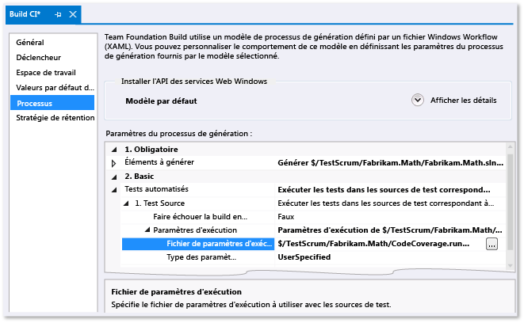

# <a name="customizing-code-coverage-analysis"></a>Personnalisation de l’analyse de la couverture du code

Par défaut, l’outil de couverture de Visual Studio Code 2012 analyse tous les assemblys de la solution (.exe/.dll) chargés pendant les tests unitaires. Nous vous recommandons de conserver ce paramètre par défaut, car il est généralement efficace. Pour plus d’informations, consultez [Utilisation de la couverture du code pour déterminer la quantité de code testé](../test/using-code-coverage-to-determine-how-much-code-is-being-tested.md).  
  
Avant de personnaliser le comportement de la couverture du code, vérifiez les autres possibilités :  
  
-   *Je souhaite exclure le code de test des résultats de la couverture du code et inclure uniquement le code d’application.*  
  
     Ajoutez `ExcludeFromCodeCoverage Attribute` à votre classe de test.  
  
-   *Je souhaite inclure des assemblys qui ne font pas partie de ma solution.*  
  
     Obtenez les fichiers .pdb de ces assemblys et copiez-les dans le même dossier que les fichiers .dll de l’assembly.  
  
Pour personnaliser le comportement de couverture du code, copiez [l’exemple indiqué à la fin de cette rubrique](#sample) et ajoutez-le à votre solution à l’aide de l’extension de fichier .runsettings. Modifiez-le selon vos besoins, puis, dans le menu **Test**, choisissez **Paramètres de test**, **Sélectionner le fichier de paramètres des tests**. La suite de cette rubrique décrit cette procédure plus en détail.  
  
## <a name="the-runsettings-file"></a>Le fichier .runsettings

Les fonctionnalités avancées de couverture du code sont spécifiées dans un fichier .runsettings. Il s’agit du fichier de configuration utilisé par les outils de test unitaire. Nous vous recommandons de copier l’[exemple indiqué à la fin de cette rubrique](#sample) et de le modifier selon vos besoins.  
  
-   *Qu’en est-il du fichier .testsettings que j’utilisais dans Visual Studio 2010 ?*  
  
     Dans Visual Studio 2010, le fichier .testsettings s'applique uniquement aux tests unitaires sur le framework MSTest. Dans Visual Studio 2012, les outils de test ne s'appliquent pas uniquement à MSTest, mais également à d'autres frameworks tels que NUnit et xUnit.net. Le fichier .testsettings ne fonctionnera pas avec ces derniers. Le fichier .runsettings est conçu pour personnaliser les outils de test de sorte que cela fonctionne avec tous les frameworks de test.  
  
 Pour personnaliser la couverture du code, vous devez ajouter un fichier .runsettings à votre solution :  
  
1.  Ajoutez un fichier .xml comme élément de solution avec l’extension `.runsettings` :  
  
     Dans l’Explorateur de solutions, dans le menu contextuel de votre solution, choisissez **Ajouter**, **Nouvel élément**, puis sélectionnez **Fichier XML**. Enregistrez le fichier avec un nom se terminant par .runsettings, comme `CodeCoverage.runsettings`.  
  
2.  Ajoutez le contenu fourni dans l'exemple à la fin de cette rubrique, puis personnalisez-le selon vos besoins comme décrit dans les sections suivantes.  
  
3.  Dans le menu **Test**, choisissez **Paramètres de test**, **Sélectionner le fichier de paramètres des tests** et sélectionnez le fichier.  
  
4.  Dorénavant, quand vous exécuterez **Analyser la couverture du code**, ce fichier `.runsettings` vérifiera son comportement. N’oubliez pas que vous devez exécuter à nouveau la couverture du code : les résultats de couverture et la coloration de code précédents ne sont pas automatiquement masqués quand vous exécutez des tests ou que vous mettez à jour votre code.  
  
5.  Pour activer ou désactiver les paramètres personnalisés, désélectionnez ou sélectionnez le fichier dans le menu **Test**, **Paramètres de test**.  
  
   
  
 D'autres aspects des tests unitaires peuvent être configurés dans le même fichier .runsettings. Pour plus d’informations, consultez [Tests unitaires sur votre code](../test/unit-test-your-code.md).  
  
### <a name="specifying-symbol-search-paths"></a>Spécification des chemins de recherche de symboles

La couverture du code requiert que des symboles (.pdb) pour les assemblys soient présents. Pour les assemblys générés par votre solution, les fichiers de symboles sont généralement présents à côté des fichiers binaires, et la couverture du code s'exécute automatiquement. Mais, dans certains cas, vous pouvez inclure les assemblys référencés dans votre analyse de couverture du code. Dans ce cas, les fichiers .pdb peuvent ne pas être adjacents aux fichiers binaires, mais vous pouvez spécifier le chemin de recherche de symboles dans le fichier .runsettings.  
  
```xml  
<SymbolSearchPaths>                
      <Path>\\mybuildshare\builds\ProjectX</Path>  
      <!--More paths if required-->  
</SymbolSearchPaths>  
  
```  
  
> [!WARNING]
>  La résolution de symboles peut prendre du temps, surtout lorsque vous utilisez un emplacement de fichier distant avec de nombreux assemblys. Par conséquent, envisagez de copier les fichiers distants .pdb au même emplacement local que les fichiers binaires (.dll et .exe).  
  
### <a name="excluding-and-including"></a>Exclusion et inclusion

Vous pouvez exclure les assemblys spécifiés de l'analyse de couverture du code. Exemple :  
  
```minterastlib  
<ModulePaths>  
  <Exclude>  
   <ModulePath>Fabrikam.Math.UnitTest.dll</ModulePath>  
   <!-- Add more ModulePath nodes here. -->  
  </Exclude>  
</ModulePaths>  
```  
  
 Sinon, vous pouvez spécifier les assemblys doivent être inclus. Cette approche présente l'inconvénient suivant : lorsque vous ajoutez des assemblys à la solution, vous devez penser à les ajouter à la liste :  
  
```minterastlib  
<ModulePaths>  
  <Include>  
   <ModulePath>Fabrikam.Math.dll</ModulePath>  
   <!-- Add more ModulePath nodes here. -->  
  </Include>  
</ModulePaths>  
```  
  
 Si `<Include>` est vide, le traitement de couverture du code inclut tous les assemblys (fichiers .dll et .exe) qui sont chargés et pour lesquels les fichiers **.pdb** sont trouvés, à l’exception des éléments qui correspondent à une clause d’une liste `<Exclude>`.  
  
 `Include` est traité avant `Exclude`.  
  
### <a name="regular-expressions"></a>Expressions régulières

Les nœuds inclure et exclure utilisent des expressions régulières. Pour plus d’informations, consultez [Utilisation d’expressions régulières dans Visual Studio](../ide/using-regular-expressions-in-visual-studio.md). Les expressions régulières ne sont pas l'équivalent des caractères génériques. En particulier :  
  
1.   **\*** correspond à une chaîne de n’importe quels caractères  
  
2.  **\\.** correspond à un point « . »  
  
3.  **\\(   \\)** correspond à des parenthèses « (  ) »  
  
4.  **\\\\**correspond à un séparateur de chemin de fichier « \\ »  
  
5.  **^** correspond au début de la chaîne  
  
6.  **$** correspond la fin de la chaîne  
  
 Les correspondances ne respectent pas la casse.  
  
 Exemple :  
  
```xml  
<ModulePaths>  
  <Include>  
    <!-- Include all loaded .dll assemblies (but not .exe assemblies): -->  
    <ModulePath>.*\.dll$</ModulePath>  
  </Include>  
  <Exclude>  
    <!-- But exclude some assemblies: -->  
    <ModulePath>.*\\Fabrikam\.MyTests1\.dll$</ModulePath>  
    <!-- Exclude all file paths that contain "Temp": -->  
    <ModulePath>.*Temp.*</ModulePath>   
  </Exclude>  
</ModulePaths>  
  
```  
  
> [!WARNING]
>  S'il existe une erreur dans une expression régulière, telle qu'une séquence d'échappement ou une parenthèse sans correspondance, l'analyse de couverture du code ne fonctionnera pas.  
  
### <a name="other-ways-to-include-or-exclude-elements"></a>Autres façons d'inclure ou d'exclure des éléments  
 Consultez la [section d’exemples à la fin de cette rubrique](#sample) pour obtenir des exemples.  
  
-   `ModulePath` : assemblys spécifiés par le chemin de fichier d’assembly.  
  
-   `CompanyName` : correspond aux assemblys par l’attribut Société.  
  
-   `PublicKeyToken` : correspond aux assemblys signés par le jeton de clé publique. Par exemple, pour correspondre à tous les composants et extensions Visual Studio, utilisez `<PublicKeyToken>^B03F5F7F11D50A3A$</PublicKeyToken>`.  
  
-   `Source` : correspond à des éléments par le chemin du fichier source dans lequel ils sont définis.  
  
-   `Attribute` : correspond à des éléments auxquels un attribut spécial est attaché. Spécifiez le nom complet de l'attribut, en insérant « Attribute » à la fin du nom.  
  
-   `Function` : correspond à des procédures, des fonctions ou des méthodes par le nom qualifié complet.  
  
 **Correspondance avec un nom de fonction**  
  
 Votre expression régulière doit correspondre au nom qualifié complet de la fonction, y compris l'espace de noms, le nom de la classe, le nom de méthode et la liste de paramètres. Par exemple :  
  
-   C# ou Visual Basic : `Fabrikam.Math.LocalMath.SquareRoot(double)`  
  
-   C++ : `Fabrikam::Math::LocalMath::SquareRoot(double)`  
  
```xml  
<Functions>  
  <Include>  
    <!-- Include methods in the Fabrikam namespace: -->  
    <Function>^Fabrikam\..*</Function>  
    <!-- Include all methods named EqualTo: -->  
    <Function>.*\.EqualTo\(.*</Function>  
  </Include>  
  <Exclude>  
    <!-- Exclude methods in a class or namespace named UnitTest: -->  
    <Function>.*\.UnitTest\..*</Function>  
  </Exclude>  
</Functions>  
  
```  
  
## <a name="how-to-specify-runsettings-files-while-running-tests"></a>Procédure : Spécifier les fichiers .runsettings pendant l'exécution des tests  
  
### <a name="to-customize-runsettings-in-visual-studio-tests"></a>Pour personnaliser un fichier .runsettings dans les tests de Visual Studio

Choisissez **Test** > **Paramètres de test** > **Sélectionner le fichier de paramètres des tests** et sélectionnez le fichier .runsettings. Le fichier apparaît dans le menu Paramètres de test. Vous pouvez le sélectionner ou l'annuler. Tant qu’il est sélectionné, votre fichier .runsettings s’applique lorsque vous utilisez **Analyser la couverture du code**.

### <a name="to-customize-run-settings-in-a-command-line-test"></a>Pour personnaliser les paramètres d'exécution d'un test en ligne de commande

Pour exécuter des tests à partir de la ligne de commande, utilisez vstest.console.exe. Le fichier de paramètres est un paramètre de cet utilitaire.

1.  Lancez l'invite de commandes développeur Visual Studio :

    Dans le menu **Démarrer** de Windows, choisissez **Visual Studio 2017** > **Invite de commandes développeur pour VS 2017**.

2.  Exécutez la commande suivante :

    `vstest.console.exe MyTestAssembly.dll /EnableCodeCoverage /Settings:CodeCoverage.runsettings`

### <a name="to-customize-run-settings-in-a-build-definition"></a>Pour personnaliser des paramètres d'exécution dans une définition de build

Vous pouvez obtenir des données de couverture du code depuis une build d’équipe.

  

1.  Assurez-vous que votre fichier .runsettings est archivé.  
  
2.  Dans Team Explorer, ouvrez **Builds**, puis ajoutez ou modifiez une définition de build.  
  
3.  Dans la page **Processus**, développez **Tests automatisés** > **Source de test** > **Paramètres d’exécution**. Sélectionnez votre fichier **.runsettings**.
  
    -   ***Assembly de test** apparaît à la place de **Source de test**. Lorsque j’essaie de définir le champ **Paramètres d’exécution**, je ne peux sélectionner que des fichiers .testsettings.*  
  
         Sous **Tests automatisés**, sélectionnez **Assembly de test**, puis choisissez **[…]** à la fin de la ligne. Dans la boîte de dialogue **Ajouter/Modifier une série de tests**, définissez **Test Runner** sur **Visual Studio Test Runner**.  
  
Les résultats sont visibles dans la section de résumé du rapport de build.
  
##  <a name="sample"></a> Exemple de fichier runsettings

Copiez ce code et modifiez-le selon vos besoins. Il s'agit du fichier .runsettings par défaut.

(Pour connaître d’autres utilisations du fichier .runsettings, consultez [Configurer des tests unitaires à l’aide d’un fichier .runsettings](../test/configure-unit-tests-by-using-a-dot-runsettings-file.md).)

```xml
<?xml version="1.0" encoding="utf-8"?>  
<!-- File name extension must be .runsettings -->  
<RunSettings>  
  <DataCollectionRunSettings>  
    <DataCollectors>  
      <DataCollector friendlyName="Code Coverage" uri="datacollector://Microsoft/CodeCoverage/2.0" assemblyQualifiedName="Microsoft.VisualStudio.Coverage.DynamicCoverageDataCollector, Microsoft.VisualStudio.TraceCollector, Version=11.0.0.0, Culture=neutral, PublicKeyToken=b03f5f7f11d50a3a">  
        <Configuration>  
          <CodeCoverage>  
<!--  
Additional paths to search for .pdb (symbol) files. Symbols must be found for modules to be instrumented.  
If .pdb files are in the same folder as the .dll or .exe files, they are automatically found. Otherwise, specify them here.  
Note that searching for symbols increases code coverage runtime. So keep this small and local.  
-->   
<!--             
            <SymbolSearchPaths>                
                   <Path>C:\Users\User\Documents\Visual Studio 2012\Projects\ProjectX\bin\Debug</Path>  
                   <Path>\\mybuildshare\builds\ProjectX</Path>  
            </SymbolSearchPaths>  
-->  
  
<!--  
About include/exclude lists:  
Empty "Include" clauses imply all; empty "Exclude" clauses imply none.  
Each element in the list is a regular expression (ECMAScript syntax). See http://msdn.microsoft.com/library/2k3te2cs.aspx.  
An item must first match at least one entry in the include list to be included.  
Included items must then not match any entries in the exclude list to remain included.  
-->  
  
            <!-- Match assembly file paths: -->  
            <ModulePaths>  
              <Include>  
                <ModulePath>.*\.dll$</ModulePath>  
                <ModulePath>.*\.exe$</ModulePath>  
              </Include>  
              <Exclude>  
                <ModulePath>.*CPPUnitTestFramework.*</ModulePath>  
              </Exclude>  
            </ModulePaths>  
  
            <!-- Match fully qualified names of functions: -->  
            <!-- (Use "\." to delimit namespaces in C# or Visual Basic, "::" in C++.)  -->  
            <Functions>  
              <Exclude>  
                <Function>^Fabrikam\.UnitTest\..*</Function>           
                <Function>^std::.*</Function>  
                <Function>^ATL::.*</Function>  
                <Function>.*::__GetTestMethodInfo.*</Function>  
                <Function>^Microsoft::VisualStudio::CppCodeCoverageFramework::.*</Function>  
                <Function>^Microsoft::VisualStudio::CppUnitTestFramework::.*</Function>  
              </Exclude>  
            </Functions>  
  
            <!-- Match attributes on any code element: -->  
            <Attributes>  
              <Exclude>  
                <!-- Don't forget "Attribute" at the end of the name -->  
                <Attribute>^System\.Diagnostics\.DebuggerHiddenAttribute$</Attribute>  
                <Attribute>^System\.Diagnostics\.DebuggerNonUserCodeAttribute$</Attribute>  
                <Attribute>^System\.Runtime\.CompilerServices.CompilerGeneratedAttribute$</Attribute>  
                <Attribute>^System\.CodeDom\.Compiler.GeneratedCodeAttribute$</Attribute>  
                <Attribute>^System\.Diagnostics\.CodeAnalysis.ExcludeFromCodeCoverageAttribute$</Attribute>  
              </Exclude>  
            </Attributes>  
  
            <!-- Match the path of the source files in which each method is defined: -->  
            <Sources>  
              <Exclude>  
                <Source>.*\\atlmfc\\.*</Source>  
                <Source>.*\\vctools\\.*</Source>  
                <Source>.*\\public\\sdk\\.*</Source>  
                <Source>.*\\microsoft sdks\\.*</Source>  
                <Source>.*\\vc\\include\\.*</Source>  
              </Exclude>  
            </Sources>  
  
            <!-- Match the company name property in the assembly: -->  
            <CompanyNames>  
              <Exclude>  
                <CompanyName>.*microsoft.*</CompanyName>  
              </Exclude>  
            </CompanyNames>  
  
            <!-- Match the public key token of a signed assembly: -->  
            <PublicKeyTokens>  
              <!-- Exclude Visual Studio extensions: -->  
              <Exclude>  
                <PublicKeyToken>^B77A5C561934E089$</PublicKeyToken>  
                <PublicKeyToken>^B03F5F7F11D50A3A$</PublicKeyToken>  
                <PublicKeyToken>^31BF3856AD364E35$</PublicKeyToken>  
                <PublicKeyToken>^89845DCD8080CC91$</PublicKeyToken>  
                <PublicKeyToken>^71E9BCE111E9429C$</PublicKeyToken>  
                <PublicKeyToken>^8F50407C4E9E73B6$</PublicKeyToken>  
                <PublicKeyToken>^E361AF139669C375$</PublicKeyToken>  
              </Exclude>  
            </PublicKeyTokens>  
  
            <!-- We recommend you do not change the following values: -->  
            <UseVerifiableInstrumentation>True</UseVerifiableInstrumentation>  
            <AllowLowIntegrityProcesses>True</AllowLowIntegrityProcesses>  
            <CollectFromChildProcesses>True</CollectFromChildProcesses>  
            <CollectAspDotNet>False</CollectAspDotNet>  
  
          </CodeCoverage>  
        </Configuration>  
      </DataCollector>  
    </DataCollectors>  
  </DataCollectionRunSettings>  
</RunSettings>
```

## <a name="see-also"></a>Voir aussi

[Utilisation de la couverture du code pour déterminer la quantité de code testé](../test/using-code-coverage-to-determine-how-much-code-is-being-tested.md)  
[Tests unitaires sur votre code](../test/unit-test-your-code.md)
