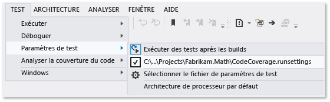

# <a name="customize-code-coverage-analysis"></a>Personnaliser l’analyse de la couverture du code

Par défaut, la couverture du code analyse tous les assemblys de la solution chargés pendant les tests unitaires. Nous vous recommandons d’utiliser ce comportement par défaut, car il est généralement efficace. Pour plus d’informations, consultez [Utiliser la couverture du code pour déterminer la quantité de code testé](../test/using-code-coverage-to-determine-how-much-code-is-being-tested.md).

Pour exclure le code de test des résultats de la couverture du code et inclure uniquement le code d’application, ajoutez l’attribut <xref:System.Diagnostics.CodeAnalysis.ExcludeFromCodeCoverageAttribute> à votre classe de test.

Pour inclure des assemblys qui ne font pas partie de votre solution, obtenez les fichiers *.pdb* de ces assemblys et copiez-les dans le même dossier que les fichiers *.dll* de l’assembly.

## <a name="run-settings-file"></a>Fichier de paramètres d’exécution

Le [fichier de paramètres d’exécution](../test/configure-unit-tests-by-using-a-dot-runsettings-file.md) est le fichier de configuration utilisé par les outils de test unitaire. Les paramètres avancés de la couverture du code sont spécifiées dans un fichier *.runsettings*.

Pour personnaliser la couverture du code, effectuez les étapes suivantes :

1. Ajoutez un fichier de paramètres d’exécution à votre solution. Dans **l’Explorateur de solutions**, dans le menu contextuel de votre solution, choisissez **Ajouter** > **Nouvel élément**, puis sélectionnez **Fichier XML**. Enregistrez le fichier sous un nom comme *CodeCoverage.runsettings*.

2. Ajoutez le contenu de l’exemple de fichier à la fin de cet article, puis personnalisez-le selon vos besoins comme décrit dans les sections qui suivent.

::: moniker range="vs-2017"

3. Pour sélectionner le fichier de paramètres d’exécution, dans le menu **Test**, choisissez **Paramètres de test** > **Sélectionner le fichier de paramètres des tests**. Pour spécifier un fichier de paramètres d’exécution afin d’exécuter des tests depuis la ligne de commande, consultez [Configurer des tests unitaires](../test/configure-unit-tests-by-using-a-dot-runsettings-file.md#command-line).

::: moniker-end

::: moniker range=">=vs-2019"

3. Pour sélectionner le fichier de paramètres d’exécution, dans le menu **test** , choisissez **Sélectionner le fichier de paramètres**. Pour spécifier un fichier de paramètres d’exécution afin d’exécuter des tests depuis la ligne de commande, consultez [Configurer des tests unitaires](../test/configure-unit-tests-by-using-a-dot-runsettings-file.md#command-line).

::: moniker-end

   Quand vous sélectionnez **Analyser la couverture du code**, les informations de configuration sont lues à partir du fichier de paramètres d’exécution.

   > [!TIP]
   > Les résultats de la couverture du code et la coloration du code précédents ne sont pas masqués automatiquement quand vous exécutez des tests ou que vous mettez à jour votre code.

::: moniker range="vs-2017"

Pour activer ou désactiver les paramètres personnalisés, désélectionnez ou sélectionnez le fichier dans le menu **Test** > **Paramètres de test**.



::: moniker-end

::: moniker range=">=vs-2019"

Pour activer et désactiver les paramètres personnalisés, désélectionnez ou sélectionnez le fichier dans le menu **test** .

::: moniker-end

## <a name="symbol-search-paths"></a>Chemins de recherche de symboles

La couverture du code requiert des fichiers de symboles (fichiers *.pdb*) pour les assemblys. Pour les assemblys générés par votre solution, les fichiers de symboles sont généralement présents à côté des fichiers binaires, et la couverture du code s’exécute automatiquement. Dans certains cas, vous voulez inclure des assemblys référencés dans votre analyse de couverture du code. Dans ce cas, les fichiers *.pdb* peuvent ne pas être adjacents aux fichiers binaires, mais vous pouvez spécifier le chemin de recherche de symboles dans le fichier *.runsettings*.

```xml
<SymbolSearchPaths>
      <Path>\\mybuildshare\builds\ProjectX</Path>
      <!--More paths if required-->
</SymbolSearchPaths>
```

> [!NOTE]
> La résolution des symboles peut prendre du temps, surtout quand vous utilisez un emplacement de fichier distant avec de nombreux assemblys. Ainsi, envisagez de copier les fichiers *.pdb* au même emplacement local que les fichiers binaires ( *.dll* et *.exe*).

## <a name="include-or-exclude-assemblies-and-members"></a>Inclure ou exclure des assemblys et des membres

Vous pouvez inclure ou exclure des assemblys ou des types et des membres spécifiques de l’analyse de couverture du code. Si la section **include** est vide ou omise, tous les assemblys chargés et ayant des fichiers PDB associés sont inclus. Si un assembly ou un membre correspond à une clause dans la section **Exclude** , il est exclu de la couverture du code. La section **Exclude** est prioritaire sur la section **include** : si un assembly est répertorié dans **include** et **Exclude**, il n’est pas inclus dans la couverture du code.

Par exemple, le code XML suivant exclut un assembly unique en spécifiant son nom :

```xml
<ModulePaths>
  <Exclude>
   <ModulePath>Fabrikam.Math.UnitTest.dll</ModulePath>
   <!-- Add more ModulePath nodes here. -->
  </Exclude>
</ModulePaths>
```

L’exemple suivant spécifie qu’un seul assembly doit être inclus dans la couverture du code :

```xml
<ModulePaths>
  <Include>
   <ModulePath>Fabrikam.Math.dll</ModulePath>
   <!-- Add more ModulePath nodes here. -->
  </Include>
</ModulePaths>
```

Le tableau suivant montre les différentes façons dont les assemblys et les membres peuvent être mis en correspondance pour l’inclusion dans ou l’exclusion de la couverture du code.

| Élément XML | Ce qu’il correspond |
| - | - |
| ModulePath | Correspond aux assemblys spécifiés par le nom de l’assembly ou le chemin d’accès du fichier. |
| CompanyName | Correspond aux assemblys par l’attribut **Company** . |
| PublicKeyToken | Correspond aux assemblys signés par le jeton de clé publique. |
| `Source` | Met en correspondance les éléments par le nom de chemin d’accès du fichier source dans lequel ils sont définis. |
| Attribut | Met en correspondance les éléments qui ont l’attribut spécifié. Spécifiez le nom complet de l’attribut, par exemple `<Attribute>^System\.Diagnostics\.DebuggerHiddenAttribute$</Attribute>`.<br/><br/>Si vous excluez l’attribut <xref:System.Runtime.CompilerServices.CompilerGeneratedAttribute>, le code qui utilise des fonctionnalités du langage comme `async`, `await` et `yield return`, et des propriétés implémentées automatiquement, est exclu de l’analyse de couverture du code. Pour exclure le code réellement généré, excluez seulement l’attribut <xref:System.CodeDom.Compiler.GeneratedCodeAttribute>. |
| Fonction | Met en correspondance des procédures, des fonctions ou des méthodes par nom qualifié complet, y compris la liste de paramètres. Vous pouvez également faire correspondre une partie du nom à l’aide d’une [expression régulière](#regular-expressions).<br/><br/>Exemples :<br/><br/>`Fabrikam.Math.LocalMath.SquareRoot(double);` (C#)<br/><br/>`Fabrikam::Math::LocalMath::SquareRoot(double)`(C++) |

### <a name="regular-expressions"></a>Expressions régulières

Les nœuds Inclure et Exclure utilisent des expressions régulières, qui ne sont pas identiques à des caractères génériques. Les correspondances ne respectent pas la casse. Voici quelques exemples :

- **\*** correspond à une chaîne de n’importe quels caractères

- **\\.** correspond à un point « . »

- **\\(   \\)** correspond à des parenthèses « (  ) »

- **\\\\** correspond à un séparateur de chemin de fichier « \\ »

- **^** correspond au début de la chaîne

- **$** correspond la fin de la chaîne

Le code XML suivant montre comment inclure et exclure des assemblys spécifiques à l’aide d’expressions régulières :

```xml
<ModulePaths>
  <Include>
    <!-- Include all loaded .dll assemblies (but not .exe assemblies): -->
    <ModulePath>.*\.dll$</ModulePath>
  </Include>
  <Exclude>
    <!-- But exclude some assemblies: -->
    <ModulePath>.*\\Fabrikam\.MyTests1\.dll$</ModulePath>
    <!-- Exclude all file paths that contain "Temp": -->
    <ModulePath>.*Temp.*</ModulePath>
  </Exclude>
</ModulePaths>
```

Le code XML suivant montre comment inclure et exclure des fonctions spécifiques à l’aide d’expressions régulières :

```xml
<Functions>
  <Include>
    <!-- Include methods in the Fabrikam namespace: -->
    <Function>^Fabrikam\..*</Function>
    <!-- Include all methods named EqualTo: -->
    <Function>.*\.EqualTo\(.*</Function>
  </Include>
  <Exclude>
    <!-- Exclude methods in a class or namespace named UnitTest: -->
    <Function>.*\.UnitTest\..*</Function>
  </Exclude>
</Functions>
```

> [!WARNING]
> S’il existe une erreur dans une expression régulière, telle qu’une séquence d’échappement ou une parenthèse sans correspondance, l’analyse de couverture du code ne fonctionne pas.

Pour plus d’informations sur les expressions régulières, consultez [utiliser des expressions régulières dans Visual Studio](../ide/using-regular-expressions-in-visual-studio.md).

## <a name="sample-runsettings-file"></a>Fichier d'exemple .runsettings

Copiez ce code et modifiez-le selon vos besoins.

```xml
<?xml version="1.0" encoding="utf-8"?>
<!-- File name extension must be .runsettings -->
<RunSettings>
  <DataCollectionRunSettings>
    <DataCollectors>
      <DataCollector friendlyName="Code Coverage" uri="datacollector://Microsoft/CodeCoverage/2.0" assemblyQualifiedName="Microsoft.VisualStudio.Coverage.DynamicCoverageDataCollector, Microsoft.VisualStudio.TraceCollector, Version=11.0.0.0, Culture=neutral, PublicKeyToken=b03f5f7f11d50a3a">
        <Configuration>
          <CodeCoverage>
<!--
Additional paths to search for .pdb (symbol) files. Symbols must be found for modules to be instrumented.
If .pdb files are in the same folder as the .dll or .exe files, they are automatically found. Otherwise, specify them here.
Note that searching for symbols increases code coverage runtime. So keep this small and local.
-->
<!--
            <SymbolSearchPaths>
                   <Path>C:\Users\User\Documents\Visual Studio 2012\Projects\ProjectX\bin\Debug</Path>
                   <Path>\\mybuildshare\builds\ProjectX</Path>
            </SymbolSearchPaths>
-->

<!--
About include/exclude lists:
Empty "Include" clauses imply all; empty "Exclude" clauses imply none.
Each element in the list is a regular expression (ECMAScript syntax). See https://docs.microsoft.com/visualstudio/ide/using-regular-expressions-in-visual-studio.
An item must first match at least one entry in the include list to be included.
Included items must then not match any entries in the exclude list to remain included.
-->

            <!-- Match assembly file paths: -->
            <ModulePaths>
              <Include>
                <ModulePath>.*\.dll$</ModulePath>
                <ModulePath>.*\.exe$</ModulePath>
              </Include>
              <Exclude>
                <ModulePath>.*CPPUnitTestFramework.*</ModulePath>
              </Exclude>
            </ModulePaths>

            <!-- Match fully qualified names of functions: -->
            <!-- (Use "\." to delimit namespaces in C# or Visual Basic, "::" in C++.)  -->
            <Functions>
              <Exclude>
                <Function>^Fabrikam\.UnitTest\..*</Function>
                <Function>^std::.*</Function>
                <Function>^ATL::.*</Function>
                <Function>.*::__GetTestMethodInfo.*</Function>
                <Function>^Microsoft::VisualStudio::CppCodeCoverageFramework::.*</Function>
                <Function>^Microsoft::VisualStudio::CppUnitTestFramework::.*</Function>
              </Exclude>
            </Functions>

            <!-- Match attributes on any code element: -->
            <Attributes>
              <Exclude>
                <!-- Don't forget "Attribute" at the end of the name -->
                <Attribute>^System\.Diagnostics\.DebuggerHiddenAttribute$</Attribute>
                <Attribute>^System\.Diagnostics\.DebuggerNonUserCodeAttribute$</Attribute>
                <Attribute>^System\.CodeDom\.Compiler\.GeneratedCodeAttribute$</Attribute>
                <Attribute>^System\.Diagnostics\.CodeAnalysis\.ExcludeFromCodeCoverageAttribute$</Attribute>
              </Exclude>
            </Attributes>

            <!-- Match the path of the source files in which each method is defined: -->
            <Sources>
              <Exclude>
                <Source>.*\\atlmfc\\.*</Source>
                <Source>.*\\vctools\\.*</Source>
                <Source>.*\\public\\sdk\\.*</Source>
                <Source>.*\\microsoft sdks\\.*</Source>
                <Source>.*\\vc\\include\\.*</Source>
              </Exclude>
            </Sources>

            <!-- Match the company name property in the assembly: -->
            <CompanyNames>
              <Exclude>
                <CompanyName>.*microsoft.*</CompanyName>
              </Exclude>
            </CompanyNames>

            <!-- Match the public key token of a signed assembly: -->
            <PublicKeyTokens>
              <!-- Exclude Visual Studio extensions: -->
              <Exclude>
                <PublicKeyToken>^B77A5C561934E089$</PublicKeyToken>
                <PublicKeyToken>^B03F5F7F11D50A3A$</PublicKeyToken>
                <PublicKeyToken>^31BF3856AD364E35$</PublicKeyToken>
                <PublicKeyToken>^89845DCD8080CC91$</PublicKeyToken>
                <PublicKeyToken>^71E9BCE111E9429C$</PublicKeyToken>
                <PublicKeyToken>^8F50407C4E9E73B6$</PublicKeyToken>
                <PublicKeyToken>^E361AF139669C375$</PublicKeyToken>
              </Exclude>
            </PublicKeyTokens>

            <!-- We recommend you do not change the following values: -->

            <!-- Set this to True to collect coverage information for functions marked with the "SecuritySafeCritical" attribute. Instead of writing directly into a memory location from such functions, code coverage inserts a probe that redirects to another function, which in turns writes into memory. -->
            <UseVerifiableInstrumentation>True</UseVerifiableInstrumentation>
            <!-- When set to True, collects coverage information from child processes that are launched with low-level ACLs, for example, UWP apps. -->
            <AllowLowIntegrityProcesses>True</AllowLowIntegrityProcesses>
            <!-- When set to True, collects coverage information from child processes that are launched by test or production code. -->
            <CollectFromChildProcesses>True</CollectFromChildProcesses>
            <!-- When set to True, restarts the IIS process and collects coverage information from it. -->
            <CollectAspDotNet>False</CollectAspDotNet>

          </CodeCoverage>
        </Configuration>
      </DataCollector>
    </DataCollectors>
  </DataCollectionRunSettings>
</RunSettings>
```

## <a name="see-also"></a>Voir aussi

- [Configurer des tests unitaires à l’aide d’un fichier .runsettings](../test/configure-unit-tests-by-using-a-dot-runsettings-file.md)
- [Utiliser la couverture du code pour déterminer la quantité de code testé](../test/using-code-coverage-to-determine-how-much-code-is-being-tested.md)
- [Tests unitaires sur votre code](../test/unit-test-your-code.md)
