# Modification des tests codés de l'interface utilisateur à l'aide de l'éditeur de test codé de l'interface utilisateur
L'éditeur de test codé de l'interface utilisateur vous permet de modifier facilement vos tests codés de l'interface utilisateur. À l'aide de l'éditeur de test codé de l'interface utilisateur, vous pouvez localiser, afficher et modifier les propriétés de vos méthodes de test et actions d'interface utilisateur. De plus, vous pouvez utiliser le mappage de contrôle d'interface utilisateur pour afficher et modifier leurs contrôles correspondants.

 **Spécifications**

-   Visual Studio Enterprise

## Pourquoi est-ce nécessaire ?
 Utiliser l'éditeur de test codé de l'interface utilisateur est plus rapide et plus efficace que modifier le code dans vos méthodes de test codé de l'interface utilisateur à l'aide de l'éditeur de code. Avec l'éditeur de test codé de l'interface utilisateur, vous pouvez utiliser la barre d'outils et les menus contextuels pour rapidement localiser et modifier des valeurs de propriétés associées aux contrôles et actions d'interface utilisateur. Par exemple, vous pouvez utiliser la barre d’outils de l’éditeur de test codé de l’interface utilisateur pour exécuter les commandes suivantes :

 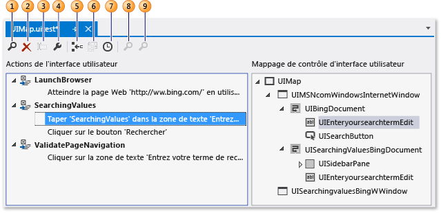

1.  [Trouver](../ide/finding-and-replacing-text.md) vous permet de localiser des actions et des contrôles d’interface utilisateur.

2.  [Supprimer](#CodedUITestEditor_DeleteUIActions) supprime les actions d'interface utilisateur inutiles.

3.  **Renommer** modifie les noms des méthodes de test et contrôles.

4.  **Propriétés** ouvre la fenêtre Propriétés de l'élément sélectionné.

5.  [Diviser en nouvelle méthode](#CodedUITestEditor_SplitMethods) vous permet de modulariser les actions d'interface utilisateur.

6.  [Déplacer le code](#CodedUITestEditor_MoveMethods) ajoute du code personnalisé à vos méthodes de test.

7.  [Insérer délai avant](#CodedUITestEditor_InsertDelay) ajoute une pause avant une action d'interface utilisateur, spécifiée en millisecondes.

8.  [Localiser le contrôle IU](#CodedUITestEditor_LocateUIControl) identifie l'emplacement du contrôle dans l'interface utilisateur de l'application testée.

9. [Localiser tout](#CodedUITestEditor_LocateDecendants) permet de vérifier la propriété des contrôles et les modifications importantes apportées aux contrôles de l’application.

## Comment faire ?
 Dans [!INCLUDE[vs_dev11_long](../data-tools/includes/vs_dev11_long_md.md)], l'ouverture du fichier UIMap.uitest affilié à votre test codé de l'interface utilisateur dans votre projet de test codé de l'interface utilisateur affiche automatiquement le test codé de l'interface utilisateur dans l'éditeur de test codé de l'interface utilisateur. Les procédures suivantes décrivent comment vous pouvez localiser et modifier vos méthodes de test, les propriétés des actions d’interface utilisateur et les contrôles à l’aide de la barre d’outils et des menus contextuels de l’éditeur.

## Ouvrir un test codé de l'interface utilisateur
 Vous pouvez afficher et modifier votre test codé de l'interface utilisateur Visual C# et Visual Basic à l'aide de l'éditeur de test codé de l'interface utilisateur.

 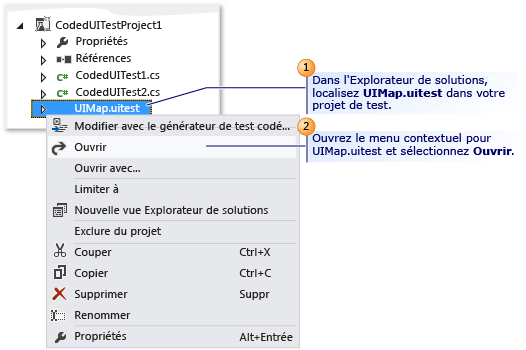

 Dans l'Explorateur de solutions, ouvrez le menu contextuel pour **UIMap.uitest** et choisissez **Ouvrir**. Le test codé de l'interface utilisateur s'affiche dans l'éditeur de test codé de l'interface utilisateur. Vous pouvez désormais afficher et modifier les méthodes enregistrées, les actions et les contrôles correspondants dans le test codé de l'interface utilisateur.

> [!TIP]
> Quand vous sélectionnez une action d'interface utilisateur qui se trouve dans une méthode dans le volet **Actions d'interface utilisateur** , le contrôle correspondant est mis en surbrillance. Vous pouvez également modifier l'action d'interface utilisateur ou les propriétés des contrôles.

 *Je ne vois pas* l'éditeur de test codé de l'interface utilisateur.
Vous utilisez peut-être une version de Visual Studio Enterprise antérieure à la version 2012. L'éditeur de test codé de l'interface utilisateur était également disponible dans Visual Studio 2010 Feature Pack 2 avec un abonnement MSDN. Pour plus d’informations, consultez [Microsoft Visual Studio 2010 Feature Pack 2](http://go.microsoft.com/fwlink/?LinkID=204119).

##   Modifier les propriétés des actions d'interface utilisateur et les propriétés de leurs contrôles correspondants
 À l'aide de l'éditeur de test codé de l'interface utilisateur, vous pouvez rapidement localiser et afficher toutes les actions d'interface utilisateur dans vos méthodes de test. Quand vous sélectionnez l'action d'interface utilisateur dans l'éditeur, le contrôle correspondant est automatiquement mis en surbrillance. De même, si vous sélectionnez un contrôle, les actions d'interface utilisateur associées sont mises en surbrillance. Quand vous sélectionnez un contrôle ou une action d'interface utilisateur, il est alors facile d'utiliser la fenêtre Propriétés pour modifier les propriétés qui lui correspondent.

 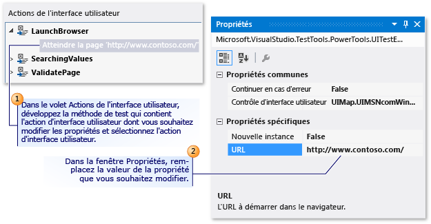

 Pour modifier les propriétés d'une action d'interface utilisateur, dans le volet **Action d'interface utilisateur** , développez la méthode de test qui contient une action d'interface utilisateur dont vous voulez modifier les propriétés, sélectionnez l'action d'interface utilisateur et modifiez les propriétés à l'aide de la fenêtre Propriétés.

 Par exemple, si un serveur est indisponible et si une action d’IU associée à votre navigateur web indique **Atteindre la page web « http://Contoso1/default.aspx »**, vous pouvez remplacer l’URL par `'http://Contoso2/default.aspx'`.

 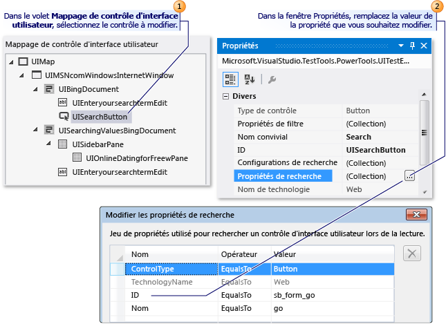

 La modification des propriétés d'un contrôle s'effectue de la même façon que pour les actions d'interface utilisateur. Dans le volet **Mappage de contrôle d'interface utilisateur** , sélectionnez le contrôle à modifier et modifiez ses propriétés à l'aide de la fenêtre Propriétés.

 Par exemple, un développeur peut avoir remplacé la valeur « idSubmit » de la propriété **(ID)** sur un contrôle de bouton dans le code source pour l’application testée par « idLogin ». Avec la propriété **(ID)** modifiée dans l'application, le test codé de l'interface utilisateur n'est pas en mesure de localiser le contrôle du bouton et échoue. Dans ce cas, le testeur peut ouvrir la collection **Propriétés de recherche** et modifier la propriété **Id** pour qu'elle corresponde à la nouvelle valeur que le développeur a utilisée dans l'application. Le testeur peut également remplacer la valeur « Submit » de la propriété **Nom convivial** par « Login ». Cette modification permet de mettre à jour l’action d’interface utilisateur associée dans l’éditeur de test codé de l’interface utilisateur. Ainsi, « Choisir le bouton 'Submit' » est remplacé par « Choisir le bouton 'Login' ».

 Après avoir effectué vos modifications, enregistrez-les dans le fichier UIMap.Designer en choisissant **Enregistrer** dans la barre d’outils [!INCLUDE[vsprvs](../code-quality/includes/vsprvs_md.md)].

### Conseils

- Si la fenêtre Propriétés n’est pas affichée, appuyez de façon prolongée sur **Alt** pendant que vous appuyez sur **Entrée**, ou appuyez sur **F4**.

- Pour annuler les changements apportés à des propriétés, sélectionnez **Annuler** dans le menu **Edition**, ou appuyez sur Ctrl+Z.

- Vous pouvez utiliser le bouton **Rechercher** dans la barre d’outils de l’éditeur de test codé de l’interface utilisateur pour ouvrir l’outil Rechercher et remplacer dans Visual Studio. Vous pouvez ensuite utiliser le contrôle de recherche pour localiser une action d'interface utilisateur dans l'éditeur de test codé de l'interface utilisateur. Par exemple, vous pouvez essayer de trouver « Cliquez sur le bouton 'Login' ». Cela peut être utile dans les tests de grande taille. Notez que vous ne pouvez pas utiliser la fonctionnalité de remplacement de l'outil Rechercher et remplacer dans l'éditeur de test codé de l'interface utilisateur. Pour plus d’informations, consultez la rubrique relative au contrôle de recherche dans [Finding and Replacing Text](../ide/finding-and-replacing-text.md).

- Parfois, il peut être difficile de visualiser l’emplacement des contrôles dans l’interface utilisateur de l’application testée. L'une des fonctionnalités de l'éditeur de test codé de l'interface utilisateur vous permet de sélectionner un contrôle répertorié dans le mappage de contrôle d'interface utilisateur et d'afficher son emplacement dans l'application testée. Pour plus d’informations, consultez [Localisation d’un contrôle d’IU dans l’application testée](#CodedUITestEditor_LocateUIControl) un peu plus loin dans cette rubrique.

- Il peut s’avérer nécessaire de développer le contrôle conteneur qui contient le contrôle à modifier. Pour plus d’informations, consultez [Localisation d’un contrôle et de ses descendants](#CodedUITestEditor_LocateDecendants) un peu plus loin dans cette rubrique.

##   Supprimer les actions d'interface utilisateur inutiles
 Vous pouvez facilement supprimer les actions d'interface utilisateur inutiles dans votre test codé de l'interface utilisateur.

 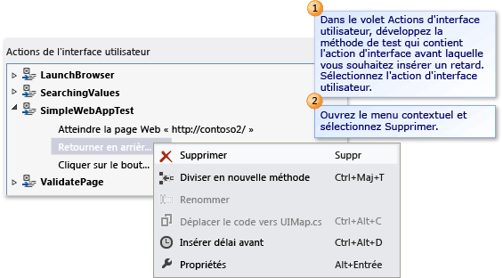

 Dans le volet **Action d'interface utilisateur** , développez la méthode de test qui contient l'action d'interface utilisateur à supprimer. Ouvrez le menu contextuel de l'action d'interface utilisateur et choisissez **Supprimer**.

##   Fractionner une méthode de test en deux méthodes distinctes
 Vous pouvez fractionner une méthode de test pour affiner ou modulariser les actions d'interface utilisateur. Par exemple, votre test peut avoir une seule méthode de test avec des actions d'interface utilisateur dans deux contrôles conteneur. Les actions d'interface utilisateur peuvent être mieux modularisées dans deux méthodes qui correspondent à un seul conteneur.

 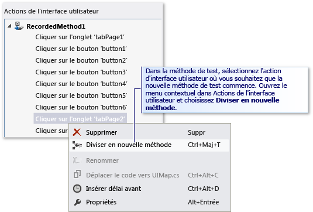

 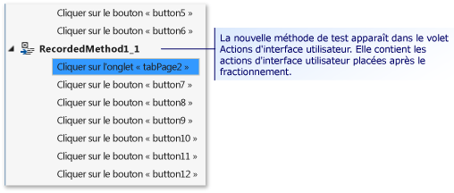

 Dans le volet **Action d'interface utilisateur** , développez la méthode de test que vous souhaitez fractionner en deux méthodes distinctes et sélectionnez l'action d'interface utilisateur où vous voulez que la nouvelle méthode de test commence. Ouvrez le menu contextuel de l'action d'interface utilisateur, puis choisissez **Diviser en nouvelle méthode**ou choisissez le bouton **Diviser en nouvelle méthode** dans la barre d'outils de l'éditeur de test codé de l'interface utilisateur. La nouvelle méthode de test s'affiche dans le volet Actions d'interface utilisateur. Elle contient les actions d'interface utilisateur à partir de l'action où vous avez spécifié le fractionnement.

 Une fois que vous avez terminé de fractionner la méthode, enregistrez les modifications dans le fichier UIMap.Designer en choisissant **Enregistrer** dans la barre d'outils [!INCLUDE[vsprvs](../code-quality/includes/vsprvs_md.md)] .

> [!WARNING]
> Quand vous fractionnez une méthode, vous devez modifier le code qui appelle la méthode existante pour qu’il appelle également la nouvelle méthode que vous êtes sur le point de créer, si vous tenez à inclure ces actions d’IU. Quand vous fractionnez une méthode, une boîte de dialogue Microsoft Visual Studio s'affiche. Elle vous avertit que vous devez modifier tout code qui appelle la méthode existante de sorte à appeler également la nouvelle méthode que vous êtes sur le point de créer. Cliquez sur **Oui**.

### Conseils

- Pour annuler le fractionnement, choisissez **Annuler** dans le menu **Edition**, ou appuyez sur Ctrl+Z.

- Vous pouvez renommer la nouvelle méthode. Sélectionnez-la dans le volet Actions d'interface utilisateur et choisissez le bouton **Renommer** dans la barre d'outils de l'éditeur de test codé de l'interface utilisateur.

     - ou -

     Ouvrez le menu contextuel de la nouvelle méthode de test et choisissez **Renommer**.

     Une boîte de dialogue Microsoft Visual Studio s'affiche. Elle vous avertit que vous devez modifier tout code qui fait référence à la méthode. Cliquez sur **Oui**.

##   Déplacer une méthode de test vers le fichier UIMap pour en faciliter la personnalisation
 Si vous déterminez qu'une de vos méthodes de test dans votre test codé de l'interface utilisateur requiert du code personnalisé, vous devez la déplacer vers le fichier UIMap.cs ou UIMap.vb. Sinon, votre code sera remplacé chaque fois que le test codé de l'interface utilisateur sera recompilé. Si vous ne déplacez pas la méthode, votre code personnalisé sera remplacé à chaque nouvelle compilation du test.

 Dans le volet **Action d’interface utilisateur**, sélectionnez la méthode de test à déplacer vers le fichier UIMap.cs ou UIMap.vb pour permettre au code personnalisé de ne pas être remplacé quand le code du test est recompilé. Ensuite, choisissez le bouton **Déplacer le code** dans la barre d'outils de l'éditeur de test codé de l'interface utilisateur ou ouvrez le menu contextuel de la méthode de test et choisissez **Déplacer le code**. La méthode de test est supprimée du fichier UIMap.uitest et n'apparaît plus dans le volet Actions d'interface utilisateur. Pour modifier le fichier de test que vous avez déplacé, ouvrez le fichier UIMap.cs ou UIMap.vb depuis l'Explorateur de solutions.

 Une fois que vous avez terminé de déplacer la méthode, enregistrez les modifications dans le fichier UIMap.Designer en choisissant **Enregistrer** dans la barre d'outils [!INCLUDE[vsprvs](../code-quality/includes/vsprvs_md.md)] .

> [!WARNING]
> Une fois que vous avez déplacé une méthode, vous ne pouvez plus la modifier à l’aide de l’éditeur de test codé de l’interface utilisateur. Vous devez ajouter le code personnalisé et le gérer à l'aide de l'éditeur de code. Quand vous déplacez une méthode, une boîte de dialogue Microsoft Visual Studio s'affiche. Elle vous informe que la méthode sera déplacée du fichier UIMap.uitest vers le fichier UIMap.cs ou UIMap.vb et que vous ne pourrez plus la modifier à l'aide de l'éditeur de test codé de l'interface utilisateur. Cliquez sur **Oui**.

### Conseils

Pour annuler le déplacement, sélectionnez **Annuler** dans le menu **Edition**, ou appuyez sur Ctrl+Z. Toutefois, vous devez ensuite supprimer manuellement le code du fichier UIMap.cs ou UIMap.vb.

##   Localisation d’un contrôle d’IU dans l’application testée
 Parfois, il peut être difficile de visualiser l’emplacement des contrôles dans l’interface utilisateur de l’application testée. L'une des fonctionnalités de l'éditeur de test codé de l'interface utilisateur vous permet de sélectionner un contrôle répertorié dans le mappage de contrôle d'interface utilisateur et d'afficher son emplacement dans l'application testée. L'utilisation de la fonctionnalité **Localiser le contrôle IU** dans l'application testée peut également servir à vérifier les modifications de propriété de recherche que vous avez apportées à un contrôle.

 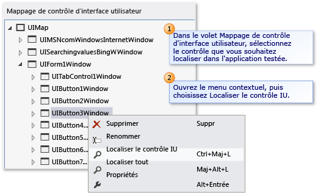

 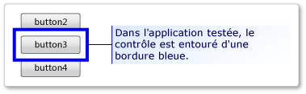

 Dans le volet **Mappage de contrôle d'interface utilisateur** , sélectionnez le contrôle à localiser dans l'application associée au test. Ensuite, ouvrez le menu contextuel du contrôle, puis choisissez **Localiser le contrôle IU**. Dans l'application testée, le contrôle est signalé par une bordure bleue.

> [!NOTE]
> Avant de localiser un contrôle d’IU, vérifiez que l’application associée au test est en cours d’exécution.

### Conseils

Vous pouvez également utiliser l’option **Localiser tout** pour vérifier que tous les contrôles inclus dans un conteneur peuvent être correctement localisés. Cette option est décrite dans la section suivante.

##   Localisation d’un contrôle et de ses descendants
 Vous pouvez vérifier que tous les contrôles inclus dans un conteneur peuvent être correctement localisés dans l'interface utilisateur de l'application testée. Cela peut s'avérer utile pour vérifier les modifications de propriété de recherche apportées au conteneur. De plus, si des modifications importantes ont été apportées à l'interface utilisateur de l'application testée, vous pouvez vous assurer que les propriétés de recherche des contrôles existants sont toujours correctes.

 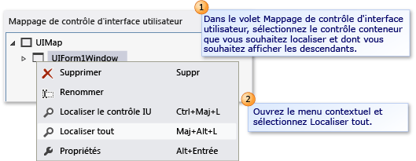

 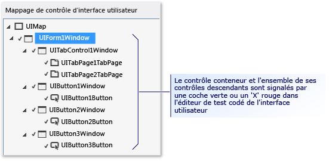

 Dans le volet **Mappage de contrôle d'interface utilisateur** , sélectionnez le contrôle conteneur à localiser et dont vous voulez afficher tous les descendants. Ensuite, ouvrez le menu contextuel du contrôle et choisissez **Localiser tout**. Le contrôle conteneur et tous ses contrôles descendants sont marqués dans l’éditeur de test codé de l’interface utilisateur avec une coche verte ou un « X » rouge. Ces marques vous permettent de savoir si les contrôles ont été correctement localisés dans l'application testée.

> [!NOTE]
> Avant de localiser les contrôles d’IU, vérifiez que l’application associée au test est en cours d’exécution.

##   Insertion d'un délai avant une action d'interface utilisateur
 Parfois, vous pouvez avoir besoin que le test attende que certains événements se produisent, notamment qu'une fenêtre s'affiche, que la barre de progression disparaisse, etc. À l'aide de l'éditeur de test codé de l'interface utilisateur, vous pouvez définir cette attente en insérant un délai avant une action d'interface utilisateur. Vous pouvez indiquer le nombre de secondes du délai.

 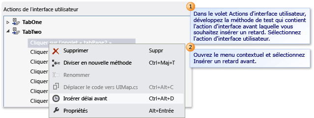

 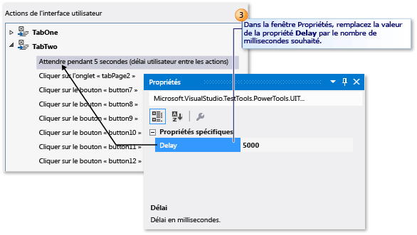

 Dans le volet **Action d'interface utilisateur** , développez la méthode de test qui contient l'action d'interface utilisateur avant laquelle vous voulez insérer un délai. Sélectionnez l'action d'interface utilisateur. Ensuite, ouvrez le menu contextuel de l'action d'interface utilisateur et choisissez **Insérer délai avant**. Un délai est inséré et mis en surbrillance avant l'action d'interface utilisateur sélectionnée avec le texte suivant : **Attendre pendant 1 secondes (délai utilisateur entre les actions)**. Dans la fenêtre Propriétés, remplacez la valeur de la propriété **Délai** par le nombre de millisecondes souhaité.

 Une fois que vous avez terminé d'insérer le délai, enregistrez les modifications dans le fichier UIMap.Designer en choisissant **Enregistrer** dans la barre d'outils [!INCLUDE[vsprvs](../code-quality/includes/vsprvs_md.md)] .

Si vous devez vous assurer qu'un contrôle spécifique est disponible avant une action d'interface utilisateur, vous devez envisager d'ajouter du code personnalisé à votre méthode de test à l'aide de la méthode UITestControl.WaitForControlXXX() appropriée. Pour plus d’informations, consultez [Suspension des tests codés de l’interface utilisateur en attendant des événements spécifiques pendant la lecture](../test/making-coded-ui-tests-wait-for-specific-events-during-playback.md).

### Conseils

Si la fenêtre Propriétés n’est pas affichée, appuyez de façon prolongée sur **Alt** pendant que vous appuyez sur **Entrée**, ou appuyez sur **F4**.

## Voir aussi

- [Utiliser l’automatisation de l’interface utilisateur pour tester votre code](../test/use-ui-automation-to-test-your-code.md)
- [Création de tests codés de l’interface utilisateur](../test/use-ui-automation-to-test-your-code.md)
- [Création d’un test codé de l’interface utilisateur piloté par les données](../test/creating-a-data-driven-coded-ui-test.md)
- [Procédures pas à pas : création, édition et gestion d’un test codé de l’interface utilisateur](../test/walkthrough-creating-editing-and-maintaining-a-coded-ui-test.md)