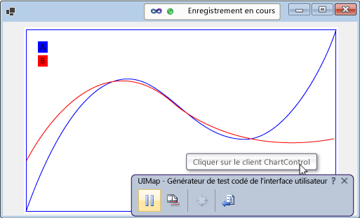
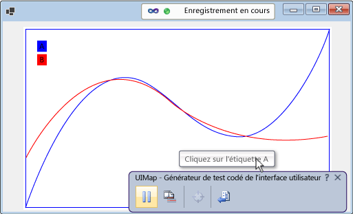
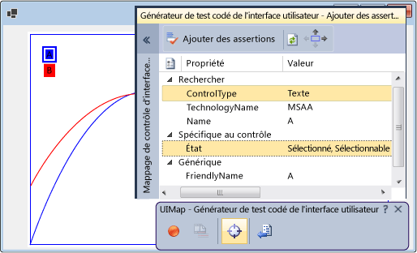

# <a name="enable-coded-ui-testing-of-your-controls"></a>Activer le test codé de l'interface utilisateur de vos contrôles
Vous pouvez tester votre contrôle plus facilement si vous implémentez la prise en charge du framework de test codé de l'interface utilisateur. Vous pouvez ajouter des niveaux croissants de prise en charge de manière incrémentielle. Vous pouvez commencer en prenant en charge l'enregistrement et la lecture, ainsi que la validation de propriété. Cette option vous permet d’autoriser le générateur de test codé de l’interface utilisateur à reconnaître les propriétés personnalisées de votre contrôle et de fournir aux classes personnalisées l’accès à ces propriétés à partir du code généré. Vous pouvez également aider à ce que les actions de capture du générateur de test codé de l'interface utilisateur soient plus proches de l'objectif de l'action en cours d'enregistrement.  
  
 **Dans cette rubrique :**  
  
1.  [Prendre en charge l’enregistrement et la lecture, ainsi que la validation de propriété, en implémentant l’accessibilité](../test/enable-coded-ui-testing-of-your-controls.md#recordandplayback)  
  
2.  [Prendre en charge la validation de propriété personnalisée en implémentant un fournisseur de propriétés](../test/enable-coded-ui-testing-of-your-controls.md#customproprties)  
  
3.  [Prendre en charge la génération de code en implémentant une classe pour accéder aux propriétés personnalisées](../test/enable-coded-ui-testing-of-your-controls.md#codegeneration)  
  
4.  [Prendre en charge les actions avec intention en implémentant un filtre d’action](../test/enable-coded-ui-testing-of-your-controls.md#intentawareactions)  
  
   
  
##  <a name="recordandplayback"></a>Prendre en charge l’enregistrement et la lecture, ainsi que la validation de propriété, en implémentant l’accessibilité  
 Le générateur de test codé de l'interface utilisateur capture des informations sur les contrôles qu'il rencontre lors d'un enregistrement et génère ensuite le code pour relire la session. Si votre contrôle ne prend pas en charge l'accessibilité, le générateur de test codé de l'interface utilisateur capture les actions (telles que les clics de souris) à l'aide des coordonnées d'écran. Lorsque le test est lu, le code généré émet les clics de souris dans ces mêmes coordonnées d'écran. Si votre contrôle s'affiche à un autre emplacement de l'écran lors de la lecture du test, le code généré échoue à effectuer cette action sur votre contrôle. Il peut en résulter un échec si le test est lu sur d'autres configurations d'écran, dans des environnements différents ou après que des modifications ont été apportées à la disposition de l'interface utilisateur.  
  
   
  
 Si vous implémentez l'accessibilité, toutefois, le générateur de test codé de l'interface utilisateur s'en sert pour capturer les informations sur votre contrôle lorsqu'il enregistre un test et génère le code. Ensuite, lorsque vous exécutez le test, le code généré relit les événements par rapport à votre contrôle, même s'il se trouve à un autre emplacement de l'interface utilisateur. Les auteurs de test sont également en mesure de créer des assertions à l'aide des propriétés de base de votre contrôle.  
  
   
  
### <a name="to-support-record-and-playback-property-validation-and-navigation-for-a-windows-forms-control"></a>Pour prendre en charge l’enregistrement et la lecture, la validation de propriété et la navigation d’un contrôle Windows Forms  
 Implémentez l'accessibilité de votre contrôle, comme indiqué dans la procédure suivante et expliqué en détail dans <xref:System.Windows.Forms.AccessibleObject>.  
  
   
  
1.  Implémentez une classe qui dérive de <xref:System.Windows.Forms.Control.ControlAccessibleObject> et remplacez la propriété <xref:System.Windows.Forms.Control.AccessibilityObject%2A> pour retourner un objet de votre classe.  
  
    ```c#  
    public partial class ChartControl : UserControl  
    {  
        // Overridden to return the custom AccessibleObject for the control.  
        protected override AccessibleObject CreateAccessibilityInstance()  
        {  
            return new ChartControlAccessibleObject(this);  
        }  
  
        // Inner class ChartControlAccessibleObject represents accessible information  
        // associated with the ChartControl and is used when recording tests.  
        public class ChartControlAccessibleObject : ControlAccessibleObject  
        {  
            ChartControl myControl;  
            public ChartControlAccessibleObject(ChartControl ctrl)  
                : base(ctrl)  
            {  
                myControl = ctrl;  
            }  
        }  
    }  
    ```  
  
2.  Remplacez les propriétés et méthodes <xref:System.Windows.Forms.AccessibleObject.Role%2A>, <xref:System.Windows.Forms.AccessibleObject.State%2A>, <xref:System.Windows.Forms.AccessibleObject.GetChild%2A> et <xref:System.Windows.Forms.AccessibleObject.GetChildCount%2A> de l’objet accessible.  
  
3.  Implémentez un autre objet d’accessibilité pour le contrôle enfant et remplacez la propriété <xref:System.Windows.Forms.Control.AccessibilityObject%2A> du contrôle enfant pour retourner l’objet d’accessibilité.  
  
4.  Remplacez les propriétés et méthodes <xref:System.Windows.Forms.AccessibleObject.Bounds%2A>, <xref:System.Windows.Forms.AccessibleObject.Name%2A>, <xref:System.Windows.Forms.AccessibleObject.Parent%2A>, <xref:System.Windows.Forms.AccessibleObject.Role%2A>, <xref:System.Windows.Forms.AccessibleObject.State%2A>, <xref:System.Windows.Forms.AccessibleObject.Navigate%2A> et <xref:System.Windows.Forms.AccessibleObject.Select%2A> de l’objet d’accessibilité du contrôle enfant.  
  
> [!NOTE]
>  Cette rubrique commence par l'exemple d'accessibilité de <xref:System.Windows.Forms.AccessibleObject> dans la procédure, puis se base dessus dans les procédures suivantes. Si vous souhaitez créer une version opérationnelle de l'exemple d'accessibilité, créez une application console et remplacez le code du fichier Program.cs par celui de l'exemple. Vous devez ajouter des références à Accessibility, System.Drawing et System.Windows.Forms. Vous devez modifier la propriété **Incorporer les types d’interopérabilité** d’Accessibility et lui attribuer la valeur **False** afin de prévenir un avertissement de build. Vous pouvez changer le type de sortie du projet et remplacer **Application Console** par **Application Windows** pour qu’une fenêtre de console n’apparaisse pas quand vous exécutez l’application.  
  
##  <a name="customproprties"></a> Prendre en charge la validation de propriété personnalisée en implémentant un fournisseur de propriétés  
 Une fois que vous avez implémenté la prise en charge de base pour l’enregistrement et la lecture, ainsi que pour la validation de propriété, vous pouvez rendre les propriétés personnalisées de votre contrôle accessibles aux tests codés de l’interface utilisateur en implémentant un plug-in <xref:Microsoft.VisualStudio.TestTools.UITesting.UITestPropertyProvider>. Par exemple, la procédure suivante crée un fournisseur de propriétés qui permet aux tests codés de l’interface utilisateur d’accéder à la propriété State des contrôles enfants CurveLegend du contrôle de graphique.  
  
   
  
### <a name="to-support-custom-property-validation"></a>Pour prendre en charge la validation de propriété personnalisée  
   
  
1.  Substituez la propriété <xref:System.Windows.Forms.AccessibleObject.Description%2A> de l’objet accessible de la légende de la courbe pour passer des valeurs de propriété fournies dans la chaîne de description, séparées de la description principale (et les unes des autres si vous implémentez plusieurs propriétés) par des points-virgules (;).  
  
    ```c#  
    public class CurveLegendAccessibleObject : AccessibleObject  
    {  
        // add the state property value to the description  
        public override string Description  
        {  
            get  
            {  
                // Add ";" and the state value to the end  
                // of the curve legend's description  
                return "CurveLegend; " + State.ToString();  
            }  
        }  
    }  
    ```  
  
2.  Créez un package d’extension de test de l’interface utilisateur pour votre contrôle en créant un projet de bibliothèque de classes et ajoutez des références à Accessibility, Microsoft.VisualStudio.TestTools.UITesting, Microsoft.VisualStudio.TestTools.UITest.Common et Microsoft.VisualStudio.TestTools.Extension. Modifiez la propriété **Incorporer les types d’interopérabilité** d’Accessibility et attribuez-lui la valeur **False**.  
  
3.  Ajoutez une classe de fournisseur de propriétés dérivée de <xref:Microsoft.VisualStudio.TestTools.UITesting.UITestPropertyProvider>.  
  
    ```c#  
    using System;  
    using System.Collections.Generic;  
    using Accessibility;  
    using Microsoft.VisualStudio.TestTools.UITesting;  
    using Microsoft.VisualStudio.TestTools.UITest.Extension;  
    using Microsoft.VisualStudio.TestTools.UITesting.WinControls;  
    using Microsoft.VisualStudio.TestTools.UITest.Common;  
  
    namespace ChartControlExtensionPackage  
    {  
        public class ChartControlPropertyProvider : UITestPropertyProvider  
        {  
        }  
    }  
    ```  
  
4.  Implémentez le fournisseur de propriétés en plaçant les noms de propriété et les descripteurs de propriété dans un <xref:System.Collections.Generic.Dictionary%602>.  
  
<CodeContentPlaceHolder>3</CodeContentPlaceHolder>  
5.  Substituez <xref:Microsoft.VisualStudio.TestTools.UITesting.UITestPropertyProvider.GetControlSupportLevel%2A?displayProperty=fullName> pour indiquer que votre assembly fournit une prise en charge spécifique au contrôle pour votre contrôle et ses enfants.  
  
<CodeContentPlaceHolder>4</CodeContentPlaceHolder>  
6.  Substituez les méthodes abstraites restantes de <xref:Microsoft.VisualStudio.TestTools.UITesting.UITestPropertyProvider?displayProperty=fullName>.  
  
<CodeContentPlaceHolder>5</CodeContentPlaceHolder>  
7.  Ajoutez une classe de package d’extension dérivée de <xref:Microsoft.VisualStudio.TestTools.UITest.Extension.UITestExtensionPackage>.  
  
<CodeContentPlaceHolder>6</CodeContentPlaceHolder>  
8.  Définissez l'attribut `UITestExtensionPackage` pour l'assembly.  
  
<CodeContentPlaceHolder>7</CodeContentPlaceHolder>  
9. Dans la classe de package d'extension, substituez <xref:Microsoft.VisualStudio.TestTools.UITest.Extension.UITestExtensionPackage.GetService%2A?displayProperty=fullName> pour renvoyer la classe de fournisseur de propriétés lors de la demande d'un fournisseur de propriétés.  
  
<CodeContentPlaceHolder>8</CodeContentPlaceHolder>  
10. Substituez les propriétés et méthodes abstraites restantes de <xref:Microsoft.VisualStudio.TestTools.UITest.Extension.UITestExtensionPackage>.  
  
<CodeContentPlaceHolder>9</CodeContentPlaceHolder>  
11. Créez vos fichiers binaires et copiez-les dans **% ProgramFiles%\Common Files\Microsoft Shared\VSTT\10.0\UITestExtensionPackages**.  
  
> [!NOTE]
>  Ce package d’extension sera appliqué à tout contrôle de type « Texte ». Si vous testez plusieurs contrôles du même type, vous devez les tester séparément et gérer les packages d’extension qui sont déployés quand vous enregistrez les tests.  
  
##  <a name="codegeneration"></a>Prendre en charge la génération de code en implémentant une classe pour accéder aux propriétés personnalisées  
 Lorsque le générateur de test codé de l'interface utilisateur génère le code à partir d'un enregistrement de session, il utilise la classe <xref:Microsoft.VisualStudio.TestTools.UITesting.UITestControl> pour accéder à vos contrôles.  
  
<CodeContentPlaceHolder>10</CodeContentPlaceHolder>  
 Si vous avez implémenté un fournisseur de propriétés pour fournir l’accès aux propriétés personnalisées de votre contrôle, vous pouvez ajouter une classe spécialisée utilisée pour accéder à ces propriétés afin que le code généré soit simplifié.  
  
<CodeContentPlaceHolder>11</CodeContentPlaceHolder>  
### <a name="to-add-a-specialized-class-to-access-your-control"></a>Pour ajouter une classe spécialisée pour accéder à votre contrôle  
   
  
1.  Implémentez une classe dérivée de <xref:Microsoft.VisualStudio.TestTools.UITesting.WinControls.WinControl> et ajoutez le type de contrôle à la collection de propriétés de recherche du constructeur.  
  
<CodeContentPlaceHolder>12</CodeContentPlaceHolder>  
2.  Implémentez les propriétés personnalisées de votre contrôle en tant que propriétés de la classe.  
  
<CodeContentPlaceHolder>13</CodeContentPlaceHolder>  
3.  Substituez la méthode <xref:Microsoft.VisualStudio.TestTools.UITesting.UITestPropertyProvider.GetSpecializedClass%2A?displayProperty=fullName> de votre fournisseur de propriétés pour retourner le type de la nouvelle classe de contrôles enfants de la légende de la courbe.  
  
<CodeContentPlaceHolder>14</CodeContentPlaceHolder>  
4.  Substituez la méthode <xref:Microsoft.VisualStudio.TestTools.UITesting.UITestPropertyProvider.GetPropertyNamesClassType%2A> de votre fournisseur de propriétés pour retourner le type de la méthode PropertyNames de la nouvelle classe.  
  
<CodeContentPlaceHolder>15</CodeContentPlaceHolder>  
##  <a name="intentawareactions"></a> Prendre en charge les actions avec intention en implémentant un filtre d’action  
 Lorsque Visual Studio enregistre un test, il capture chaque événement de souris et de clavier. Toutefois, dans certains cas, l'objectif de l'action peut se perdre dans la série d'événements de souris et de clavier. Par exemple, si votre contrôle prend en charge la saisie semi-automatique, le même jeu d'événements de souris et de clavier peut entraîner une valeur différente lorsque le test est lu dans un environnement différent. Vous pouvez ajouter un plug-in de filtre d'action qui remplace la série d'événements de clavier et de souris par une seule action. De cette façon, vous pouvez remplacer la série d'événements de clavier et de souris qui résulte de la sélection d'une valeur par une action unique qui définit la valeur. Ce remplacement permet de protéger les tests codés de l'interface utilisateur contre les différences de saisie semi-automatique d'un environnement à un autre.  
  
### <a name="to-support-intent-aware-actions"></a>Pour prendre en charge les actions avec intention  
   
  
1.  Implémentez une classe de filtre d’action dérivée de <xref:Microsoft.VisualStudio.TestTools.UITest.Common.UITestActionFilter>, en substituant les propriétés <xref:Microsoft.VisualStudio.TestTools.UITest.Common.UITestActionFilter.ApplyTimeout%2A>, <xref:Microsoft.VisualStudio.TestTools.UITest.Common.UITestActionFilter.Category%2A>, <xref:Microsoft.VisualStudio.TestTools.UITest.Common.UITestActionFilter.Enabled%2A>, <xref:Microsoft.VisualStudio.TestTools.UITest.Common.UITestActionFilter.FilterType%2A>, <xref:Microsoft.VisualStudio.TestTools.UITest.Common.UITestActionFilter.Group%2A> et <xref:Microsoft.VisualStudio.TestTools.UITest.Common.UITestActionFilter.Name%2A>.  
  
<CodeContentPlaceHolder>16</CodeContentPlaceHolder>  
2.  Substituez <xref:Microsoft.VisualStudio.TestTools.UITest.Common.UITestActionFilter.ProcessRule%2A> L'exemple remplace ici une action de double-clic par une action de simple clic.  
  
<CodeContentPlaceHolder>17</CodeContentPlaceHolder>  
3.  Ajoutez le filtre d'action à la méthode <xref:Microsoft.VisualStudio.TestTools.UITest.Extension.UITestExtensionPackage.GetService%2A> de votre package d'extension.  
  
<CodeContentPlaceHolder>18</CodeContentPlaceHolder>  
4.  Créez vos fichiers binaires et copiez-les sur % ProgramFiles%\Common Files\Microsoft Shared\VSTT\10.0\UITestExtensionPackages.  
  
> [!NOTE]
>  Le filtre d'action ne dépend pas de l'implémentation de l'accessibilité ou du fournisseur de propriétés.  
  
## <a name="debug-your-property-provider-or-action-filter"></a>Déboguer votre fournisseur de propriétés ou filtre d'action  
 Vos fournisseur de propriétés et filtre d'action sont implémentés dans un package d'extension qui est chargé et exécuté par le générateur de test codé de l'interface utilisateur dans un processus distinct de votre application.  
  
#### <a name="to-debug-your-property-provider-or-action-filter"></a>Pour déboguer votre fournisseur de propriétés ou filtre d'action  
  
1.  Générez la version debug de votre package d’extension, puis copiez les fichiers .dll et .pdb dans % ProgramFiles%\Common Files\Microsoft Shared\VSTT\10.0\UITestExtensionPackages.  
  
2.  Exécutez votre application (pas dans le débogueur).  
  
3.  Exécutez le test codé de l'interface utilisateur.  
  
     `codedUITestBuilder.exe  /standalone`  
  
4.  Attachez le débogueur au processus codedUITestBuilder.  
  
5.  Définissez les points d'arrêt dans votre code.  
  
6.  Dans le générateur de test codé de l'interface utilisateur, créez des assertions pour tester votre fournisseur de propriétés et enregistrez les actions pour tester vos filtres d'action.  
  
## <a name="external-resources"></a>Ressources externes  
  
### <a name="guidance"></a>Conseils  
 [Test de la livraison continue avec Visual Studio 2012 - Chapitre 2 : Tests unitaires : tester l’intérieur](http://go.microsoft.com/fwlink/?LinkID=255188)  
  
## <a name="see-also"></a>Voir aussi  
 <xref:System.Windows.Forms.AccessibleObject>   
 [Utiliser UI Automation pour tester votre code](../test/use-ui-automation-to-test-your-code.md)

