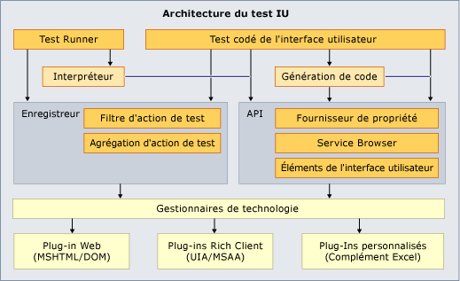

# Étendre des tests codés de l’interface utilisateur et des enregistrements des actions

L'infrastructure de test pour les tests codés de l'interface utilisateur et les enregistrements des actions ne prend pas en charge toutes les interfaces utilisateur possibles. Elle risque de ne pas prendre en charge l’interface utilisateur spécifique que vous souhaitez tester. Par exemple, vous ne pouvez pas créer immédiatement un test codé de l’interface utilisateur ou un enregistrement des actions pour une feuille de calcul Microsoft Excel. Toutefois, vous pouvez créer votre propre extension de l'infrastructure de test codé de l'interface utilisateur, qui prend en charge votre interface utilisateur spécifique en tirant parti de l’extensibilité du framework de test codé de l'interface utilisateur.

[!INCLUDE [coded-ui-test-deprecation](includes/coded-ui-test-deprecation.md)]

## Exemple d’extension pour tester Microsoft Excel

Ce [billet de blog](https://blogs.msdn.microsoft.com/gautamg/2010/01/05/3-introducing-sample-excel-extension/) contient un lien vers un [exemple d’extension](https://msdnshared.blob.core.windows.net/media/MSDNBlogsFS/prod.evol.blogs.msdn.com/CommunityServer.Components.PostAttachments/00/09/94/38/24/ExcelPluginSample.zip) de framework de test codé de l’interface utilisateur. Vous pouvez également voir l’intégralité de la [série de billets de blog sur l’extensibilité du test codé de l'interface utilisateur](https://blogs.msdn.microsoft.com/gautamg/2010/01/05/series-on-coded-ui-test-extensibility/).

> [!NOTE]
> L'exemple est conçu pour être utilisé avec Microsoft Excel 2010. Il peut fonctionner ou pas avec d’autres versions d’Excel.

## Voir aussi

- <xref:Microsoft.VisualStudio.TestTools.UITesting.UITestPropertyProvider>
- <xref:Microsoft.VisualStudio.TestTools.UITest.Extension.UITechnologyElement>
- [UITestActionFilter](/previous-versions/visualstudio/visual-studio-2012/dd985757(v=vs.110))
- <xref:Microsoft.VisualStudio.TestTools.UITest.Extension.UITestExtensionPackage>
- [Utiliser l’automatisation de l’interface utilisateur pour tester votre code](../test/use-ui-automation-to-test-your-code.md)
- [Bonnes pratiques pour les tests codés de l’interface utilisateur](../test/best-practices-for-coded-ui-tests.md)
- [Plateformes et configurations prises en charge pour les tests codés de l’interface utilisateur et les enregistrements des actions](../test/supported-configurations-and-platforms-for-coded-ui-tests-and-action-recordings.md)