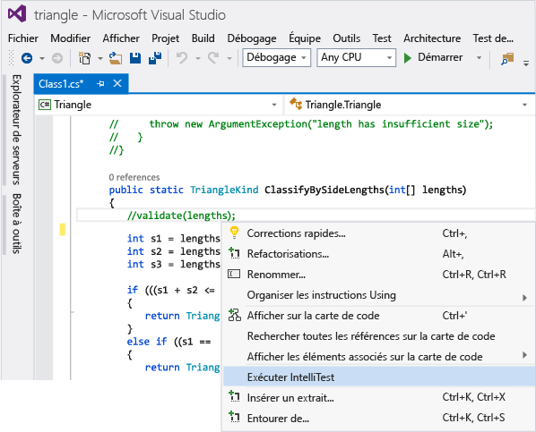
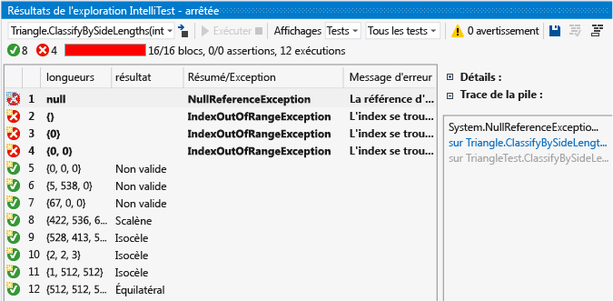
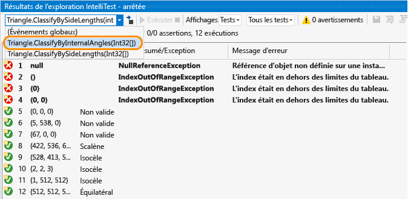
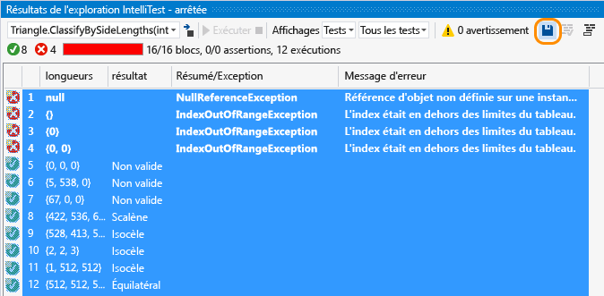
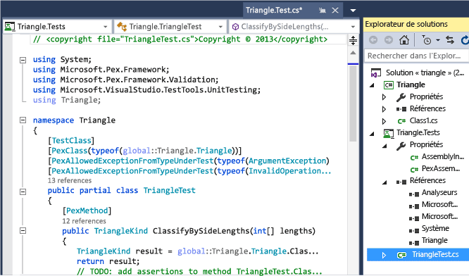
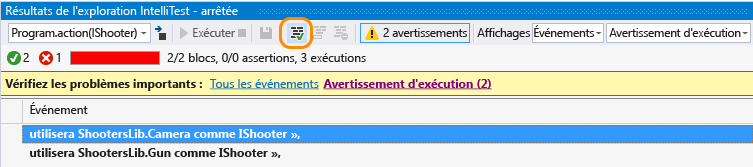
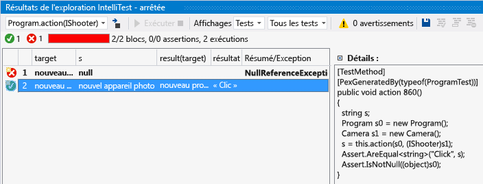

# Comment : générer des tests unitaires à l’aide de IntelliTest

IntelliTest explore votre code .NET pour générer des données de test et une suite de tests unitaires. Pour chaque instruction dans le code, une entrée de test est générée pour exécuter cette instruction. Une analyse de cas est effectuée pour chaque branche conditionnelle dans le code. Par exemple, les instructions `if`, les assertions et toutes les opérations susceptibles de lever des exceptions sont analysées. Cette analyse vous permet de générer des données de test pour établir un test unitaire paramétré pour chacune de vos méthodes et de bénéficier d'une couverture de code élevée.

Lorsque vous exécutez IntelliTest, vous pouvez facilement détecter les tests qui échouent et ajouter le code nécessaire pour les corriger. Vous pouvez sélectionner les tests générés à enregistrer dans un projet de test pour fournir une suite de régression. À mesure que vous modifiez votre code, relancez IntelliTest pour synchroniser les tests générés avec les changements de code.

## Disponibilité et extensions

Les commandes de menu **Créer IntelliTest** et **Exécuter IntelliTest** :

* sont disponibles seulement dans l’édition Enterprise de Visual Studio.

* prennent uniquement en charge le code C# qui cible le .NET Framework ;

* sont [extensibles](#extend-framework) et prennent en charge l’émission de tests aux formats MSTest, MSTest V2, NUnit et xUnit.

* ne prennent pas en charge la configuration x64.

## Exploration : utiliser IntelliTest pour explorer votre code et générer des tests unitaires

Pour générer des tests unitaires, vos types doivent être publics.

1. Ouvrez votre solution dans Visual Studio, puis ouvrez le fichier de classe qui contient les méthodes que vous voulez tester.

2. Cliquez avec le bouton droit sur une méthode et choisissez **Exécuter IntelliTest** pour générer des tests unitaires pour le code de votre méthode.

   

   IntelliTest exécute votre code plusieurs fois de suite avec des entrées différentes. Chaque série est représentée dans un tableau qui répertorie les données des tests d'entrée et la sortie ou exception résultante.

   

Pour générer des tests unitaires pour toutes les méthodes publiques d’une classe, cliquez simplement avec le bouton droit sur la classe au lieu de le faire sur une méthode spécifique, puis choisissez **Exécuter IntelliTest**. Utilisez la liste déroulante de la fenêtre résultats de l' **exploration** pour afficher les tests unitaires et les données d’entrée pour chaque méthode de la classe.

Pour les tests réussis, vérifiez que les résultats indiqués dans la colonne des résultats correspondent bien à vos attentes. Pour les tests qui échouent, corrigez votre code comme il convient. Réexécutez IntelliTest pour valider les corrections.

## Persistance : enregistrer les tests unitaires comme une suite de régression

1. Sélectionnez les lignes de données que vous souhaitez enregistrer avec le test unitaire paramétrable dans un projet de test.

     

     Vous pouvez afficher le projet de test et le test unitaire paramétrable qui a été créé : les tests unitaires individuels correspondant à chacune des lignes sont enregistrés dans le fichier *. g.cs* du projet de test, et un test unitaire paramétré est enregistré dans son fichier *. cs* correspondant. Vous pouvez exécuter les tests unitaires et afficher les résultats dans l'Explorateur de tests au même titre qu'un autre test unitaire que vous avez créé manuellement.

     

     Toutes les références nécessaires sont également ajoutées au projet de test.

     Si le code de la méthode change, relancez IntelliTest pour synchroniser les tests unitaires avec les changements.

## Assistance : utiliser IntelliTest pour vous concentrer sur l'exploration du code

1. Si vous avez du code plus complexe, IntelliTest vous aide à vous concentrer sur l'exploration de votre code. Par exemple, si vous avez une méthode avec une interface comme paramètre et que plusieurs classes implémentent cette interface, IntelliTest découvre ces classes et génère un avertissement.

     Passez en revue les avertissements et décidez de la marche à suivre.

     

2. Après avoir étudié le code et identifié les parties à tester, vous pouvez traiter l'avertissement et choisir les classes à utiliser pour tester l'interface.

     

     Ce choix est ajouté au fichier *PexAssemblyInfo.cs* .

     `[assembly: PexUseType(typeof(Camera))]`

3. Vous pouvez à présent relancer IntelliTest pour générer un test unitaire paramétrable et des données de test en utilisant simplement la classe que vous avez corrigée.

     

## Spécification : utiliser IntelliTest pour vérifier les propriétés définies pour la validation que vous spécifiez dans le code

Spécifiez la relation générale entre les entrées et les sorties que les tests unitaires générés doivent valider. Cette spécification est encapsulée dans une méthode qui ressemble à une méthode de test, mais qui est quantifiée de façon universelle. Il s'agit de la méthode de test unitaire paramétré, et les assertions que vous faites doivent contenir toutes les valeurs d'entrée possibles qu'IntelliTest peut générer.

## Questions et réponses

### Q : Pouvez-vous utiliser IntelliTest pour du code non managé ?

**Q :** Non, IntelliTest ne fonctionne qu'avec du code managé.

### Q : Qu'est-ce qui détermine la réussite ou l'échec d'un test généré ?

**R :** Comme tout autre test unitaire, il réussit si aucune exception ne se produit. Il échoue en cas d'échec d'une assertion ou si le code testé lève une exception non gérée.

Si vous avez un test qui peut réussir en dépit de certaines exceptions, vous pouvez définir l'un des attributs suivants en fonction de vos besoins au niveau de la méthode de test, de la classe de test ou de l'assembly :

- **PexAllowedExceptionAttribute**

- **PexAllowedExceptionFromTypeAttribute**

- **PexAllowedExceptionFromTypeUnderTestAttribute**

- **PexAllowedExceptionFromAssemblyAttribute**

### Q : Puis-je ajouter des hypothèses au test unitaire paramétrable ?

**R :** Oui, utilisez des hypothèses pour spécifier les données de test non requises pour le test unitaire d'une méthode spécifique. Utilisez la classe <xref:Microsoft.Pex.Framework.PexAssume> pour ajouter des hypothèses. Par exemple, vous pouvez ajouter une hypothèse selon laquelle la variable `lengths` n’a pas la valeur NULL, comme ceci :

`PexAssume.IsNotNull(lengths);`

Si vous ajoutez une hypothèse et que vous relancez IntelliTest, les données de test qui ne sont plus adéquates sont supprimées.

### Q : Puis-je ajouter des assertions au test unitaire paramétrable ?

**R :** Oui. IntelliTest vérifie que les assertions dans votre instruction sont correctes quand il exécute les tests unitaires. Utilisez la classe <xref:Microsoft.Pex.Framework.PexAssert> ou l'API d'assertion qui est fournie avec l'infrastructure de test pour ajouter des assertions. Par exemple, vous pouvez ajouter une assertion selon laquelle deux variables sont égales.

`PexAssert.AreEqual(a, b);`

Si vous ajoutez une assertion et que vous relancez IntelliTest, ce dernier vérifie que votre assertion est valide et le test échoue si elle ne l’est pas.

###  Q : puis-je générer des tests unitaires paramétrables sans exécuter IntelliTest en premier ?

**R :** Oui, cliquez avec le bouton droit sur la classe ou la méthode, puis choisissez **Créer IntelliTest**.

Acceptez le format par défaut pour générer vos tests ou modifiez la façon dont votre projet et les tests sont nommés. Vous pouvez créer un nouveau projet de test ou enregistrer vos tests dans un projet existant.

### Q : Puis-je utiliser d’autres infrastructures de tests unitaires avec IntelliTest ?

**R :** Oui, suivez ces étapes pour [rechercher et installer d’autres frameworks](../test/install-third-party-unit-test-frameworks.md).
Les extensions de Framework de test sont également disponibles dans Visual Studio Marketplace, par exemple, [nunit Test Generator](https://marketplace.visualstudio.com/items?itemName=NUnitDevelopers.TestGeneratorNUnitextension-18371).

Après avoir redémarré Visual Studio et rouvert votre solution, cliquez avec le bouton droit sur la classe ou la méthode, puis choisissez **Créer IntelliTest**. Sélectionnez l’infrastructure installée ici :

Exécutez ensuite IntelliTest pour générer des tests unitaires individuels dans les fichiers *. g.cs* correspondants.

### Q : Puis-je en savoir plus sur la façon dont les tests sont générés ?

**R :** Oui, pour obtenir une vue d’ensemble globale, lisez ce [billet de blog](https://devblogs.microsoft.com/devops/intellitest-one-test-to-rule-them-all/).
