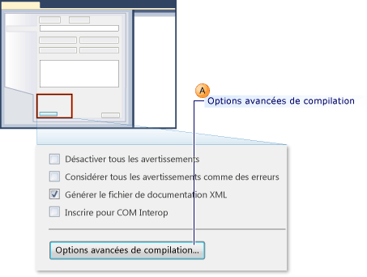
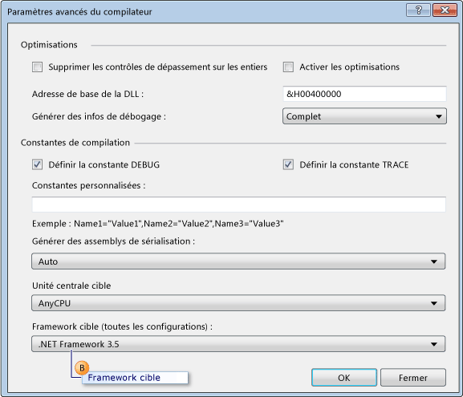
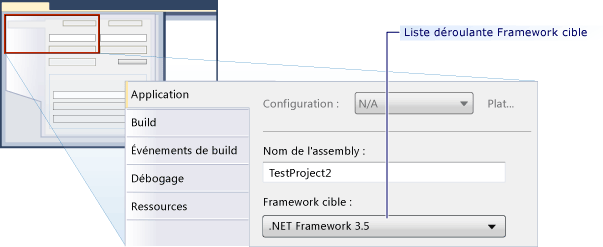

# <a name="how-to-configure-unit-tests-to-target-an-earlier-version-of-the-net-framework"></a>Procédure : configurer des tests unitaires pour cibler une version antérieure du .NET Framework

Quand vous créez un projet de test dans Microsoft Visual Studio, la version la plus récente du .NET Framework est définie en tant que cible, par défaut. De plus, si vous mettez à niveau des projets de test à partir de versions antérieures de Visual Studio, ceux-ci sont mis à niveau pour cibler la version la plus récente du .NET Framework. En modifiant les propriétés du projet, vous pouvez recibler explicitement le projet vers des versions antérieures du .NET Framework.

Vous pouvez créer des projets de test unitaire qui ciblent des versions spécifiques du .NET Framework. La version ciblée doit correspondre à la version 3.5 (ou une version ultérieure) et ne peut pas être une version client. Visual Studio assure la prise en charge de base suivante pour les tests unitaires qui ciblent des versions spécifiques :

- Vous pouvez créer des projets de test unitaire et les cibler vers une version spécifique du .NET Framework.

- Vous pouvez exécuter des tests unitaires qui ciblent une version spécifique du .NET Framework à partir de Visual Studio sur votre machine locale.

- Vous pouvez exécuter des tests unitaires qui ciblent une version spécifique du .NET Framework à l’aide de *MSTest.exe* à partir de l’invite de commandes.

- Vous pouvez exécuter des tests unitaires sur un agent de build dans le cadre d’une build.

**Test des applications SharePoint**

Les fonctionnalités listées ci-dessus vous permettent également d’écrire des tests unitaires et des tests d’intégration pour les applications SharePoint à l’aide de Visual Studio. Pour plus d’informations sur le développement d’applications SharePoint à l’aide de Visual Studio, consultez [Créer des solutions SharePoint](../sharepoint/create-sharepoint-solutions.md), [Générer et déboguer des solutions SharePoint](../sharepoint/building-and-debugging-sharepoint-solutions.md) et [Vérifier et déboguer du code SharePoint](../sharepoint/verifying-and-debugging-sharepoint-code.md).

**Limitations**

Les limitations suivantes s’appliquent quand vous reciblez vos projets de test pour utiliser des versions antérieures du .NET Framework :

- Dans .NET Framework 3.5, le multiciblage est pris en charge pour les projets de test qui contiennent uniquement des tests unitaires. .NET Framework 3.5 ne prend pas en charge d’autres types de test, par exemple le test codé de l’interface utilisateur ou le test de charge. Le reciblage est bloqué pour les types de test qui ne sont pas des tests unitaires.

- L’exécution de tests qui ciblent une version antérieure du .NET Framework est prise en charge uniquement par l’adaptateur hôte par défaut. Elle n’est pas prise en charge par l’adaptateur hôte ASP.NET. Les applications ASP.NET qui doivent s’exécuter dans le contexte d’un Serveur de développement ASP.NET doivent être compatibles avec la version actuelle du .NET Framework.

- La prise en charge de la collecte de données est désactivée quand vous exécutez des tests qui prennent en charge le multiciblage .NET Framework 3.5. Vous pouvez exécuter la couverture du code à l’aide des outils en ligne de commande Visual Studio.

- Les tests unitaires qui utilisent .NET Framework 3.5 ne peuvent pas s’exécuter sur une machine distante.

- Vous ne pouvez pas cibler les tests unitaires vers les précédentes versions client du framework.

## <a name="retargeting-for-visual-basic-unit-test-projects"></a>Reciblage pour les projets de test unitaire Visual Basic

1. Créez un **projet de test unitaire** Visual Basic.

2. Dans l’**Explorateur de solutions**, choisissez **Propriétés** dans le menu contextuel du nouveau projet de test Visual Basic.

     Les propriétés de votre projet de test Visual Basic s’affichent.

3. Sous l’onglet **Compiler**, choisissez **Options avancées de compilation**, comme indiqué dans l’illustration suivante.

     

4. Utilisez la liste déroulante **Framework cible (toutes les configurations)** pour remplacer le framework cible par **.NET Framework 3.5** ou une version ultérieure, comme indiqué dans la légende B de l’illustration suivante. Ne spécifiez pas de version client.

     

## <a name="retargeting-for-c-unit-test-projects"></a>Reciblage pour les projets de test unitaire C#

1. Créez un **projet de test unitaire** C#.

2. Dans **l’Explorateur de solutions**, choisissez **Propriétés** dans le menu contextuel de votre nouveau projet de test C#.

   Les propriétés de votre projet de test C# s’affichent.

3. Sous l’onglet **Application**, choisissez **Framework cible**. Dans la liste déroulante, choisissez **.NET Framework 3.5** ou une version ultérieure, comme indiqué dans l’illustration suivante. Ne spécifiez pas de version client.

   

## <a name="retargeting-for-ccli-unit-test-projects"></a>Reciblage pour les projets de test unitaire C++/CLI

1. Créez un **projet de test unitaire** C++.

   > [!WARNING]
   > Pour créer des tests unitaires C++/CLI basés sur une version antérieure du .NET Framework pour Visual C++, vous devez utiliser la version correspondante de Visual Studio.

2. Dans **l’Explorateur de solutions**, choisissez **Décharger le projet** à partir de votre nouveau projet de test C++.

3. Dans **l’Explorateur de solutions**, choisissez le projet de test C++ déchargé, puis choisissez **Modifier \<nom_projet>.vcxproj**.

   Le fichier *.vcxproj* s’ouvre dans l’éditeur.

4. Affectez la version 3.5 ou une version ultérieure à `TargetFrameworkVersion` dans le `PropertyGroup` nommé `"Globals"`. Ne spécifiez pas de version client :

    ```xml
    <PropertyGroup Label="Globals">
        <TargetName>DefaultTest</TargetName>
        <ProjectTypes>{3AC096D0-A1C2-E12C-1390-A8335801FDAB};{8BC9CEB8-8B4A-11D0-8D11-00A0C91BC942}</ProjectTypes>
        <ProjectGUID>{CE16D77A-E364-4ACD-948B-1EB6218B0EA3}</ProjectGUID>
        <TargetFrameworkVersion>3.5</TargetFrameworkVersion>
        <Keyword>ManagedCProj</Keyword>
        <RootNamespace>CPP_Test</RootNamespace>
      </PropertyGroup>
    ```

5. Enregistrez et fermez le fichier *.vcxproj*.

6. Dans l’**Explorateur de solutions**, choisissez **Recharger le projet** dans le menu contextuel de votre nouveau projet de test C++.

## <a name="see-also"></a>Voir aussi

- [Créer des solutions SharePoint](../sharepoint/create-sharepoint-solutions.md)
- [Générer et déboguer des solutions SharePoint](../sharepoint/building-and-debugging-sharepoint-solutions.md)
- [Paramètres avancés du compilateur, boîte de dialogue (Visual Basic)](../ide/reference/advanced-compiler-settings-dialog-box-visual-basic.md)
