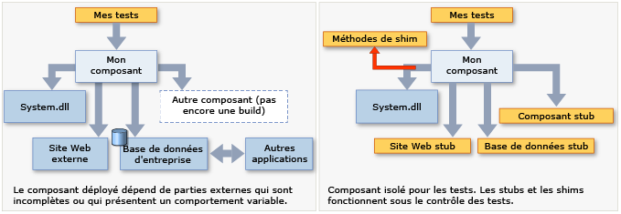

# <a name="isolating-code-under-test-with-microsoft-fakes"></a>Isolation du code sous test avec Microsoft Fakes

Microsoft Fakes vous permet d’isoler le code que vous testez en remplaçant d’autres parties de l’application par des *stubs* ou des *shims*. Ce sont de petits segments de code qui sont sous le contrôle de vos tests. En isolant votre code pour les tests, vous savez que si le test échoue, la cause réside dans le code et pas ailleurs. Les stubs et les shims vous permettent également de tester votre code même si d'autres parties de votre application ne fonctionnent pas encore.

Microsoft Fakes est disponible en deux versions :

-   Un [stub](#stubs) remplace une classe par un petit substitut qui implémente la même interface.  Pour utiliser les stubs, vous devez concevoir votre application afin que chaque composant dépende uniquement des interfaces, et non pas d'autres composants. (Par « composant » nous entendons une classe ou un groupe de classes conçues et mises à jour ensemble et généralement contenues dans un assembly.)

-   Un [shim](#shims) modifie le code compilé de votre application au moment de l’exécution pour qu’elle exécute le code shim que votre test fournit au lieu de faire un appel de méthode spécifié. Les shims peuvent être utilisés pour remplacer les appels aux assemblys que vous ne pouvez pas modifier, par exemple les assemblys .NET.



**Spécifications**

-   Visual Studio Enterprise
-   Un projet .NET Framework

> [!NOTE]
> Les projets .NET Standard ne sont pas pris en charge.

## <a name="choosing-between-stub-and-shim-types"></a>Choix entre types stub et shim
En général, vous considérez un projet Visual Studio comme un composant, car vous développez et mettez à jour ces classes simultanément. Vous pouvez envisager d'utiliser des stubs et des shims pour les appels que le projet effectue en direction d'autres projets de votre solution ou d'autres assemblys que le projet référence.

En règle générale, utilisez des stubs pour les appels dans votre solution Visual Studio et des shims pour les appels vers d'autres assemblys référencés. En effet, dans votre propre solution, il est conseillé de découpler les composants en définissant les interfaces de la façon requise par l'opération stub. Cependant, les assemblys externes tels que System.dll ne sont généralement pas fournis avec des définitions d'interface distinctes et vous devez utiliser des shims à la place.

Les autres éléments à prendre en compte sont :

**Performances.** Les shims s'exécutent plus lentement, car ils réécrivent votre code au moment de l'exécution. Les stubs ne subissent pas cette surcharge de performances et sont aussi rapides que les méthodes virtuelles.

**Méthodes statiques, types sealed.** Vous pouvez uniquement utiliser les stubs pour implémenter les interfaces. Par conséquent, les types stub ne peuvent pas être utilisés pour les méthodes statiques, les méthodes non virtuelles, les méthodes virtuelles sealed, les méthodes dans les types sealed, etc.

**Types internes.** Les stubs et les shims peuvent être utilisés avec les types internes qui sont rendus accessibles à l'aide de l'attribut d'assembly <xref:System.Runtime.CompilerServices.InternalsVisibleToAttribute>.

**Méthodes privées.** Les shims peuvent remplacer les appels aux méthodes privées si tous les types dans la signature de méthode sont visibles. Les stubs peuvent uniquement remplacer des méthodes visibles.

**Interfaces et méthodes abstraites.** Les stubs fournissent des implémentations d'interfaces et de méthodes abstraites qui peuvent être utilisées lors du test. Les shims ne peuvent pas instrumenter les interfaces ni les méthodes abstraites, car ils n’ont pas de corps de méthode.

En général, nous vous conseillons d'utiliser des types stub pour isoler des dépendances dans votre base de code. Pour cela, masquez les composants derrière les interfaces. Les types shim peuvent être utilisés pour isoler des composants tiers qui ne fournissent pas d'API pouvant être testée.

##  <a name="stubs"></a> Démarrage avec les stubs
Pour obtenir une description détaillée, consultez [Utilisation de stubs pour isoler des parties de votre application les unes des autres pour des tests unitaires](../test/using-stubs-to-isolate-parts-of-your-application-from-each-other-for-unit-testing.md).

1.  **Injecter des interfaces**

     Pour utiliser les stubs, vous devez écrire le code que vous souhaitez tester de telle sorte qu'il ne mentionne pas explicitement les classes d'un autre composant de votre application. Par « composant » nous entendons une ou plusieurs classes développées et mises à jour ensemble et généralement contenues dans un projet Visual Studio. Les variables et les paramètres doivent être déclarés à l'aide d'interfaces et les instances des autres composants doivent être passées ou créées à l'aide d'une fabrique. Par exemple, si StockFeed est une classe dans un autre composant de l'application, le résultat est incorrect :

     `return (new StockFeed()).GetSharePrice("COOO"); // Bad`

     Au lieu de cela, définissez une interface qui peut être implémentée par l'autre composant, et qui peut également être implémentée par un stub à des fins de test :

    ```csharp
    public int GetContosoPrice(IStockFeed feed)
    { return feed.GetSharePrice("COOO"); }

    ```

    ```vb
    Public Function GetContosoPrice(feed As IStockFeed) As Integer
     Return feed.GetSharePrice("COOO")
    End Function

    ```

2.  **Ajouter un assembly Fakes**

    1.  Dans l’Explorateur de solutions, développez la liste de références du projet de test. Si vous utilisez Visual Basic, vous devez choisir **Afficher tous les fichiers** pour afficher la liste des références.

    2.  Sélectionnez la référence à l'assembly dans lequel l'interface (par exemple IStockFeed) est définie. Dans le menu contextuel de cette référence, choisissez **Ajouter un assembly Fakes**.

    3.  Régénérez la solution.

3.  Dans vos tests, construisez les instances du stub et fournissez le code pour ses méthodes :

    ```csharp
    [TestClass]
    class TestStockAnalyzer
    {
        [TestMethod]
        public void TestContosoStockPrice()
        {
          // Arrange:

            // Create the fake stockFeed:
            IStockFeed stockFeed =
                 new StockAnalysis.Fakes.StubIStockFeed() // Generated by Fakes.
                     {
                         // Define each method:
                         // Name is original name + parameter types:
                         GetSharePriceString = (company) => { return 1234; }
                     };

            // In the completed application, stockFeed would be a real one:
            var componentUnderTest = new StockAnalyzer(stockFeed);

          // Act:
            int actualValue = componentUnderTest.GetContosoPrice();

          // Assert:
            Assert.AreEqual(1234, actualValue);
        }
        ...
    }
    ```

    ```vb
    <TestClass()> _
    Class TestStockAnalyzer

        <TestMethod()> _
        Public Sub TestContosoStockPrice()
            ' Arrange:
            ' Create the fake stockFeed:
            Dim stockFeed As New StockAnalysis.Fakes.StubIStockFeed
            With stockFeed
                .GetSharePriceString = Function(company)
                                           Return 1234
                                       End Function
            End With
            ' In the completed application, stockFeed would be a real one:
            Dim componentUnderTest As New StockAnalyzer(stockFeed)
            ' Act:
            Dim actualValue As Integer = componentUnderTest.GetContosoPrice
            ' Assert:
            Assert.AreEqual(1234, actualValue)
        End Sub
    End Class

    ```

    Ici, l'aspect le plus magique est la classe `StubIStockFeed`. Pour chaque interface de l'assembly référencé, le mécanisme Microsoft Fakes génère une classe stub. Le nom de la classe stub est dérivé du nom de l'interface, précédé de "`Fakes.Stub`", et auquel sont ajoutés les noms de types de paramètre.

    Les stubs sont également générés pour les accesseurs Get et les méthodes setter de propriétés, les événements et les méthodes génériques. Pour plus d’informations, consultez [Utilisation de stubs pour isoler des parties de votre application les unes des autres pour des tests unitaires](../test/using-stubs-to-isolate-parts-of-your-application-from-each-other-for-unit-testing.md).

##  <a name="shims"></a> Démarrage avec les shims
(Pour obtenir une description détaillée, consultez [Utilisation de shims pour isoler votre application des autres assemblys pour des tests unitaires](../test/using-shims-to-isolate-your-application-from-other-assemblies-for-unit-testing.md).)

Supposons que votre composant contienne des appels à `DateTime.Now` :

```csharp
// Code under test:
    public int GetTheCurrentYear()
    {
       return DateTime.Now.Year;
    }

```

Pendant le test, placez un shim sur la propriété `Now`, car la vraie version retourne incommodément une valeur différente à chaque appel.

Pour utiliser des shims, vous ne devez pas modifier le code de l’application ni l’écrire d’une façon particulière.

1.  **Ajouter un assembly Fakes**

     Dans l’Explorateur de solutions, ouvrez les références de votre projet de test unitaire et sélectionnez la référence à l’assembly qui contient la méthode que vous souhaitez simuler. Dans cet exemple, la classe `DateTime` se trouve dans **System.dll**.  Pour afficher les références dans un projet Visual Basic, choisissez **Afficher tous les fichiers**.

     Choisissez **Ajouter un assembly Fakes**.

2.  **Insérer un shim dans ShimsContext**

    ```csharp
    [TestClass]
    public class TestClass1
    {
            [TestMethod]
            public void TestCurrentYear()
            {
                int fixedYear = 2000;

                // Shims can be used only in a ShimsContext:
                using (ShimsContext.Create())
                {
                  // Arrange:
                    // Shim DateTime.Now to return a fixed date:
                    System.Fakes.ShimDateTime.NowGet =
                    () =>
                    { return new DateTime(fixedYear, 1, 1); };

                    // Instantiate the component under test:
                    var componentUnderTest = new MyComponent();

                  // Act:
                    int year = componentUnderTest.GetTheCurrentYear();

                  // Assert:
                    // This will always be true if the component is working:
                    Assert.AreEqual(fixedYear, year);
                }
            }
    }
    ```

    ```vb
    <TestClass()> _
    Public Class TestClass1
        <TestMethod()> _
        Public Sub TestCurrentYear()
            Using s = Microsoft.QualityTools.Testing.Fakes.ShimsContext.Create()
                Dim fixedYear As Integer = 2000
                ' Arrange:
                ' Detour DateTime.Now to return a fixed date:
                System.Fakes.ShimDateTime.NowGet = _
                    Function() As DateTime
                        Return New DateTime(fixedYear, 1, 1)
                    End Function

                ' Instantiate the component under test:
                Dim componentUnderTest = New MyComponent()
                ' Act:
                Dim year As Integer = componentUnderTest.GetTheCurrentYear
                ' Assert:
                ' This will always be true if the component is working:
                Assert.AreEqual(fixedYear, year)
            End Using
        End Sub
    End Class
    ```

    Les noms de classe de shim sont obtenus en ajoutant le préfixe `Fakes.Shim` au nom de type d'origine. Les noms de paramètres sont ajoutés au nom de la méthode. (Vous ne devez ajouter aucune référence d’assembly à System.Fakes)

L'exemple précédent utilise un shim pour une méthode statique. Pour utiliser un shim pour une méthode d'instance, écrivez `AllInstances` entre le nom du type et le nom de la méthode :

```vb
System.IO.Fakes.ShimFile.AllInstances.ReadToEnd = ...
```

(Il n’existe aucun assembly « System.IO.Fakes » à référencer. L'espace de noms est généré par le processus de création de shim. Toutefois, vous pouvez utiliser « using » ou « Import » de la façon habituelle.)

Vous pouvez également créer des shims pour des instances spécifiques, des constructeurs et des propriétés. Pour plus d’informations, consultez [Utilisation de shims pour isoler votre application des autres assemblys pour des tests unitaires](../test/using-shims-to-isolate-your-application-from-other-assemblies-for-unit-testing.md).

## <a name="in-this-section"></a>Dans cette section
 [Utilisation de stubs pour isoler des parties de votre application les unes des autres pour des tests unitaires](../test/using-stubs-to-isolate-parts-of-your-application-from-each-other-for-unit-testing.md)

 [Utilisation de shims pour isoler votre application des autres assemblys pour des tests unitaires](../test/using-shims-to-isolate-your-application-from-other-assemblies-for-unit-testing.md)

 [Génération, compilation de code et conventions d’affectation de noms dans Microsoft Fakes](../test/code-generation-compilation-and-naming-conventions-in-microsoft-fakes.md)
