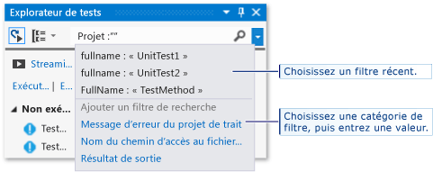

# Exécuter des tests unitaires pour les applications UWP dans Visual Studio
Cette rubrique décrit comment exécuter des tests unitaires à l'aide de l'Explorateur de tests dans Microsoft Visual Studio.  
  
> [!NOTE]
>  Les rubriques de cette section décrivent les fonctionnalités de Visual Studio Express pour Windows 8. Visual Studio Community, Enterprise et Professional fournissent des fonctionnalités supplémentaires pour les tests unitaires.  
>   
>  -   Utilisez n'importe quelle infrastructure de tests unitaires tierce ou open source qui a créé un adaptateur complémentaire pour l'Explorateur de tests Microsoft. Vous pouvez également analyser et afficher les informations de couverture du code pour vos tests.  
> -   Exécutez vos tests après chaque build. Vous pouvez également utiliser Microsoft Fakes, une infrastructure d'isolement pour le code managé, pour concentrer vos tests sur votre propre code en remplaçant le code de test pour les fonctionnalités du système et les fonctionnalités tierces.  
>   
>  Pour plus d’informations, consultez [Tests unitaires sur votre code](../test/unit-test-your-code.md) dans MSDN Library.  
  
##   Dans cette rubrique  
 [Infrastructures de tests unitaires et projets de test](#BKMK_Unit_test_frameworks_and_test_projects)  
  
 [Exécution des tests dans l’Explorateur de tests](#BKMK_Running_tests_in_Test_Explorer)  
  
-   [Exécution de tests](#BKMK_Running_tests)  
  
 [Affichage des résultats de tests](#BKMK_Viewing_test_results)  
  
-   [Affichage des détails de tests](#BKMK_Viewing_test_details)  
  
-   [Affichage du code source d’une méthode de test](#BKMK_Viewing_the_source_code_of_a_test_method)  
  
 [Organisation de la liste de tests](#BKMK_Organizing_the_test_list)  
  
-   [Regroupement de tests](#BKMK_Grouping_tests)  
  
-   [Recherche et filtrage de la liste de tests](#BKMK_Searching_and_filtering_the_test_list)  
  
 [Débogage de tests unitaires](#BKMK_Debugging_unit_tests)  
  
##   Infrastructures de tests unitaires et projets de test  
 Visual Studio Express pour les applications UWP comprend les frameworks de tests unitaires Microsoft pour le code C++ natif et managé. L'Explorateur de tests peut exécuter des tests à partir de plusieurs projets de test dans une solution et à partir de classes de test qui font partie des projets de code de production. Les projets de test peuvent être n'importe quelle combinaison des frameworks de tests unitaires Visual C++ ou Visual C# et Visual Basic. Quand le code testé est écrit pour le .NET Framework, le projet de test peut être écrit dans n'importe quel langage du .NET Framework, quel que soit le langage du code cible. Les projets de code C/C++ natifs doivent être testés à l'aide d'un framework de tests unitaires C++.  
  
##   Exécution des tests dans l’Explorateur de tests  
 Quand vous générez le projet de test, les tests s’affichent dans l’explorateur de tests. Si l’explorateur de tests n’est pas visible, sélectionnez **Test** dans le menu Visual Studio et choisissez **Fenêtres**, puis **Explorateur de tests**.  
  
   
  
 Tandis que vous exécutez, écrivez et réexécutez vos tests, l'Explorateur de tests affiche les résultats dans les groupes par défaut **Échecs de tests**, **Tests réussis**, **Tests ignorés** et **Tests non exécutés**. Vous pouvez modifier la façon dont l'Explorateur de tests regroupe vos tests.  
  
 Vous pouvez effectuer la majeure partie du travail de recherche, d'organisation et d'exécution des tests à partir de la barre d'outils de l'Explorateur de tests.  
  
   
  
###   Exécution de tests  
 Vous pouvez exécuter tous les tests dans la solution, tous les tests dans un groupe, ou un ensemble de tests que vous sélectionnez. Effectuez l’une des opérations suivantes :  
  
-   Pour exécuter tous les tests dans une solution, choisissez **Exécuter tout**.  
  
-   Pour exécuter tous les tests dans un groupe par défaut, choisissez **Exécuter...** , puis le groupe dans le menu.  
  
-   Sélectionnez chacun des tests que vous voulez exécuter, ouvrez le menu contextuel pour un test sélectionné, puis choisissez **Exécuter les tests sélectionnés**.  
  
 La barre Réussite/Échec en haut de la fenêtre Explorateur de tests est animée pendant l'exécution des tests. À la fin de la série de tests, la barre Réussite/Échec devient verte si tous les tests ont réussi ou rouge si un test a échoué.  
  
##   Affichage des résultats de tests  
 Tandis que vous exécutez, écrivez et réexécutez vos tests, l'Explorateur de tests affiche les résultats dans les groupes **Échecs de tests**, **Tests réussis**, **Tests ignorés** et **Tests non exécutés**. Le volet d'informations en bas de l'Explorateur de tests affiche un résumé de la série de tests.  
  
###   Affichage des détails de tests  
 Pour afficher les détails d'un test individuel, sélectionnez le test.  
  
 Le volet d'informations de test affiche les informations suivantes :  
  
-   Nom du fichier source et numéro de ligne de la méthode de test.  
  
-   Statut du test.  
  
-   Temps d'exécution de la méthode.  
  
 Si le test échoue, le volet d'informations affiche également :  
  
-   Le message retourné par l'infrastructure de tests unitaires pour le test.  
  
-   La trace de la pile au moment de l'échec du test.  
  
###   Affichage du code source d’une méthode de test  
 Pour afficher le code source pour une méthode de test dans l’éditeur Visual Studio, sélectionnez le test, puis choisissez **Ouvrir un test** dans le menu contextuel (clavier : F12).  
  
##   Organisation de la liste de tests  
  
###   Regroupement de tests  
 Par défaut, l’Explorateur de tests affiche vos tests en tant que nœuds enfants de **Tests ayant échoué**, **Tests réussis**, **Tests ignorés** et **Tests non exécutés**.  
  
|||  
|-|-|  
||Pour regrouper vos tests d’après la durée nécessaire à leur exécution, ouvrez la liste **Grouper par** et choisissez **Durée**. Choisissez **Résultat du test** pour basculer vers le regroupement d’origine.|  
  
###   Recherche et filtrage de la liste de tests  
 Quand vous avez un grand nombre de tests, vous pouvez taper du texte dans la zone de recherche de l'Explorateur de tests pour filtrer la liste selon la chaîne spécifiée. Vous pouvez limiter votre filtre à certains types de chaînes en choisissant dans la liste des filtres avant d'entrer la chaîne de recherche.  
  
   
  
##   Débogage de tests unitaires  
 Vous pouvez utiliser l'Explorateur de tests pour démarrer une session de débogage de vos tests. L'exécution pas à pas de votre code avec le débogueur Visual Studio vous conduit de manière transparente à des allers et retours entre les tests unitaires et le projet testé. Pour démarrer le débogage :  
  
1.  Dans l’éditeur Visual Studio, définissez un point d’arrêt dans une ou plusieurs méthodes de test que vous souhaitez déboguer.  
  
    > [!NOTE]
    >  Comme les méthodes de test peuvent s’exécuter dans n’importe quel ordre, définissez les points d’arrêt dans toutes les méthodes de test que vous souhaitez déboguer.  
  
2.  Dans l’Explorateur de tests, sélectionnez les méthodes de test, puis choisissez **Déboguer les tests sélectionnés** dans le menu contextuel.  
  
 Pour plus d’informations sur le débogueur, consultez [Debugging in Visual Studio](../debugger/debugging-in-visual-studio.md).
