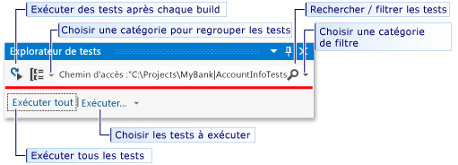
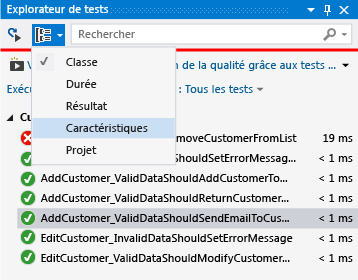
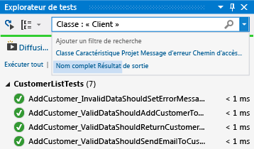

# <a name="run-unit-tests-with-test-explorer"></a>Exécuter des tests unitaires avec l'Explorateur de tests

Utilisez l’Explorateur de tests pour exécuter des tests unitaires à partir de projets de tests unitaires Visual Studio ou tiers. Vous pouvez également utiliser l’Explorateur de tests pour regrouper les tests par catégories, filtrer la liste de tests, et créer, enregistrer et exécuter des playlists de tests. Vous pouvez également analyser la couverture du code et [Déboguer des tests unitaires](../test/debug-unit-tests-with-test-explorer.md).

**L’Explorateur de tests** peut exécuter des tests à partir de plusieurs projets de tests dans une solution et à partir de classes de test qui font partie des projets de code en production. Les projets de test peuvent utiliser différentes infrastructures de tests unitaires. Quand le code testé est écrit pour .NET, le projet de test peut être écrit dans n’importe quel langage qui cible également .NET, quel que soit le langage du code cible. Les projets de code C/C++ natifs doivent être testés à l'aide d'une infrastructure de tests unitaires C++.

## <a name="build-your-test-project"></a>Générer votre projet de test

Si vous n’avez pas encore de projet de test configuré dans votre solution Visual Studio, vous devez d’abord créer et générer un projet de test.

- [Prise en main du test unitaire (.NET)](../test/getting-started-with-unit-testing.md)
- [Écrire des tests unitaires pour C/C++](writing-unit-tests-for-c-cpp.md)

Visual Studio inclut les infrastructures de tests unitaires Microsoft pour le code managé comme pour le code natif. Toutefois, l'Explorateur de tests peut également exécuter toute infrastructure de tests unitaires qui a implémenté un adaptateur pour l'Explorateur de tests. Pour plus d’informations sur l’installation des frameworks de tests unitaires tiers, consultez [Installer des frameworks de tests unitaires tiers](../test/install-third-party-unit-test-frameworks.md).

## <a name="run-tests-in-test-explorer"></a>Exécuter des tests dans l’explorateur de tests

Quand vous générez le projet de test, les tests s’affichent dans l’explorateur de tests. Si l’Explorateur de tests n’est pas visible, choisissez **test** dans le menu Visual Studio, choisissez **fenêtres**, puis **Explorateur de tests** (ou appuyez sur **CTRL**  +  **E**, **T**).

::: moniker range="vs-2017"

::: moniker-end
::: moniker range=">=vs-2019"

::: moniker-end

::: moniker range="vs-2017"
Tandis que vous exécutez, écrivez et réexécutez vos tests, l'Explorateur de tests affiche les résultats dans les groupes par défaut **Échecs de tests**, **Tests réussis**, **Tests ignorés** et **Tests non exécutés**. Vous pouvez modifier la façon dont l'Explorateur de tests regroupe vos tests.
::: moniker-end
::: moniker range=">=vs-2019"
Pendant que vous exécutez, écrivez et réexécutez vos tests, l’Explorateur de tests affiche les résultats en les regroupant par défaut selon les catégories suivantes : **Projet**, **Espace de noms** et **Classe**. Vous pouvez changer la façon dont l’Explorateur de tests regroupe vos tests.
::: moniker-end

Vous pouvez effectuer la majeure partie du travail de recherche, d’organisation et d’exécution des tests à partir de la barre d’outils de **l’Explorateur de tests**.

::: moniker range="vs-2017"

::: moniker-end
::: moniker range=">=vs-2019"

::: moniker-end

### <a name="run-tests"></a>Exécuter les tests

::: moniker range="vs-2017"
Vous pouvez exécuter tous les tests dans la solution, tous les tests dans un groupe, ou un ensemble de tests que vous sélectionnez. Effectuez l’une des opérations suivantes :

- Pour exécuter tous les tests d’une solution, choisissez **exécuter tout** (ou appuyez sur **CTRL** + **R**, **V**).

- Pour exécuter tous les tests dans un groupe par défaut, choisissez **Exécuter**, puis le groupe dans le menu.

- Sélectionnez les tests individuels que vous souhaitez exécuter, ouvrez le menu contextuel d’un test sélectionné, puis choisissez exécuter les **tests sélectionnés** (ou appuyez sur **CTRL** + **R**, **T**).

- Si les tests individuels n’ont aucune dépendance qui les empêche d’être exécutés dans n’importe quel ordre, activez l’exécution parallèle des tests avec le bouton bascule  dans la barre d’outils. Cela peut réduire sensiblement le temps nécessaire pour exécuter tous les tests.

La **barre Réussite/Échec** en haut de la fenêtre **Explorateur de tests** est animée pendant l’exécution des tests. À la fin de la série de tests, la **barre Réussite/Échec** devient verte si tous les tests ont réussi ou rouge si un test a échoué.
::: moniker-end
::: moniker range=">=vs-2019"
Vous pouvez exécuter tous les tests dans la solution, tous les tests dans un groupe, ou un ensemble de tests que vous sélectionnez. Effectuez l’une des opérations suivantes :

- Pour exécuter tous les tests d’une solution, choisissez l’icône **exécuter tout** (ou appuyez sur **CTRL** + **R**, **V**).

- Pour exécuter tous les tests d’un groupe par défaut, choisissez l’icône **Exécuter**, puis choisissez le groupe souhaité dans le menu.

- Sélectionnez les tests individuels que vous souhaitez exécuter, ouvrez le menu contextuel d’un test sélectionné, puis choisissez exécuter les **tests sélectionnés** (ou appuyez sur **CTRL** + **R**, **T**).

- Si les tests individuels n’ont aucune dépendance qui les empêche d’être exécutés dans n’importe quel ordre, activez l’exécution parallèle des tests dans le menu Paramètres de la barre d’outils. Cela peut réduire sensiblement le temps nécessaire pour exécuter tous les tests.
::: moniker-end

### <a name="run-tests-after-every-build"></a>Exécuter des tests après chaque génération
::: moniker range="vs-2017"
|Bouton|Description|
|-|-|
||Pour exécuter vos tests unitaires après chaque génération locale, choisissez **Test** dans le menu standard, puis **Exécuter les tests après la génération** dans la barre d’outils de **l’Explorateur de tests**.|

> [!NOTE]
> L’exécution de tests unitaires après chaque génération nécessite Visual Studio 2017 Enterprise ou Visual Studio 2019. Dans Visual Studio 2019, il est inclus dans les éditions Community et Professional mais aussi Enterprise.
::: moniker-end
::: moniker range=">=vs-2019"
Pour exécuter vos tests unitaires après chaque build locale, ouvrez l’icône des paramètres dans la barre d’outils de l’Explorateur de tests, puis sélectionnez **Exécuter les tests après la build**.
::: moniker-end

## <a name="view-test-results"></a>Afficher les résultats des tests

Tandis que vous exécutez, écrivez et réexécutez vos tests, l'Explorateur de tests affiche les résultats dans les groupes **Échecs de tests**, **Tests réussis**, **Tests ignorés** et **Tests non exécutés**. Le volet d’informations en bas ou sur le côté de l’Explorateur de tests affiche un récapitulatif de la série de tests.

### <a name="view-test-details"></a>Afficher les détails du test

Pour afficher les détails d'un test individuel, sélectionnez le test.

::: moniker range="vs-2017"

::: moniker-end
::: moniker range=">=vs-2019"

::: moniker-end

Le volet d'informations de test affiche les informations suivantes :

- Nom du fichier source et numéro de ligne de la méthode de test.

- Statut du test.

- Temps d'exécution de la méthode.

Si le test échoue, le volet d'informations affiche également :

- Le message retourné par l'infrastructure de tests unitaires pour le test.

- La trace de la pile au moment de l'échec du test.

### <a name="view-the-source-code-of-a-test-method"></a>Afficher le code source d'une méthode de test

Pour afficher le code source d’une méthode de test dans l’éditeur Visual Studio, sélectionnez le test, puis choisissez **ouvrir un test** dans le menu contextuel (ou appuyez sur **F12**).

## <a name="group-and-filter-the-test-list"></a>Regrouper et filtrer la liste de tests

L'Explorateur de tests vous permet de regrouper vos tests en catégories prédéfinies. La plupart des infrastructures de tests unitaires qui s'exécutent dans l'Explorateur de tests vous permettent de définir vos propres catégories et paires catégorie/valeur pour regrouper vos tests. Vous pouvez également filtrer la liste de tests en mettant en correspondance les chaînes avec les propriétés de test.

### <a name="group-tests-in-the-test-list"></a>Regrouper des tests dans la liste de tests

::: moniker range="vs-2017"
Pour modifier le mode d’organisation des tests, cliquez sur la flèche vers le bas à côté du bouton **Grouper par** et sélectionnez un nouveau critère de regroupement.


::: moniker-end
::: moniker range=">=vs-2019"
L’Explorateur de tests vous permet de regrouper vos tests au sein d’une hiérarchie. Le regroupement correspondant à la hiérarchie par défaut est : **Projet**, **Espace de noms**, puis **Classe**. Pour changer la façon dont les tests sont organisés, choisissez le bouton **Regrouper par**, puis sélectionnez un nouveau critère de regroupement.


Vous pouvez définir vos propres niveaux de hiérarchie et effectuer un regroupement par **État**, puis par **Classe**, par exemple, en sélectionnant les options Regrouper par dans l’ordre de votre choix.


::: moniker-end

### <a name="test-explorer-groups"></a>Groupes de l'explorateur de tests

::: moniker range="vs-2017"
|Groupe|Description|
|-|-----------------|
|**Durée**|Regroupe les tests selon la durée d'exécution : **Rapide**, **Moyenne** et **Lente**.|
|**Résultat**|Regroupe les tests selon les résultats de l'exécution : **Échecs de tests**, **Tests ignorés**, **Tests réussis**.|
|**Caractéristiques**|Regroupe les tests selon les paires catégorie/valeur que vous définissez. La syntaxe permettant de spécifier les catégories et les valeurs des caractéristiques est définie par l'infrastructure de tests unitaires.|
|**Projet**|Regroupe les tests selon le nom des projets.|
::: moniker-end
::: moniker range=">=vs-2019"
|Groupe|Description|
|-|-----------------|
|**Durée**|Regroupe les tests par heure d’exécution : **rapide**, **moyenne** et **lente**.|
|**State**|Groupes de tests par résultats d’exécution : **échecs de tests**, **tests ignorés**, **tests réussis**, **non exécutés**|
|**Framework cible** | Regroupe les tests en fonction du framework ciblé par leurs projets |
|**Espace de noms**|Regroupe les tests en fonction de l’espace de noms conteneur.|
|**Projet**|Regroupe les tests en fonction du projet conteneur.|
|**Classe**|Regroupe les tests en fonction de la classe conteneur.|
::: moniker-end

### <a name="traits"></a>Caractéristiques

Une caractéristique est habituellement une paire nom/valeur de catégorie, mais elle peut également être une catégorie unique. Des caractéristiques peuvent être assignées aux méthodes identifiées comme une méthode de test par l'infrastructure de tests unitaires. Une infrastructure de tests unitaires peut définir des catégories de caractéristiques. Vous pouvez ajouter des valeurs aux catégories de caractéristiques pour définir vos propres paires nom/valeur de catégorie. La syntaxe permettant de spécifier les catégories et les valeurs des caractéristiques est définie par l'infrastructure de tests unitaires.

**Caractéristiques dans l'infrastructure de tests unitaires Microsoft pour le code managé**

Dans l'infrastructure de tests unitaires Microsoft pour les applications managées, vous définissez une paire nom/valeur de caractéristique dans un attribut  <xref:Microsoft.VisualStudio.TestTools.UnitTesting.TestPropertyAttribute> . Le framework de tests contient également les caractéristiques prédéfinies suivantes :

|Caractéristique|Description|
|-|-----------------|
|<xref:Microsoft.VisualStudio.TestTools.UnitTesting.OwnerAttribute>|La catégorie Owner est définie par le framework de tests unitaires et vous demande de fournir une valeur de chaîne du propriétaire.|
|<xref:Microsoft.VisualStudio.TestTools.UnitTesting.PriorityAttribute>|La catégorie Priority est définie par le framework de tests unitaires et vous demande de fournir une valeur entière de la priorité.|
|<xref:Microsoft.VisualStudio.TestTools.UnitTesting.TestCategoryAttribute>|L’attribut TestCategory vous permet de spécifier la catégorie d’un test unitaire.|
|<xref:Microsoft.VisualStudio.TestTools.UnitTesting.TestPropertyAttribute>|L'attribut TestProperty vous permet de définir la paire catégorie/valeur de caractéristique.|


**Caractéristiques dans l'infrastructure de tests unitaires Microsoft pour C++**

Consultez [Guide pratique pour utiliser le framework de tests unitaires Microsoft pour C++](how-to-use-microsoft-test-framework-for-cpp.md).

## <a name="create-custom-playlists"></a>Créer des sélections personnalisées

::: moniker range="vs-2017"
Vous pouvez créer et enregistrer une liste de tests que vous souhaitez exécuter ou visualiser en tant que groupe. Quand vous choisissez une sélection, les tests de la liste sont affichés dans l’Explorateur de tests. Vous pouvez ajouter un test à plusieurs sélections, et tous les tests de votre projet sont disponibles quand vous choisissez la sélection par défaut **Tous les tests** .


**Pour créer une sélection**, sélectionnez un ou plusieurs tests dans l'Explorateur de tests. Dans le menu contextuel, choisissez **Ajouter à la sélection**  >  **NewPlaylist**. Enregistrez le fichier sous le nom et à l'emplacement que vous spécifiez dans la boîte de dialogue **Créer une sélection** .

**Pour ajouter des tests à une sélection**, sélectionnez un ou plusieurs tests dans l'Explorateur de tests. Dans le menu contextuel (clic droit), choisissez **Ajouter à la playlist**, puis la playlist à laquelle vous souhaitez ajouter les tests.

**Pour ouvrir une sélection**, choisissez **tester** > la **sélection** dans le menu Visual Studio, puis choisissez une sélection dans la liste des sélections récemment utilisées ou choisissez **ouvrir la sélection** pour spécifier le nom et l’emplacement de la sélection.

Si les tests individuels n’ont aucune dépendance qui les empêche d’être exécutés dans n’importe quel ordre, activez l’exécution parallèle des tests avec le bouton bascule  dans la barre d’outils. Cela peut réduire sensiblement le temps nécessaire pour exécuter tous les tests.
::: moniker-end
::: moniker range=">=vs-2019"
Vous pouvez créer et enregistrer une liste de tests que vous souhaitez exécuter ou visualiser en tant que groupe. Lorsque vous sélectionnez une sélection, les tests de la liste s’affichent dans un nouvel onglet de l’Explorateur de tests. Vous pouvez ajouter un test à plusieurs sélections.

**Pour créer une sélection**, sélectionnez un ou plusieurs tests dans l'Explorateur de tests. Dans le menu contextuel, choisissez **Ajouter à la sélection**  >  **nouvelle sélection**.


La sélection s’ouvre dans un nouvel onglet de l’Explorateur de tests. Vous pouvez utiliser cette playlist une seule fois, puis la supprimer, ou vous pouvez cliquer sur le bouton **Enregistrer** dans la barre d’outils de la fenêtre de sélection, puis sélectionner un nom et un emplacement pour enregistrer la sélection.


**Pour créer une sélection**, sélectionnez un ou plusieurs tests dans l'Explorateur de tests. Cliquez avec le bouton droit et choisissez **Ajouter à la sélection**  >  **nouvelle sélection**.

**Pour ouvrir une playlist**, choisissez l’icône de playlist dans la barre d’outils de Visual Studio, puis sélectionnez dans le menu un fichier de playlist enregistré.

**Pour modifier une sélection**, vous pouvez cliquer avec le bouton droit sur n’importe quel test et utiliser les options de menu pour l’ajouter ou la supprimer d’une sélection.

À compter de Visual Studio 2019 version 16,7, vous pouvez cliquer sur le bouton **modifier** dans la barre d’outils. Les cases à cocher s’affichent en regard de vos tests et indiquent les tests qui sont inclus et exclus dans la sélection. Modifiez les groupes selon vos besoins.


Vous pouvez également cocher ou décocher les cases des groupes parents dans la hiérarchie. Cette action crée une sélection dynamique qui met toujours à jour la sélection en fonction des tests qui se trouvent dans ce groupe. Par exemple, si vous placez une coche en regard d’une classe, tout test ajouté à partir de cette classe devient une partie de cette playlist. Si vous supprimez un test de cette classe, il est supprimé de la sélection. Vous pouvez en savoir plus sur les règles en enregistrant la sélection à l’aide du bouton enregistrer dans la barre d’outils et en ouvrant le fichier *. playlist* créé sur votre disque. Ce fichier répertorie toutes les règles et les tests individuels qui composent une sélection.


Si vous souhaitez créer une sélection pour les caractéristiques, utilisez le format suivant pour MSTest.
```xml
<Playlist Version="2.0">
    <Rule Name="Includes" Match="Any">
        <Property Name="Trait" Value="SchemaUpdateBasic" />
    </Rule>
</Playlist>
```

Utilisez le format suivant pour xUnit. Assurez-vous qu’il y a un espace entre votre `TestCategory` nom et le `[Value]` .
```xml
<Playlist Version="2.0">
  <Rule Name="Includes" Match="Any">
    <Rule Match="All">
      <Property Name="Solution" />
        <Rule Match="Any">
            <Property Name="Trait" Value="TestCategory [Value]" />
        </Rule>
    </Rule>
  </Rule>
</Playlist>
```

::: moniker-end

::: moniker range=">=vs-2019"
### <a name="test-explorer-columns"></a>Colonnes de l’Explorateur de tests

Les [groupes](#test-explorer-groups) sont également disponibles en tant que colonnes de l’Explorateur de tests, notamment Caractéristiques, Arborescence des appels de procédure, Message d’erreur et Nom complet. La plupart des colonnes ne sont pas visibles par défaut. Vous pouvez personnaliser les colonnes que vous voyez et leur ordre d’apparition.


### <a name="filter-sort-and-rearrange-test-columns"></a>Filtrer, trier et réorganiser les colonnes de test

Les colonnes peuvent être filtrées, triées et réorganisées.
* Pour filtrer des caractéristiques spécifiques, cliquez sur l’icône de filtre en haut de la colonne Caractéristiques.

  

* Pour changer l’ordre des colonnes, cliquez sur un en-tête de colonne, puis faites-le glisser vers la gauche ou la droite.

* Pour trier une colonne, cliquez sur son en-tête. Toutes les colonnes ne peuvent pas être triées. Vous pouvez également effectuer un tri sur une colonne secondaire en maintenant la touche **Maj** enfoncée et en cliquant sur un en-tête de colonne supplémentaire.

  
::: moniker-end

## <a name="search-and-filter-the-test-list"></a>Rechercher et filtrer la liste de tests

Vous pouvez également utiliser les filtres de recherche de l’Explorateur de tests pour limiter les méthodes de test des projets que vous visualisez et exécutez.

Quand vous tapez une chaîne dans la zone de recherche de **l’Explorateur de tests** et appuyez sur **Entrée**, la liste de tests est filtrée pour afficher uniquement les tests dont les noms qualifiés complets contiennent la chaîne.

Pour filtrer selon un autre critère :

1. Ouvrez la liste déroulante à droite de la zone de recherche.

2. Choisissez un nouveau critère.

3. Entrez la valeur de filtre entre guillemets. Si vous voulez rechercher une correspondance exacte sur la chaîne au lieu d’une correspondance de contenance, utilisez un signe égal (=) au lieu du signe deux-points (:).

::: moniker range="vs-2017"

::: moniker-end
::: moniker range=">=vs-2019"

::: moniker-end

> [!NOTE]
> Les recherches ne respectent pas la casse et associent la chaîne spécifiée à une partie de la valeur de critère.

::: moniker range="vs-2017"
|Qualificateur|Description|
|-|-----------------|
|**Caractéristique**|Recherche la catégorie et la valeur de caractéristique pour les correspondances. La syntaxe permettant de spécifier les catégories et les valeurs des caractéristiques est définie par l'infrastructure de tests unitaires.|
|**Projet**|Recherche les noms de projet de test pour les correspondances.|
|**Message d’erreur**|Recherche les messages d'erreur définis par l'utilisateur retournés par des assertions ayant échoué pour les correspondances.|
|**Chemin d'accès au fichier**|Recherche le nom de fichier qualifié complet des fichiers sources de test pour les correspondances.|
|**Nom qualifié complet**|Recherche des correspondances dans le nom complet des espaces de noms, des classes et des méthodes de test.|
|**Sortie**|Recherche les messages d'erreur définis par l'utilisateur qui sont écrits dans la sortie standard (stdout) ou une erreur standard (stderr). La syntaxe permettant de spécifier les messages de sortie est définie par l'infrastructure de tests unitaires.|
|**Résultat**|Recherche les noms de catégorie de l'Explorateur de tests pour les correspondances : **Échecs de tests**, **Tests ignorés**, **Tests réussis**.|
::: moniker-end
::: moniker range=">=vs-2019"
|Qualificateur|Description|
|-|-----------------|
|**State**|Recherche les noms de catégorie de l'Explorateur de tests pour les correspondances : **Échecs de tests**, **Tests ignorés**, **Tests réussis**.|
|**Caractéristiques**|Recherche la catégorie et la valeur de caractéristique pour les correspondances. La syntaxe permettant de spécifier les catégories et les valeurs des caractéristiques est définie par l'infrastructure de tests unitaires.|
|**Nom qualifié complet**|Recherche des correspondances dans le nom complet des espaces de noms, des classes et des méthodes de test.|
|**Projet**|Recherche les noms de projet de test pour les correspondances.|
|**Framework cible**|Recherche les noms de catégorie de l'Explorateur de tests pour les correspondances : **Échecs de tests**, **Tests ignorés**, **Tests réussis**.|
|**Espace de noms**|Recherche des correspondances dans les espaces de noms de test.|
|**Classe**|Recherche des correspondances dans les noms des classes de test.|
::: moniker-end

Pour exclure un sous-ensemble des résultats d'un filtre, utilisez la syntaxe suivante :

```
FilterName:"Criteria" -FilterName:"SubsetCriteria"
```

Par exemple, `FullName:"MyClass" - FullName:"PerfTest"` retourne tous les tests qui incluent « MyClass » dans leur nom, sauf ceux qui incluent également « PerfTest » dans leur nom.

### <a name="analyze-unit-test-code-coverage"></a>Analyser la couverture du code de test unitaire

Vous pouvez déterminer la quantité de code produit qui est réellement testée par vos tests unitaires à l'aide de l'outil de couverture de code Visual Studio disponible dans l’édition Visual Studio Enterprise. Vous pouvez exécuter la couverture de code sur les tests sélectionnés ou sur tous les tests d'une solution.

Pour exécuter la couverture du code pour les méthodes de test dans une solution :

::: moniker range="vs-2017"

1. Choisissez **Test** dans la barre de menus du haut, puis **Analyser la couverture du code**.

2. Sélectionnez l'une des commandes suivantes dans le sous-menu :

    - **Tests sélectionnés** exécute les méthodes de test que vous avez sélectionnées dans l'Explorateur de tests.

    - **Tous les tests** exécute toutes les méthodes de test de la solution.

::: moniker-end

::: moniker range=">=vs-2019"

* Cliquez avec le bouton droit dans l’Explorateur de tests et sélectionnez **analyser la couverture du code pour les tests sélectionnés**

::: moniker-end

La fenêtre **Résultats de la couverture du code** affiche le pourcentage des blocs du code du produit qui ont été testés par ligne, fonction, classe, espace de noms et module.

Pour plus d’informations, consultez [Utiliser la couverture du code pour déterminer la quantité de code testé](../test/using-code-coverage-to-determine-how-much-code-is-being-tested.md).

## <a name="test-shortcuts"></a>Raccourcis pour les tests

Les tests peuvent être exécutés à partir de l’Explorateur de tests en cliquant avec le bouton droit dans l’éditeur de code sur un test, puis en sélectionnant **exécuter le test** ou en utilisant les raccourcis de l' [Explorateur de tests](../ide/default-keyboard-shortcuts-in-visual-studio.md#bkmk_testexplorerGLOBAL) par défaut dans Visual Studio. Certains raccourcis dépendent du contexte. Cela signifie qu’ils exécutent ou [déboguent des tests](../test/debug-unit-tests-with-test-explorer.md) en fonction de l’emplacement de votre curseur dans l’éditeur de code. Si le curseur est à l’intérieur d’une méthode de test, cette méthode de test s’exécute. Si le curseur est au niveau de la classe, tous les tests de cette classe s’exécutent. C’est pareil pour le niveau d’espace de noms.

|Commandes fréquentes| Raccourcis clavier|
|-|------------------------|
|TestExplorer.DebugAllTestsInContext|**CTRL** + **R**, **CTRL** + **T**|
|TestExplorer.RunAllTestsInContext|**CTRL** + **R**, **T**|
|TestExplorer.RunAllTests|**CTRL** + **R**, **A**|
|TestExplorer.RepeatLastRun|**CTRL** + **R**, **L**|

> [!NOTE]
> Vous ne pouvez pas exécuter un test dans une classe abstraite, car les tests sont seulement définis dans les classes abstraites et ne sont pas instanciés. Pour exécuter des tests dans des classes abstraites, créez une classe qui dérive de la classe abstraite.

::: moniker range=">=vs-2019"
## <a name="test-audio-cue"></a>Tester le signal audio
L’Explorateur de tests peut émettre un signal sonore lorsqu’une série de tests est terminée. Il y a deux sons : un pour indiquer que la série de tests a réussi avec tous les tests réussis et un second pour indiquer que la série de tests s’est terminée avec au moins un test ayant échoué. Vous pouvez configurer ces sons dans la boîte de dialogue audio Windows 10 par défaut. Cette fonctionnalité est disponible à partir de Visual Studio 2019 Update 16,9 Preview 3.

1. Ouvrez la boîte de dialogue audio Windows 10 par défaut.
2. Accédez à l’onglet **sons** .
3. Recherchez la catégorie **Microsoft Visual Studio** . Choisissez la **série de tests réussie** ou les sons de la **série de tests ayant échoué** pour sélectionner les sons prédéfinis ou accédez à votre propre fichier audio.  


::: moniker-end
## <a name="see-also"></a>Voir aussi

- [Tests unitaires de votre code](../test/unit-test-your-code.md)
- [Déboguer des tests unitaires avec l’Explorateur de tests](../test/debug-unit-tests-with-test-explorer.md)
- [Exécuter un test unitaire comme processus 64 bits](../test/run-a-unit-test-as-a-64-bit-process.md)
- [Questions fréquentes (FAQ) sur l’Explorateur de tests](test-explorer-faq.md)
