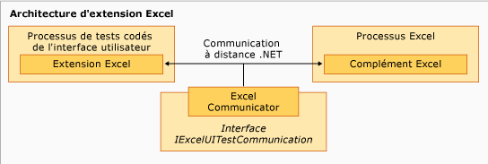

# Exemple d’extension du test cod&#233; de l’interface utilisateur pour Excel
[!INCLUDE[vs2017banner](../code-quality/includes/vs2017banner.md)]

Le composant d'extension de l'exemple est exécuté dans le processus du test codé de l'interface utilisateur de [!INCLUDE[vsprvs](../code-quality/includes/vsprvs_md.md)] et prend une forme hiérarchique avec la classe `ExtensionPackage` à la base.  Les classes `TechnologyManager`, `ActionFilter` et `PropertyProvider` se trouvent au niveau suivant, avec les éléments de commande au niveau supérieur.  
  
   
Architecture d'extension Excel  
  
## Points d'extension  
 Ces classes représentent les points d'extension implémentés dans l'exemple pour activer le test codé de l'interface utilisateur pour [!INCLUDE[ofprexcel](../test/includes/ofprexcel_md.md)].  
  
### ExtensionPackage  
 Hérité de la classe <xref:Microsoft.VisualStudio.TestTools.UITest.Extension.UITestExtensionPackage>, il s'agit du point d'entrée pour l'extension du test codé de l'interface utilisateur.  L'implémentation de cette classe abstraite donne à l'infrastructure du test codé de l'interface utilisateur un accès interne au gestionnaire de technologies du test de l'interface utilisateur personnalisé, a fournisseur de propriétés du test de l'interface utilisateur et au filtre d'action du test de l'interface utilisateur pour tester la nouvelle interface utilisateur.  Pour plus d’informations, consultez [Classe ExtensionPackage](../test/sample-excel-extension-extensionpackage-class.md).  
  
### TechnologyManager  
 Héritée de la classe <xref:Microsoft.VisualStudio.TestTools.UITest.Extension.UITechnologyManager>, cette classe fournit un gestionnaire de technologies pour l'enregistrement et la lecture de tests.  Pour plus d’informations, consultez [Classe TechnologyManager](../test/sample-excel-extension-technologymanager-class.md).  
  
### ActionFilter  
 Héritée de la classe <xref:Microsoft.VisualStudio.TestTools.UITest.Common.UITestActionFilter>, cette classe fournit une classe de base pour regrouper les résultats d'actions des tests semblables dans un seul résultat de test.  Pour plus d’informations, consultez [Classe ActionFilter](../test/sample-excel-extension-actionfilter-class.md).  
  
### Éléments de technologie  
 Une classe de base héritée de la classe <xref:Microsoft.VisualStudio.TestTools.UITest.Extension.UITechnologyElement> sert de base aux éléments de technologie dans vos tests de l'interface utilisateur qui peuvent être enregistrés et lus.  Pour plus d’informations, consultez [Classes d'éléments](../test/sample-excel-extension-element-classes.md).  
  
### PropertyProvider  
 Héritée de la classe <xref:Microsoft.VisualStudio.TestTools.UITesting.UITestPropertyProvider>, cette classe fournit une classe de base pour la prise en charge des propriétés d'éléments d'interface utilisateur pour l'enregistrement et la lecture de tests.  Pour plus d’informations, consultez [Classe PropertyProvider](../test/sample-excel-extension-propertyprovider-class.md).  
  
## Voir aussi  
 <xref:Microsoft.VisualStudio.TestTools.UITesting.UITestPropertyProvider>   
 <xref:Microsoft.VisualStudio.TestTools.UITest.Extension.UITechnologyElement>   
 <xref:Microsoft.VisualStudio.TestTools.UITest.Common.UITestActionFilter>   
 <xref:Microsoft.VisualStudio.TestTools.UITest.Extension.UITestExtensionPackage>   
 [Classe ExtensionPackage](../test/sample-excel-extension-extensionpackage-class.md)   
 [Classe TechnologyManager](../test/sample-excel-extension-technologymanager-class.md)   
 [Classe ActionFilter](../test/sample-excel-extension-actionfilter-class.md)   
 [Classes d'éléments](../test/sample-excel-extension-element-classes.md)   
 [Classe PropertyProvider](../test/sample-excel-extension-propertyprovider-class.md)