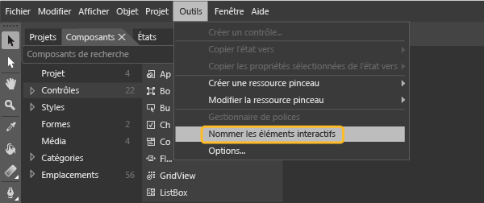

# <a name="set-a-unique-automation-property-for-uwp-controls-for-testing"></a>Définir une propriété Automation unique pour les contrôles UWP à des fins de test

Si vous voulez exécuter des tests codés de l’interface utilisateur pour vos applications UWP en XAML, chaque contrôle doit être identifié par une propriété d’automatisation unique. Vous pouvez assigner une propriété Automation unique selon le type de contrôle XAML dans votre application.

[!INCLUDE [coded-ui-test-deprecation](includes/coded-ui-test-deprecation.md)]

## <a name="static-xaml-definition"></a>Définition XAML statique

Pour spécifier une propriété Automation unique pour un contrôle défini dans votre fichier XAML, vous pouvez définir **AutomationProperties. AutomationId** ou **AutomationProperties.Name** implicitement ou explicitement, comme indiqué dans les exemples qui suivent. La définition de l’une ou l’autre de ces valeurs affecte au contrôle une propriété Automation unique qui peut être utilisée pour identifier ce contrôle lorsque vous créez un test codé de l’interface utilisateur ou un enregistrement des actions.

### <a name="set-the-property-implicitly"></a>Définir la propriété implicitement

Affectez à **AutomationProperties.AutomationId** la valeur **ButtonX** à l’aide de la propriété **Name** dans le code XAML du contrôle.

```xaml
<Button Name="ButtonX" Height="31" HorizontalAlignment="Left" Margin="23,26,0,0"  VerticalAlignment="Top" Width="140" Click="ButtonX_Click" />
```

Affectez à **AutomationProperties.Name** la valeur **ButtonY** à l’aide de la propriété **Content** dans le code XAML du contrôle.

```xaml
<Button Content="ButtonY" Height="31" HorizontalAlignment="Left" Margin="23,76,0,0" VerticalAlignment="Top" Width="140" Click="ButtonY_Click" />
```

### <a name="set-the-property-explicitly"></a>Définir la propriété explicitement

Affectez à **AutomationProperties.AutomationId** la valeur **ButtonX** de façon explicite dans le code XAML du contrôle.

```xaml
<Button AutomationProperties.AutomationId="ButtonX" Height="31" HorizontalAlignment="Left" Margin="23,26,0,0"  VerticalAlignment="Top" Width="140" Click="ButtonX_Click" />
```

Affectez à **AutomationProperties.Name** la valeur **ButtonY** de façon explicite dans le code XAML du contrôle.

```xaml
<Button AutomationProperties.Name="ButtonY" Height="31" HorizontalAlignment="Left" Margin="23,76,0,0" VerticalAlignment="Top" Width="140" Click="ButtonY_Click" />
```

## <a name="assign-unique-names"></a>Attribuer des noms uniques

Dans Blend pour Visual Studio, vous pouvez sélectionner une option pour affecter des noms uniques à des éléments interactifs, comme des boutons, des zones de liste, des zones de liste modifiable et des zones de texte, ce qui permet d’affecter aux contrôles des valeurs uniques pour **AutomationProperties.Name**.

Pour affecter des noms uniques à des contrôles existants, sélectionnez **Outils**  >  **nom éléments interactifs**.



Pour attribuer automatiquement des noms uniques aux nouveaux contrôles que vous ajoutez, sélectionnez **Outils**  >  **options** pour ouvrir la boîte de dialogue **options** . Sélectionnez **Concepteur XAML**, puis **Nommer automatiquement les éléments interactifs lors de la création**. puis cliquez sur **OK** pour fermer la boîte de dialogue.

## <a name="use-a-data-template"></a>Utiliser un modèle de données

Vous pouvez définir un modèle simple avec **ItemTemplate** pour lier les valeurs d’une zone de liste à des variables :

```xaml
<ListBox Name="listBox1" ItemsSource="{Binding Source={StaticResource employees}}">
   <ListBox.ItemTemplate>
      <DataTemplate>
         <StackPanel Orientation="Horizontal">
            <TextBlock Text="{Binding EmployeeName}" />
            <TextBlock Text="{Binding EmployeeID}" />
         </StackPanel>
      </DataTemplate>
   </ListBox.ItemTemplate>
</ListBox>
```

Vous pouvez également utiliser un modèle avec **ItemContainerStyle** pour lier les valeurs à des variables :

```xaml
<ListBox Name="listBox1" ItemsSource="{Binding Source={StaticResource employees}}">
   <ListBox.ItemContainerStyle>
      <Style TargetType="ListBoxItem">
         <Setter Property="Template">
            <Setter.Value>
               <ControlTemplate TargetType="ListBoxItem">
                  <Grid>
                     <Button Content="{Binding EmployeeName}" AutomationProperties.AutomationId="{Binding EmployeeID}"/>
                  </Grid>
               </ControlTemplate>
            </Setter.Value>
         </Setter>
      </Style>
   </ListBox.ItemContainerStyle>
</ListBox>
```

Pour ces deux exemples, vous devez substituer la méthode **ToString ()** de **ItemSource**, comme illustré dans l’exemple de code suivant. Ce code vérifie que la valeur pour **AutomationProperties.Name** est définie et unique, car vous ne pouvez pas définir une propriété Automation unique pour chaque élément de liste lié aux données à l’aide de la liaison. Dans ce cas, la définition d’une valeur unique pour **Automation Properties.Name** est suffisante.

> [!NOTE]
> Cette approche permet également d’affecter au contenu interne de l’élément de liste une chaîne dans la classe Employee via la liaison. Comme indiqué dans l’exemple, un ID Automation unique (ID d’employé) est affecté au contrôle de bouton situé au sein de chaque élément de la liste.

```csharp
Employee[] employees = new Employee[]
{
   new Employee("john", "4384"),
   new Employee("margaret", "7556"),
   new Employee("richard", "8688"),
   new Employee("george", "1293")
};

listBox1.ItemsSource = employees;

public override string ToString()
{
    return EmployeeName + EmployeeID; // Unique Identification to be set as the AutomationProperties.Name
}
```

## <a name="use-a-control-template"></a>Utiliser un modèle de contrôle

Vous pouvez utiliser un modèle de contrôle afin que chaque instance d’un type donné puisse obtenir une propriété Automation unique lorsqu’elle est définie dans le code. Créez le modèle de sorte qu’une liaison soit établie entre **AutomationProperty** et un ID unique dans l’instance de contrôle. Le code XAML suivant illustre une approche permettant de créer cette liaison avec un modèle de contrôle :

```xaml
<Style x:Key="MyButton" TargetType="Button">
<Setter Property="Template">
   <Setter.Value>
<ControlTemplate TargetType="Button">
   <Grid>
      <CheckBox HorizontalAlignment="Left" AutomationProperties.AutomationId="{TemplateBinding Content}"></CheckBox>
      <Button Width="90" HorizontalAlignment="Right" Content="{TemplateBinding Content}" AutomationProperties.AutomationId="{TemplateBinding Content}"></Button>
   </Grid>
</ControlTemplate>
   </Setter.Value>
</Setter>
</Style>
```

Quand vous définissez deux instances d’un bouton à l’aide de ce modèle de contrôle, la chaîne de contenu unique est affectée à l’ID Automation pour les contrôles du modèle, comme indiqué dans le code XAML suivant :

```xaml
<Button Content="Button1" Style="{StaticResource MyButton}" Width="140"/>
<Button Content="Button2" Style="{StaticResource MyButton}" Width="140"/>
```

### <a name="dynamic-controls"></a>Contrôles dynamiques

Si vous avez des contrôles qui sont créés de façon dynamique à partir de votre code et qui ne sont pas créés de façon statique ni via des modèles dans des fichiers XAML, vous devez définir les propriétés **Content** ou **Name** pour ces contrôles. Cette action permet de garantir qu’une propriété Automation unique est affectée à chaque contrôle dynamique. Par exemple, si une case à cocher doit être affichée lorsque vous sélectionnez un élément de liste, définissez ces propriétés comme indiqué ici :

```csharp
private void CreateCheckBox(string txt, StackPanel panel)
{
   CheckBox cb = new CheckBox();
   cb.Content = txt; // Sets the AutomationProperties.Name
   cb.Height = 50;
   cb.Width = 100;
   cb.Name = "DynamicCheckBoxAid"+ txt; // Sets the AutomationProperties.AutomationId
   panel.Children.Add(cb);
}
```

## <a name="see-also"></a>Voir aussi

- [Tester des applications UWP avec des tests codés de l’interface utilisateur](../test/test-uwp-app-with-coded-ui-test.md)
