# <a name="test-windows-uwp-and-81-phone-apps-with-coded-ui-tests"></a>Tester des applications Windows UWP et des applications Windows Phone 8.1 avec des tests codés de l’interface utilisateur

Utilisez cette procédure pas à pas afin de créer des tests de l’interface utilisateur pour les applications Windows UWP qui s’exécutent sur des appareils mobiles ou des émulateurs et pour les applications Windows Phone 8.1 XAML.  

## <a name="create-a-simple-windows-phone-app"></a>Créer une application Windows Phone simple  
  
1.  Créer un projet pour une application Windows Phone vide à l’aide d’un modèle Visual C# ou Visual Basic.  
  
     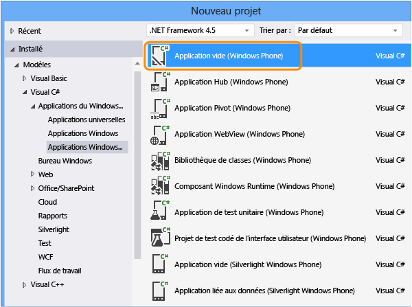  
  
2.  Dans l’Explorateur de solutions, ouvrez MainPage.xaml. Dans la barre d’outils, faites glisser un contrôle bouton et un contrôle textbox sur l’aire de conception.  
  
     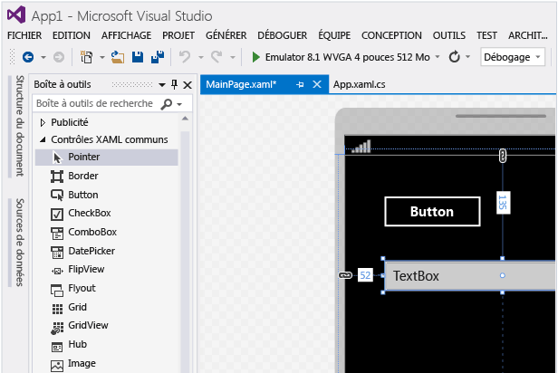  
  
3.  Dans la fenêtre Propriétés, nommez le contrôle bouton.  
  
     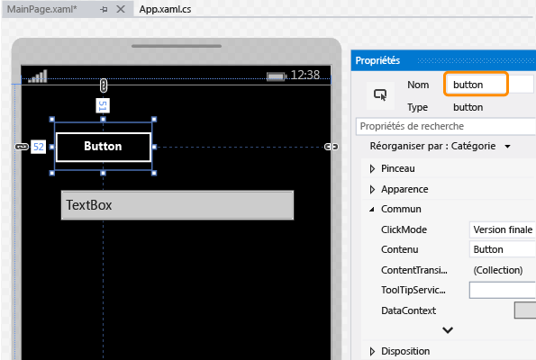  
  
4.  Nommez le contrôle textbox.  
  
     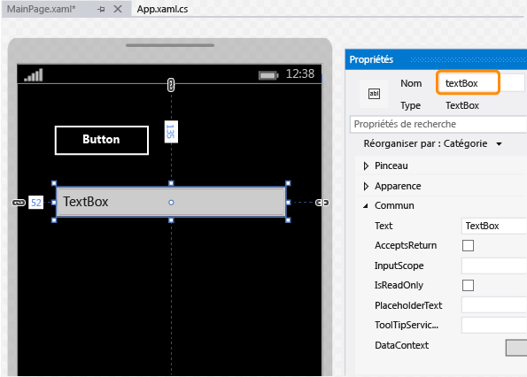  
  
5.  Sur l’aire de conception, double-cliquez sur le contrôle bouton et ajoutez le code suivant :  
  
    ```c#  
    private void button_Click_1(object sender, RoutedEventArgs e)  
    {  
        this.textBox.Text = this.button.Name;  
    }  
  
    ```  
  
    ```vb#  
    Public NotInheritable Class MainPage  
        Inherits Page  
  
        Private Sub button_Click(sender As Object, e As RoutedEventArgs) Handles Button.Click  
            Me.textBox.Text = Me.button.Name  
        End Sub  
    End Class  
    ```  
  
6.  Appuyez sur F5 pour exécuter votre application Windows Phone dans l’émulateur et vérifier si elle fonctionne.  
  
     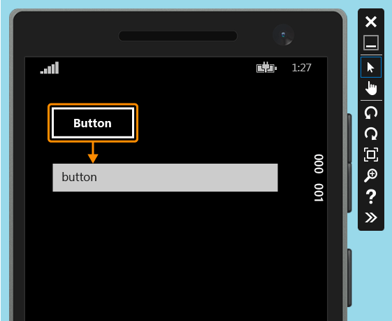  
  
7.  Quittez l’émulateur.  
  
## <a name="deploy-the-windows-phone-app"></a>Déployer l’application Windows Phone  
  
1.  Pour qu’un test codé de l’interface utilisateur puisse mapper les contrôles d’une application, vous devez la déployer.  
  
     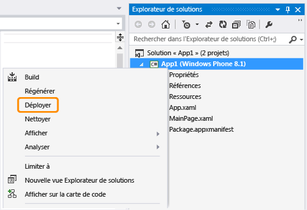  
  
     L’émulateur démarre. L’application est maintenant disponible pour les tests.  
  
     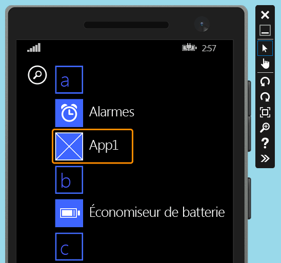  
  
     Laissez l’émulateur en cours d’exécution pendant que vous créez votre test codé de l’interface utilisateur.  
  
## <a name="create-a-coded-ui-test-for-the-windows-phone-app"></a>Créer un test codé de l’interface utilisateur pour l’application Windows Phone  

[Comment créer des tests codés de l’interface utilisateur pour les applications de plateforme Windows universelle (UWP) ?](#uwpapps)
  
1.  Ajoutez un nouveau projet de test codé de l’interface utilisateur à la solution avec l’application Windows Phone.  
  
     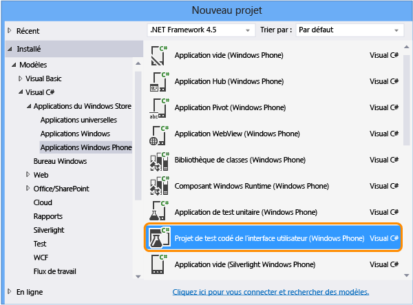  
  
2.  Choisissez de modifier le mappage d’IU à l’aide de la croix.  
  
     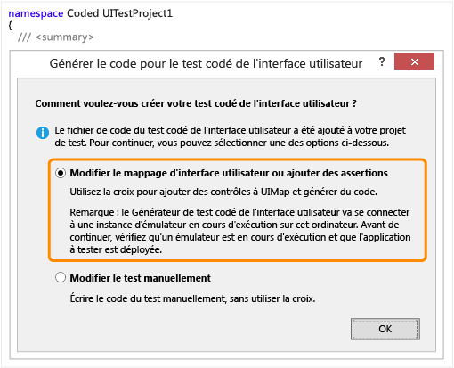  
  
3.  Utilisez la croix pour sélectionner l’application, puis copiez la valeur de la propriété **AutomationId** de l’application, qui sera utilisée ultérieurement pour démarrer l’application lors du test.  
  
     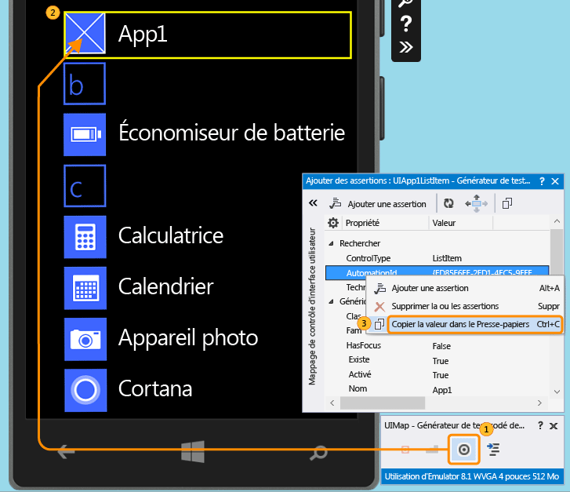  
  
4.  Dans l’émulateur, démarrez l’application et utilisez la croix pour sélectionner le contrôle bouton. Ensuite, ajoutez le contrôle bouton au mappage de contrôle d’IU.  
  
     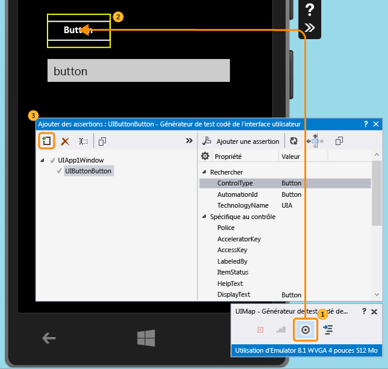  
  
5.  Pour ajouter le contrôle textbox au mappage de contrôle d’interface utilisateur, répétez l’étape précédente.  
  
     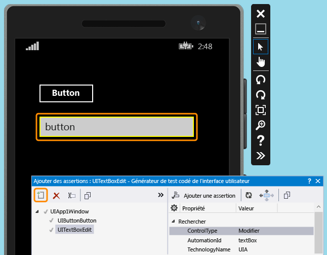  
  
6.  Générez le code pour créer le code pour les modifications apportées au mappage de contrôle d’interface utilisateur.  
  
     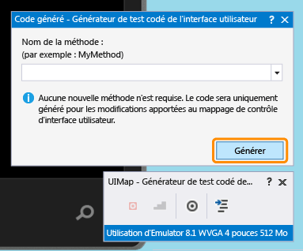  
  
7.  Utilisez la croix pour sélectionner le contrôle textbox, puis sélectionnez la propriété **Texte** .  
  
     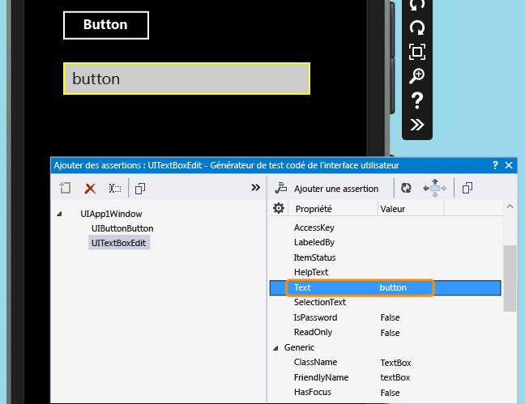  
  
8.  Ajoutez une assertion. Elle sera utilisée lors du test pour vérifier que la valeur est correcte.  
  
     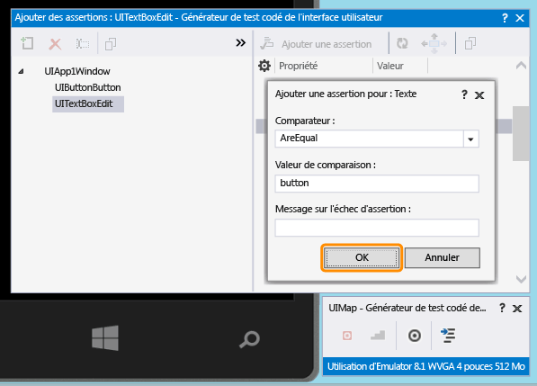  
  
9. Ajoutez et générez le code pour la méthode assert.  
  
     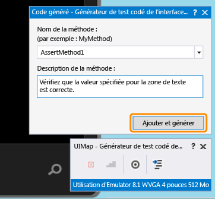  
  
10. **Visual C#**  
  
     Dans l’Explorateur de solutions, ouvrez le fichier UIMap.Designer.cs pour afficher le code que vous venez d’ajouter pour la méthode assert et les contrôles.  
  
     **Visual Basic**  
  
     Dans l’Explorateur de solutions, ouvrez le fichier CodedUITest1.vb. Dans le code de la méthode de test CodedUITestMethod1(), cliquez avec le bouton droit sur l’appel à la méthode d’assertion qui a été ajouté automatiquement `Me.UIMap.AssertMethod1()` et choisissez **Atteindre la définition**. Le fichier UIMap.Designer.vb s’ouvre dans l’éditeur de code, ce qui vous permet de voir le code que vous avez ajouté pour la méthode assert et les contrôles.  
  
    > [!WARNING]
    >  Ne modifiez pas le fichier UIMap.Designer.cs ou UIMap.Designer.vb directement. Si vous le faites, les modifications apportées au fichier seront remplacées à chaque génération du test.  
  
     **Assert, méthode**  
  
    ```c#  
    public void AssertMethod1()  
    {  
        #region Variable Declarations  
        XamlEdit uITextBoxEdit = this.UIApp1Window.UITextBoxEdit;  
        #endregion  
  
        // Verify that the 'Text' property of 'textBox' text box equals 'button'  
        Assert.AreEqual(this.AssertMethod1ExpectedValues.UITextBoxEditText, uITextBoxEdit.Text);  
    }  
    ```  
  
    ```vb#  
    Public Sub AssertMethod1()  
        Dim uITextBoxEdit As XamlEdit = Me.UIApp1Window.UITextBoxEdit  
  
        'Verify that the 'Text' property of 'textBox' text box equals 'button'  
        Assert.AreEqual(Me.AssertMethod1ExpectedValues.UITextBoxEditText, uITextBoxEdit.Text)  
    End Sub  
    ```  
  
     **Contrôles**  
  
    ```c#  
    #region Properties  
    public virtual AssertMethod1ExpectedValues AssertMethod1ExpectedValues  
    {  
        get  
        {  
            if ((this.mAssertMethod1ExpectedValues == null))  
            {  
                this.mAssertMethod1ExpectedValues = new AssertMethod1ExpectedValues();  
            }  
            return this.mAssertMethod1ExpectedValues;  
        }  
    }  
  
    public UIApp1Window UIApp1Window  
    {  
        get  
        {  
            if ((this.mUIApp1Window == null))  
            {  
                this.mUIApp1Window = new UIApp1Window();  
            }  
            return this.mUIApp1Window;  
        }  
    }  
    #endregion  
  
    #region Fields  
    private AssertMethod1ExpectedValues mAssertMethod1ExpectedValues;  
  
    private UIApp1Window mUIApp1Window;  
    #endregion  
    ```  
  
    ```vb#  
    #Region "Properties"  
    Public ReadOnly Property UIButtonButton() As XamlButton  
        Get  
            If (Me.mUIButtonButton Is Nothing) Then  
                Me.mUIButtonButton = New XamlButton(Me)  
                Me.mUIButtonButton.SearchProperties(XamlButton.PropertyNames.AutomationId) = "button"  
            End If  
            Return Me.mUIButtonButton  
        End Get  
    End Property  
  
    Public ReadOnly Property UITextBoxEdit() As XamlEdit  
        Get  
            If (Me.mUITextBoxEdit Is Nothing) Then  
                Me.mUITextBoxEdit = New XamlEdit(Me)  
                Me.mUITextBoxEdit.SearchProperties(XamlEdit.PropertyNames.AutomationId) = "textBox"  
            End If  
            Return Me.mUITextBoxEdit  
        End Get  
    End Property  
    #End Region  
  
    #Region "Fields"  
    Private mUIButtonButton As XamlButton  
  
    Private mUITextBoxEdit As XamlEdit  
    #End Region  
    ```  
  
11. Dans l’Explorateur de solutions, ouvrez le fichier CodedUITest1.cs ou CodedUITest1.vb. Vous pouvez maintenant ajouter du code à la méthode CodedUTTestMethod1 pour les actions nécessaires à l’exécution du test. Utilisez les contrôles qui ont été ajoutés au mappage d’IU pour ajouter du code :  
  
    1.  Lancez l’application Windows Phone à l’aide de la propriété d’ID d’automation que vous avez copiée précédemment dans le Presse-papiers :  
  
        ```c#  
        XamlWindow myAppWindow = XamlWindow.Launch("ed85f6ff-2fd1-4ec5-9eef-696026c3fa7b_cyrqexqw8cc7c!App");  
        ```  
  
        ```vb#  
        XamlWindow.Launch("ed85f6ff-2fd1-4ec5-9eef-696026c3fa7b_cyrqexqw8cc7c!App");  
        ```  
  
    2.  Ajoutez un mouvement pour appuyer sur le contrôle bouton :  
  
        ```c#  
        Gesture.Tap(this.UIMap.UIApp1Window.UIButtonButton);  
        ```  
  
        ```vb#  
        Gesture.Tap(Me.UIMap.UIApp1Window.UIButtonButton)  
        ```  
  
    3.  Vérifiez que l’appel à la méthode assert généré automatiquement se produit après le lancement de l’application et le mouvement d’appui sur le bouton :  
  
        ```c#  
        this.UIMap.AssertMethod1();  
        ```  
  
        ```vb#  
        Me.UIMap.AssertMethod1()  
        ```  
  
     Une fois le code ajouté, la méthode de test CodedUITestMethod1 doit ressembler à ce qui suit :  
  
    ```c#  
    [TestMethod]  
    public void CodedUITestMethod1()  
    {  
        // To generate code for this test, select "Generate Code for Coded UI Test" from the shortcut menu and select one of the menu items.  
  
        // Launch the app.  
        XamlWindow myAppWindow = XamlWindow.Launch("ed85f6ff-2fd1-4ec5-9eef-696026c3fa7b_cyrqexqw8cc7c!App");  
  
        // Tap the button.  
        Gesture.Tap(this.UIMap.UIApp1Window.UIButtonButton);  
  
        this.UIMap.AssertMethod1();  
    }  
    ```  
  
    ```vb#  
    <CodedUITest>  
    Public Class CodedUITest1  
  
        <TestMethod()>  
        Public Sub CodedUITestMethod1()  
            '              
            ' To generate code for this test, select "Generate Code for Coded UI Test" from the shortcut menu and select one of the menu items.  
            '  
            ' Launch the app.  
            XamlWindow.Launch("ed85f6ff-2fd1-4ec5-9eef-696026c3fa7b_cyrqexqw8cc7c!App")  
  
            '// Tap the button.  
            Gesture.Tap(Me.UIMap.UIApp1Window.UIButtonButton)  
  
            Me.UIMap.AssertMethod1()  
        End Sub  
    ```  
  
## <a name="run-the-coded-ui-test"></a>Exécuter le test codé de l’interface utilisateur  
  
1.  Générez votre test et exécutez-le à l’aide de l’Explorateur de tests.  
  
     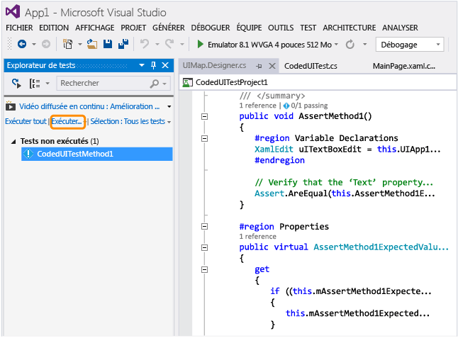  
  
     L’application Windows Phone démarre, l’action d’appui sur le bouton est exécutée et la propriété Texte du contrôle textbox est remplie et validée à l’aide de la méthode assert.  
  
     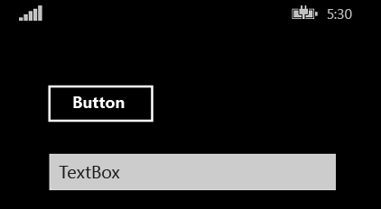  
  
     Une fois le test terminé, l’Explorateur de tests confirme que le test a réussi.  
  
     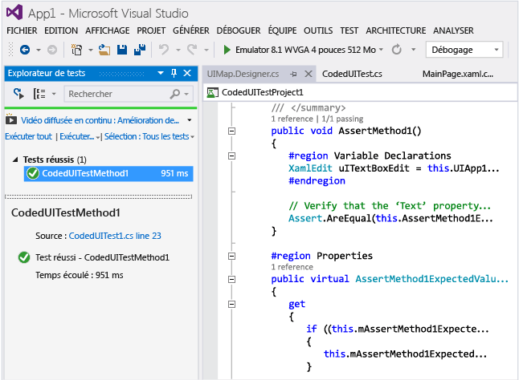  
  
##  <a name="TestingPhoneAppsCodedUI_DataDriven"></a> Utiliser les tests codés de l’interface utilisateur pilotés par les données sur des applications Windows Phone  
 Pour tester différentes conditions, un test codé de l’interface utilisateur peut être exécuté plusieurs fois avec différents jeux de données.  
  
 Les tests codés de l’interface utilisateur pilotés par les données pour Windows Phone sont définis à l’aide de l’attribut DataRow sur une méthode de test. Dans l’exemple suivant, x et y utilisent les valeurs 1 et 2 pour la première itération et -1 et -2 pour la seconde itération du test.  
  
```  
[DataRow(1, 2, DisplayName = "Add positive numbers")]  
[DataRow(-1, -2, DisplayName = "Add negative numbers")]  
[TestMethod]  
public void DataDrivingDemo_MyTestMethod(int x, int y)  
  
```  
  
## <a name="q--a"></a>Q et R  
  
### <a name="q-do-i-have-to-deploy-the-windows-phone-app-in-the-emulator-in-order-to-map-ui-controls"></a>Q : suis-je obligé de déployer l’application Windows Phone dans l’émulateur pour mapper des contrôles d’interface utilisateur ?  
 **R**: oui, le générateur de test codé de l’interface utilisateur exige qu’un émulateur soit en cours d’exécution et que l’application soit déployée dessus. Sinon, il génère un message d’erreur signalant qu’aucun émulateur en cours d’exécution n’a été détecté.  
  
###  <a name="TestingPhoneAppsCodedUI_EmulatorDevice"></a> Q : les tests peuvent-ils être exécutés uniquement sur l’émulateur, ou puis-je aussi utiliser un appareil physique ?  
 **R**: les deux options sont prises en charge. Vous pouvez modifier la cible d’exécution des tests en changeant le type d’émulateur ou en sélectionnant Périphérique dans la barre d’outils Périphérique. Si vous sélectionnez Périphérique, un appareil Phone Blue doit être connecté à l’un des ports USB de l’ordinateur.  
  
 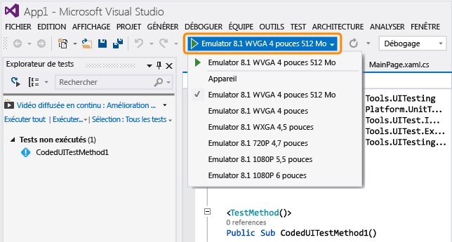  
  
### <a name="q-why-dont-i-see-the-option-to-record-my-coded-ui-test-in-the-generate-code-for-a-coded-ui-test-dialog"></a>Q : pourquoi l’option d’enregistrement de mon test codé de l’interface utilisateur ne figure-t-elle pas dans la boîte de dialogue Générer le code pour le test codé de l’interface utilisateur ?  
 **R**: l’option d’enregistrement n’est pas prise en charge pour les applications Windows Phone.  
  
### <a name="q-can-i-create-a-coded-ui-test-for-my-windows-phone-apps-based-on-winjs-silverlight-or-html5"></a>Q : puis-je créer un test codé de l’interface utilisateur pour mes applications Windows Phone basées sur WinJS, Silverlight ou HTML5 ?  
 **R**: non, seules les applications XAML sont prises en charge.  
  
### <a name="q-can-i-create-coded-ui-tests-for-my-windows-phone-apps-on-a-system-that-is-not-running-windows-81-or-windows-10"></a>Q : puis-je créer des tests codés de l’interface utilisateur pour mes applications Windows Phone sur un système qui n’exécute pas Windows 8.1 ou Windows 10 ?  
 **R**: non, les modèles Projet de test codé de l’interface utilisateur sont disponibles seulement sur Windows 8.1 et Windows 10. Pour créer l’automation pour les applications de plateforme Windows universelle, vous aurez besoin de Windows 10.  

<a name="uwpapps"></a>  
### <a name="q-how-do-i-create-coded-ui-tests-for-universal-windows-platform-uwp-apps"></a>Q : comment créer des tests codés de l’interface utilisateur pour les applications de plateforme Windows universelle ?  
 **R**: selon la plateforme où vous testez votre application de plateforme Windows universelle, créez le projet de test codé de l’interface utilisateur de l’une des façons suivantes :  
  
-   Une application de plateforme Windows universelle s’exécutant sur un ordinateur local s’exécutera comme une application de Store. Pour tester, vous devez utiliser le modèle **Projet de test codé de l’interface utilisateur (Windows)** . Pour trouver ce modèle quand vous créez un projet, accédez au nœud **Windows**, **Universel** . Vous pouvez aussi accéder au nœud **Windows**, **Windows 8**, **Windows** .  
  
-   Une application de plateforme Windows universelle s’exécutant sur un appareil mobile ou un émulateur s’exécutera comme une application Windows Phone. Pour tester, vous devez utiliser le modèle **Projet de test codé de l’interface utilisateur (Windows Phone)** . Pour trouver ce modèle quand vous créez un projet, accédez au nœud **Windows**, **Universel** . Vous pouvez aussi accéder au nœud **Windows**, **Windows 8**, **Windows Phone** .  
  
 Une fois le projet créé, la création d’un test se fait de la même façon qu’auparavant.  
  
### <a name="q-can-i-select-controls-that-are-outside-the-emulator"></a>Q : puis-je sélectionner des contrôles qui sont en dehors de l’émulateur ?  
 **R**: non, car le générateur ne les détectera pas.  
  
### <a name="q-can-i-use-the-coded-ui-test-builder-to-map-controls-using-a-physical-phone-device"></a>Q : puis-je utiliser le générateur de test codé de l’interface utilisateur pour mapper des contrôles à l’aide d’un appareil physique (téléphone) ?  
 **R**: non, le générateur ne peut mapper des éléments d’interface utilisateur que si votre application a été déployée sur l’émulateur.  
  
### <a name="q-why-cant-i-modify-the-code-in-the-uimapdesigner-file"></a>Q : pourquoi ne puis-je pas modifier le code du fichier UIMap.Designer ?  
 **R**: toutes les modifications de code que vous effectuez dans le fichier UIMapDesigner.cs sont remplacées chaque fois que vous générez du code dans UIMap - Générateur de test codé de l’interface utilisateur. Si vous devez modifier une méthode enregistrée, vous devez la copier dans le fichier UIMap.cs et la renommer. Le fichier UIMap.cs peut être utilisé pour remplacer les méthodes et les propriétés dans le fichier UIMapDesigner.cs. Vous devez supprimer la référence à la méthode d’origine dans le fichier Coded UITest.cs et la remplacer par le nom de la méthode renommée.  
  
### <a name="q-can-i-run-a-coded-ui-test-on-my-windows-phone-app-from-the-command-line"></a>Q : puis-je exécuter un test codé de l’interface utilisateur sur mon application Windows Phone à partir de la ligne de commande ?  
 **R**: Oui, vous pouvez utiliser un fichier runsettings visant à spécifier l’appareil cible pour l’exécution du test. Exemple :  
  
 **vstest.console.exe "pathToYourCodedUITestDll" /settings:devicetarget.runsettings**  
  
 Exemple de fichier runsettings :  
  
```  
<?xml version="1.0" encoding="utf-8"?>  
<RunSettings>  
<MSPhoneTest>  
<!--to specify test execution on device, use a TargetDevice option as follows-->  
<TargetDevice>Device</TargetDevice>  
<!--to specify an emulator instead, use a TargetDevice option like below-->  
<!--<TargetDevice>Emulator 8.1 WVGA 4 inch 512MB</TargetDevice>-->  
</MSPhoneTest>  
</RunSettings>  
```  
  
### <a name="q-what-are-the-differences-between-coded-ui-tests-for-xaml-based-windows-store-apps-and-windows-phone-apps"></a>Q : quelles sont les différences entre les tests codés de l’interface utilisateur pour applications du Windows Store en XAML et les applications Windows Phone ?  
 **R**: Il existe quelques différences majeures :  
  
|Fonctionnalité|Applications Windows Store|Applications Windows Phone|  
|-------------|------------------------|------------------------|  
|Cible d’exécution des tests|Ordinateur local ou distant. Vous pouvez spécifier des ordinateurs distants quand vous utilisez un cas de test automatisé pour exécuter des tests. Consultez [Automatiser un cas de test dans Microsoft Test Manager](/devops-test-docs/test/automate-a-test-case-in-microsoft-test-manager).|Émulateur ou appareil. Voir [Q : les tests peuvent-ils être exécutés uniquement sur l’émulateur, ou puis-je aussi utiliser un appareil physique ?](#TestingPhoneAppsCodedUI_EmulatorDevice) dans cette rubrique.|  
|Exécution à partir de la ligne de commande|Fichier de paramètres non nécessaire pour spécifier la cible.|Fichier runsettings nécessaire pour spécifier la cible.|  
|Classes spécialisées pour les contrôles d’environnement|<xref:Microsoft.VisualStudio.TestTools.UITesting.DirectUIControls.DirectUIControl>|<xref:Microsoft.VisualStudio.TestTools.UITesting.UITestControl>|  
|Contrôle WebView dans une application XAML|Pris en charge si vous utilisez des classes spécialisées HTML* pour interagir avec des éléments HTML. Consultez <xref:Microsoft.VisualStudio.TestTools.UITesting.HtmlControls>.|Non prise en charge.|  
|Exécution de tests automatisés à partir de MTM|Prise en charge.|Non pris en charge.|  
|Tests pilotés par les données|Pour plus d’informations sur l’utilisation de sources de données externes et l’utilisation de l’attribut DataSource sur une méthode de test, consultez [Tests pilotés par les données](../test/creating-a-data-driven-coded-ui-test.md).|Les données sont spécifiées inline, à l’aide de l’attribut DataRow sur une méthode de test. Consultez [Utiliser les tests codés de l’interface utilisateur pilotés par les données sur des applications Windows Phone](#TestingPhoneAppsCodedUI_DataDriven) dans cette rubrique.|  
  
 Pour plus d’informations sur les tests codés de l’interface utilisateur pour les applications du Windows Store, consultez [Test des applications Windows UWP et des applications du Windows Store 8.1 avec des tests codés de l’interface utilisateur](../test/test-windows-store-8-1-apps-with-coded-ui-tests.md).  
  
## <a name="external-resources"></a>Ressources externes  
 Blog Microsoft Visual Studio Application Lifecycle Management : [Using Coded UI to test XAML-based Windows Phone apps](http://blogs.msdn.com/b/visualstudioalm/archive/2014/04/05/using-coded-ui-to-test-xaml-based-windows-phone-apps.aspx?PageIndex=2#comments)  
  
## <a name="see-also"></a>Voir aussi  
 [Utiliser UI Automation pour tester votre code](../test/use-ui-automation-to-test-your-code.md)

